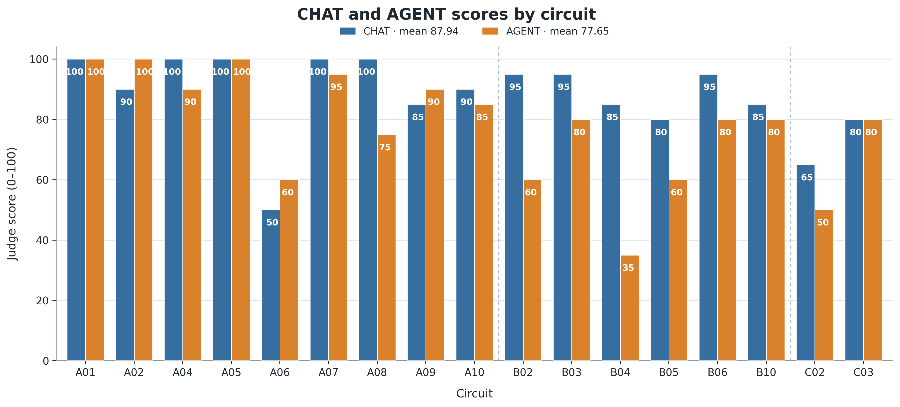
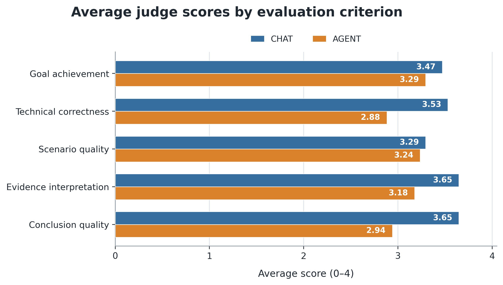
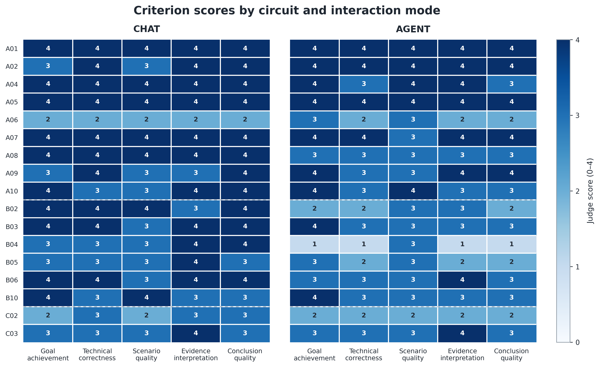
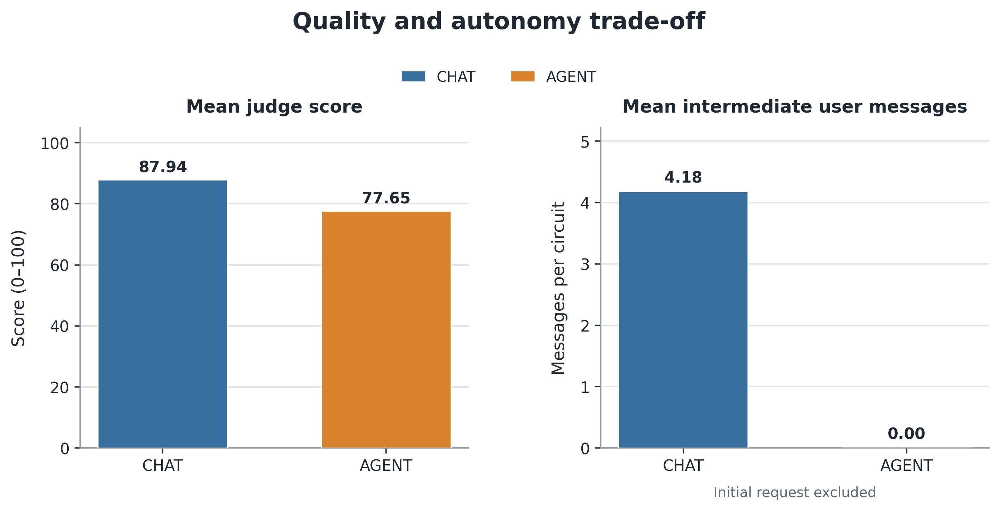
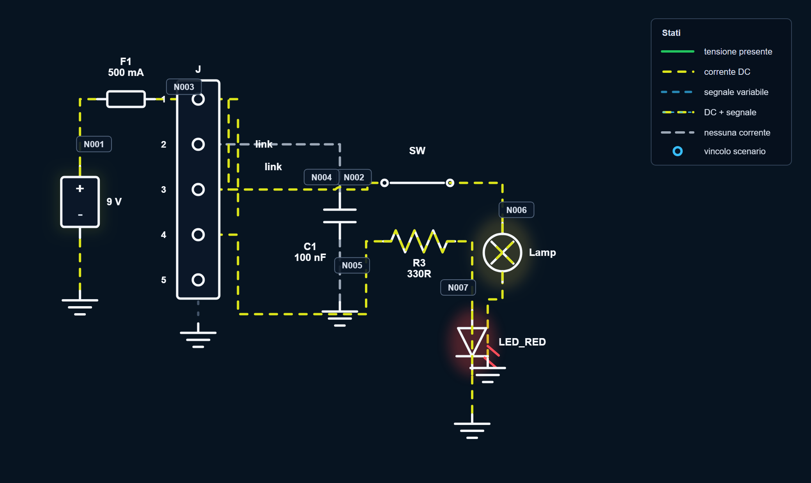
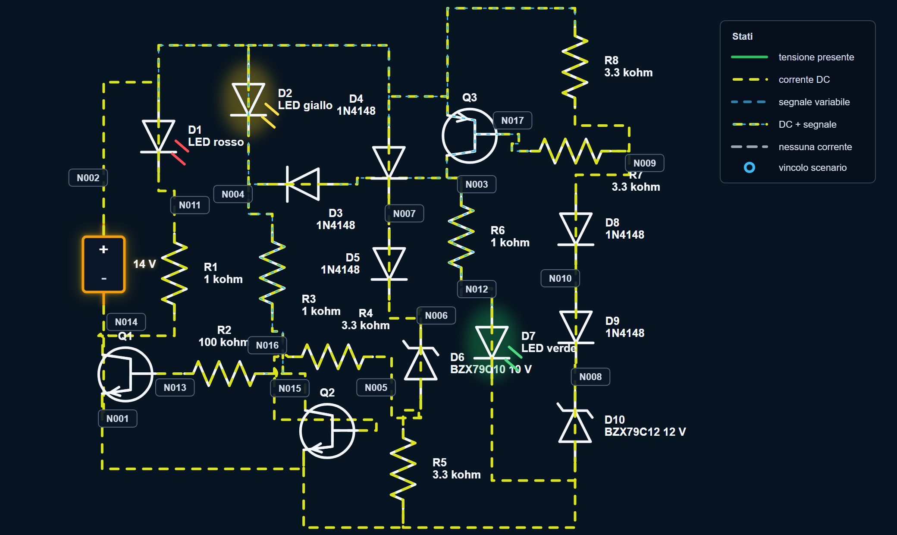
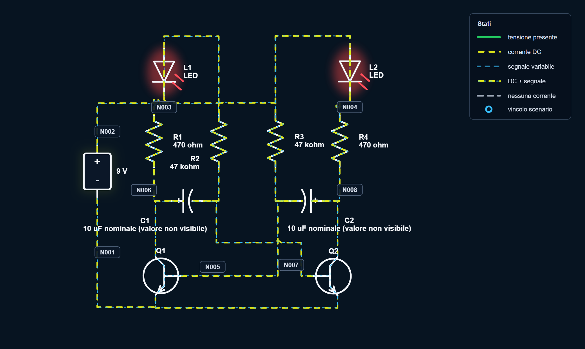
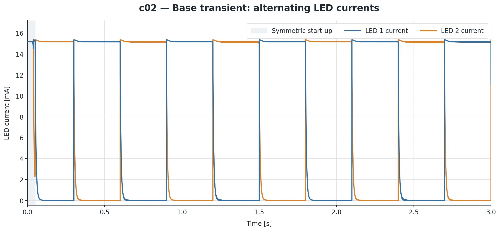

# Valutazione sperimentale delle modalità CHAT e AGENT

## Obiettivo dell'esperimento

L'ultima fase sperimentale del lavoro ha avuto l'obiettivo di valutare il
comportamento del sistema diagnostico nelle due modalità di interazione
previste dalla Pipeline 2.0:

- **CHAT**, nella quale il sistema propone scenari di verifica e l'utente
  interviene durante il processo, selezionando gli scenari da eseguire,
  formulando eventuali domande successive e richiedendo la conclusione;
- **AGENT**, nella quale il sistema riceve soltanto la richiesta iniziale e
  gestisce autonomamente la selezione degli scenari, la loro esecuzione,
  l'interpretazione delle simulazioni e la formulazione della conclusione.

Il confronto è stato progettato per rispondere a quattro domande principali:

1. le due modalità riescono a raggiungere l'obiettivo espresso dall'utente?
2. in quali fasi della traiettoria diagnostica emergono eventuali differenze?
3. quanto sono affidabili le conclusioni rispetto alle evidenze prodotte da
   SPICE?
4. quale compromesso si osserva tra qualità del risultato e autonomia
   operativa?

La valutazione non riguarda soltanto la risposta conclusiva. Per ogni
esecuzione è stata considerata l'intera traiettoria: richiesta iniziale,
ragionamento, scenari proposti, azioni applicate, simulazioni eseguite,
confronti numerici e conclusione finale.

## Impostazione della valutazione

Il dataset definitivo comprende **17 circuiti**: 9 appartenenti al batch A, 6
al batch B e 2 casi aggiuntivi appartenenti al batch C. Per ogni circuito è
stata eseguita una volta la modalità CHAT e una volta la modalità AGENT, per
un totale di **34 esecuzioni ufficiali**.

| Gruppo | Circuiti | Numero |
|---|---|---:|
| Batch A | `a01`, `a02`, `a04`, `a05`, `a06`, `a07`, `a08`, `a09`, `a10` | 9 |
| Batch B | `b02`, `b03`, `b04`, `b05`, `b06`, `b10` | 6 |
| Batch C | `c02`, `c03` | 2 |
| **Totale** |  | **17** |

Il modello impiegato dal sistema diagnostico è **GPT-5.4**. Le traiettorie
sono state successivamente valutate da **GPT-5.5**, utilizzato come
*LLM-as-a-judge* con reasoning effort `medium`. CHAT e AGENT sono state
valutate separatamente e la modalità è stata nascosta nel pacchetto fornito
al judge. Il prompt, lo schema di risposta e la configurazione del valutatore
sono stati mantenuti invariati per tutte le esecuzioni.

In 16 coppie su 17 la richiesta iniziale è identica nelle due modalità. Nel
caso `b03` le formulazioni sono leggermente differenti, ma descrivono lo
stesso obiettivo funzionale: verificare il comportamento dei tre LED durante
il passaggio della batteria da scarica a carica. Il caso è stato quindi
mantenuto nel confronto principale; l'effetto di questa scelta viene
richiamato nei limiti dell'analisi.

Non sono stati introdotti guasti artificiali. Ogni esecuzione parte dal
circuito validato e da un sintomo o obiettivo espresso in forma naturale. Le
run sono state congelate prima dell'aggregazione e le eventuali ripetizioni
eseguite durante lo sviluppo non sono incluse nei risultati ufficiali. Anche
un errore SPICE verificatosi in uno scenario AGENT di `a08` è stato mantenuto,
in modo da non rimuovere selettivamente un fallimento osservato.

Prima dell'aggregazione sono state verificate la presenza di entrambe le
modalità per ogni circuito, la coerenza di circuito e modalità nei file, la
corrispondenza degli hash SHA-256 tra judge e summary e l'uniformità di
modello, prompt e schema. Tutte le 34 valutazioni ufficiali hanno superato
questi controlli.

Non sono state utilizzate schede gold specifiche per circuito. La natura delle
richieste — diagnosi, verifica funzionale o raggiungimento di una
configurazione — rende infatti insufficiente un confronto limitato a una
singola etichetta finale. Il judge verifica invece la coerenza tra obiettivo,
azioni, misure SPICE e conclusione, dando priorità alle evidenze numeriche
rispetto alle etichette interne del workflow.

## Metriche considerate e relativo significato

La valutazione combina misure di qualità, esito e comportamento operativo.
Queste informazioni sono mantenute separate: il numero di scenari o di
messaggi non viene incorporato arbitrariamente nel punteggio qualitativo.

| Metrica | Motivazione |
|---|---|
| Punteggio complessivo del judge | Fornisce una sintesi della qualità dell'intera traiettoria |
| Media, mediana, deviazione standard e intervallo | Descrivono livello centrale, dispersione e casi estremi senza affidarsi alla sola media |
| Differenza appaiata AGENT−CHAT | Confronta le modalità sullo stesso circuito, riducendo l'effetto della diversa difficoltà dei casi |
| Vittorie, pareggi e sconfitte | Mostrano quanto il risultato sia diffuso e se dipenda da pochi casi estremi |
| Punteggi per criterio | Identificano la fase della traiettoria nella quale emergono le differenze |
| Esito categorico | Distingue `success`, `partial_success`, `failure` e `inconclusive` |
| Errori critici | Evidenziano conclusioni non dimostrate, affermazioni non supportate o letture incompatibili con SPICE |
| Metriche operative | Quantificano scenari, simulazioni, decisioni autonome e guida richiesta all'utente |

Il judge assegna cinque punteggi interi compresi tra 0 e 4. I criteri hanno lo
stesso peso, pari al 20%:

| Criterio | Oggetto della valutazione |
|---|---|
| Raggiungimento dell'obiettivo | Copertura dell'obiettivo esplicito formulato dall'utente |
| Correttezza tecnica | Correttezza elettrica, diagnostica e della localizzazione proposta |
| Qualità degli scenari | Pertinenza e utilità delle verifiche selezionate |
| Interpretazione delle evidenze | Coerenza tra risultati SPICE e interpretazione fornita |
| Qualità della conclusione | Chiarezza, completezza e calibrazione del grado di certezza |

Il punteggio complessivo è calcolato dallo script, e non dal modello, secondo
la relazione:

> **S = 5 × (c₁ + c₂ + c₃ + c₄ + c₅)**

dove c₁, c₂, c₃, c₄ e c₅ rappresentano i punteggi dei cinque criteri. Il risultato è
quindi espresso su una scala da 0 a 100. Tale valore deve essere interpretato
come **qualità attribuita dal judge alla traiettoria**, non come misura diretta
e assoluta della verità fisica della diagnosi.

## Risultati complessivi

La Tabella seguente riporta le principali statistiche descrittive.

| Modalità | N | Media | Mediana | Dev. std. | IQR | Min–max |
|---|---:|---:|---:|---:|---:|---:|
| CHAT | 17 | 87,94 | 90 | 13,70 | 85–100 | 50–100 |
| AGENT | 17 | 77,65 | 80 | 18,88 | 60–90 | 35–100 |

La modalità CHAT ottiene un punteggio medio di **87,94**, mentre AGENT
raggiunge **77,65**. Anche mediana e primo quartile risultano più elevati per
CHAT. AGENT presenta inoltre una maggiore dispersione: la deviazione standard
è pari a 18,88 punti, rispetto a 13,70 per CHAT, e il valore minimo scende a
35. Nel benchmark considerato, il comportamento della modalità autonoma
risulta quindi meno uniforme tra circuiti.

La Figura 1 mostra il confronto appaiato completo.

**Figura 1 – Confronto dei punteggi complessivi ottenuti dalle modalità CHAT e
AGENT nei 17 circuiti analizzati.** Per ciascun circuito sono riportate le
valutazioni assegnate dal judge GPT-5.5 alle due esecuzioni, su una scala da 0
a 100. Ogni coppia di barre rappresenta un confronto diretto sullo stesso
caso sperimentale: la barra blu identifica CHAT e quella arancione AGENT. I
separatori tratteggiati distinguono i batch A, B e C. CHAT ottiene un
punteggio medio di 87,94, mentre AGENT raggiunge 77,65. Valori più elevati
indicano una migliore qualità complessiva della diagnosi o della verifica.

*Fonte: elaborazione propria sui risultati sperimentali.*

La differenza non è uniforme. AGENT ottiene un punteggio superiore in `a02`
e `a06`, con un vantaggio di 10 punti, e in `a09`, con un vantaggio di 5
punti. `a01`, `a05` e `c03` terminano in parità; nei primi due casi entrambe
le modalità raggiungono il massimo punteggio. CHAT prevale nei restanti 11
circuiti. Gli scarti maggiori si osservano in `b04` (50 punti), `b02` (35
punti), `a08` (25 punti) e `b05` (20 punti).

| Circuito | CHAT | AGENT | Δ AGENT−CHAT | Confronto | Esito CHAT | Esito AGENT |
|---|---:|---:|---:|---|---|---|
| `a01` | 100 | 100 | 0 | Pari | `success` | `success` |
| `a02` | 90 | 100 | +10 | AGENT | `partial_success` | `success` |
| `a04` | 100 | 90 | −10 | CHAT | `success` | `success` |
| `a05` | 100 | 100 | 0 | Pari | `success` | `success` |
| `a06` | 50 | 60 | +10 | AGENT | `partial_success` | `partial_success` |
| `a07` | 100 | 95 | −5 | CHAT | `success` | `success` |
| `a08` | 100 | 75 | −25 | CHAT | `success` | `partial_success` |
| `a09` | 85 | 90 | +5 | AGENT | `success` | `success` |
| `a10` | 90 | 85 | −5 | CHAT | `success` | `success` |
| `b02` | 95 | 60 | −35 | CHAT | `success` | `partial_success` |
| `b03` | 95 | 80 | −15 | CHAT | `success` | `success` |
| `b04` | 85 | 35 | −50 | CHAT | `partial_success` | `failure` |
| `b05` | 80 | 60 | −20 | CHAT | `partial_success` | `partial_success` |
| `b06` | 95 | 80 | −15 | CHAT | `success` | `success` |
| `b10` | 85 | 80 | −5 | CHAT | `success` | `success` |
| `c02` | 65 | 50 | −15 | CHAT | `partial_success` | `partial_success` |
| `c03` | 80 | 80 | 0 | Pari | `partial_success` | `success` |

Il vantaggio medio di CHAT non dipende soltanto dal singolo caso peggiore di
AGENT. Escludendo `b04`, la differenza media rimane pari a 7,81 punti a favore
di CHAT; escludendo anche `b02`, rimane pari a 6,00 punti. I casi estremi
amplificano pertanto il risultato, ma non lo determinano da soli.

Si osserva inoltre una differenza descrittiva tra i batch. Nel batch A lo
scarto medio è limitato a 2,22 punti a favore di CHAT; nel batch B tutti i sei
circuiti favoriscono CHAT e lo scarto medio sale a 23,33 punti; nei due casi
del batch C lo scarto è pari a 7,50 punti. Le diverse numerosità e la
composizione dei gruppi non consentono tuttavia di attribuire un significato
inferenziale a questo confronto per batch.

## Analisi appaiata della differenza

Poiché ogni circuito è stato valutato in entrambe le modalità, l'unità
informativa principale è la differenza:

> **Δᵢ = S(AGENT, i) − S(CHAT, i)**

| Indicatore appaiato | Valore |
|---|---:|
| Coppie | 17 |
| Differenza media AGENT−CHAT | −10,29 |
| Differenza mediana AGENT−CHAT | −5 |
| Deviazione standard delle differenze | 15,86 |
| IQR delle differenze | −15–0 |
| Intervallo osservato | −50–+10 |
| Vittorie AGENT | 3 |
| Pareggi | 3 |
| Vittorie CHAT | 11 |

La differenza media è pari a **−10,29 punti** e la mediana è pari a −5. Il
segno negativo indica un vantaggio di CHAT. La presenza di 11 vittorie CHAT,
3 pareggi e 3 vittorie AGENT mostra che la tendenza non deriva soltanto dal
confronto delle due medie aggregate.

Data la numerosità contenuta, la scala discreta dei punteggi e la struttura
appaiata, è stato utilizzato il test non parametrico dei ranghi con segno di
Wilcoxon. Le tre differenze nulle sono state escluse dal calcolo, ottenendo
**n_eff = 14**. La statistica risulta **W = 14,5**, con
**p = 0,015** bilaterale mediante enumerazione delle assegnazioni di segno.
L'effetto rank-biserial, orientato come AGENT−CHAT, è pari a −0,724 e indica
una prevalenza marcata dei ranghi a favore di CHAT all'interno del benchmark.

Un bootstrap percentile appaiato, basato su 100.000 ricampionamenti dei 17
circuiti e seed `20260729`, restituisce per la differenza media AGENT−CHAT un
intervallo al 95% pari a:

> **[−17,94; −3,53]**

Equivalentemente, il vantaggio medio di CHAT è pari a 10,29 punti, con
intervallo bootstrap **[3,53; 17,94]**. Come controllo più conservativo,
il *sign test*, che considera soltanto la direzione delle 14 differenze non
nulle, restituisce **p = 0,057**. La differenza tra i due risultati evidenzia
che il Wilcoxon utilizza anche l'ampiezza dei divari, generalmente maggiore
nei casi favorevoli a CHAT.

Queste misure forniscono evidenza interna ai circuiti selezionati, ma non
devono essere interpretate come una stima direttamente generalizzabile
all'intera popolazione dei diagrammi circuitali. Il dataset è infatti
intenzionale e non probabilistico.

## Scomposizione per criterio

Il solo punteggio complessivo non consente di individuare in quale fase della
traiettoria emerga il divario. Per questo motivo sono state analizzate
separatamente le cinque componenti del giudizio.

| Criterio | CHAT, media ± dev. std. | AGENT, media ± dev. std. | Δ CHAT−AGENT |
|---|---:|---:|---:|
| Raggiungimento dell'obiettivo | 3,47 ± 0,72 | 3,29 ± 0,92 | +0,18 |
| Correttezza tecnica | 3,53 ± 0,62 | 2,88 ± 0,86 | +0,65 |
| Qualità degli scenari | 3,29 ± 0,69 | 3,24 ± 0,56 | +0,06 |
| Interpretazione delle evidenze | 3,65 ± 0,61 | 3,18 ± 0,95 | +0,47 |
| Qualità della conclusione | 3,65 ± 0,61 | 2,94 ± 0,90 | +0,71 |

**Figura 2 – Punteggi medi ottenuti dalle modalità CHAT e AGENT nei cinque
criteri utilizzati dal judge.** Ogni criterio è valutato su una scala da 0 a
4 e contribuisce per il 20% al punteggio complessivo; i valori rappresentano
la media delle 17 valutazioni disponibili per ciascuna modalità. Il risultato
più simile riguarda la qualità degli scenari, pari a 3,29 per CHAT e 3,24 per
AGENT. Lo scarto maggiore emerge nella qualità della conclusione, con 0,71
punti a favore di CHAT.

*Fonte: elaborazione propria sui risultati sperimentali.*

La qualità media degli scenari è molto simile: lo scarto è soltanto 0,06
punti su 4. Nel campione analizzato, il divario complessivo non sembra quindi
concentrarsi principalmente sulla capacità di proporre verifiche pertinenti.
Le differenze maggiori riguardano invece:

- la qualità della conclusione, con 0,71 punti a favore di CHAT;
- la correttezza tecnica, con 0,65 punti;
- l'interpretazione delle evidenze, con 0,47 punti.

Poiché tutti i criteri hanno lo stesso peso, questi tre scarti contribuiscono
rispettivamente per circa 3,53, 3,24 e 2,35 punti alla differenza complessiva
su 100. Insieme spiegano 9,12 dei 10,29 punti osservati. Il margine di
miglioramento principale di AGENT sembra pertanto collocarsi dopo la scelta
degli scenari: nella trasformazione dei risultati delle simulazioni in una
spiegazione tecnicamente corretta e in una conclusione proporzionata alle
prove.

La Figura 3 permette di verificare se questa lettura sia diffusa oppure
determinata da singoli casi.

**Figura 3 – Punteggi assegnati dal judge ai cinque criteri per ciascun
circuito e modalità di interazione.** Le due heatmap riportano le 17
valutazioni CHAT e le 17 valutazioni AGENT utilizzando la stessa scala
cromatica da 0 a 4. I numeri nelle celle rendono disponibile il valore esatto,
mentre i separatori tratteggiati distinguono i batch A, B e C. La figura
evidenzia sia i casi nei quali le modalità risultano equivalenti sia quelli
nei quali la modalità autonoma incontra difficoltà localizzate.

*Fonte: elaborazione propria sui risultati sperimentali.*

La heatmap mostra che AGENT non subisce un abbassamento uniforme. Nei casi
`a01`, `a05` e `c03` i profili dei cinque criteri sono identici nelle due
modalità; in `a02`, AGENT ottiene il massimo in tutti i criteri. Le difficoltà
si concentrano invece in alcuni circuiti.

`b04` costituisce il caso più esplicativo. La qualità degli scenari rimane
pari a 3 in entrambe le modalità, ma AGENT scende a 1 nel raggiungimento
dell'obiettivo, nella correttezza tecnica, nell'interpretazione delle evidenze
e nella conclusione. Gli scenari erano pertinenti, ma la corrente principale
è stata interpretata nel verso opposto rispetto ai valori SPICE. Il caso
mostra quindi che una buona scelta sperimentale non è sufficiente se la prova
viene successivamente letta in modo errato.

Su tutti i 17 confronti, AGENT non supera mai CHAT nella correttezza tecnica
né nella qualità della conclusione: per entrambi i criteri CHAT è superiore
in 9 casi e le modalità sono alla pari negli altri 8. Per la qualità degli
scenari, invece, CHAT prevale in 4 casi, AGENT in 3 e si osservano 10 parità.
La scomposizione conferma dunque che la selezione delle verifiche non
costituisce la principale fonte del divario.

## Esiti categorici

Il judge assegna anche un esito complessivo alla traiettoria.

| Esito | CHAT | AGENT |
|---|---:|---:|
| `success` | 11 (64,7%) | 11 (64,7%) |
| `partial_success` | 6 (35,3%) | 5 (29,4%) |
| `failure` | 0 | 1 (5,9%) |
| `inconclusive` | 0 | 0 |

Le due modalità raggiungono lo stesso numero di successi completi: 11 su 17.
CHAT non presenta fallimenti, mentre AGENT registra 5 successi parziali e un
fallimento. Considerando insieme successi completi e parziali, CHAT produce
un risultato almeno utile in 17 casi su 17 e AGENT in 16 casi su 17.

L'identico numero di `success` non contraddice il divario nei punteggi. L'esito
è una classificazione più grossolana, mentre i cinque criteri distinguono la
qualità interna di traiettorie appartenenti alla stessa categoria. Non è
quindi corretto concludere che CHAT abbia ottenuto più successi completi; è
corretto affermare che ha raggiunto punteggi mediamente più elevati, una
dispersione minore e nessun fallimento nel benchmark.

Nel confronto appaiato, 9 circuiti sono classificati `success` in entrambe le
modalità; in 2 casi CHAT passa da `success` ad AGENT `partial_success`; in 2
casi avviene la transizione opposta; 3 coppie rimangono `partial_success`; una
coppia, `b04`, passa da CHAT `partial_success` ad AGENT `failure`.

## Errori critici e affidabilità delle conclusioni

Il punteggio medio potrebbe nascondere problemi qualitativamente rilevanti.
Per questa ragione il judge registra separatamente tre tipi di errore:

- `false_success`: dichiarazione di successo o risoluzione non dimostrata;
- `unsupported_claims`: affermazioni causali, valori o effetti non sostenuti
  dai dati disponibili;
- `wrong_interpretation`: lettura dei risultati SPICE incompatibile con i
  valori osservati.

| Indicatore | CHAT | AGENT |
|---|---:|---:|
| Flag complessivi | 4 | 14 |
| Media dei flag per esecuzione | 0,235 | 0,824 |
| Esecuzioni con almeno un flag | 3/17 (17,6%) | 7/17 (41,2%) |
| `false_success` | 1/17 (5,9%) | 3/17 (17,6%) |
| `unsupported_claims` | 3/17 (17,6%) | 7/17 (41,2%) |
| `wrong_interpretation` | 0/17 | 4/17 (23,5%) |

I conteggi per tipologia non devono essere sommati come se descrivessero
esecuzioni distinte, poiché più flag possono coesistere nella stessa
valutazione. Complessivamente, CHAT presenta almeno un errore critico in 3
casi, mentre AGENT in 7.

I casi `b04` e `c02` AGENT aiutano a interpretare il risultato. In `b04`,
abbassando la tensione della batteria da 12 V a 10 V e 8 V, il modulo di
`i(VVBAT_TEST)` diminuisce da 12,42 mA a 10,27 mA e poi a 8,43 mA. Nonostante
ciò, la conclusione afferma che una batteria più scarica assorba più corrente.
Il caso riceve pertanto un `failure`, un punteggio di 35 e tutti e tre gli
errori critici.

In `c02`, AGENT riduce i condensatori del multivibratore e verifica che i LED
continuino a lampeggiare, ma non misura fase relativa, sovrapposizione o
percezione visiva dell'alternanza. La conclusione dichiara ugualmente una
correzione verificata. Il problema non risiede quindi nell'assenza di una
simulazione, ma nel disallineamento tra le metriche controllate e il sintomo
espresso dall'utente.

## Revisione manuale dei flag del judge

Per controllare che gli errori critici non fossero accettati in modo
automatico, sono state riesaminate tutte le 10 valutazioni contenenti almeno
un flag, per un totale di 18 segnalazioni positive. La revisione ha
confrontato richiesta, scenari, azioni, misure SPICE, conclusione e
motivazione del judge.

| Tipo di flag | Revisionati | Confermati | Dubbi | Non confermati |
|---|---:|---:|---:|---:|
| `false_success` | 4 | 4 | 0 | 0 |
| `unsupported_claims` | 10 | 7 | 1 | 2 |
| `wrong_interpretation` | 4 | 4 | 0 | 0 |
| **Totale** | **18** | **15** | **1** | **2** |

Quindici flag su 18, pari all'83,3%, risultano direttamente confermati; uno è
dubbio e due non sono confermati. Tutti i falsi successi e tutte le
interpretazioni errate sono stati confermati. Il risultato indica che il
judge ha intercettato correttamente i problemi più direttamente legati al
contrasto tra conclusione e misure SPICE.

I due flag non confermati riguardano `b10` CHAT e `c02` CHAT. In entrambi i
casi, la provenienza manuale di alcuni valori era presente nel summary
completo, ma i campi `source` e `label_text` erano stati rimossi durante la
costruzione del pacchetto compatto fornito al judge. Si tratta quindi di un
limite informativo dell'input di valutazione, non di un errore tecnico
dimostrato nella traiettoria. Il caso dubbio, `a06` AGENT, deriva invece dalla
presenza di valori nello stdout completo che risultano difficili da conciliare
con le tensioni nodali operative.

L'83,3% non rappresenta l'accuratezza globale del judge. La revisione ha
controllato soltanto i flag positivi e non consente di stimare eventuali falsi
negativi nelle 24 valutazioni prive di errori critici. Inoltre non costituisce
una validazione indipendente di tutti i punteggi numerici. Per preservare il
protocollo congelato, nessun punteggio o esito ufficiale è stato modificato
dopo la revisione.

## Autonomia e metriche operative

Il confronto qualitativo deve essere affiancato da una misura dell'interazione
richiesta. La Tabella seguente riporta gli indicatori letti direttamente dai
log delle esecuzioni.

| Metrica | CHAT | AGENT |
|---|---:|---:|
| Scenari proposti | 59 totali; media 3,47 | 30 totali; media 1,76 |
| Scenari eseguiti | 34 totali; media 2,00 | 30 totali; media 1,76 |
| Run SPICE riuscite | 34 | 29 |
| Run SPICE fallite | 0 | 1 |
| Messaggi intermedi dell'utente | 71 totali; media 4,18 | 0 |
| Decisioni autonome | n.d. | 45 totali; media 2,65 |

I messaggi intermedi di CHAT sono calcolati sottraendo la richiesta iniziale
dal numero complessivo dei turni utente. AGENT riceve a sua volta una
richiesta iniziale, ma non richiede ulteriori interventi. Il valore zero non
indica quindi assenza di input, bensì assenza di **guida intermedia**.

Messaggi CHAT e decisioni autonome AGENT non sono unità equivalenti e non
devono essere confrontati numericamente. Anche il numero di scenari è una
metrica descrittiva: eseguire meno scenari non implica automaticamente una
maggiore efficienza, poiché non sono disponibili misure sistematiche di tempo,
costo o carico cognitivo.

La Figura 4 riassume il compromesso osservato tra qualità e autonomia.

**Figura 4 – Compromesso osservato tra qualità del risultato e autonomia
operativa nelle modalità CHAT e AGENT.** Il pannello di sinistra riporta il
punteggio medio assegnato dal judge alle 17 esecuzioni di ciascuna modalità.
Il pannello di destra mostra il numero medio di messaggi intermedi inviati
dall'utente dopo la richiesta iniziale. CHAT ottiene un punteggio medio di
87,94 e richiede 4,18 messaggi intermedi per circuito. AGENT raggiunge un
punteggio medio di 77,65 e non richiede messaggi intermedi.

*Fonte: elaborazione propria sui risultati sperimentali.*

Nel campione analizzato, l'eliminazione dell'intervento intermedio dell'utente
coincide con una riduzione media di 10,29 punti nel punteggio. Il risultato
documenta un compromesso osservato tra autonomia operativa e qualità finale,
ma non dimostra che la sola assenza di messaggi sia la causa del divario. La
figura confronta infatti due configurazioni aggregate e non rappresenta una
curva continua dalla quale stimare il costo marginale di ogni messaggio
eliminato.

## Analisi qualitativa di casi rappresentativi

Le statistiche aggregate descrivono l'andamento generale del benchmark, ma
non mostrano come le due modalità arrivino alla diagnosi. Per rendere
osservabili le differenze nel processo, sono stati quindi selezionati alcuni
casi rappresentativi da analizzare attraverso l'intera traiettoria. Il primo,
`a09`, è un caso favorevole alla modalità autonoma: entrambe le esecuzioni
raggiungono l'obiettivo, ma AGENT raccoglie autonomamente un insieme di misure
più completo e ottiene un punteggio leggermente superiore.

### Caso `a09` – Attivazione simultanea di lampada e LED

#### Obiettivo e configurazione iniziale

La richiesta iniziale, identica nelle due modalità, è:

> *Voglio accendere contemporaneamente la lampada e il LED mantenendo il
> circuito stabile. Individua la causa ed esegui gli scenari necessari per
> verificare, nella stessa simulazione, che entrambi siano attivi.*

Il circuito comprende una batteria da 9 V, un fusibile con valore nominale di
500 mA e un connettore dal quale partono due rami distinti. Il ramo della
lampada attraversa lo switch `switch25.1` e una lampada equivalente da 90 Ω;
il ramo del LED comprende invece una resistenza da 330 Ω e un LED rosso.

Nella simulazione di base i 9 V raggiungono il nodo `N003` attraverso il
fusibile, ma non vengono distribuiti agli ingressi dei due rami, identificati
come `N004` e `N005`. Lo switch della lampada è inoltre aperto. Il punto di
lavoro SPICE conferma questa lettura: `N003` è a 9 V, mentre le tensioni dei
rami sono nulle o trascurabili e le correnti di lampada e LED sono
praticamente zero. La batteria e il fusibile non emergono quindi come causa
principale; il problema osservato nel modello è la mancanza di continuità
verso i carichi.

#### Interazione in modalità CHAT

La traiettoria CHAT contiene tre turni utente complessivi, due dei quali
successivi alla richiesta iniziale.

1. Nella prima risposta, il sistema analizza la simulazione di base e osserva
   che la sola chiusura dello switch non sarebbe sufficiente: renderebbe
   conducibile il ramo della lampada, ma lascerebbe il ramo LED privo di
   alimentazione.
2. Viene proposto un unico scenario, denominato *Alimentare entrambi i rami
   dal nodo BAT_FUSED e chiudere SW2*. Il test collega il nodo alimentato
   `N003` a `N004` e `N005` mediante collegamenti di prova da 1 mΩ e chiude lo
   switch della lampada.
3. L'utente invia il comando «Esegui scenario 1». La pipeline crea una copia
   separata della base run, applica le azioni ed esegue ngspice con successo.
4. Il classificatore interno assegna allo scenario l'esito
   `partially_resolved`. Non viene registrata alcuna aspettativa fallita:
   l'esito parziale dipende dal fatto che `v(N004)` non è disponibile nella
   base run e non può quindi essere confrontata con il valore ottenuto nello
   scenario.
5. L'utente comunica quindi le correnti osservate — circa 100 mA nella
   lampada, 25 mA nel LED e 125 mA complessivi — e chiede di formulare la
   conclusione senza ulteriori scenari. La risposta finale localizza la causa,
   distingue il risultato elettrico dal limite formale del classificatore e
   chiarisce che non è stata eseguita una verifica transitoria.

La corrente del LED è presente nello stdout SPICE completo, ma non era stata
inclusa da CHAT tra le quantità del confronto strutturato. Il relativo valore
entra pertanto esplicitamente nella conversazione attraverso il secondo
messaggio intermedio dell'utente.

#### Esecuzione in modalità AGENT

AGENT riceve la stessa richiesta iniziale e completa il processo attraverso
due decisioni autonome, senza ulteriori messaggi dell'utente.

Nella prima decisione identifica `N003` come nodo alimentato, riconosce lo
switch aperto sul ramo della lampada e il ramo LED flottante, quindi formula
ed esegue un unico scenario. Le azioni applicate sono elettricamente identiche
a quelle della modalità CHAT: alimentazione di `N004` e `N005` da `N003` e
chiusura di `switch25.1`. Anche le netlist prodotte dalle due modalità
risultano identiche.

AGENT seleziona però sette quantità da confrontare anziché cinque, includendo
direttamente le correnti della lampada, del LED e della relativa resistenza
serie. Dopo il successo della simulazione, nella seconda decisione sceglie di
fermarsi: considera sufficientemente localizzata la mancata distribuzione dei
9 V dal connettore ai due rami e ritiene che ulteriori collegamenti di prova
richiederebbero ipotesi topologiche non presenti negli artefatti.

#### Evidenze dello scenario

Le principali misure, comuni alle due simulazioni, sono riportate nella
Tabella seguente.

| Grandezza | Base run | Scenario |
|---|---:|---:|
| `v(N003)` | 9,000 V | 8,999875 V |
| `v(N004)` | non disponibile | 8,999775 V |
| `v(N005)` | ≈ 0 V | 8,999850 V |
| `v(N006)` | 0 V | 8,999675 V |
| `v(N007)` | ≈ 0 V | 0,738410 V |
| Corrente lampada | 0 A | 99,9964 mA |
| Corrente LED | ≈ 0 A | 25,0347 mA |
| Corrente della batteria, in modulo | ≈ 0 A | 125,031 mA |

La corrente totale rimane inferiore al valore nominale di 500 mA del fusibile.
Tale confronto non simula tuttavia l'intervento del fusibile: nella netlist
esso è rappresentato elettricamente come una resistenza chiusa da 1 mΩ,
mentre 500 mA costituisce un dato nominale associato al componente.

La Figura 5 mostra il viewer generato a partire dallo scenario. I due viewer
di CHAT e AGENT coincidono, poiché le modifiche applicate alla netlist e i
risultati SPICE sono gli stessi.

**Figura 5 – Viewer del circuito `a09` dopo l'applicazione dello scenario
controllato.** I collegamenti di prova distribuiscono il nodo alimentato
`N003` ai rami della lampada e del LED e lo switch della lampada viene chiuso.
I percorsi tratteggiati gialli rappresentano la corrente continua calcolata
nel punto operativo; l'evidenziazione dei due carichi mostra che lampada e LED
sono contemporaneamente attivi. Il viewer visualizza i risultati dello
scenario SPICE e non costituisce una misura indipendente.

*Fonte: elaborazione propria mediante il viewer della pipeline.*

#### Confronto delle valutazioni

| Criterio | CHAT | AGENT |
|---|---:|---:|
| Raggiungimento dell'obiettivo | 3 | 4 |
| Correttezza tecnica | 4 | 3 |
| Qualità degli scenari | 3 | 3 |
| Interpretazione delle evidenze | 3 | 4 |
| Qualità della conclusione | 4 | 4 |
| **Punteggio complessivo** | **85** | **90** |
| Esito del judge | `success` | `success` |
| Errori critici | 0 | 0 |

Il vantaggio di cinque punti di AGENT non deriva da una simulazione migliore:
lo scenario elettrico è lo stesso. La differenza riguarda il modo in cui
vengono costruite le evidenze. AGENT misura direttamente le correnti dei due
carichi e completa autonomamente esecuzione, interpretazione e arresto. CHAT
produce una spiegazione topologica più articolata, ma richiede un comando
esplicito per eseguire lo scenario e un secondo intervento con le correnti
osservate e l'indicazione di concludere.

Il caso mostra quindi che l'autonomia completa può essere ottenuta senza una
riduzione della qualità del risultato. Il divario numerico deve però essere
interpretato con prudenza. Entrambe le modalità eseguono soltanto un'analisi
`.op`, che dimostra l'attivazione simultanea nel punto operativo ma non la
stabilità temporale. Inoltre il judge richiama esplicitamente tale limite
nella valutazione di CHAT, mentre non applica la stessa penalizzazione in modo
altrettanto evidente ad AGENT. `a09` costituisce pertanto soprattutto
un'evidenza qualitativa della capacità autonoma di selezionare misure
pertinenti, non una dimostrazione isolata della superiorità generale di
AGENT.

Infine, lo stato interno `partially_resolved` non deve essere confuso con
l'esito `success` assegnato dal judge all'intera traiettoria. Il primo deriva
dalla singola misura base mancante su `N004`; il secondo considera l'insieme
delle evidenze e riconosce che entrambi i carichi sono stati attivati. Nessuna
delle due esecuzioni certifica tuttavia una riparazione hardware definitiva:
la continuità mancante è dimostrata nella netlist estratta e potrebbe dipendere
anche da un cablaggio esterno al connettore non rappresentato nel diagramma.

### Caso `b03` – Verifica funzionale di un monitor LED

#### Obiettivo e configurazione iniziale

Il circuito `b03` è un monitor a tre LED che segnala differenti livelli della
tensione di batteria. Diversamente da `a09`, in questo caso non viene
diagnosticato un malfunzionamento specifico: il compito consiste nel
verificare il comportamento funzionale del dispositivo durante il passaggio
da batteria scarica a batteria carica.

Le richieste iniziali delle due modalità sono semanticamente simili, ma non
testualmente identiche. CHAT riceve una consegna più prescrittiva:

> *Voglio verificare tutti e tre i LED: prova batteria scarica, normale e
> carica, poi fai una rampa di tensione per vedere come si accendono e
> spengono nel tempo.*

AGENT riceve invece:

> *Voglio capire se il monitor della batteria funziona correttamente quando
> la batteria passa da scarica a carica. Verifica autonomamente tutti e tre i
> LED e mostrami anche come cambia l'indicazione nel tempo mentre la tensione
> aumenta.*

La differenza deve essere tenuta presente nell'interpretazione: CHAT è
esplicitamente invitata a verificare più condizioni statiche, mentre ad AGENT
è richiesto soprattutto di scegliere autonomamente come osservare la
transizione.

La simulazione di base utilizza una batteria da 12 V. In tale condizione il
LED rosso è spento, il LED giallo conduce circa 9,94 mA ed è acceso
stabilmente, mentre il LED verde è spento. Le stesse evidenze iniziali sono
disponibili a entrambe le modalità.

#### Interazione in modalità CHAT

La traiettoria CHAT comprende sette turni utente complessivi, quindi sei
messaggi intermedi dopo la richiesta iniziale.

1. La prima risposta analizza lo stato a 12 V e propone tre verifiche: un
   punto statico a 10 V per la batteria scarica, un punto statico a 14 V per
   la batteria carica e una rampa lineare da 10 a 14 V in 3 s.
2. L'utente richiede, con tre messaggi distinti, l'esecuzione degli scenari
   1, 2 e 3. Tutte le simulazioni SPICE terminano con successo.
3. Dopo la rampa, l'utente richiede un ulteriore test statico a 16 V per
   controllare che il LED verde rimanga acceso e quello giallo si spenga.
   CHAT formula quindi lo scenario 4.
4. L'utente ordina l'esecuzione del quarto scenario e, in un ultimo
   messaggio, chiede una sintesi degli stati a 10, 12, 14 e 16 V, della
   sequenza osservata nella rampa e delle fasce di sovrapposizione.
5. La conclusione finale ricostruisce il funzionamento del monitor a partire
   dalle correnti SPICE, distinguendo gli stati statici dalle transizioni
   osservate durante l'aumento della tensione.

Il percorso guidato produce pertanto quattro scenari e quattro run SPICE
riuscite. L'utente non si limita ad autorizzare le esecuzioni: amplia il piano
iniziale con il test a 16 V e definisce gli aspetti da includere nella
conclusione.

#### Esecuzione in modalità AGENT

AGENT completa la verifica senza messaggi intermedi attraverso due decisioni
autonome. Nella prima osserva che il solo punto di lavoro a 12 V non permette
di valutare l'intera transizione e costruisce un unico scenario transitorio.
La sorgente viene sostituita dalla rampa:

> **9 V a 0 s → 11 V a 1 s → 12 V a 2 s → 14 V a 3 s**

Lo scenario confronta direttamente le correnti dei tre LED e quattro tensioni
associate ai nodi di soglia. Tutte le sette quantità cambiano e tutte le
aspettative di variazione risultano soddisfatte. AGENT aggiunge però anche un
criterio temporale che richiede al LED giallo lo stato `on`. Il profilo viene
classificato come `transient_pulse` e il criterio risulta formalmente non
soddisfatto, nonostante il LED conduca nella parte finale della rampa.

Nella seconda decisione AGENT sceglie comunque di fermarsi. Conclude che i tre
LED vengono attivati in successione e che non emerge una discontinuità
strutturale da correggere. La verifica principale è quindi completata con un
solo scenario, ma la risposta non approfondisce separatamente i punti statici
né le zone nelle quali due LED conducono contemporaneamente.

#### Evidenze statiche e transitorie

Le quattro condizioni statiche verificate nella modalità CHAT rendono
immediatamente leggibile la logica del monitor.

| Tensione | LED rosso | LED giallo | LED verde |
|---:|---:|---:|---:|
| 10 V | 8,238 mA – acceso | 0,0756 mA – spento | ≈ 0 mA – spento |
| 12 V | ≈ 0 mA – spento | 9,942 mA – acceso | ≈ 0 mA – spento |
| 14 V | ≈ 0 mA – spento | 9,513 mA – acceso | 10,743 mA – acceso |
| 16 V | ≈ 0 mA – spento | ≈ 0 mA – spento | 13,823 mA – acceso |

Il passaggio complessivo è quindi:

> **rosso → giallo → giallo e verde → verde**

La rampa CHAT da 10 a 14 V conferma la stessa sequenza. Il LED rosso è attivo
per il 47,84% dei campioni, il giallo per il 54,72% e il verde per il 5,62%.
I profili mostrano una breve sovrapposizione rosso–giallo e, nella parte alta
della rampa, una sovrapposizione giallo–verde. Quest'ultima è confermata
direttamente dal punto statico a 14 V.

La rampa AGENT copre invece 9–14 V con un andamento a tratti. Le frazioni di
attivazione risultano rispettivamente 63,67%, 39,75% e 3,75%. Tali percentuali
non possono essere confrontate direttamente con quelle di CHAT, perché
intervallo iniziale e andamento temporale della sorgente sono differenti.
Entrambe le rampe mostrano comunque che tutti e tre i LED conducono almeno una
volta.

La Figura 6 rappresenta il punto statico a 14 V eseguito in CHAT. È stato
scelto al posto di una singola schermata della rampa perché mostra in modo
non ambiguo la fascia di sovrapposizione tra le indicazioni gialla e verde.

**Figura 6 – Viewer del circuito `b03` nello scenario statico a 14 V.** Il
LED rosso risulta spento, mentre il LED giallo e il LED verde conducono
rispettivamente circa 9,51 mA e 10,74 mA. I percorsi tratteggiati gialli
mostrano la corrente continua ricavata dalla simulazione SPICE. La
visualizzazione documenta uno dei punti della verifica CHAT e rende evidente
la zona di compresenza tra due indicazioni; non rappresenta da sola l'intera
sequenza temporale.

*Fonte: elaborazione propria mediante il viewer della pipeline.*

#### Confronto delle valutazioni

| Criterio | CHAT | AGENT |
|---|---:|---:|
| Raggiungimento dell'obiettivo | 4 | 4 |
| Correttezza tecnica | 4 | 3 |
| Qualità degli scenari | 3 | 3 |
| Interpretazione delle evidenze | 4 | 3 |
| Qualità della conclusione | 4 | 3 |
| **Punteggio complessivo** | **95** | **80** |
| Esito del judge | `success` | `success` |
| Errori critici | 0 | 0 |

Entrambe le modalità raggiungono l'obiettivo principale e non presentano
errori critici. CHAT ottiene un punteggio superiore perché combina i punti
statici con la rampa e interpreta più precisamente la successione e le
sovrapposizioni. AGENT dimostra invece che la verifica fondamentale può
essere svolta autonomamente con una sola simulazione, ma impiega aspettative
troppo generiche di semplice cambiamento e descrive i tre profili come
impulsi o finestre singole. In realtà, nella rampa AGENT il LED rosso torna
spento, mentre giallo e verde, dopo l'attivazione, rimangono accesi fino al
termine dello sweep a 14 V.

Tutti gli scenari ricevono internamente lo stato `partially_resolved`, ma ciò
non indica un fallimento funzionale. Nei punti statici CHAT la tensione della
batteria viene confrontata attraverso l'escursione picco-picco: una sorgente
continua presenta escursione nulla sia prima sia dopo la variazione e genera
quindi un'aspettativa formalmente fallita. La rampa CHAT è invece penalizzata
da una regola di miglioramento correttivo poco pertinente a un compito senza
guasto. In AGENT il risultato parziale deriva dal criterio temporale sul LED
giallo. Il judge considera il contenuto complessivo delle prove e assegna
`success` a entrambe le traiettorie.

Il divario di 15 punti non deve tuttavia essere attribuito interamente alla
modalità di esecuzione. `b03` è l'unico caso del benchmark in cui le due
richieste iniziali non coincidono letteralmente: CHAT riceve fin dall'inizio
una consegna più dettagliata sui punti statici e viene inoltre guidata con sei
messaggi intermedi. Il caso mostra quindi soprattutto il valore di
un'esplorazione interattiva più ricca rispetto a una verifica autonoma
compatta; non costituisce, isolatamente, una stima causale dell'effetto della
modalità CHAT. Coerentemente, nell'analisi di sensibilità l'esclusione di
`b03` non modifica la direzione del risultato aggregato.

### Caso `c02` – Quando “blinking” non basta a dimostrare l'alternanza

#### Obiettivo e configurazione iniziale

Il caso `c02` riguarda un multivibratore astabile a due transistor, progettato
per comandare alternativamente due LED. Le modalità CHAT e AGENT ricevono
esattamente la stessa richiesta:

> *Ho montato questo circuito per far lampeggiare alternativamente i due LED,
> ma sembrano restare entrambi accesi senza alternarsi. Quale potrebbe essere
> il problema?*

Il circuito estratto è alimentato a 9 V e comprende due transistor BC548, due
LED con resistenze serie da 470 Ω, due resistenze di polarizzazione da 47 kΩ e
due condensatori di accoppiamento incrociato da 10 µF. Quest'ultimo valore non
è leggibile nell'immagine originale: negli artefatti completi è esplicitamente
registrato come `manual_testbench_assumption`.

La base sperimentale è identica per le due modalità. Il graph e la node map
non presentano terminali scollegati, nodi singoli o corrispondenze sospette;
tutti gli undici componenti risultano associati a un modello SPICE, nessun
elemento viene omesso e ngspice termina con successo.

La Figura 7 mostra la struttura simmetrica ricostruita dal viewer. Entrambi i
LED sono rappresentati con l'alone rosso perché la cattura coincide con la
condizione iniziale, nella quale i due rami conducono circa 15,16 mA ciascuno.
Questa visualizzazione è utile per comprendere il circuito e riproduce
l'impressione descritta dall'utente, ma non costituisce una prova temporale:
un singolo frame non permette di stabilire se i LED rimangano accesi oppure si
alternino successivamente.

**Figura 7 – Viewer del circuito `c02` nella configurazione base.** Il
multivibratore astabile è costituito da due rami simmetrici, con transistor
BC548, LED, resistenze di polarizzazione e condensatori incrociati. La cattura
mostra entrambi gli aloni luminosi perché rappresenta la condizione iniziale
simmetrica; un singolo frame del viewer non descrive però la relazione
temporale tra i LED e non dimostra che rimangano accesi simultaneamente
durante l'intero transitorio.

*Fonte: elaborazione propria mediante il viewer della pipeline.*

#### Evidenze della simulazione base

Il punto operativo iniziale è perfettamente simmetrico: le correnti dei due
LED valgono entrambe circa 15,163 mA. L'analisi del sintomo deve però basarsi
sul transitorio e non sul solo punto operativo. I profili temporali prodotti
dalla pipeline riportano infatti:

| Metrica | LED 1 | LED 2 |
|---|---:|---:|
| Stato | `blinking` | `blinking` |
| Periodicità | regolare | regolare |
| Frequenza | 1,6682 Hz | 1,6683 Hz |
| Periodo | 0,59945 s | 0,59941 s |
| Duty cycle | 0,5174 | 0,5170 |
| Frazione di campioni in stato “on” | 0,5659 | 0,5308 |
| Corrente massima | 15,356 mA | 15,356 mA |

La Figura 8, ottenuta direttamente dal CSV transitorio, chiarisce la
differenza tra le due letture. Dopo un breve avvio simmetrico, quando la
corrente di un LED è prossima a 15 mA quella dell'altro scende quasi a zero.
Il comportamento è quindi sostanzialmente complementare e si ripete per
l'intera finestra di 3 s.

**Figura 8 – Correnti dei LED nella simulazione base del circuito `c02`.**
Dopo un breve avvio simmetrico, le correnti dei due LED commutano in modo
sostanzialmente complementare tra circa 15,36 mA e valori prossimi allo zero.
Il transitorio completo di 3 s mostra quindi che il modello SPICE oscilla già
regolarmente a circa 1,67 Hz e non rimane nella condizione statica suggerita
dal singolo frame del viewer.

*Fonte: elaborazione propria a partire dal CSV transitorio prodotto da
ngspice.*

Questo risultato esclude che il **modello simulato** sia bloccato con entrambi
i LED permanentemente accesi. Non dimostra, invece, che il montaggio fisico
sia identico alla netlist né identifica la causa dell'osservazione reale. Tale
distinzione è decisiva per interpretare le due traiettorie.

#### Interazione in modalità CHAT

La traiettoria CHAT contiene quattro turni utente, compresa la richiesta
iniziale, tre risposte del modello e un evento automatico di esecuzione.

1. CHAT riconosce correttamente la struttura astabile, distingue lo stato
   iniziale simmetrico dal transitorio e osserva che entrambi i profili sono
   già classificati come lampeggianti.
2. Propone tre verifiche: ridurre separatamente una delle due resistenze di
   polarizzazione da 47 kΩ a 33 kΩ oppure ridurre il solo condensatore C1 da
   10 µF a 4,7 µF.
3. L'utente seleziona il terzo scenario. La simulazione termina con successo,
   tutte le quattro grandezze richieste cambiano e le due aspettative
   esplicite risultano soddisfatte.
4. L'utente domanda se il test spieghi davvero perché i LED sembrino entrambi
   accesi. CHAT risponde che lo scenario dimostra soltanto la sensibilità del
   timing a C1 e suggerisce, come possibile passo successivo, una verifica
   simmetrica su C2.
5. L'utente decide di concludere senza eseguire ulteriori scenari. La risposta
   finale conserva quindi una diagnosi prudente.

La riduzione del solo C1 modifica chiaramente la dinamica:

| Metrica | Base | Scenario CHAT |
|---|---:|---:|
| Valore C1 | 10 µF | 4,7 µF |
| Valore C2 | 10 µF | 10 µF |
| Frequenza LED 1 | 1,6682 Hz | 2,2732 Hz |
| Frequenza LED 2 | 1,6683 Hz | 2,2745 Hz |
| Duty cycle LED 1 | 0,5174 | 0,3327 |
| Duty cycle LED 2 | 0,5170 | 0,7028 |

Lo scenario mostra che C1 partecipa alla temporizzazione e, modificando un
solo ramo, introduce una marcata asimmetria nei duty cycle. Non verifica però
una riduzione della simultaneità né una migliore alternanza percepita. Per
questo il workflow lo classifica `partially_resolved`, mantiene
`stop_automation=false` e registra
`meaningful_improvement_count=0`. CHAT interpreta correttamente tali
indicatori come conferma di sensibilità parametrica, non come soluzione del
sintomo.

#### Esecuzione in modalità AGENT

AGENT completa l'intera procedura con due decisioni autonome, un solo scenario
SPICE e nessun messaggio intermedio dell'utente. Dopo aver riconosciuto che la
base oscilla già, attribuisce l'impressione di accensione simultanea a
costanti di tempo troppo elevate e riduce entrambi i condensatori:

> **C1 = C2: 10 µF → 1 µF**

Lo scenario richiede che le correnti dei due LED siano non nulle, che le
tensioni dei nodi `N003` e `N004` cambino e che il solo LED 1 continui a
lampeggiare con periodo regolare e duty cycle almeno pari a 0,1. Le quattro
aspettative elettriche risultano soddisfatte e il controllo temporale ha esito
positivo. Il classificatore interno assegna quindi
`resolved_candidate` e `stop_automation=true`.

I dati sintetici dello scenario sono:

| Metrica | Base | Scenario AGENT |
|---|---:|---:|
| Valore C1 | 10 µF | 1 µF |
| Valore C2 | 10 µF | 1 µF |
| Frequenza LED 1 | 1,6682 Hz | 166,6667 Hz |
| Frequenza LED 2 | 1,6683 Hz | 166,6667 Hz |
| Duty cycle LED 1 | 0,5174 | 0,6667 |
| Duty cycle LED 2 | 0,5170 | 0,3333 |
| `meaningful_improvement_count` | – | 0 |

AGENT interpreta l'esito come prova che la causa risieda nelle costanti RC,
dichiara il caso `resolved` e registra la riduzione dei condensatori come
`verified_correction`. Afferma inoltre che nella base vi sia un'ampia
sovrapposizione visiva e che, a 1 µF, l'alternanza diventi molto più evidente.

Le aspettative eseguite non verificano però nessuna di queste due
affermazioni. Misurano il lampeggio dei singoli dispositivi e la variazione di
alcuni nodi, ma non la fase relativa, la durata della conduzione simultanea o
la percezione visiva. Anche l'aumento della frequenza non costituisce, da
solo, una prova di maggiore distinguibilità dei due stati. L'ispezione
post-hoc del CSV mostra inoltre un cambiamento di regime durante la run: il
valore sintetico di 166,7 Hz descrive soprattutto la parte finale e deve
essere interpretato con prudenza. Questa osservazione non faceva parte delle
evidenze utilizzate da AGENT e non viene impiegata per ricalcolare il
punteggio.

#### Confronto delle valutazioni

| Criterio | CHAT | AGENT |
|---|---:|---:|
| Raggiungimento dell'obiettivo | 2 | 2 |
| Correttezza tecnica | 3 | 2 |
| Qualità degli scenari | 2 | 2 |
| Interpretazione delle evidenze | 3 | 2 |
| Qualità della conclusione | 3 | 2 |
| **Punteggio complessivo** | **65** | **50** |
| Esito del judge | `partial_success` | `partial_success` |

Entrambe le modalità ricevono un esito parziale perché nessuna identifica una
causa verificata del comportamento osservato sull'hardware. Il vantaggio di
15 punti di CHAT riguarda la calibrazione dell'interpretazione: la modalità
interattiva riconosce che il test su C1 non rappresenta direttamente il
sintomo, mentre AGENT trasforma criteri formalmente soddisfatti in una
conclusione più forte delle evidenze disponibili.

Il judge segnala un solo errore critico per CHAT, `unsupported_claims`,
ritenendo non documentata l'origine manuale dei valori da 10 µF. L'audit
sugli artefatti completi non conferma il flag: il campo
`source = manual_testbench_assumption` è presente in `values_bound`, ma era
stato rimosso dal pacchetto compatto fornito al judge. Per coerenza
sperimentale il punteggio ufficiale di 65 non è stato modificato.

Per AGENT il judge segnala invece `false_success`, `unsupported_claims` e
`wrong_interpretation`; la revisione manuale conferma tutti e tre i flag. Il
caso è dichiarato risolto senza misurare direttamente la proprietà richiesta
dall'utente e le variazioni `nonzero`, `changed` e `blinking` vengono
interpretate come prova di una correzione che non dimostrano.

#### Significato metodologico del caso

`c02` mostra che la correttezza di uno scenario non dipende soltanto dal
successo della simulazione o dal numero di aspettative soddisfatte. I criteri
devono rappresentare la domanda dell'utente. In questo caso i profili
`blinking` sono calcolati separatamente per ciascun LED: confermano che
entrambi commutano, ma non misurano automaticamente **come** commutano l'uno
rispetto all'altro.

Una verifica specificamente allineata al sintomo avrebbe dovuto includere
almeno una misura relazionale, per esempio la frazione di tempo con entrambi i
LED accesi, la frazione con un solo LED acceso, la fase relativa o la
correlazione tra le due correnti. Tali metriche non sono state calcolate
nell'esperimento ufficiale e vengono quindi indicate come miglioramento
futuro, non come risultati aggiuntivi.

Il caso chiarisce infine che `resolved_candidate` è uno stato interno prodotto
dalle aspettative dello scenario, non una ground truth. L'autonomia di AGENT
riduce completamente la guida umana, ma rende ancora più importante
l'allineamento tra sintomo, misure e criterio di arresto: quando tale
allineamento manca, l'agente può concludere in modo coerente con le proprie
regole e tuttavia non aver dimostrato la soluzione del problema reale.

## Limiti dell'analisi

I risultati devono essere interpretati considerando i seguenti limiti:

1. **Numerosità e selezione dei casi.** I 17 circuiti costituiscono un
   benchmark intenzionale e non un campione probabilistico dell'intera
   popolazione dei diagrammi circuitali.
2. **Singola esecuzione.** È disponibile una sola traiettoria per modalità e
   circuito; non è quindi stimabile la variabilità stocastica di GPT-5.4 tra
   repliche dello stesso esperimento.
3. **Composizione dei task.** Il dataset comprende 15 richieste classificate
   come diagnosi e soltanto 2 verifiche funzionali. Non è possibile trarre
   conclusioni generali sulle differenze tra tipologie di compito.
4. **Prompt iniziale.** In `b03` le richieste sono semanticamente equivalenti,
   ma non testualmente identiche. Escludendo questo caso, la differenza media
   AGENT−CHAT rimane comunque pari a −10,00 punti.
5. **Valutatore automatico.** I punteggi dipendono dal modello GPT-5.5, dal
   prompt e dal pacchetto informativo utilizzato. Non è stata condotta una
   stima completa della variabilità del judge mediante repliche multiple.
6. **Revisione mirata.** L'audit manuale copre tutte le segnalazioni positive,
   ma non verifica sistematicamente la presenza di errori non rilevati nelle
   valutazioni prive di flag.
7. **Assenza di gold specifici.** La validità è valutata attraverso la
   coerenza tra obiettivo, azioni, misure e conclusione, non mediante una
   risposta gold unica per ciascun circuito.
8. **Ambiente simulato.** Le conclusioni riguardano il comportamento
   nell'ambiente SPICE e non costituiscono una validazione diretta su hardware
   reale, tolleranze fisiche o guasti di laboratorio.
9. **Metriche di autonomia.** Il numero di messaggi intermedi è un indicatore
   semplice della guida umana, ma non misura direttamente tempo, costo,
   difficoltà cognitiva o utilità percepita dall'utente.
10. **Interpretazione causale.** Il disegno confronta due configurazioni
    complete; non isola causalmente l'effetto della sola autonomia da tutte le
    altre differenze nella dinamica di interazione.

Il test di Wilcoxon e l'intervallo bootstrap descrivono la robustezza interna
del confronto appaiato, ma non eliminano tali limiti di validità esterna. Il
*sign test* più conservativo si colloca inoltre appena oltre la soglia
convenzionale del 5%, suggerendo prudenza nell'interpretazione inferenziale.

## Sintesi dei risultati

Nel benchmark analizzato, CHAT produce risultati mediamente più elevati e più
uniformi, prevalendo in 11 dei 17 confronti appaiati. AGENT mantiene tuttavia
lo stesso numero di successi completi — 11 su 17 — e raggiunge un risultato
almeno parzialmente utile in 16 casi, senza richiedere interventi dell'utente
dopo la domanda iniziale.

La scomposizione dei punteggi mostra che le modalità selezionano scenari di
qualità osservata molto simile. Il divario emerge soprattutto nella
correttezza tecnica, nell'interpretazione delle misure SPICE e nella
formulazione della conclusione. Anche gli errori critici seguono la stessa
direzione: AGENT presenta più affermazioni non supportate, falsi successi e
interpretazioni incompatibili con i dati. Nella modalità CHAT è disponibile
una guida intermedia dell'utente; il disegno sperimentale non permette però di
attribuire causalmente a questa sola caratteristica l'intero divario.

I risultati non indicano una superiorità assoluta di CHAT in ogni caso:
AGENT prevale in tre circuiti, pareggia in altri tre e ottiene il massimo
punteggio in `a01`, `a02` e `a05`. La modalità autonoma dimostra quindi di
poter completare efficacemente l'intera procedura in numerosi casi. Al tempo
stesso, il fallimento e gli errori critici osservati mostrano che l'autonomia
non garantisce sempre una conclusione tecnicamente proporzionata alle
evidenze.

Il risultato complessivo descrive pertanto un **compromesso tra autonomia
operativa e qualità della traiettoria**. CHAT rappresenta la configurazione
più affidabile nel benchmark considerato; AGENT riduce a zero la guida
intermedia e mantiene prestazioni utili nella grande maggioranza dei casi,
ma presenta un margine di miglioramento nella verifica delle proprie
interpretazioni e nella calibrazione della conclusione finale.

## Tracciabilità degli artefatti

I dati e i documenti utilizzati per questa sezione sono disponibili nei
seguenti file:

- [`report.md`](./_aggregate/report.md): tabelle aggregate principali;
- [`pairs.csv`](./_aggregate/pairs.csv): confronto appaiato per circuito;
- [`criteria_summary.csv`](./_aggregate/criteria_summary.csv): statistiche
  dei cinque criteri;
- [`outcome_counts.csv`](./_aggregate/outcome_counts.csv): distribuzione
  degli esiti;
- [`critical_error_counts.csv`](./_aggregate/critical_error_counts.csv):
  conteggi degli errori critici;
- [`manual_critical_error_review.md`](./_aggregate/manual_critical_error_review.md):
  revisione manuale delle segnalazioni del judge;
- [`evaluation/a09/`](./evaluation/a09/): summary e valutazioni utilizzati per
  l'analisi qualitativa del caso `a09`;
- [`evaluation/b03/`](./evaluation/b03/): summary e valutazioni utilizzati per
  l'analisi qualitativa del caso `b03`;
- [`evaluation/c02/`](./evaluation/c02/): summary e valutazioni utilizzati per
  l'analisi qualitativa del caso `c02`;
- [`fig05_a09_viewer_scenario.png`](./_aggregate/figures/fig05_a09_viewer_scenario.png):
  viewer dello scenario controllato del caso `a09`;
- [`fig06_b03_viewer_14v.png`](./_aggregate/figures/fig06_b03_viewer_14v.png):
  viewer dello scenario statico a 14 V del caso `b03`;
- [`fig07_c02_viewer_base.png`](./_aggregate/figures/fig07_c02_viewer_base.png):
  viewer della configurazione base del caso `c02`;
- [`fig08_c02_base_led_currents.png`](./_aggregate/figures/fig08_c02_base_led_currents.png):
  correnti transitorie dei LED nella configurazione base di `c02`;
- [`make_c02_case_figure.py`](./make_c02_case_figure.py): script riproducibile
  utilizzato per generare la Figura 8 dal CSV SPICE;
- [`figures/`](./_aggregate/figures/): grafici e didascalie.
