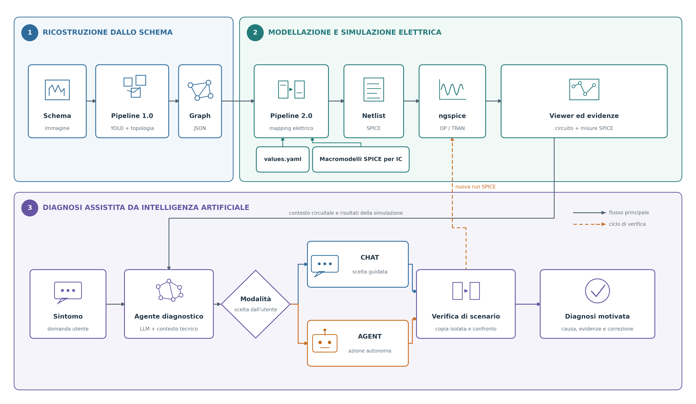
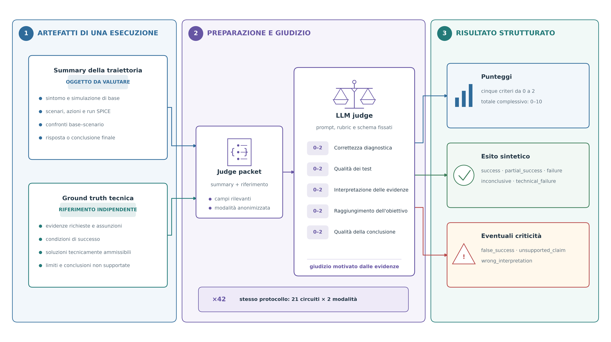
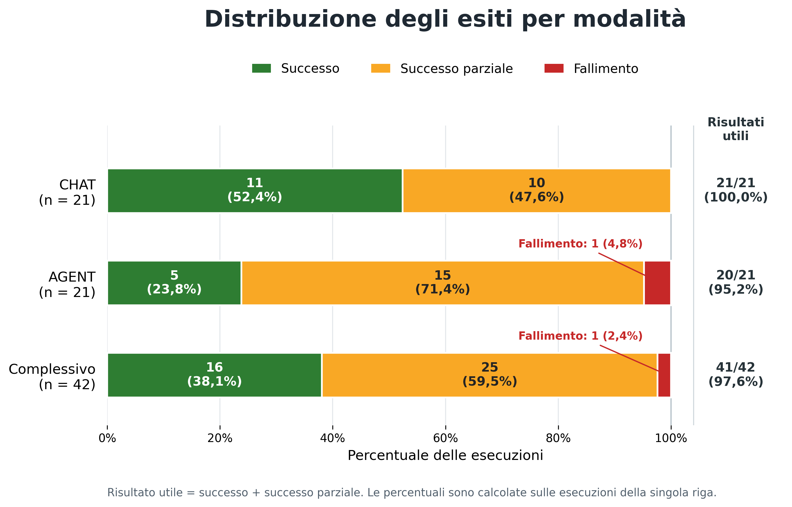
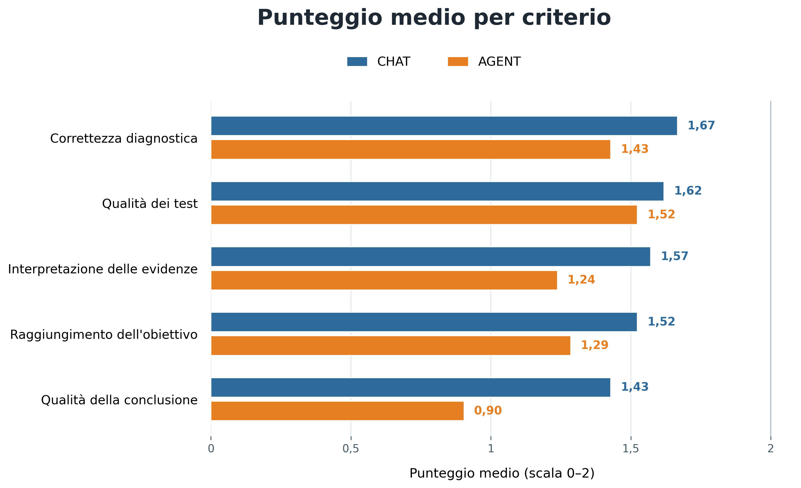
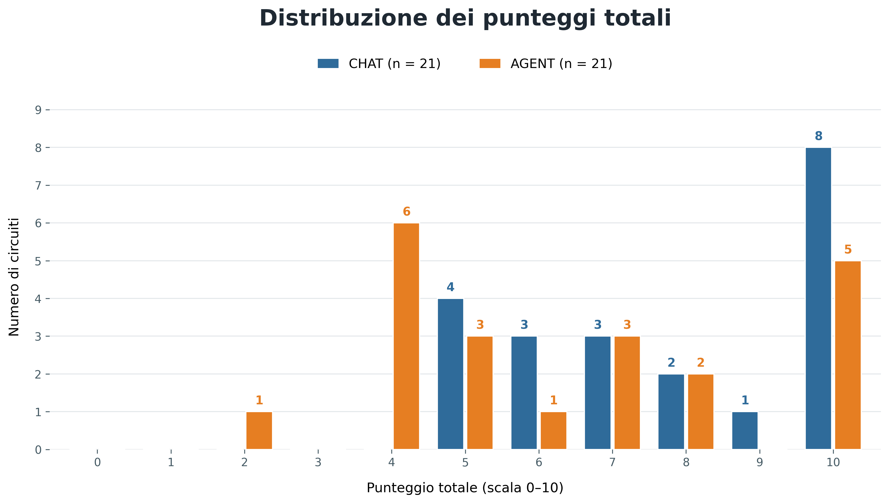

# Valutazione dell'agente per la diagnosi circuitale

> Stato del documento: bozza completa del capitolo. Disegno della valutazione,
> risultati quantitativi, figure, analisi dei casi, discussione e limiti sono
> consolidati.

## 1. Obiettivo del capitolo

Le fasi precedenti del lavoro trasformano l'immagine di uno schema elettrico in
una rappresentazione strutturata del circuito e in un modello simulabile con
SPICE. Il passaggio successivo consiste nell'utilizzare tali artefatti come
contesto tecnico per un agente basato su un modello linguistico. L'agente non
si limita quindi a descrivere l'immagine: riceve il sintomo espresso
dall'utente, formula ipotesi diagnostiche, propone o applica scenari
controllati, interpreta le misure prodotte da ngspice e restituisce una
conclusione motivata..

L'obiettivo principale di questo capitolo è stabilire se l'applicativo, nel
suo complesso, produca un supporto tecnicamente utile alla diagnosi
circuitale. Il confronto tra CHAT e AGENT è una seconda prospettiva di analisi:
le due modalità condividono la stessa rappresentazione del circuito e lo
stesso motore di simulazione, ma offrono livelli diversi di guida e autonomia.
Non vengono pertanto considerate come due sistemi concorrenti, bensì come due
forme di utilizzo dello stesso agente.

L'analisi risponde alle seguenti domande:

1. l'agente riesce a formulare diagnosi e verifiche tecnicamente utili?
2. quali risultati produce la modalità guidata CHAT?
3. quali risultati produce la modalità autonoma AGENT?
4. quali sono i principali punti di forza e le principali fonti di errore?
5. in che modo le due modalità possono essere utilizzate dall'utente?

## 2. Disegno della valutazione

### 2.1 Insieme dei circuiti

Il corpus di valutazione comprende 21 circuiti selezionati per rappresentare
topologie, sintomi e componenti differenti. Sono presenti percorsi in corrente
continua, circuiti di commutazione e temporizzazione, oscillatori, indicatori a
LED, stadi di amplificazione, circuiti audio e sistemi di carica. Il corpus
comprende inoltre sorgenti, interruttori, carichi, strumenti di misura,
componenti passivi, diodi, transistor e amplificatori operazionali. Questa
varietà permette di osservare il comportamento dell'agente sia su verifiche
statiche sia su fenomeni che richiedono un'analisi transitoria.

Quattro schemi, identificati come `ic01`–`ic04`, contengono circuiti integrati.
In questi casi la simulazione utilizza macromodelli SPICE documentati del
produttore, collegati alla netlist mediante l'ordine dei pin dichiarato nei file
di configurazione. Gli altri circuiti utilizzano le primitive elettriche e i
modelli generali già previsti dal flusso di simulazione.

Per ciascun circuito sono disponibili l'immagine canonica, il Graph JSON, i
valori elettrici, la netlist, i risultati SPICE, una ground truth tecnica e due
summary: uno relativo a CHAT e uno relativo ad AGENT. L'applicazione delle due
modalità agli stessi 21 circuiti produce quindi 42 traiettorie distinte da
valutare. La Tabella 1 riporta il sintomo e i principali componenti di ciascun
caso.

**Tabella 1 — Composizione del dataset**

| Circuito | Compito diagnostico o sintomo | Componenti principali | Macromodello IC ufficiale |
|---|---|---|---|
| a01 | Ramo lampada non alimentato con LED già acceso | Lampada, LED, resistori, interruttore, connettore | — |
| a02 | Batteria presente ma assenza di corrente nel percorso DC | Batteria, condensatore, resistore, interruttore, connettore | — |
| a04 | Segnale di uscita amplificato troppo debole | BJT NPN, resistori, condensatori, sorgente di segnale, batteria | — |
| a05 | Lettura voltmetrica costantemente nulla | Voltmetro, condensatore, resistore, interruttore, connettore | — |
| a06 | Uscita amplificata distorta o poco pulita | BJT NPN, resistori, condensatori, sorgente di segnale | — |
| a07 | LED di alimentazione e voltmetro inattivi | LED, voltmetro, resistori, interruttore, connettore | — |
| a08 | Lampeggio LED irregolare | LED, BJT NPN, resistori, condensatori, sorgente di segnale | — |
| a09 | Attivazione simultanea dei rami lampada e LED | Batteria, fusibile, lampada, LED, resistori, condensatore, interruttore | — |
| a10 | Attivazione simultanea dei rami lampada e LED | Batteria, lampada, LED, resistori, interruttore, connettore | — |
| b02 | Due LED accesi senza alternanza | LED, BJT NPN, condensatori polarizzati, resistori | — |
| b03 | Verifica statica e dinamica di un indicatore a tre soglie | Batteria, diodi, LED, BJT NPN, resistori | — |
| b04 | Corrente di carica della batteria apparentemente insufficiente | Trasformatore, diodi, fusibile, BJT NPN, resistori | — |
| b05 | Assenza di segnale audio in cuffia | Antenna, batteria, diodi, induttore, BJT PNP, condensatori, interruttore | — |
| b06 | Radio alimentata ma senza uscita audio | Antenna, batteria, diodo, induttore, BJT NPN, amplificatore operazionale, condensatori | — |
| b10 | Tensione quasi nulla all'uscita di uno switch analogico aperto | Sorgenti di tensione e corrente, switch, resistore, condensatore | — |
| c02 | Due LED apparentemente accesi senza alternanza | Batteria, LED, BJT NPN, condensatori polarizzati, resistori | — |
| c03 | Volume di uscita audio molto basso | Amplificatore operazionale, speaker, condensatori polarizzati, resistori | — |
| ic01 | Avvio irregolare dell'oscillatore e del LED | Timer 555, LED, resistori, condensatori | TI `TLC555_6` |
| ic02 | Volume audio troppo basso a ingresso invariato | Amplificatore LM1875, speaker, fusibili, resistori, condensatori | TI `LM1875_0` |
| ic03 | Lampeggio della lampada troppo rapido | Regolatore LM317T, lampada, resistori, condensatori, interruttore | TI `LM317_TRANS` |
| ic04 | Variazione del tono della sirena poco evidente | Due NE555, diodo, speaker, resistori, condensatori | 2 × TI `TLC555_6` |

Fonte: ground truth `../references/*.yaml` e inventario
`../dataset/components.csv`.

### 2.2 Dalla pipeline all'agente

La Figura 1 sintetizza il passaggio dall'immagine dello schema alla diagnosi
assistita. La Pipeline 1.0 rileva i componenti mediante YOLO e ricostruisce la
topologia formata da terminali e collegamenti, producendo una rappresentazione
strutturata in formato Graph JSON. La Pipeline 2.0 associa a questa struttura i
parametri contenuti nel `values.yaml` e, quando sono presenti circuiti
integrati, i relativi macromodelli SPICE. Da tali informazioni vengono generate
la netlist e le analisi elettriche eseguite con ngspice.

Il viewer e le misure ottenute dalle analisi di punto operativo e transitorie
costituiscono il contesto tecnico fornito all'agente insieme al sintomo espresso
dall'utente. L'utente può quindi scegliere la modalità guidata CHAT oppure la
modalità autonoma AGENT. Le due modalità condividono lo stesso motore di
simulazione: gli scenari vengono applicati a copie isolate del circuito, nuovamente
simulati e confrontati con la condizione di partenza prima di formulare la
diagnosi finale.

**Figura 1 — Flusso complessivo dell'applicativo**

*Figura 1 — Flusso complessivo dell'applicativo. Le frecce continue descrivono
il percorso principale dei dati e delle decisioni; la freccia tratteggiata
evidenzia il ciclo iterativo con cui uno scenario controllato produce una nuova
esecuzione SPICE. CHAT e AGENT condividono la stessa base tecnica e si
differenziano nel grado di intervento richiesto all'utente. Fonte: elaborazione
dell'autore a partire dagli artefatti delle Pipeline 1.0 e 2.0.*

### 2.3 Modalità CHAT e AGENT

Nella modalità CHAT l'interazione è guidata. A partire dal sintomo iniziale,
l'agente propone uno o più scenari diagnostici e ne illustra lo scopo;
l'utente sceglie quale scenario eseguire e può fornire osservazioni o richieste
successive. I risultati SPICE vengono quindi restituiti alla conversazione e
utilizzati per proporre la verifica seguente oppure per formulare la
conclusione. Il fatto che non tutti gli scenari proposti vengano eseguiti è
quindi coerente con il funzionamento della modalità e non costituisce, da solo,
un errore.

Nella modalità AGENT il sistema gestisce autonomamente la stessa sequenza
operativa: pianifica le verifiche, seleziona gli scenari, applica le azioni
ammesse a copie isolate del circuito, avvia le simulazioni e interpreta i
risultati prima di produrre la risposta finale. L'autonomia rimane vincolata
alle primitive previste dall'applicativo e non comporta modifiche permanenti al
circuito di partenza.

Le due modalità partono dallo stesso contesto circuitale e perseguono lo stesso
obiettivo diagnostico. In 20 casi su 21 la domanda iniziale è identica; nel
circuito `b03` la formulazione è stata adattata all'interazione autonoma, pur
mantenendo invariato l'obiettivo tecnico di verificare i tre stati
dell'indicatore e la loro evoluzione durante una rampa di tensione. CHAT offre
quindi maggiore controllo all'utente, mentre AGENT riduce gli interventi
intermedi richiesti. La valutazione considera innanzitutto l'utilità del
sistema complessivo e utilizza il confronto tra le modalità per descrivere i
diversi compromessi tra supervisione e autonomia.

### 2.4 Ground truth e artefatti valutati

Per ogni circuito è stata predisposta una ground truth tecnica indipendente
dalle risposte dell'agente. La sua costruzione ha richiesto il controllo
congiunto dell'immagine canonica, del Graph JSON, della node map, dei valori
elettrici, della netlist e dei risultati ngspice. La scheda descrive quindi le
evidenze che una risposta deve rispettare, le assunzioni del testbench, le
condizioni di successo, le soluzioni ammissibili e le conclusioni che non
risultano supportate.

Il summary ha una funzione diversa: documenta la traiettoria effettivamente
seguita in CHAT oppure in AGENT e costituisce l'oggetto da valutare. Contiene il
sintomo iniziale, gli scenari proposti ed eseguiti, le azioni applicate, i
risultati SPICE, i confronti con la simulazione di base e la conclusione finale.
Summary e ground truth vengono riuniti in un packet compatto, dal quale sono
escluse le note che anticiperebbero il verdetto e nel quale i riferimenti alla
modalità sono anonimizzati.

Per ciascuna delle 42 esecuzioni sono disponibili:

- summary della traiettoria CHAT o AGENT;
- ground truth del circuito;
- packet fornito al judge;
- risultato strutturato del judge.

**Figura 2 — Processo di valutazione di una singola esecuzione**

*Figura 2 — Processo di valutazione di una singola esecuzione. Il summary della
traiettoria costituisce l'oggetto da giudicare, mentre la ground truth fornisce
il riferimento tecnico indipendente. Il packet pulito viene valutato dal judge
mediante prompt, rubric e schema di risposta fissati. L'output comprende i
cinque punteggi da 0 a 2, l'esito sintetico e le eventuali categorie di errore
critico. Lo stesso protocollo è applicato separatamente alle 42 traiettorie.
Fonte: elaborazione dell'autore sulla base di `build_judge_packets.py` e
`run_judge.py`.*

Il judge restituisce inoltre una motivazione per ciascun criterio, le evidenze
ritenute decisive e un livello di confidenza. Il risultato viene accettato solo
se rispetta lo schema JSON previsto; il punteggio totale è calcolato sommando i
cinque criteri, mentre l'esito rimane un giudizio distinto e non deriva da una
semplice soglia numerica.

### 2.5 Criteri di valutazione

Ogni esecuzione riceve cinque punteggi compresi tra 0 e 2.

| Criterio | Aspetto valutato | Intervallo |
|---|---|---:|
| Correttezza diagnostica | Coerenza della diagnosi con circuito e ground truth | 0–2 |
| Qualità dei test | Pertinenza e utilità delle verifiche proposte o eseguite | 0–2 |
| Interpretazione delle evidenze | Lettura corretta dei risultati SPICE | 0–2 |
| Raggiungimento dell'obiettivo | Risposta effettiva al sintomo dell'utente | 0–2 |
| Qualità della conclusione | Chiarezza, supporto e calibrazione della risposta finale | 0–2 |

Il totale è compreso tra 0 e 10, ma l'esito non viene ricavato applicando una
soglia numerica. Il judge considera anche la natura del risultato: un errore
centrale può rendere non valida la conclusione anche quando alcuni passaggi
intermedi ricevono un punteggio positivo. Questa distinzione evita che la somma
dei criteri nasconda una soluzione finale non realmente dimostrata.

### 2.6 Esiti ed errori critici

Gli esiti utilizzati sono:

- `success`: l'obiettivo è raggiunto, la conclusione è corretta e le prove sono
  sufficienti;
- `partial_success`: la traiettoria contiene almeno un contributo corretto e
  materialmente utile, ma l'obiettivo è incompleto oppure la conclusione
  presenta limiti rilevanti;
- `failure`: non emerge un risultato concretamente utilizzabile oppure viene
  proposta come soluzione una conclusione centrale contraria alle evidenze;
- `inconclusive`: le informazioni disponibili non consentono una decisione;
- `technical_failure`: la traiettoria non è valutabile per un problema tecnico,
  distinto dalla correttezza della diagnosi.

Oltre all'esito, il judge registra tre categorie di errore critico:

- `false_success`: dichiarazione di una soluzione non dimostrata;
- `unsupported_claim`: affermazione non sostenuta dalle evidenze;
- `wrong_interpretation`: interpretazione incompatibile con i risultati.

La presenza di un errore critico impedisce il successo pieno quando compromette
il risultato, ma non trasforma automaticamente tutta la traiettoria in un
fallimento. Se rimane un contributo indipendente e utilizzabile, per esempio un
test pertinente o una localizzazione parziale corretta, l'esito può essere
`partial_success`. Nel capitolo un **risultato utile** corrisponde quindi a
`success` o `partial_success`; nel secondo caso può essere necessaria la
supervisione dell'utente prima di applicare la conclusione.

## 3. Risultati complessivi dell'applicativo

La valutazione comprende 42 esecuzioni complete, ottenute applicando entrambe
le modalità ai 21 circuiti. Nel complesso, il judge assegna 16 successi pieni,
25 successi parziali e un fallimento. Considerando utile un risultato
classificato come successo o successo parziale, l'applicativo produce quindi un
contributo utile in 41 casi su 42 (97,6%). Questo dato descrive la capacità del
sistema di fornire elementi concretamente utilizzabili nella diagnosi, ma non
deve essere confuso con il raggiungimento completo dell'obiettivo: i successi
pieni rappresentano infatti 16 esecuzioni su 42 (38,1%).

**Tabella 2 — Risultati complessivi e per modalità**

| Modalità | Esecuzioni | Successi | Successi parziali | Fallimenti | Risultati utili | Media | Mediana | Run critiche |
|---|---:|---:|---:|---:|---:|---:|---:|---:|
| CHAT | 21 | 11 (52,4%) | 10 (47,6%) | 0 (0,0%) | 21 (100,0%) | 7,81/10 | 8/10 | 5 (23,8%) |
| AGENT | 21 | 5 (23,8%) | 15 (71,4%) | 1 (4,8%) | 20 (95,2%) | 6,38/10 | 6/10 | 12 (57,1%) |
| Complessivo | 42 | 16 (38,1%) | 25 (59,5%) | 1 (2,4%) | 41 (97,6%) | 7,10/10 | 7/10 | 17 (40,5%) |

Fonte: `tables/table_03_mode_summary.csv`.

**Tabella 3 — Punteggi assegnati a ogni circuito e modalità**

I cinque criteri sono valutati singolarmente da 0 a 2; il totale è compreso
tra 0 e 10.

| Circuito | Modalità | Correttezza diagnostica | Qualità dei test | Interpretazione delle evidenze | Raggiungimento dell'obiettivo | Qualità della conclusione | Totale |
|---|---|---:|---:|---:|---:|---:|---:|
| a01 | CHAT | 2 | 2 | 2 | 2 | 2 | 10 |
| a01 | AGENT | 2 | 2 | 2 | 2 | 2 | 10 |
| a02 | CHAT | 1 | 1 | 2 | 1 | 2 | 7 |
| a02 | AGENT | 2 | 2 | 1 | 1 | 1 | 7 |
| a04 | CHAT | 2 | 2 | 1 | 2 | 1 | 8 |
| a04 | AGENT | 1 | 2 | 1 | 2 | 1 | 7 |
| a05 | CHAT | 2 | 2 | 2 | 2 | 2 | 10 |
| a05 | AGENT | 2 | 2 | 2 | 2 | 2 | 10 |
| a06 | CHAT | 2 | 2 | 2 | 2 | 2 | 10 |
| a06 | AGENT | 1 | 2 | 1 | 1 | 1 | 6 |
| a07 | CHAT | 2 | 2 | 2 | 2 | 2 | 10 |
| a07 | AGENT | 2 | 2 | 2 | 2 | 2 | 10 |
| a08 | CHAT | 2 | 2 | 2 | 2 | 2 | 10 |
| a08 | AGENT | 1 | 1 | 1 | 1 | 0 | 4 |
| a09 | CHAT | 2 | 2 | 2 | 2 | 2 | 10 |
| a09 | AGENT | 2 | 2 | 2 | 1 | 1 | 8 |
| a10 | CHAT | 2 | 1 | 2 | 1 | 1 | 7 |
| a10 | AGENT | 2 | 2 | 2 | 2 | 2 | 10 |
| b02 | CHAT | 2 | 2 | 2 | 2 | 2 | 10 |
| b02 | AGENT | 1 | 1 | 1 | 1 | 0 | 4 |
| b03 | CHAT | 1 | 2 | 1 | 1 | 1 | 6 |
| b03 | AGENT | 2 | 2 | 1 | 1 | 1 | 7 |
| b04 | CHAT | 1 | 1 | 2 | 1 | 1 | 6 |
| b04 | AGENT | 1 | 1 | 1 | 1 | 0 | 4 |
| b05 | CHAT | 1 | 1 | 1 | 1 | 1 | 5 |
| b05 | AGENT | 1 | 1 | 1 | 1 | 0 | 4 |
| b06 | CHAT | 2 | 2 | 2 | 2 | 1 | 9 |
| b06 | AGENT | 1 | 1 | 1 | 1 | 1 | 5 |
| b10 | CHAT | 1 | 1 | 1 | 1 | 1 | 5 |
| b10 | AGENT | 1 | 1 | 1 | 1 | 1 | 5 |
| c02 | CHAT | 2 | 1 | 1 | 1 | 1 | 6 |
| c02 | AGENT | 1 | 1 | 0 | 0 | 0 | 2 |
| c03 | CHAT | 1 | 1 | 1 | 1 | 1 | 5 |
| c03 | AGENT | 1 | 1 | 1 | 1 | 0 | 4 |
| ic01 | CHAT | 2 | 2 | 1 | 2 | 1 | 8 |
| ic01 | AGENT | 2 | 2 | 2 | 2 | 2 | 10 |
| ic02 | CHAT | 2 | 2 | 1 | 1 | 1 | 7 |
| ic02 | AGENT | 1 | 1 | 1 | 1 | 1 | 5 |
| ic03 | CHAT | 2 | 2 | 2 | 2 | 2 | 10 |
| ic03 | AGENT | 2 | 2 | 1 | 2 | 1 | 8 |
| ic04 | CHAT | 1 | 1 | 1 | 1 | 1 | 5 |
| ic04 | AGENT | 1 | 1 | 1 | 1 | 0 | 4 |

Fonte: `tables/table_07_scores_only.csv`.

*Figura 3 — Distribuzione degli esiti nelle modalità CHAT e AGENT. Le barre
riportano il numero e la percentuale di successi pieni, successi parziali e
fallimenti; la colonna a destra indica i risultati utili, definiti come somma di
successi e successi parziali. La riga “Complessivo” aggrega le 42 esecuzioni e
non costituisce una terza modalità. Fonte: elaborazione di
`tables/table_05_outcome_summary.csv`.*

La Figura 3 evidenzia due aspetti complementari. CHAT fornisce un risultato
utile in tutti i 21 circuiti, con 11 successi pieni e 10 parziali. AGENT produce
20 risultati utili su 21, ma presenta una quota maggiore di successi parziali:
5 successi pieni, 15 parziali e un fallimento. Il sistema risulta pertanto
generalmente capace di contribuire alla diagnosi in entrambe le modalità;
tuttavia, la modalità autonoma raggiunge meno frequentemente una soluzione
completa e richiede maggiore attenzione nella verifica della conclusione. Le
cause di questa differenza vengono approfondite nelle analisi dei singoli
criteri e degli errori critici.

## 4. Risultati della modalità CHAT

### 4.1 Efficacia della diagnosi guidata

La modalità CHAT produce un risultato utile in tutti i 21 circuiti. Il judge
assegna 11 successi pieni (52,4%) e 10 successi parziali (47,6%), senza
registrare fallimenti. Il punteggio medio è pari a 7,81/10 e la mediana a
8/10. I valori osservati sono compresi tra 5 e 10: otto circuiti raggiungono il
punteggio massimo e nessuna esecuzione scende sotto la metà della scala.

Il successo pieno in poco più della metà dei casi indica che la modalità
guidata riesce frequentemente a collegare il sintomo a una diagnosi e a una
conclusione sufficientemente verificate. I dieci successi parziali richiedono
però una lettura distinta. In tali casi il dialogo produce comunque almeno un
contributo diagnostico corretto e utilizzabile, ma una parte dell'obiettivo
rimane incompleta oppure la conclusione non è sostenuta in modo pieno dalle
evidenze disponibili. Il dato del 100% di risultati utili descrive quindi la
capacità di assistere l'utente, non una correttezza completa in tutte le run.

La supervisione dell'utente è parte del funzionamento di CHAT: consente di
scegliere quali ipotesi approfondire, avviare le verifiche ritenute più
pertinenti e richiedere una conclusione quando le evidenze sono considerate
sufficienti. I risultati misurano pertanto l'efficacia di un processo
interattivo, non la capacità del sistema di operare senza interventi esterni.

### 4.2 Interazione dell'utente e scenari SPICE

**Tabella 4 — Operatività della modalità CHAT**

| Indicatore | Totale sulle 21 run | Media per run |
|---|---:|---:|
| Scenari proposti | 77 | 3,67 |
| Scenari eseguiti | 40 | 1,90 |
| Simulazioni SPICE riuscite | 40 | 1,90 |
| Simulazioni SPICE fallite | 0 | 0,00 |
| Turni intermedi dell'utente | 83 | 3,95 |

Fonte: aggregazione di `tables/table_01_run_results.csv`.

Nel complesso, CHAT propone 77 scenari e ne esegue 40, pari in media a 3,67
proposte e 1,90 esecuzioni per circuito. La differenza non rappresenta 37 prove
fallite o abbandonate dal sistema: uno scenario proposto diventa una prova
effettiva soltanto quando l'utente decide di avviarlo. La selezione permette di
concentrare l'analisi sulle ipotesi considerate più informative senza dover
eseguire automaticamente tutte le alternative formulate durante la
conversazione.

Tutte le 40 simulazioni richieste si concludono correttamente con ngspice e non
si registra alcun fallimento SPICE. Questo risultato separa le eventuali
debolezze diagnostiche da problemi di esecuzione del simulatore: nei casi
parzialmente riusciti, il limite riguarda l'interpretazione o la conclusione e
non l'impossibilità di ottenere le misure richieste. Le 83 interazioni
intermedie, corrispondenti a una media di 3,95 per run, quantificano invece il
coinvolgimento necessario all'utente per selezionare gli scenari, comunicare
osservazioni e orientare la conversazione verso la risposta finale.

### 4.3 Punti di forza e limiti di CHAT

Il profilo dei cinque criteri mostra che i principali punti di forza di CHAT
sono la correttezza diagnostica, con una media di 1,67/2, e la qualità dei test,
con 1,62/2. L'interpretazione delle evidenze raggiunge 1,57/2 e il
raggiungimento dell'obiettivo 1,52/2. Questi valori sono coerenti con una
modalità nella quale le ipotesi possono essere discusse e le prove vengono
scelte progressivamente. Anche l'affidabilità tecnica del percorso è elevata:
non si osservano run SPICE fallite né esecuzioni complessivamente classificate
come fallimento.

La qualità della conclusione è il criterio relativamente più debole, con una
media di 1,43/2. Cinque run su 21 (23,8%) contengono almeno un errore critico:
`b03`, `b05`, `b10`, `c03` e `ic04`. In tutti e cinque i casi è presente una
`wrong_interpretation`; `c03` contiene anche un `unsupported_claim`. Non viene
invece rilevato alcun `false_success`. Le cinque traiettorie conservano prove o
osservazioni utili e sono classificate come successi parziali, ma la loro
conclusione richiede una verifica ulteriore prima di essere applicata.

CHAT offre quindi un buon livello di controllo e rende possibile un esame
progressivo delle ipotesi, al costo di un coinvolgimento continuativo
dell'utente. Tale coinvolgimento non costituisce un difetto rispetto allo scopo
della modalità, ma ne definisce il principale compromesso operativo: maggiore
supervisione e possibilità di orientare il percorso, a fronte di un numero più
elevato di interazioni rispetto all'esecuzione autonoma. La presenza di
successi parziali mostra comunque che il dialogo non elimina il rischio di
interpretazioni incomplete o conclusioni non pienamente supportate. La minore
frequenza di criticità rispetto ad AGENT sarà quindi letta come un risultato
descrittivo del campione osservato, non come una prova causale dell'effetto
della supervisione.

## 5. Risultati della modalità AGENT

### 5.1 Capacità di esecuzione autonoma

La modalità AGENT produce un risultato utile in 20 circuiti su 21 (95,2%). Il
judge assegna 5 successi pieni (23,8%), 15 successi parziali (71,4%) e un
fallimento (4,8%). Il punteggio medio è pari a 6,38/10 e la mediana a 6/10. I
risultati coprono un intervallo più ampio rispetto a CHAT, da un minimo di 2 a
un massimo di 10; cinque circuiti raggiungono il punteggio massimo.

Questi valori indicano che l'esecuzione autonoma riesce quasi sempre a produrre
almeno un contributo diagnostico utilizzabile, ma raggiunge meno frequentemente
una soluzione completa. La prevalenza dei successi parziali non equivale a
un'incapacità di eseguire le verifiche: in molti casi l'agente pianifica e
simula scenari pertinenti, mentre il limite compare nell'interpretazione delle
misure o nella formulazione della conclusione finale.

**Tabella 5 — Operatività della modalità AGENT**

| Indicatore | Totale sulle 21 run | Media per run |
|---|---:|---:|
| Scenari proposti | 41 | 1,95 |
| Scenari eseguiti | 41 | 1,95 |
| Simulazioni SPICE riuscite | 40 | 1,90 |
| Simulazioni SPICE fallite | 1 | 0,05 |
| Decisioni autonome | 58 | 2,76 |

Fonte: aggregazione di `tables/table_01_run_results.csv`.

AGENT propone complessivamente 41 scenari e li esegue tutti, con una media di
1,95 scenari per circuito. Questo comportamento è coerente con la modalità
autonoma: dopo la richiesta iniziale non è previsto un passaggio nel quale
l'utente selezioni manualmente le prove. Il registro contiene inoltre 58
decisioni autonome, pari in media a 2,76 per run, che comprendono le scelte
operative compiute durante la pianificazione, l'esecuzione e l'arresto del
percorso.

Quaranta simulazioni su 41 si concludono correttamente, mentre una fallisce,
per un tasso di riuscita tecnica del 97,6%. Il fallimento SPICE riguarda il
secondo dei tre scenari eseguiti in `a08`; la traiettoria non viene interrotta,
poiché il primo e il terzo scenario producono regolarmente risultati. L'unico
errore di simulazione non coincide quindi con un arresto complessivo
dell'agente, ma ricorda che una prova fallita non può essere usata per
confermare o smentire un'ipotesi.

### 5.2 Qualità diagnostica e conclusione finale

La scomposizione dei punteggi conferma la distinzione tra esecuzione delle prove
e utilizzo delle relative evidenze. La qualità dei test è il criterio migliore
di AGENT, con una media di 1,52/2, seguita dalla correttezza diagnostica con
1,43/2. L'agente dimostra quindi di saper formulare ipotesi plausibili e
trasformarle in scenari generalmente pertinenti ed eseguibili.

I valori diminuiscono nei passaggi successivi. Il raggiungimento dell'obiettivo
ottiene 1,29/2 e l'interpretazione delle evidenze 1,24/2; la qualità della
conclusione scende a 0,90/2. Il punto più fragile non è pertanto l'avvio della
simulazione, ma il collegamento tra le misure osservate, la causa del sintomo e
la risposta finale. Una traiettoria può avere eseguito correttamente una prova
e localizzato una parte del problema, ma rimanere un successo parziale quando
la conclusione estende il risultato oltre ciò che lo scenario ha realmente
dimostrato.

Quattro successi parziali (`a09`, `b03`, `b06` e `ic02`) non contengono errori
critici: in questi casi il risultato è utile ma incompleto, per esempio perché
manca una verifica richiesta oppure la localizzazione della causa non viene
portata a termine. Gli altri 11 successi parziali presentano almeno una
criticità nella conclusione o nell'interpretazione. Il solo fallimento,
relativo a `c02`, contiene invece un falso successo: una correzione viene
presentata come valida nonostante sia incompatibile con le evidenze decisive.
Il caso viene analizzato separatamente nella Sezione 9.4.

### 5.3 Punti di forza e limiti di AGENT

Il principale punto di forza di AGENT è la continuità operativa. Tutti gli
scenari pianificati vengono avviati senza interventi intermedi dell'utente e
il 97,6% delle simulazioni termina correttamente. Cinque circuiti (`a01`, `a05`,
`a07`, `a10` e `ic01`) ottengono 10/10, mostrando che, quando ipotesi, prova e
interpretazione rimangono coerenti, la modalità autonoma può completare
l'intero percorso diagnostico. Nel complesso, 20 risultati utili su 21
confermano che l'autonomia non impedisce al sistema di fornire un contributo
concreto nella grande maggioranza dei casi osservati.

Il limite principale riguarda l'affidabilità semantica della parte finale.
Dodici run su 21 (57,1%) contengono almeno un errore critico. Gli
`unsupported_claim` e le `wrong_interpretation` compaiono ciascuno in 10 run e
spesso coesistono nella stessa traiettoria; il solo `false_success` è quello di
`c02`. Questi conteggi non devono essere sommati, perché una singola esecuzione
può appartenere a più categorie. La frequenza delle criticità è coerente con
il punteggio medio relativamente basso assegnato alla qualità della
conclusione.

AGENT riduce l'interazione richiesta dopo la domanda iniziale e può quindi
essere utile quando si desidera delegare la pianificazione e l'esecuzione delle
prove. I risultati mostrano però che l'autonomia operativa non coincide
automaticamente con l'affidabilità della conclusione: nei successi parziali è
opportuno controllare che la risposta finale sia effettivamente sostenuta dalle
misure SPICE. Il confronto con CHAT rimane descrittivo e non permette di
attribuire causalmente le differenze alla sola assenza di interventi
intermedi, poiché per ogni circuito è disponibile una singola traiettoria per
modalità.

## 6. Analisi dei criteri

La sola classificazione dell'esito non permette di distinguere le diverse
capacità coinvolte nella diagnosi. Per questo motivo, ogni esecuzione è stata
valutata separatamente rispetto a correttezza diagnostica, qualità dei test,
interpretazione delle evidenze, raggiungimento dell'obiettivo e qualità della
conclusione. La Tabella 6 e la Figura 4 riportano la media ottenuta da ciascuna
modalità sui 21 circuiti, utilizzando per ogni criterio la scala da 0 a 2
definita nella rubrica.

**Tabella 6 — Punteggi medi dei cinque criteri**

| Criterio | CHAT | AGENT | Complessivo |
|---|---:|---:|---:|
| Correttezza diagnostica | 1,67/2 | 1,43/2 | 1,55/2 |
| Qualità dei test | 1,62/2 | 1,52/2 | 1,57/2 |
| Interpretazione delle evidenze | 1,57/2 | 1,24/2 | 1,40/2 |
| Raggiungimento dell'obiettivo | 1,52/2 | 1,29/2 | 1,40/2 |
| Qualità della conclusione | 1,43/2 | 0,90/2 | 1,17/2 |

Fonte: `tables/table_04_criteria_summary.csv`; valori arrotondati a due
decimali.

*Figura 4 — Punteggio medio ottenuto da CHAT e AGENT nei cinque criteri di
valutazione. Ogni valore è la media delle 21 esecuzioni della modalità
corrispondente; la scala è compresa tra 0 e 2. Il confronto è descrittivo e non
rappresenta un test statistico di superiorità. Fonte: elaborazione di
`tables/table_04_criteria_summary.csv`.*

CHAT presenta un profilo relativamente uniforme. Il valore più alto riguarda
la correttezza diagnostica (1,67), seguito dalla qualità dei test (1,62) e
dall'interpretazione delle evidenze (1,57). Anche il raggiungimento
dell'obiettivo (1,52) e la qualità della conclusione (1,43) rimangono mediamente
al di sopra del livello intermedio della scala. La progressiva riduzione dei
punteggi verso la conclusione indica che, anche nella modalità guidata, la
sintesi finale è più difficile della formulazione iniziale della diagnosi e
della scelta delle prove.

Il profilo di AGENT è meno uniforme. La qualità dei test costituisce il suo
risultato migliore (1,52) ed è anche il criterio con la minore distanza da CHAT,
pari a circa 0,10 punti. Questo dato è coerente con la capacità della modalità
autonoma di trasformare le ipotesi in scenari eseguibili e di utilizzare la
simulazione SPICE durante la traiettoria. La correttezza diagnostica raggiunge
1,43, mentre interpretazione delle evidenze e raggiungimento dell'obiettivo si
attestano rispettivamente a 1,24 e 1,29.

La maggiore criticità riguarda la qualità della conclusione: AGENT ottiene
0,90, contro 1,43 di CHAT, con una differenza di circa 0,52 punti. Anche lo
scarto nell'interpretazione delle evidenze, pari a circa 0,33 punti, è più ampio
di quello osservato nella qualità dei test. Nel complesso, il risultato non
indica principalmente una difficoltà nell'eseguire le verifiche, ma una
maggiore fragilità nel collegare le misure alla causa del sintomo e nel
formulare una conclusione pienamente supportata. Ciò spiega perché molte
traiettorie AGENT conservino passaggi intermedi utili pur venendo classificate
come successi parziali.

Queste medie devono essere interpretate come una caratterizzazione del profilo
delle due modalità, non come una prova inferenziale: per ciascun circuito è
disponibile una sola traiettoria per modalità e i prompt del judge sono stati
adattati alle rispettive modalità operative. L'analisi per circuito e quella
degli errori critici permettono quindi di verificare in quali casi le differenze
medie corrispondono a limiti sostanziali della diagnosi.

## 7. Analisi per circuito e confronto tra le modalità

I risultati aggregati non mostrano se le due modalità si comportino in modo
uniforme sui diversi circuiti. È quindi utile affiancare alle medie un'analisi
appaiata: ciascuno dei 21 circuiti è stato affrontato una volta in CHAT e una
volta in AGENT. La Tabella 7 conserva l'identità del circuito e riporta, per
entrambe le modalità, punteggio totale ed esito assegnato dal judge. La
differenza è calcolata come punteggio AGENT meno punteggio CHAT; un valore
positivo indica pertanto un risultato numericamente maggiore per AGENT.

**Tabella 7 — Risultati CHAT e AGENT per circuito**

| Circuito | CHAT | AGENT | Differenza AGENT−CHAT | Relazione |
|---|---:|---:|---:|---|
| a01 | 10 — successo | 10 — successo | 0 | uguali |
| a02 | 7 — parziale | 7 — parziale | 0 | uguali |
| a04 | 8 — successo | 7 — parziale | −1 | CHAT maggiore |
| a05 | 10 — successo | 10 — successo | 0 | uguali |
| a06 | 10 — successo | 6 — parziale | −4 | CHAT maggiore |
| a07 | 10 — successo | 10 — successo | 0 | uguali |
| a08 | 10 — successo | 4 — parziale | −6 | CHAT maggiore |
| a09 | 10 — successo | 8 — parziale | −2 | CHAT maggiore |
| a10 | 7 — parziale | 10 — successo | +3 | AGENT maggiore |
| b02 | 10 — successo | 4 — parziale | −6 | CHAT maggiore |
| b03 | 6 — parziale | 7 — parziale | +1 | AGENT maggiore |
| b04 | 6 — parziale | 4 — parziale | −2 | CHAT maggiore |
| b05 | 5 — parziale | 4 — parziale | −1 | CHAT maggiore |
| b06 | 9 — successo | 5 — parziale | −4 | CHAT maggiore |
| b10 | 5 — parziale | 5 — parziale | 0 | uguali |
| c02 | 6 — parziale | 2 — fallimento | −4 | CHAT maggiore |
| c03 | 5 — parziale | 4 — parziale | −1 | CHAT maggiore |
| ic01 | 8 — successo | 10 — successo | +2 | AGENT maggiore |
| ic02 | 7 — parziale | 5 — parziale | −2 | CHAT maggiore |
| ic03 | 10 — successo | 8 — parziale | −2 | CHAT maggiore |
| ic04 | 5 — parziale | 4 — parziale | −1 | CHAT maggiore |

In 13 circuiti il punteggio CHAT è maggiore, in 5 è uguale e in 3 è maggiore
il punteggio AGENT. I tre vantaggi di AGENT si osservano in `a10` (+3), `ic01`
(+2) e `b03` (+1). Le differenze più ampie a favore di CHAT riguardano `a08` e
`b02` (−6), seguiti da `a06`, `b06` e `c02` (−4). I punteggi coincidono invece
in `a01`, `a02`, `a05`, `a07` e `b10`. Questi risultati mostrano che la
differenza tra le modalità non è costante, ma dipende dalla specifica
traiettoria diagnostica e dal circuito considerato. Fonte:
`tables/table_02_paired_results.csv`.

La scomposizione completa nei cinque criteri è riportata nella Tabella 3 ed è
disponibile anche in `SCORES_ONLY.md` e
`tables/table_07_scores_only.csv`.

Per evitare di duplicare graficamente le 42 righe già documentate nelle
tabelle, la Figura 5 sintetizza la distribuzione dei punteggi. Per ogni valore
della scala 0–10 indica quanti dei 21 circuiti hanno ricevuto quel punteggio in
CHAT e quanti in AGENT.

*Figura 5 — Distribuzione dei punteggi totali assegnati alle 21 esecuzioni CHAT
e alle 21 esecuzioni AGENT. Ogni barra indica il numero di circuiti che ha
ottenuto il corrispondente valore della scala 0–10; l'assenza di una barra
indica una frequenza nulla. Fonte: elaborazione di
`tables/table_02_paired_results.csv`.*

La distribuzione CHAT è compresa tra 5 e 10 ed è concentrata nella parte alta
della scala. Otto circuiti ottengono il punteggio massimo, quattro ottengono 5,
tre ottengono 6, tre ottengono 7, due ottengono 8 e uno ottiene 9. Questa forma
è coerente con la media di 7,81 e la mediana di 8 riportate nella Tabella 2 e
mostra che nessuna esecuzione CHAT scende sotto la metà della scala.

I punteggi AGENT coprono invece un intervallo più ampio, da 2 a 10. Le
frequenze più elevate si osservano in corrispondenza di 4 punti, ottenuti da sei
circuiti, e di 10 punti, ottenuti da cinque circuiti. Tre circuiti ottengono 5,
uno ottiene 6, tre ottengono 7 e due ottengono 8; il punteggio 2 appartiene al
solo caso `c02`. La presenza contemporanea di cinque risultati massimi e di un
gruppo consistente di punteggi pari a 4 evidenzia una maggiore variabilità
della modalità autonoma: in alcuni circuiti la traiettoria raggiunge pienamente
l'obiettivo, mentre in altri conserva soltanto una parte del valore
diagnostico. Tale distribuzione è coerente con la media di 6,38 e la mediana di
6.

Il punteggio totale sintetizza i cinque criteri, ma non determina
automaticamente l'esito. Il judge considera anche la natura degli errori e la
validità della conclusione: una traiettoria può quindi ricevere credito per
test o passaggi intermedi corretti senza raggiungere il successo pieno. Per
questo motivo, la Figura 5 deve essere letta insieme alla distribuzione degli
esiti della Figura 3 e all'analisi dei criteri della Figura 4.

Infine, il confronto rimane descrittivo. È disponibile una sola esecuzione per
circuito e modalità e i prompt del judge sono adattati alle rispettive modalità
operative. I dati permettono di caratterizzare i risultati osservati e la loro
eterogeneità, ma non costituiscono una prova statistica di superiorità generale
di una modalità sull'altra.

## 8. Circuiti contenenti circuiti integrati

I quattro circuiti `ic01`–`ic04` fanno parte del corpus unitario di 21 casi e
non costituiscono un esperimento statistico separato. Sono esaminati in questa
sezione perché introducono una difficoltà ulteriore nella generazione della
netlist: oltre ai componenti esterni, la simulazione deve includere il
macromodello del circuito integrato e collegarne correttamente i terminali ai
nodi ricostruiti dallo schema. I quattro casi comprendono un timer 555 con LED,
un amplificatore audio LM1875, un lampeggiatore con LM317T e una sirena bitonale
basata su due timer 555.

L'integrazione è realizzata in modo dichiarativo. Per ciascun integrato, il
file `values.yaml` specifica il modello da impiegare, l'emissione come
subcircuito, l'ordine dei pin previsto dal modello e l'associazione tra i pin e
i nodi del grafo. La Pipeline 2.0 risolve quindi il modello registrato, ne
inserisce una copia locale nel file `07_external_models.lib` e genera nella
netlist una o più istanze di tipo `X`. Il comportamento interno dell'integrato
non è pertanto riprodotto mediante regole specifiche nel codice Python: deriva
dal macromodello SPICE, mentre la sua interazione con il circuito dipende dalla
mappatura dei pin e dalla rete esterna ricostruita.

Prima della valutazione dell'agente è stata verificata anche l'esecuzione
elettrica. Le quattro simulazioni di base sono terminate correttamente con
ngspice. Nelle successive traiettorie CHAT e AGENT sono stati inoltre eseguiti
17 scenari relativi ai quattro circuiti, tutti completati senza errori del
simulatore. Questo controllo non dimostra soltanto la presenza del file di
modello nella netlist, ma verifica che le istanze siano effettivamente
collegate e che le modifiche dei componenti esterni producano risultati
simulabili.

**Tabella 8 — Risultati dei quattro circuiti con IC**

| Circuito | Modello SPICE usato | CHAT | Esito CHAT | AGENT | Esito AGENT |
|---|---|---:|---|---:|---|
| ic01 | TI `TLC555_6` | 8/10 | successo | 10/10 | successo |
| ic02 | TI `LM1875_0` | 7/10 | successo parziale | 5/10 | successo parziale |
| ic03 | TI `LM317_TRANS` | 10/10 | successo | 8/10 | successo parziale |
| ic04 | 2 × TI `TLC555_6` (schema NE555) | 5/10 | successo parziale | 4/10 | successo parziale |

Fonte: estratto di `tables/table_02_paired_results.csv` e ground truth
`../references/ic01.yaml`–`../references/ic04.yaml`.

Considerando le otto traiettorie dei quattro circuiti, tre sono classificate
come successi e cinque come successi parziali; non si osservano fallimenti. Il
punteggio medio è pari a 7,13/10: CHAT ottiene una media di 7,50, mentre AGENT
raggiunge 6,75. Tutte le otto esecuzioni conservano quindi un contributo
diagnostico utile, anche quando la conclusione non soddisfa pienamente i
criteri del judge. Data la numerosità ridotta del sottogruppo, tali valori hanno
funzione descrittiva e non sono utilizzati per formulare un confronto
statistico autonomo.

Nel caso `ic01`, entrambe le modalità raggiungono il successo. La simulazione
con il modello TLC555 riproduce il funzionamento astabile e la commutazione
dell'uscita che pilota il LED; la variazione del condensatore sul terminale di
controllo produce inoltre un cambiamento osservabile nella fase iniziale del
transitorio. AGENT raggiunge in questo caso il punteggio massimo, mentre CHAT
ottiene 8/10.

Per `ic02`, entrambe le modalità individuano nella rete di retroazione
dell'LM1875 un punto di intervento utile e verificano mediante SPICE che la
variazione della resistenza interessata aumenta il guadagno. I risultati
rimangono tuttavia parziali perché la conclusione deve distinguere con maggiore
precisione una modifica progettuale verificata da un guasto fisico realmente
identificato. Inoltre, la simulazione elettrica del carico non consente da sola
di validare tutte le implicazioni acustiche espresse in termini di volume
percepito.

Nel circuito `ic03`, CHAT raggiunge 10/10, mentre AGENT ottiene 8/10. In
entrambi i casi la modifica proposta rallenta elettricamente il lampeggio del
circuito con LM317T; la penalizzazione di AGENT deriva da un'affermazione non
completamente sostenuta dalle grandezze osservate. Il transitorio consente
infatti di verificare tensioni e tempi di commutazione, ma non direttamente la
visibilità ottica della lampada per un osservatore.

Il circuito `ic04` è il caso più impegnativo del sottogruppo: contiene due
timer, una modulazione a bassa frequenza e una sezione che genera il tono
audio. CHAT e AGENT eseguono correttamente gli scenari SPICE, ma ottengono
rispettivamente 5/10 e 4/10. La criticità riguarda l'interpretazione del
comportamento già presente nella simulazione di base e la traduzione della
risposta elettrica in un effetto sonoro percepito, non il caricamento o il
collegamento dei due modelli SPICE.

Questi risultati mostrano che lo stesso meccanismo generale di generazione e
diagnosi può essere applicato anche ai quattro circuiti con integrati
considerati. Non dimostrano, invece, la compatibilità con qualunque circuito
integrato o con ogni possibile variante fisica. In particolare, il modello
TLC555 impiegato in `ic01` e `ic04` è funzionalmente e topologicamente
compatibile con il 555 rappresentato negli schemi, ma non coincide con tutte le
caratteristiche di un NE555 bipolare. I macromodelli del produttore sono inoltre
eseguiti tramite la compatibilità PSpice di ngspice, mentre altoparlanti e
lampade sono rappresentati mediante equivalenti elettrici semplificati. Le
conclusioni riguardano pertanto la corretta integrazione funzionale dei modelli
nei quattro casi studiati, non una validazione termica, acustica o percettiva
dei dispositivi reali.

## 9. Errori critici e casi rappresentativi

### 9.1 Frequenza degli errori

La classificazione degli esiti indica se la traiettoria è complessivamente
utilizzabile, ma non descrive la natura delle sue debolezze. Le categorie di
errore critico permettono di distinguere una soluzione dichiarata senza
verifica, un'affermazione priva di supporto e una lettura errata delle misure.
In questo contesto il termine “critico” si riferisce all'affidabilità semantica
della diagnosi e non a un arresto del software o della simulazione.

**Tabella 9 — Errori critici per modalità**

| Indicatore | CHAT | AGENT | Complessivo |
|---|---:|---:|---:|
| `false_success` | 0 (0,0%) | 1 (4,8%) | 1 (2,4%) |
| `unsupported_claim` | 1 (4,8%) | 10 (47,6%) | 11 (26,2%) |
| `wrong_interpretation` | 5 (23,8%) | 10 (47,6%) | 15 (35,7%) |
| Run con almeno un errore critico | 5 (23,8%) | 12 (57,1%) | 17 (40,5%) |

Fonte: `tables/table_06_critical_errors.csv` e
`tables/table_03_mode_summary.csv`.

In CHAT, 5 esecuzioni su 21 (23,8%) presentano almeno una criticità. Non viene
rilevato alcun `false_success`; un'unica esecuzione contiene un
`unsupported_claim`, mentre 5 presentano una `wrong_interpretation`. Il numero
delle occorrenze non coincide con quello delle run critiche perché `c03`
contiene contemporaneamente un'affermazione non supportata e
un'interpretazione errata. Tutte le cinque run CHAT con criticità conservano
comunque un contributo utile e sono classificate come successi parziali, non
come fallimenti.

In AGENT, 12 esecuzioni su 21 (57,1%) contengono almeno una criticità. Le
affermazioni non supportate e le interpretazioni errate compaiono entrambe in
10 esecuzioni, spesso nella stessa traiettoria. Il `false_success` compare una
sola volta, nel circuito `c02`, nel quale la conclusione presenta come valida
una correzione incompatibile con le evidenze decisive. Questo è anche l'unico
caso classificato come fallimento. Le altre 11 run AGENT con criticità sono
successi parziali: il judge riconosce il valore di ipotesi o test intermedi, ma
non considera pienamente affidabile la conclusione.

Nel complesso, 17 esecuzioni su 42 (40,5%) presentano almeno un errore critico,
ma le singole categorie non devono essere sommate per ricavare questo totale:
una stessa run può contribuire a due o, nel caso di `c02` AGENT, a tutte e tre
le categorie. Il falso successo rimane circoscritto a 1 caso su 42 (2,4%);
le criticità più frequenti riguardano invece l'interpretazione delle evidenze
(15 casi, 35,7%) e il supporto delle affermazioni (11 casi, 26,2%).

La maggiore frequenza di criticità in AGENT è coerente con i risultati della
Figura 4, nella quale interpretazione delle evidenze e qualità della conclusione
sono i criteri più deboli della modalità autonoma. Il problema principale non è
quindi l'impossibilità di eseguire gli scenari, ma il rischio che un errore di
lettura si propaghi fino alla risposta finale in assenza di un intervento
intermedio dell'utente. In CHAT, il dialogo consente invece di scegliere le
prove successive e di correggere più facilmente la direzione dell'analisi.

Questi dati non annullano l'elevata percentuale di risultati utili osservata
nella Figura 3, ma ne precisano il significato. Un successo parziale può offrire
un supporto concreto alla diagnosi e, allo stesso tempo, richiedere che
l'utente verifichi la conclusione prima di intervenire sul circuito. La
segnalazione separata delle criticità rende quindi la valutazione più
trasparente e impedisce di assimilare automaticamente utilità parziale e
correttezza completa.

### 9.2 Casi positivi

Per mostrare come si presenta una traiettoria pienamente riuscita sono stati
selezionati tre casi con punteggio 10/10 e privi di errori critici. La selezione
comprende sia la modalità guidata sia quella autonoma, un'analisi in continua e
un transitorio con circuito integrato. Gli esempi non sostituiscono i risultati
aggregati, ma permettono di collegare i punteggi alle operazioni effettivamente
compiute dal sistema.

**`a05`, modalità CHAT — Localizzazione di un ingresso non pilotato.** Il
sintomo iniziale era una lettura costantemente nulla del voltmetro VMON. La
diagnosi guidata ha ipotizzato che il nodo di ingresso `N003` non fosse
alimentato, evitando di attribuire immediatamente il problema al voltmetro. Lo
scenario decisivo ha applicato una sorgente continua di prova da 5 V tra
`N003` e massa. La simulazione ha mostrato che sia `v(N003)` sia il nodo
misurato `v(N001)` passavano da 0 V a 5 V. La prova ha quindi localizzato il
problema nell'assenza del segnale sul connettore e ha confermato che il percorso
fino al voltmetro risponde correttamente. La conclusione ha inoltre mantenuto
la distinzione tra i 5 V usati come stimolo di prova e l'eventuale valore
nominale del circuito reale.

**`a01`, modalità AGENT — Correzione del ramo della lampada senza alterare il
LED.** Nel circuito di base il LED era acceso, mentre la lampada non riceveva
corrente. AGENT ha individuato che il nodo `N001` era alimentato a 5 V, ma che
il nodo `N002`, dal quale dipende il ramo della lampada, era isolato. Nello
scenario di correzione il sistema ha alimentato `N002` a partire da `N001`. La
tensione `v(N002)` è passata da 0 V a circa 5 V e la corrente della lampada da
0 A a 4,76 mA; nello stesso scenario la corrente del LED è rimasta invariata a
circa 19,40 mA. La conclusione associa quindi il sintomo alla mancata
continuità verso il ramo della lampada e verifica contemporaneamente entrambi
i requisiti posti dall'utente: attivazione del carico prima spento e
conservazione del LED già funzionante.

**`ic01`, modalità AGENT — Regolarizzazione dell'avvio del TLC555.** Il
circuito oscillava, ma il transitorio iniziale del LED non risultava regolare.
AGENT ha prima eseguito due prove con condizioni iniziali differenti: i segnali
cambiavano, ma il criterio di periodicità rimaneva insoddisfatto. Questo
risultato ha permesso di scartare l'ipotesi che fosse sufficiente rompere la
simmetria iniziale. Nel terzo scenario il condensatore collegato al terminale
CONTROL del TLC555 è stato ridotto da 1 µF a 10 nF. Il profilo del LED è
risultato periodico, con periodo di circa 2,096 ms e frequenza di circa 477 Hz,
e lo scenario è stato classificato come candidato risolutivo. La conclusione
individua pertanto nel condensatore di controllo la causa dell'assestamento
irregolare e propone una modifica verificata. La frequenza misurata dimostra la
regolarità elettrica del transitorio, ma non viene interpretata come misura
della visibilità del lampeggio per un osservatore.

Nei tre casi la simulazione non è utilizzata soltanto per confermare che la
netlist sia eseguibile: distingue ipotesi alternative, verifica una relazione
causa-effetto e fornisce misure direttamente collegate al sintomo. È questa
coerenza tra diagnosi, scenario, evidenza e conclusione che determina il
successo pieno, non il semplice completamento tecnico di ngspice.

### 9.3 Casi parzialmente riusciti

I successi parziali non hanno tutti la stessa natura. In alcuni casi la
traiettoria è corretta e prudente, ma non completa tutte le verifiche richieste;
in altri gli scenari sono pertinenti, mentre la grandezza osservata non è
sufficiente a sostenere la conclusione. I casi `a02` e `b04` rappresentano
queste due situazioni.

**`a02`, modalità CHAT — Diagnosi utile, ma correzione non verificata nella sua
forma completa.** La batteria risultava presente a 5 V ma non erogava corrente.
Il primo scenario ha chiuso lo switch di ritorno senza produrre alcuna
variazione: la corrente della batteria è rimasta nulla. Questa prova ha escluso
che la sola posizione dello switch fosse sufficiente. Un secondo scenario ha
collegato il positivo `N002` al ramo resistivo `N004`; `v(N004)` è passato da
0 V a circa 2,47 V e la corrente della batteria si è attivata, raggiungendo in
modulo 0,50 mA. L'esperimento ha quindi fornito un'indicazione concreta sulla
mancata continuità del lato positivo. Tuttavia non è stato eseguito un unico
scenario che combinasse tale collegamento con il corretto riferimento a massa
e verificasse anche la corrente nella resistenza. La conclusione è rimasta
prudentemente non risolutiva: il contributo è utile per localizzare la causa,
ma non dimostra ancora la correzione completa richiesta. Per questo il judge
ha assegnato 7/10 e un successo parziale, senza errori critici.

**`b04`, modalità AGENT — Scenari pertinenti, ma grandezza di prova non
adeguata.** La domanda chiedeva se una batteria più scarica avrebbe ricevuto
più corrente dal caricabatteria. AGENT ha ridotto la tensione della batteria di
prova da 12 V prima a 10 V e poi a 8 V, ottenendo in entrambi i casi simulazioni
riuscite e variazioni del nodo di uscita e della conduzione del diodo D4. La
strategia sperimentale era quindi coerente con la domanda, ma la conclusione ha
utilizzato soprattutto il punto operativo di `i(VVBAT_TEST)` e il picco di
corrente del diodo, non la corrente media transitoria del ramo batteria. Il
punto operativo passava in modulo da 12,42 mA a 10,27 mA e 8,43 mA e non
dimostrava l'aumento dichiarato.

La ground truth, ricavata invece dal ramo batteria nel tratto a regime del
transitorio, riporta correnti medie di circa 0,164 A a 12 V, 0,678 A a 10 V e
1,281 A a 8 V. I picchi raggiungono inoltre circa 0,985 A, 2,955 A e 4,941 A:
negli ultimi due casi superano il valore nominale di 2 A del fusibile e
richiedono un'esplicita cautela. La traiettoria dimostra che il circuito reagisce
alla variazione della batteria, ma interpreta una misura non decisiva e omette
il limite sui picchi. Il risultato rimane quindi parzialmente utile, con 4/10,
ma richiede la supervisione dell'utente prima di accettare la conclusione.

### 9.4 Caso di fallimento

L'unico fallimento del corpus è `c02` in modalità AGENT, con un punteggio di
2/10. Il sintomo riferito dall'utente era che i due LED del multivibratore
sembravano restare entrambi accesi senza alternarsi. La simulazione di base,
tuttavia, non riproduceva il problema: i LED commutavano in opposizione con un
periodo di circa 0,600 s, corrispondente a 1,668 Hz. L'analisi di riferimento
mostra che il primo LED era acceso da solo per circa il 51,1% del tempo, il
secondo per il 47,1% e che la sovrapposizione sopra soglia era limitata a circa
l'1,8%. L'evidenza iniziale avrebbe quindi dovuto condurre a distinguere il
comportamento corretto del modello da un possibile problema del montaggio
fisico.

AGENT ha invece attribuito il sintomo a costanti di tempo troppo elevate e ha
ridotto entrambi i condensatori da 10 µF a 1 µF. Lo scenario SPICE è stato
eseguito correttamente e ha prodotto segnali variabili; questo giustifica il
credito parziale attribuito alla qualità del test. Il profilo automatico ha
però stimato una frequenza di 166,7 Hz, successivamente riconosciuta come
artefatto numerico: una verifica stabile dello stesso circuito fornisce circa
16,69 Hz. Anche considerando quest'ultimo valore, la riduzione della capacità
accelera l'alternanza e non dimostra che essa diventi più percepibile; può anzi
renderla più difficile da distinguere visivamente.

La conclusione ha presentato la modifica come correzione verificata e ha
escluso sostanzialmente un errore di cablaggio. Il judge ha quindi rilevato
contemporaneamente `false_success`, `unsupported_claim` e
`wrong_interpretation`. La risposta corretta avrebbe dovuto dichiarare che il
modello simulato alternava già regolarmente e proporre controlli sul circuito
reale, quali pinout dei transistor, collegamenti incrociati, polarità dei
condensatori e valori effettivamente montati. Il fallimento riguarda pertanto
il passaggio dall'evidenza alla conclusione, non l'esecuzione del simulatore:
ngspice ha completato lo scenario, ma il sistema ha interpretato come soluzione
una modifica che non risolveva il sintomo descritto.

Fonte dei casi: summary in `../evaluation/<circuito>/` e risultati del judge in
`../judge_results/<circuito>/`, confrontati con le rispettive ground truth in
`../references/`.

## 10. Discussione

### 10.1 Valutazione complessiva dell'agente

La domanda principale della valutazione riguarda la capacità dell'applicativo
di fornire un supporto tecnicamente utile alla diagnosi circuitale. Nei limiti
del corpus e a partire dagli artefatti elettrici validati, i risultati
forniscono una risposta complessivamente positiva: 41 traiettorie su 42
(97,6%) contengono almeno un contributo utilizzabile. Il dato deve però essere
letto insieme alla distribuzione degli esiti. I successi pieni sono 16 (38,1%),
i successi parziali 25 (59,5%) e il fallimento uno (2,4%). L'elevata utilità
osservata non equivale quindi a una diagnosi completa e immediatamente
applicabile in tutti i casi.

Dal punto di vista dell'ingegneria del software, la sperimentazione valida
innanzitutto il collegamento tra moduli eterogenei. Il sintomo espresso in
linguaggio naturale viene messo in relazione con il grafo circuitale, la
netlist e le misure della simulazione di base; le ipotesi vengono trasformate
in azioni appartenenti a un insieme controllato di primitive; ogni scenario è
applicato a una copia del circuito e nuovamente simulato; i risultati vengono
infine confrontati con la condizione iniziale. Nelle due modalità sono state
avviate complessivamente 81 simulazioni di scenario, delle quali 80 concluse
correttamente. Un tasso di riuscita tecnica pari al 98,8% mostra che
l'orchestrazione tra agente, generatore di scenari e ngspice è sufficientemente
stabile nei casi considerati.

Questo risultato è rilevante perché distingue l'applicativo da un chatbot che
formula una risposta basandosi soltanto su conoscenza linguistica. La diagnosi
può essere collegata a un artefatto eseguibile e a evidenze quantitative
tracciate nel summary: tensioni, correnti, guadagni, periodi e stati dei
componenti. I casi positivi della Sezione 9.2 mostrano che tale meccanismo può
localizzare una rete non alimentata, verificare una correzione preservando il
comportamento già corretto di un altro ramo e scartare ipotesi alternative
prima di modificare un componente. Anche i quattro circuiti con integrati
confermano che il flusso non è limitato alle sole primitive elementari, purché
siano disponibili un macromodello compatibile e una corretta associazione dei
pin.

La principale condizione che determina la qualità del risultato non è soltanto
la complessità topologica del circuito, ma l'osservabilità del sintomo nel
modello. Quando l'obiettivo può essere espresso direttamente mediante una
grandezza elettrica, come una tensione assente, una corrente nulla, un guadagno
o un periodo, la relazione tra scenario ed esito è più facilmente verificabile.
I casi diventano più fragili quando la domanda riguarda fenomeni fisici o
percettivi rappresentati solo indirettamente, come il volume di un
altoparlante, la luminosità di una lampada o l'apparente simultaneità di due
LED. In tali situazioni una variazione elettrica non dimostra automaticamente
che il sintomo reale sia stato corretto. Un'ulteriore difficoltà emerge quando
la grandezza scelta è soltanto un indicatore indiretto del fenomeno, come nel
caso `b04`, nel quale il punto operativo e la corrente di un diodo non
sostituiscono la corrente media transitoria del ramo batteria.

L'applicativo può pertanto essere considerato un sistema di supporto alla
decisione, non un sostituto generalizzato della verifica tecnica. Il suo valore
risiede nella capacità di organizzare il percorso diagnostico, rendere
eseguibili le ipotesi e documentare le evidenze. Nei successi pieni il sistema
può completare l'intera catena fino a una correzione verificata; nei successi
parziali restringe lo spazio delle ipotesi o produce una prova utile, ma la
conclusione deve essere riesaminata dall'utente. Questa distinzione costituisce
il risultato centrale della valutazione complessiva.

### 10.2 Ruolo delle due modalità

CHAT e AGENT condividono la stessa rappresentazione del circuito, le stesse
primitive e lo stesso motore SPICE. La differenza riguarda il punto nel quale
viene collocata l'autorità decisionale. In CHAT, l'agente formula e spiega le
alternative, mentre l'utente decide quali scenari avviare e può modificare la
direzione dell'analisi dopo ogni risposta. In AGENT, pianificazione, selezione
delle prove, esecuzione e arresto della traiettoria sono delegati al sistema.
Le due modalità realizzano quindi due configurazioni dello stesso processo,
rispettivamente *human-in-the-loop* e autonomo.

La modalità CHAT ha proposto 77 scenari, dei quali l'utente ne ha selezionati
40, attraverso 83 turni intermedi. Tutte le simulazioni richieste sono state
eseguite correttamente. Le 21 traiettorie hanno prodotto 11 successi e 10
successi parziali, senza fallimenti; cinque contengono almeno un errore critico.
Il controllo progressivo consente all'utente di evitare prove ritenute poco
informative, chiedere un'alternativa e arrestare il percorso quando considera
sufficienti le evidenze. CHAT è quindi adatta ai casi ambigui, alle analisi in
cui il sintomo non è completamente rappresentato dal modello e alle situazioni
nelle quali si desidera controllare ogni modifica prima della simulazione. Il
costo di questa configurazione è il maggiore coinvolgimento richiesto: il
processo non procede senza le scelte e le osservazioni dell'utente.

La modalità AGENT ha invece proposto ed eseguito autonomamente tutti i 41
scenari pianificati, registrando 58 decisioni operative. Quaranta simulazioni
sono riuscite e una è fallita senza impedire il proseguimento della relativa
traiettoria. AGENT ha prodotto un risultato utile in 20 circuiti su 21, con
cinque successi pieni, quindici successi parziali e un fallimento. Questa
modalità riduce l'interazione dopo la domanda iniziale ed è utile quando si
vuole delegare una prima esplorazione del circuito o ottenere automaticamente
una sequenza documentata di prove. I cinque casi con punteggio massimo mostrano
che l'autonomia può coprire correttamente l'intero ciclo quando l'ipotesi
iniziale, la metrica osservata e la condizione di successo rimangono allineate.

Nel confronto appaiato, CHAT ottiene un punteggio maggiore in 13 circuiti,
AGENT in tre, mentre cinque casi presentano lo stesso punteggio. Anche questo
risultato deve essere interpretato come descrittivo: ciascuna modalità è stata
eseguita una sola volta per circuito e le due traiettorie non compiono
necessariamente le stesse scelte. La differenza numerica non stabilisce quindi
che una modalità sia intrinsecamente superiore. Indica piuttosto che, nel
campione osservato, l'interazione dell'utente è stata associata più spesso a
conclusioni complete, mentre l'autonomia ha mantenuto una buona capacità di
produrre verifiche utili con un minore intervento esterno.

La scelta tra le modalità dipende pertanto dal livello di controllo richiesto.
CHAT privilegia supervisione, comprensibilità del percorso e correzione
incrementale delle ipotesi; AGENT privilegia continuità operativa e riduzione
dei passaggi manuali. La disponibilità di entrambe consente all'utente di
selezionare il grado di autonomia appropriato al circuito, alla qualità del
modello e alle conseguenze di una conclusione errata.

### 10.3 Relazione tra autonomia e affidabilità

I risultati permettono di separare due significati diversi di affidabilità.
L'**affidabilità operativa** riguarda la capacità di costruire ed eseguire gli
scenari senza interrompere il flusso; l'**affidabilità semantica** riguarda la
capacità di interpretare correttamente le misure e formulare una conclusione
proporzionata alle evidenze. AGENT ottiene un risultato elevato sul primo
aspetto: esegue tutti gli scenari pianificati e completa correttamente 40
simulazioni su 41. Il meccanismo di automazione, le primitive controllate e
l'isolamento degli scenari risultano quindi funzionanti nella quasi totalità
delle prove.

La maggiore fragilità compare dopo la simulazione. Per AGENT, la qualità dei
test raggiunge in media 1,52/2, mentre l'interpretazione delle evidenze scende a
1,24/2 e la qualità della conclusione a 0,90/2. Dodici traiettorie autonome su
21 presentano almeno un errore critico, contro cinque in CHAT. In particolare,
affermazioni non supportate e interpretazioni errate compaiono ciascuna in
dieci run AGENT. L'unico falso successo dell'intero corpus è prodotto dalla
modalità autonoma nel caso `c02`. Il limite osservato non consiste quindi
principalmente nell'incapacità di generare una netlist o ottenere una misura,
ma nel passaggio logico che stabilisce se quella misura confermi davvero la
causa e la soluzione del sintomo.

L'assenza di interventi intermedi può favorire la propagazione di un errore. Se
la prima ipotesi seleziona una metrica non adeguata, gli scenari successivi
possono essere tecnicamente validi ma continuare a raccogliere evidenze poco
decisive. Analogamente, uno stato operativo come `resolved_candidate` indica
che le aspettative dichiarate dallo scenario sono state soddisfatte, ma non
garantisce da solo che tali aspettative rappresentino correttamente il problema
dell'utente. In `c02`, per esempio, il sistema ha verificato che i segnali
continuassero a variare dopo la modifica dei condensatori, ma non che la
modifica rendesse l'alternanza più percepibile o risolvesse un sintomo che la
simulazione di base non riproduceva.

Da una prospettiva progettuale, i dati suggeriscono un modello di autonomia
graduata. L'agente può assumere le attività ripetitive e formalizzabili —
generazione dello scenario, esecuzione SPICE, estrazione e confronto delle
misure — mentre le conclusioni con evidenze indirette o riferite al circuito
fisico dovrebbero essere segnalate per la revisione dell'utente. Una condizione
di arresto affidabile dovrebbe richiedere non soltanto l'esito positivo del
simulatore, ma anche la presenza della grandezza decisiva, il verso atteso della
sua variazione e la corrispondenza tra il fenomeno simulato e il sintomo
iniziale. Quando uno di questi elementi manca, il sistema dovrebbe conservare
un esito parziale o trasferire il controllo alla modalità CHAT.

La relazione tra autonomia e affidabilità non è quindi un'alternativa binaria.
L'autonomia produce un vantaggio operativo reale e, nei casi ben osservabili,
può raggiungere una soluzione completa senza interventi intermedi. Al tempo
stesso, i risultati mostrano che l'aumento dell'autonomia deve essere
accompagnato da vincoli espliciti sull'uso delle evidenze e da una forma di
supervisione proporzionata all'incertezza. La combinazione delle due modalità
permette di assegnare al sistema il calcolo e l'esplorazione, mantenendo
all'utente il controllo sulle conclusioni che eccedono ciò che il modello SPICE
può dimostrare direttamente.

## 11. Limiti della valutazione

La valutazione costituisce una validazione sperimentale controllata
dell'applicativo, ma presenta limiti che circoscrivono la portata dei risultati.
Il primo riguarda la dimensione e la composizione del corpus. I 21 circuiti
sono stati selezionati intenzionalmente per includere componenti, topologie e
sintomi differenti; non rappresentano un campione casuale della popolazione
dei circuiti elettronici. Sono presenti soltanto quattro casi con circuiti
integrati e tre famiglie di macromodello. I risultati descrivono quindi il
comportamento del sistema sui casi studiati e non permettono di stimarne
statisticamente le prestazioni su qualunque schema o dispositivo.

Per ciascuna coppia circuito-modalità è stata raccolta una sola traiettoria. Le
risposte del modello linguistico possono variare tra esecuzioni successive,
anche mantenendo invariati domanda e contesto; una nuova run potrebbe scegliere
ipotesi, scenari o formulazioni differenti. Non sono state eseguite repliche
multiple dalle quali ricavare varianza, intervalli di confidenza o stabilità del
risultato. Medie, percentuali e differenze CHAT–AGENT devono pertanto essere
interpretate come statistiche descrittive delle 42 traiettorie osservate, non
come una prova inferenziale della superiorità di una modalità.

Le due modalità non sono inoltre esperimenti identici che differiscono per una
sola variabile. In CHAT, 83 turni intermedi permettono all'utente di selezionare
le prove e orientare il percorso; in AGENT tali decisioni vengono assunte dal
sistema. Questa differenza è l'oggetto stesso del confronto, ma impedisce di
attribuire causalmente ogni scarto di punteggio alla sola autonomia. La domanda
iniziale è uguale in 20 circuiti su 21; in `b03` è stata adattata alla dinamica
autonoma mantenendo lo stesso obiettivo tecnico. Anche il judge utilizza due
prompt adattati alle caratteristiche operative di CHAT e AGENT. Le 21
valutazioni di ogni modalità condividono internamente lo stesso hash del prompt,
mentre modello (`gpt-5.5`), livello di reasoning (`medium`), cinque criteri e
schema di risposta sono comuni. Tale configurazione favorisce una valutazione
pertinente alla traiettoria, ma il confronto tra le modalità non deriva da un
prompt del judge byte per byte identico.

Un ulteriore limite deriva dall'impiego di un modello linguistico come judge.
La ground truth tecnica, la rubric a cinque criteri, lo schema JSON e la
richiesta di citare le evidenze decisive riducono l'arbitrarietà e rendono ogni
punteggio ispezionabile, ma non eliminano possibili bias o variabilità del
valutatore. Il protocollo è stato calibrato manualmente su casi pilota per
distinguere una traiettoria parzialmente utile da una conclusione interamente
errata. Le ground truth sono state a loro volta costruite e controllate
manualmente confrontando immagine, grafo, netlist e risultati SPICE. Questa
procedura fornisce un riferimento tecnico esplicito, ma non equivale a una
validazione indipendente da parte di più esperti e non consente di calcolare un
accordo inter-valutatore.

Le conclusioni dipendono poi dalla validità dei modelli SPICE e dalle assunzioni
del testbench. Quando un valore non era ricavabile dall'immagine è stata
adottata un'assunzione documentata; alcuni dispositivi sono descritti mediante
modelli ideali o comportamentali e lampade e altoparlanti mediante equivalenti
elettrici semplificati. I macromodelli PSpice dei circuiti integrati sono
eseguiti attraverso la modalità compatibile di ngspice e, nei casi con timer
555, il TLC555 utilizzato non riproduce ogni caratteristica di un NE555
bipolare. Tolleranze, parassiti, temperatura, invecchiamento, dinamiche
elettromeccaniche e condizioni di montaggio non sono riprodotti integralmente.
Anche una simulazione conclusa con successo può contenere un artefatto numerico,
come osservato nel profilo di frequenza del caso `c02`, e richiedere un controllo
indipendente della misura.

Non è stata svolta una validazione sperimentale su circuiti fisici. Di
conseguenza, tensioni, correnti, guadagni e periodi descrivono il circuito
modellato, mentre affermazioni su luminosità, volume percepito, temperatura o
guasti di cablaggio reali richiedono misure sul banco. Questa separazione è
particolarmente importante quando la simulazione non riproduce il sintomo
dichiarato dall'utente: in tali casi il sistema può suggerire controlli fisici,
ma non dovrebbe dichiarare una riparazione verificata.

Infine, la valutazione dell'agente parte da Graph JSON, valori e netlist
controllati prima dell'esperimento. Essa verifica che gli artefatti prodotti a
monte possano alimentare il processo diagnostico, ma non misura in questa sede
la propagazione non supervisionata di un eventuale errore della computer vision
fino alla conclusione finale. Analogamente, gli scenari sono limitati
all'insieme di primitive implementate: una strategia diagnostica fisicamente
valida ma non esprimibile mediante tali operazioni non può essere provata
dall'agente. La valutazione deve quindi essere letta come validazione funzionale
del sottosistema diagnostico su rappresentazioni circuitali validate, non come
certificazione di un processo completamente autonomo applicabile senza
controllo a qualsiasi circuito reale.

## 12. Sintesi del capitolo

Il capitolo ha valutato l'impiego di un agente basato su modello linguistico
come livello diagnostico successivo alla ricostruzione e alla simulazione del
circuito. Su 21 schemi, affrontati nelle modalità CHAT e AGENT, il sistema ha
prodotto 41 risultati utili su 42: 16 successi pieni, 25 successi parziali e un
fallimento. Il punteggio complessivo medio è 7,10/10. Le 80 simulazioni di
scenario riuscite su 81 mostrano inoltre che il collegamento operativo tra
grafo, netlist, primitive di modifica e ngspice è affidabile nel perimetro
considerato, compresi i quattro casi con macromodelli di circuiti integrati.

CHAT ha fornito un risultato utile in tutti i 21 circuiti, con 11 successi
pieni, nessun fallimento e una media di 7,81/10. AGENT ha prodotto 20 risultati
utili, cinque successi pieni, un fallimento e una media di 6,38/10, eseguendo
autonomamente tutti i 41 scenari pianificati. I dati non definiscono un vincitore
tra le due modalità: mostrano che CHAT offre maggiore controllo e una più
frequente completezza della conclusione, mentre AGENT riduce l'interazione e
può completare autonomamente l'intero percorso nei casi in cui sintomo, misura
e criterio di successo sono ben allineati.

Il principale punto di forza dell'applicativo è la trasformazione di
un'ipotesi linguistica in una prova elettrica tracciabile. La principale
fragilità emerge nel passaggio inverso, cioè nell'interpretare la misura e
stabilire se essa dimostri davvero la causa e la correzione del sintomo. Tale
limite è più evidente per le grandezze indirette e per i fenomeni fisici o
percettivi non rappresentati integralmente dal modello. I successi parziali
devono quindi essere considerati contributi diagnostici da verificare, non
soluzioni automaticamente applicabili.

Nel complesso, la sperimentazione sostiene l'utilità dell'agente come strumento
di supporto alla diagnosi circuitale. Il suo impiego più solido combina
l'automazione delle operazioni ripetitive e delle simulazioni con una
supervisione commisurata all'incertezza della conclusione. CHAT e AGENT
realizzano questa combinazione con due diversi livelli di controllo e rendono
l'applicativo adattabile sia a un percorso guidato sia a una prima esplorazione
autonoma. Entro i limiti dichiarati, il lavoro dimostra quindi la fattibilità
del passaggio da una rappresentazione circuitale ottenuta dall'immagine a un
processo di diagnosi assistita fondato su evidenze SPICE.

## Materiale di supporto

- report tecnico completo: [`RESULTS_TABLES.md`](RESULTS_TABLES.md);
- tabella dei soli punteggi: [`SCORES_ONLY.md`](SCORES_ONLY.md);
- risultati per esecuzione: [`tables/table_01_run_results.csv`](tables/table_01_run_results.csv);
- confronto appaiato: [`tables/table_02_paired_results.csv`](tables/table_02_paired_results.csv);
- riepilogo per modalità: [`tables/table_03_mode_summary.csv`](tables/table_03_mode_summary.csv);
- medie dei criteri: [`tables/table_04_criteria_summary.csv`](tables/table_04_criteria_summary.csv);
- distribuzione degli esiti: [`tables/table_05_outcome_summary.csv`](tables/table_05_outcome_summary.csv);
- errori critici: [`tables/table_06_critical_errors.csv`](tables/table_06_critical_errors.csv);
- punteggi essenziali: [`tables/table_07_scores_only.csv`](tables/table_07_scores_only.csv).
