# Relazione dettagliata del processo di verifica con modelli GPT

Questo documento ricostruisce l'intera fase sperimentale contenuta nella cartella `experiment_ai/circuiti_complessi/batch_v1`. Lo scopo e fornire una base ordinata per la scrittura della tesi: qui sono descritti i circuiti, gli input forniti ai modelli, i prompt, gli script usati, l'estrazione dei datasheet, la valutazione tramite judge, i CSV aggregati, le tabelle e i grafici finali.

La fase sperimentale confronta diversi modelli GPT su un compito di troubleshooting circuitale. Per ogni circuito viene fornito un sintomo realistico e il modello deve proporre le cause piu probabili, motivarle tecnicamente e indicare controlli pratici. Ogni modello e stato testato in due configurazioni:

- `JSON + datasheet`
- `JSON + immagine + datasheet`

L'idea centrale e verificare quanto una rappresentazione topologica strutturata del circuito, cioe il file JSON/graph, sia sufficiente per ottenere una diagnosi utile e quanto l'aggiunta dell'immagine dello schema elettrico migliori o peggiori il risultato.

---

## 1. Struttura della cartella sperimentale

La cartella principale della fase e:

`experiment_ai/circuiti_complessi/batch_v1`

Contiene otto circuiti:

- `ic2`
- `ic3`
- `ic7`
- `ic8`
- `ic9`
- `ic11`
- `ic13`
- `ic15`

Ogni circuito contiene la stessa struttura logica:

| Elemento | Descrizione |
|---|---|
| `icX.jpg` | Immagine dello schema elettrico usata come input visivo. |
| `icX.json` | Rappresentazione strutturata del circuito come graph di componenti, terminali, pin, collegamenti e warning. |
| `prompt_json.txt` | Prompt per la configurazione `JSON + datasheet`. |
| `prompt_json_img.txt` | Prompt per la configurazione `JSON + immagine + datasheet`. |
| `datasheet/` | PDF originali e file `.txt` estratti/sintetizzati dai datasheet. |
| `results_json/` | Risposte dei modelli generate usando solo JSON e datasheet. |
| `results_json_img/` | Risposte dei modelli generate usando JSON, immagine e datasheet. |
| `judge_results/` | Valutazioni prodotte dal judge GPT-5.5 e tabelle locali per circuito. |

La cartella `_aggregate` contiene invece i risultati unificati:

| File/cartella | Contenuto |
|---|---|
| `all_runs.csv` | Dataset completo di tutte le run valutate. |
| `all_runs_data_dictionary.csv` | Dizionario delle colonne di `all_runs.csv`. |
| `aggregate_by_model.csv` | Metriche aggregate per modello. |
| `aggregate_by_model_input.csv` | Metriche aggregate per modello e tipo di input. |
| `aggregate_by_circuit.csv` | Metriche aggregate per circuito. |
| `aggregate_by_circuit_input.csv` | Metriche aggregate per circuito e tipo di input. |
| `aggregate_by_input_type.csv` | Confronto globale tra JSON-only e JSON+immagine. |
| `criteria_long.csv` | Punteggi dei singoli criteri del judge in formato lungo. |
| `deltas_image_vs_json.csv` | Delta tra JSON+immagine e JSON-only. |
| `cost_summary*.csv` | Tabelle di costo per modello, circuito e input type. |
| `tabella_prestazioni_modelli.md` | Tabella riassuntiva in Markdown delle prestazioni aggregate. |
| `figures_main/` | Figure principali della tesi. |
| `figures_appendix/` | Figure secondarie/appendice. |

---

## 2. Modelli confrontati

Sono stati confrontati otto modelli:

| Modello | Ruolo sperimentale |
|---|---|
| `gpt-4o-mini` | Baseline economica precedente. |
| `gpt-4.1-mini` | Modello mini della famiglia 4.1. |
| `gpt-4.1-nano` | Modello nano molto economico, utile per testare il limite inferiore. |
| `gpt-5-nano` | Modello nano moderno. |
| `gpt-5-mini` | Modello mini moderno, buon candidato per compromesso qualita/costo. |
| `gpt-5.4-nano` | Variante nano della famiglia 5.4. |
| `gpt-5.4-mini` | Modello mini della famiglia 5.4, candidato principale per compromesso qualita/costo/latenza. |
| `gpt-5.4` | Modello piu forte usato come baseline alta. |

Ogni modello e stato eseguito su ogni circuito e, salvo file extra non usati nelle aggregazioni, ogni combinazione circuito-modello ha due run: una con JSON+datasheet e una con JSON+immagine+datasheet.

La matrice finale usata nei CSV aggregati e quindi:

- 8 circuiti
- 8 modelli
- 2 tipi di input
- 128 run valutate dal judge

---

## 3. Circuiti analizzati

### 3.1 Tabella generale dei circuiti

| Circuito | IC principale | Tipo circuito | Sintomo fornito al modello | Datasheet usati |
|---|---|---|---|---|
| `ic2` | ADC0804 + AT89S51 | Voltmetro digitale 0-5 V con display multiplexati | Su una delle due cifre del display mancano alcuni segmenti. | ADC0804, AT89S51, display 7 segmenti |
| `ic3` | TDA1553Q | Amplificatore audio BTL | Il circuito non produce audio sugli altoparlanti. | TDA1553Q |
| `ic7` | TDA1516BQ | Amplificatore audio BTL mono | Il circuito non produce audio sullo speaker. | TDA1516BQ |
| `ic8` | HT8950A + HT82V733 | Modificatore vocale con amplificatore audio | Il circuito emette rumore, ma non riproduce correttamente il segnale audio. | HT8950A, HT82V733 |
| `ic9` | NE555 x2 | Generatore sonoro ding-dong | Il circuito non produce suono sullo speaker. | NE555 |
| `ic11` | TC4423 | Driver motore DC con dual MOSFET driver | Il motore M1 non gira. | TC4423 |
| `ic13` | L298 | Driver H-bridge per motore DC | Il motore M non gira. | L298 |
| `ic15` | ISL85410 / ISL854102 | Convertitore DC-DC step-down | Il circuito si accende, ma la tensione in uscita non e corretta. | ISL85410 |

---

### 3.2 Ipotesi e ground truth diagnostica

Per ogni circuito e stata definita manualmente una ground truth diagnostica, usata come riferimento per interpretare le valutazioni del judge e in particolare le metriche Top-1 e Top-3. Questa ground truth non e stata generata automaticamente dal judge, ma costruita prima della valutazione combinando piu fonti:

- analisi del JSON/graph del circuito;
- osservazione dell'immagine dello schema elettrico;
- consultazione del datasheet o dell'estratto testuale del datasheet;
- sintomo fornito al modello;
- conoscenza circuitale del blocco funzionale analizzato.

Per ciascun circuito sono state quindi individuate una o piu cause attese, ordinate per plausibilita tecnica. La metrica Top-1 indica se la causa principale proposta dal modello coincide con la causa piu probabile attesa; la metrica Top-3 indica invece se la causa corretta compare almeno tra le prime ipotesi diagnostiche del modello. In questo modo la valutazione non misura solo la qualita linguistica della risposta, ma anche la sua coerenza con una diagnosi tecnica di riferimento.

---

## 4. Descrizione dei singoli circuiti

### 4.1 Circuito `ic2`

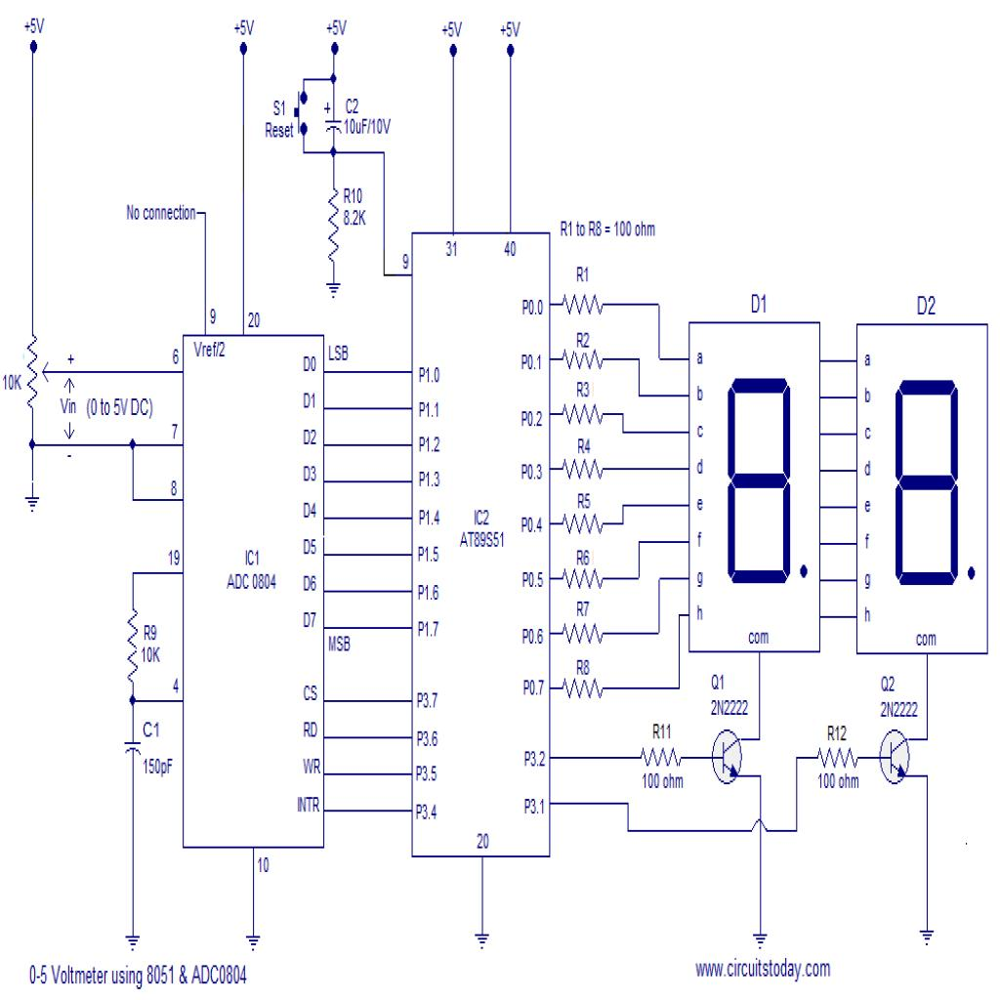

**File principali**

- Immagine: `ic2/ic2.jpg`
- JSON: `ic2/ic2.json`
- Prompt JSON-only: `ic2/prompt_json.txt`
- Prompt JSON+immagine: `ic2/prompt_json_img.txt`
- Datasheet: `ic2/datasheet/ADC0804.PDF`, `ic2/datasheet/ADC0804_datasheet.txt`, `ic2/datasheet/AT89S51.PDF`, `ic2/datasheet/AT89S51_datasheet.txt`, `ic2/datasheet/seven_segment_display_datasheet.txt`

**Funzione del circuito**

`ic2` rappresenta un voltmetro digitale 0-5 V. Il circuito usa un convertitore ADC0804, un microcontrollore AT89S51 e due display a 7 segmenti multiplexati. Il problema simulato e la mancanza di alcuni segmenti su una delle due cifre.

**JSON**

Il JSON descrive ADC0804, microcontrollore, display, resistenze, transistor e nodi di collegamento. La parte importante e il collegamento tra ADC0804 e AT89S51 tramite bus dati D0-D7 e il pilotaggio dei due display tramite linee segmento condivise. Il JSON permette di distinguere un problema locale di una cifra da un problema comune del bus segmenti. Tra le note rilevanti c'e un warning sul pin `top_1` dell'ADC0804, ma questo non e la causa principale attesa del difetto sui segmenti di una sola cifra.

**Risultato atteso**

La diagnosi corretta deve dare priorita a un guasto locale del display difettoso: segmento LED interno, pin o saldatura difettosa, pista interrotta tra bus segmenti e cifra, oppure problema sul comune/transistor se l'intera cifra e debole o assente. Una risposta meno corretta sposta invece la causa primaria su ADC0804, VREF o segnali di conversione: questi possono alterare il valore misurato, ma non spiegano bene segmenti mancanti su una sola cifra.

**Output e valutazione**

- Risposte `JSON + datasheet`: 8 file in `ic2/results_json/`
- Risposte `JSON + immagine + datasheet`: 8 file in `ic2/results_json_img/`
- Judge: 16 valutazioni piu summary in `ic2/judge_results/`
- Tabelle locali: `ic2/judge_results/ic2_judge_tables.md`

---

### 4.2 Circuito `ic3`

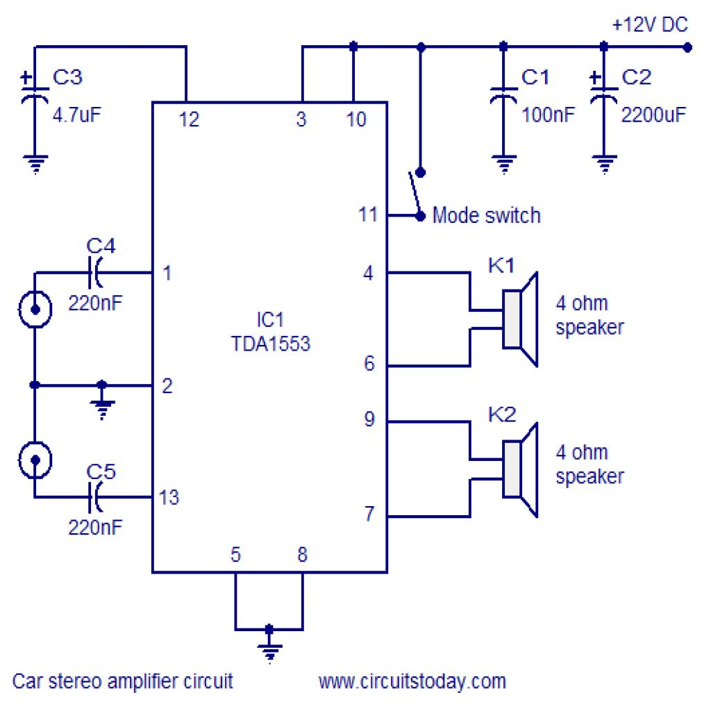

**File principali**

- Immagine: `ic3/ic3.jpg`
- JSON: `ic3/ic3.json`
- Datasheet: `ic3/datasheet/TDA1553Q.PDF`, `ic3/datasheet/datasheet.txt`

**Funzione del circuito**

`ic3` e un amplificatore audio stereo BTL basato su TDA1553Q. Il sintomo e assenza di audio sugli altoparlanti.

**JSON**

Il JSON rappresenta l'integrato TDA1553Q, gli speaker, alimentazione, massa, ingressi audio e pin di controllo. Il punto topologico piu importante e il pin M/SS, che dal JSON risulta legato a uno switch aperto. Questo e un indizio diretto: se il pin di mute/standby non e nello stato corretto, l'amplificatore resta silenziato.

**Risultato atteso**

La causa principale attesa e il pin 11 M/SS non abilitato a causa dello switch aperto. Cause secondarie plausibili sono assenza di alimentazione, mancanza di massa, assenza del segnale di ingresso, speaker guasti o corti sulle uscite. La risposta deve evitare di considerare gli speaker cablati male se il graph li mostra correttamente in configurazione BTL.

**Output e valutazione**

- Risposte `JSON + datasheet`: 8 file
- Risposte `JSON + immagine + datasheet`: 8 file
- Judge: 16 valutazioni piu summary
- Tabelle locali: `ic3/judge_results/ic3_judge_tables.md`

---

### 4.3 Circuito `ic7`

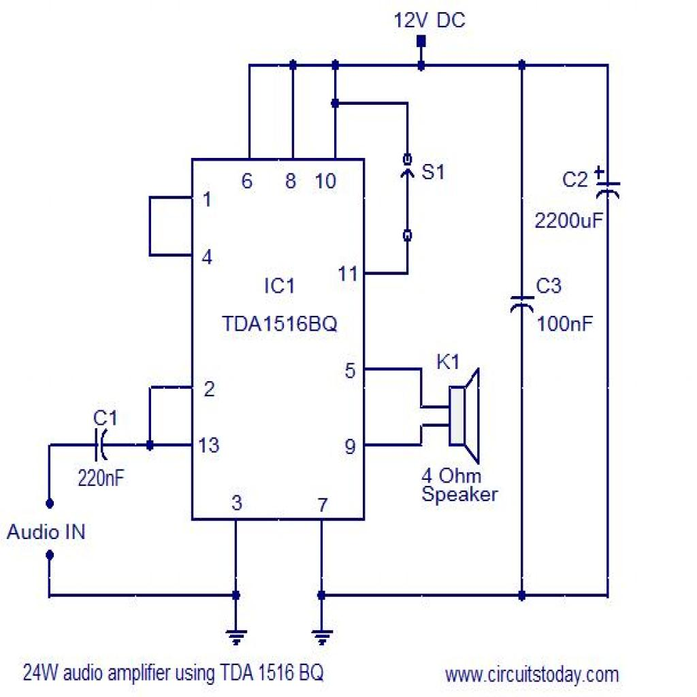

**File principali**

- Immagine: `ic7/ic7.jpg`
- JSON: `ic7/ic7.json`
- Datasheet: `ic7/datasheet/TDA1516BQ.PDF`, `ic7/datasheet/datasheet.txt`

**Funzione del circuito**

`ic7` e un amplificatore audio mono BTL basato su TDA1516BQ. Il sintomo e assenza di audio sullo speaker.

**JSON**

Il JSON descrive speaker tra le due uscite BTL, alimentazione, massa, ingresso audio e switch M/SS. A differenza di `ic3`, qui lo switch M/SS risulta `closed`, quindi non va dichiarato automaticamente aperto. Va comunque verificata la tensione reale sul pin di mute/standby.

**Risultato atteso**

La risposta corretta deve riconoscere che M/SS va controllato ma non assunto guasto con certezza. Le cause plausibili sono alimentazione assente, GND assente, segnale audio non presente, speaker scollegato/guasto o corti sulle uscite. Una risposta errata considera lo speaker sicuramente cablato male o lo switch sicuramente aperto nonostante il JSON.

**Output e valutazione**

- Risposte `JSON + datasheet`: 8 file
- Risposte `JSON + immagine + datasheet`: 8 file
- Judge: 16 valutazioni piu summary
- Tabelle locali: `ic7/judge_results/ic7_judge_tables.md`

---

### 4.4 Circuito `ic8`

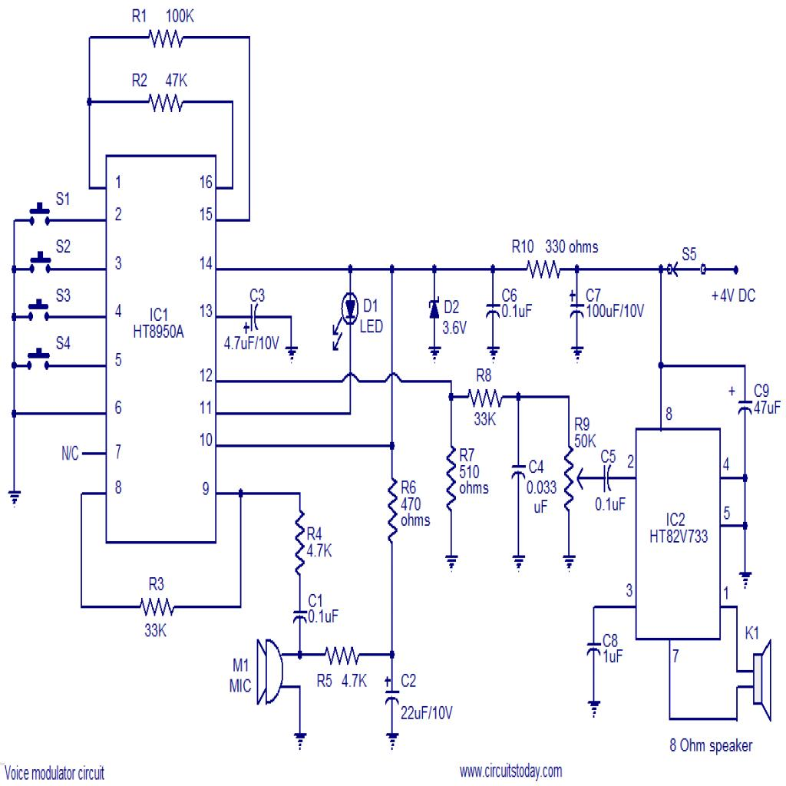

**File principali**

- Immagine: `ic8/ic8.jpg`
- JSON: `ic8/ic8.json`
- Datasheet: `ic8/datasheet/HT8950.PDF`, `ic8/datasheet/HT8950_datasheet.txt`, `ic8/datasheet/HT82V733.PDF`, `ic8/datasheet/HT82V733_datasheet.txt`

**Funzione del circuito**

`ic8` e un circuito audio composto da HT8950A, usato come voice changer, e HT82V733, usato come amplificatore verso lo speaker. Il sintomo e rumore in uscita senza riproduzione corretta del segnale audio.

**JSON**

Il JSON e piu complesso di molti altri circuiti. Un dettaglio importante e che il microfono M1 viene rilevato come `speaker24.1`, mentre lo speaker di uscita e `speaker24.2`. Questa ambiguita e centrale: una buona risposta deve riconoscere il blocco microfono/ingresso, il percorso verso HT8950A e poi il trasferimento verso HT82V733.

**Risultato atteso**

La causa principale attesa e un problema nel percorso audio di ingresso o nel trasferimento tra i due IC: microfono scollegato o polarizzato male, condensatori di accoppiamento, bias/VREF, oscillatore del voice changer, CE dell'amplificatore, alimentazione e GND. Una risposta debole si concentra solo sullo speaker finale, ignorando che il rumore in uscita suggerisce una parte del circuito attiva ma un segnale utile non correttamente processato.

**Output e valutazione**

- Risposte `JSON + datasheet`: 8 file
- Risposte `JSON + immagine + datasheet`: 8 file
- Judge: 16 valutazioni piu summary
- Tabelle locali: `ic8/judge_results/ic8_judge_tables.md`

---

### 4.5 Circuito `ic9`

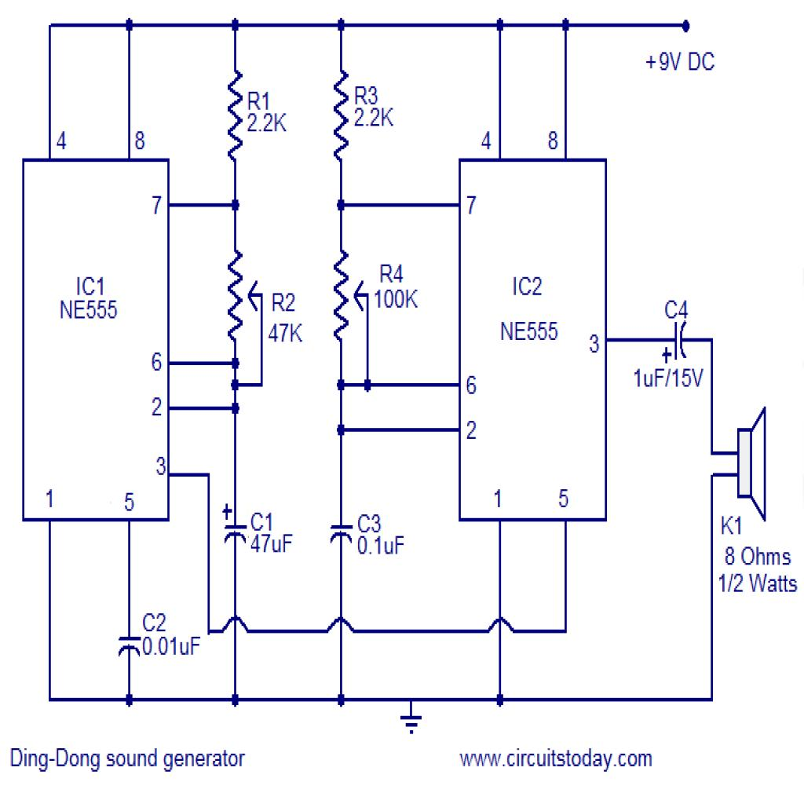

**File principali**

- Immagine: `ic9/ic9.jpg`
- JSON: `ic9/ic9.json`
- Datasheet: `ic9/datasheet/NE555.PDF`, `ic9/datasheet/datasheet.txt`

**Funzione del circuito**

`ic9` e un generatore sonoro ding-dong basato su due timer NE555. Il sintomo e assenza di suono sullo speaker.

**JSON**

Il JSON mostra due NE555, reti RC, alimentazione, reset e speaker collegato all'uscita del secondo timer tramite condensatore. La topologia consente di verificare se i pin 8 sono alimentati, se i pin 4 di reset sono alti e se il pin 3 del secondo NE555 arriva allo speaker.

**Risultato atteso**

La risposta corretta deve concentrarsi sul secondo NE555 e sul percorso verso lo speaker: oscillazione sul pin 3, condensatore di uscita e speaker. Cause secondarie sono alimentazione, GND, reset, reti RC errate e speaker guasto. Non e corretto dire che RESET e sicuramente a massa se il graph lo collega al nodo positivo.

**Output e valutazione**

- Risposte `JSON + datasheet`: 8 file
- Risposte `JSON + immagine + datasheet`: 8 file
- Judge: 16 valutazioni piu summary
- Tabelle locali: `ic9/judge_results/ic9_judge_tables.md`

---

### 4.6 Circuito `ic11`

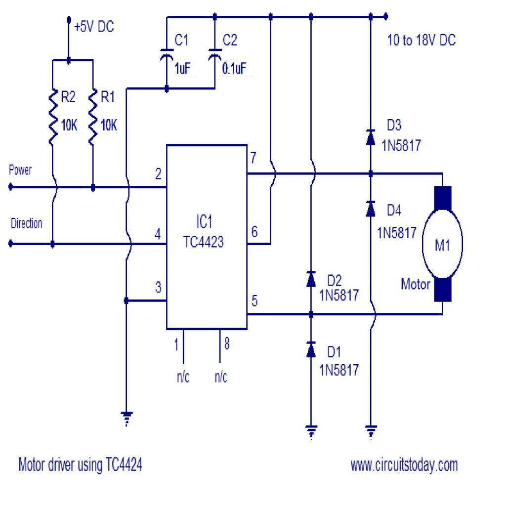

**File principali**

- Immagine: `ic11/ic11.jpg`
- JSON: `ic11/ic11.json`
- Datasheet: `ic11/datasheet/TC4423.PDF`, `ic11/datasheet/datasheet.txt`

**Funzione del circuito**

`ic11` e un driver per motore DC basato su TC4423. Il sintomo e motore M1 fermo.

**JSON**

Il JSON mostra motore collegato tra le due uscite del driver, ingressi Power/Direction su terminali esterni, alimentazione e massa. I warning sui pin 1 e 8 non devono essere sovrainterpretati: dal datasheet sono pin NC nel package considerato.

**Risultato atteso**

La diagnosi corretta non deve inventare un errore topologico dai pin NC. Deve invece verificare alimentazione VDD, GND, livelli logici sugli ingressi, logica invertente del TC4423 e comportamento delle due uscite verso il motore. I controlli pratici attesi sono misure su pin VDD/GND, ingressi, uscite e continuita del motore.

**Output e valutazione**

- Risposte `JSON + datasheet`: 8 file
- Risposte `JSON + immagine + datasheet`: 8 file
- Judge: 16 valutazioni piu summary
- Tabelle locali: `ic11/judge_results/ic11_judge_tables.md`

---

### 4.7 Circuito `ic13`

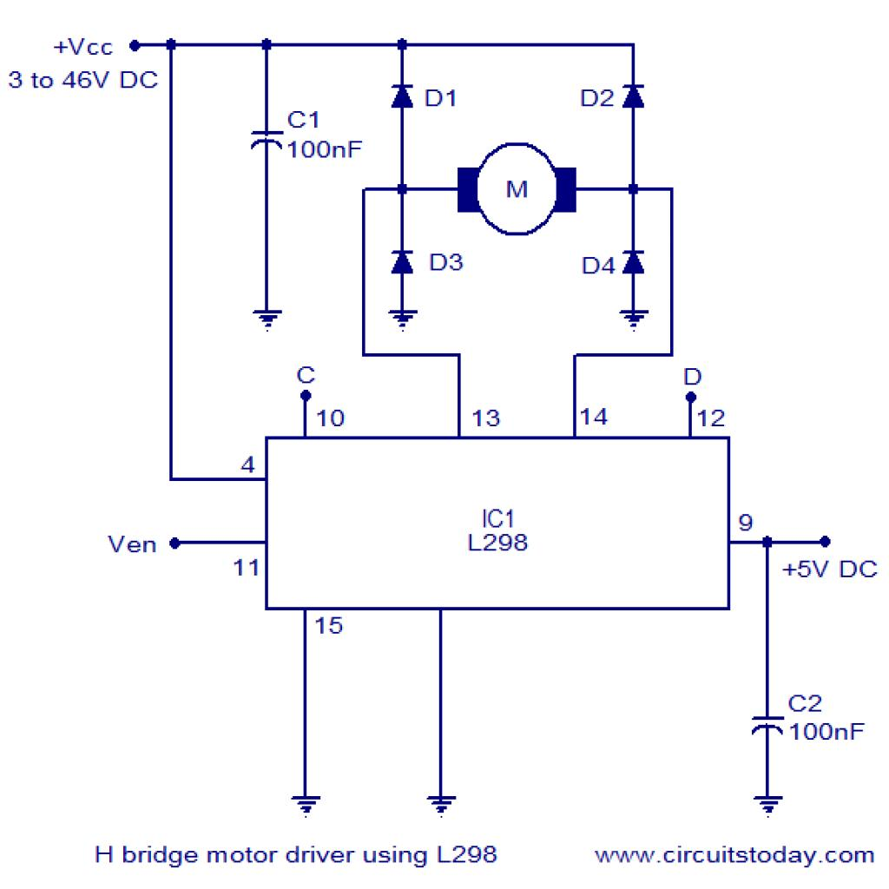

**File principali**

- Immagine: `ic13/ic13.jpg`
- JSON: `ic13/ic13.json`
- Datasheet: `ic13/datasheet/L298.PDF`, `ic13/datasheet/datasheet.txt`

**Funzione del circuito**

`ic13` e un driver H-bridge basato su L298. Il sintomo e motore M fermo.

**JSON**

Il JSON mostra motore tra le uscite del ponte, alimentazioni logica e motore, enable, ingressi e diodi di flyback. I pin 10 e 12 risultano non collegati, quindi la diagnosi deve dare priorita ai comandi logici mancanti o non validi. Il pin 11 di enable e un altro punto critico.

**Risultato atteso**

La causa principale attesa e l'assenza o invalidita dei segnali logici sugli ingressi del bridge B, insieme alla verifica dell'enable. Cause secondarie sono alimentazione motore, alimentazione logica, GND/sense, motore scollegato o guasto, diodi di flyback e continuita delle uscite.

**Output e valutazione**

- Risposte `JSON + datasheet`: 8 file
- Risposte `JSON + immagine + datasheet`: nella cartella sono presenti piu file raw, ma le aggregazioni finali considerano 8 run valutate.
- Judge: 16 valutazioni piu summary
- Tabelle locali: `ic13/judge_results/ic13_judge_tables.md`

---

### 4.8 Circuito `ic15`

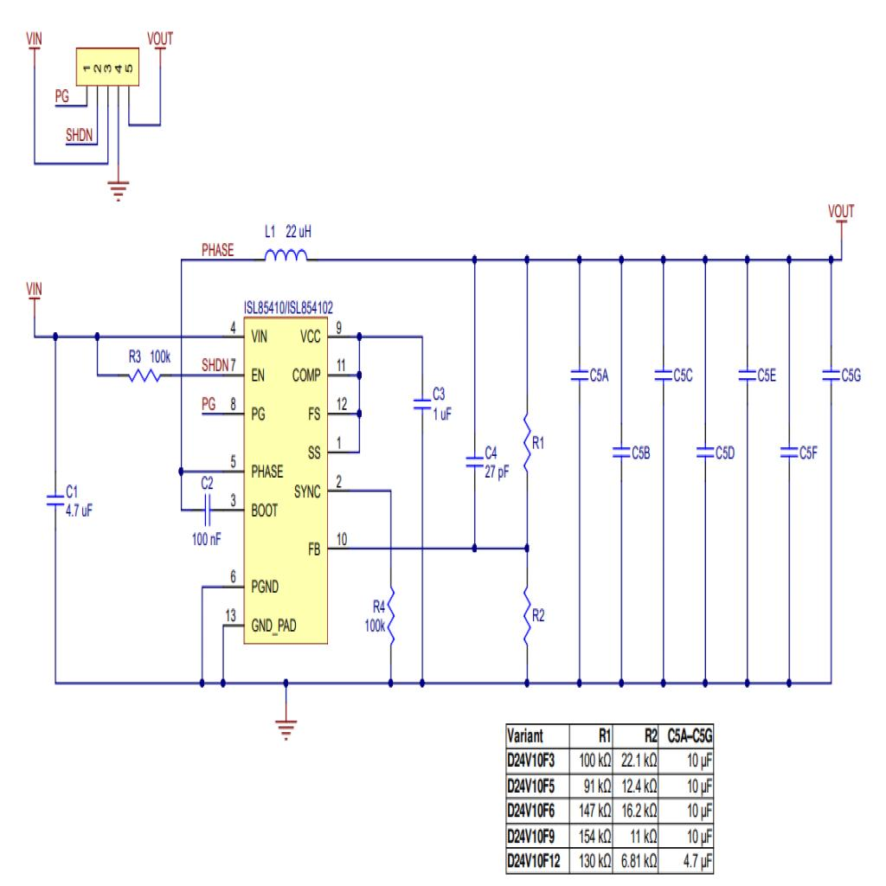

**File principali**

- Immagine: `ic15/ic15.jpg`
- JSON: `ic15/ic15.json`
- Datasheet: `ic15/datasheet/ISL85410.PDF`, `ic15/datasheet/ISL85410_datasheet.txt`

**Funzione del circuito**

`ic15` e un convertitore DC-DC buck basato su ISL85410/ISL854102. Il sintomo e circuito acceso ma tensione di uscita non corretta.

**JSON**

Il JSON e il piu grande tra quelli analizzati. Descrive IC buck, induttore, condensatori, rete di feedback, pin EN, VIN, PHASE, BOOT, FB, COMP, FS e connettore. Il circuito e difficile perche la diagnosi richiede sia comprensione del datasheet sia lettura topologica fine. Il judge ha spesso penalizzato risposte che confondono pin del package o che trattano PG/Power Good come causa primaria del problema.

**Risultato atteso**

La risposta deve concentrarsi sulla regolazione buck: feedback FB, partitore resistivo, nodo di uscita dopo l'induttore, VIN, EN, VCC, BOOT/PHASE, induttore, condensatori di ingresso/uscita, rete COMP/FS e carico. Non e sufficiente citare genericamente condensatori o alimentazione; bisogna ordinare le cause rispetto a cio che puo realmente produrre una tensione di uscita errata.

**Output e valutazione**

- Risposte `JSON + datasheet`: 8 file
- Risposte `JSON + immagine + datasheet`: 8 file
- Judge: 16 valutazioni piu summary
- Tabelle locali: `ic15/judge_results/ic15_judge_tables.md`

---

## 5. Estrazione e uso dei datasheet

Ogni circuito contiene una cartella `datasheet/` con:

1. uno o piu PDF originali;
2. uno o piu file `.txt` usati nei prompt.

Il PDF viene mantenuto come fonte originale. Il file `.txt` e l'estratto operativo fornito ai modelli. Questo estratto riassume le informazioni necessarie al troubleshooting: funzione dell'IC, pinout, alimentazione, pin di controllo, ingressi, uscite, condizioni operative e note utili. L'uso del `.txt` evita di inserire l'intero PDF nel prompt e rende piu controllabile il contenuto passato al modello.

Esempi:

- `ic15/datasheet/ISL85410_datasheet.txt` contiene descrizione del regolatore buck, pin VIN, PHASE, BOOT, EN, VCC, FB, COMP, FS e indicazioni sulla rete di feedback.
- `ic8/datasheet/HT8950_datasheet.txt` e `HT82V733_datasheet.txt` separano il voice changer dall'amplificatore audio.
- `ic2/datasheet/ADC0804_datasheet.txt`, `AT89S51_datasheet.txt` e `seven_segment_display_datasheet.txt` coprono conversione analogico-digitale, microcontrollore e display.

Nei due script di generazione, tutti i file `.txt` nella cartella `datasheet/` vengono letti, ordinati e concatenati con separatori `---`. Questo consente di usare piu datasheet nello stesso prompt quando un circuito contiene piu IC.

---

## 6. Prompt usati per i modelli sotto test

### 6.1 Prompt `JSON + datasheet`

Il file `prompt_json.txt` dice al modello che ricevera:

- un JSON del circuito come grafo;
- un datasheet o estratto;
- un problema da analizzare.

Il prompt spiega che:

- `components` contiene componenti e terminali;
- `graph` indica quali terminali appartengono allo stesso nodo elettrico;
- i `warnings` devono essere usati come possibili indizi ma non come prova automatica di errore.

La richiesta al modello e:

```text
Analizza il circuito e rispondi alla domanda:
Quali sono le cause piu probabili del problema indicato?
```

La risposta deve:

- spiegare cosa fa il circuito;
- identificare componenti e pin importanti;
- controllare alimentazione, massa, ingressi, uscite, carichi e pin di controllo;
- ordinare le cause dalla piu probabile alla meno probabile;
- dare piu peso alle cause supportate dal JSON rispetto a cause generiche dedotte dal datasheet;
- citare terminali reali del JSON quando utile;
- proporre controlli pratici;
- evitare valori o misure inventate.

### 6.2 Prompt `JSON + immagine + datasheet`

Il file `prompt_json_img.txt` estende il precedente aggiungendo l'immagine. Il modello riceve:

- JSON;
- immagine dello schema elettrico;
- datasheet;
- problema.

Il prompt separa esplicitamente i ruoli:

- il JSON serve per leggere componenti, terminali, pin e collegamenti in modo strutturato;
- l'immagine serve per verificare schema generale, nomi, valori visibili e ambiguita del JSON.

Viene chiesto al modello di dichiarare esplicitamente eventuali disaccordi tra JSON e immagine. Questo punto e importante in circuiti come `ic8`, dove il microfono viene rilevato nel JSON come `speaker24.1`.

---

## 7. Script di esecuzione dei modelli

Gli script operativi si trovano in `scripts/GPT`.

### 7.1 `run_one_json.py`

Questo script esegue una singola run nella configurazione `JSON + datasheet`.

Passaggi principali:

1. imposta `MODEL`, `CIRCUIT_NAME` e `PROBLEM`;
2. costruisce i path verso `icX.json`, `datasheet/` e `prompt_json.txt`;
3. legge il JSON;
4. legge tutti i datasheet `.txt`;
5. sostituisce nel prompt i placeholder:
   - `[INSERIRE PROBLEMA]`
   - `[INCOLLARE DATASHEET O ESTRATTO]`
   - `[INCOLLARE JSON]`
6. invia la richiesta alla Responses API;
7. per i modelli GPT-5 imposta `reasoning: {"effort": "low"}`;
8. misura la latenza con `time.perf_counter()`;
9. salva il risultato in `results_json/`.

Ogni file risultato contiene:

- modello;
- circuito;
- tipo di input;
- path JSON;
- elenco datasheet;
- problema;
- latenza;
- usage/token;
- risposta testuale.

### 7.2 `run_one_json_image.py`

Questo script esegue la configurazione `JSON + immagine + datasheet`.

La struttura e simile a `run_one_json.py`, ma aggiunge:

- lettura di `icX.jpg`;
- encoding dell'immagine in base64;
- costruzione di un `data:image/...;base64,...`;
- invio del contenuto come `input_text` + `input_image`;
- `detail: "original"` per mantenere la massima informazione visiva disponibile.

L'output viene salvato in `results_json_img/`.

### 7.3 Note operative

Gli script sono configurati modificando manualmente `MODEL`, `CIRCUIT_NAME` e `PROBLEM`. La chiave API viene caricata da `.env`. Questo approccio e semplice e controllabile: ogni run e un file indipendente, tracciabile e valutabile successivamente.

---

## 8. Processo di valutazione con judge GPT-5.5

### 8.1 Script `run_judge_one_circuit.py`

Il judge e eseguito con `scripts/GPT/run_judge_one_circuit.py`.

Per ogni circuito lo script:

1. legge `icX.json`;
2. legge `icX.jpg`;
3. legge tutti i datasheet `.txt`;
4. legge il prompt del judge `scripts/GPT/prompt_judge.txt`;
5. raccoglie tutti i file in `results_json/` e `results_json_img/`;
6. per ogni risposta costruisce un prompt di valutazione;
7. invia al judge:
   - JSON;
   - immagine;
   - datasheet;
   - problema;
   - output del modello da valutare;
   - tipo di input ricevuto dal modello valutato;
8. salva un file JSON per ogni valutazione;
9. salva un file summary con tutte le valutazioni del circuito.

Il judge usato e `gpt-5.5`.

### 8.2 Prompt del judge

Il prompt del judge stabilisce regole chiare:

- il judge deve valutare solo la risposta, non il nome del modello;
- il judge riceve sempre anche l'immagine, ma non deve penalizzare un modello JSON-only solo perche non la cita;
- il JSON e la fonte principale per i collegamenti topologici;
- il datasheet e la fonte principale per pinout, funzioni dei pin e condizioni operative;
- non deve inventare difetti non supportati;
- deve restituire solo JSON valido.

Schema obbligatorio del risultato:

```json
{
  "scores": {
    "circuit_understanding": 0,
    "datasheet_use": 0,
    "json_image_use": 0,
    "diagnostic_accuracy": 0,
    "cause_priority": 0,
    "practical_checks": 0,
    "hallucination_absence": 0
  },
  "total_score": 0,
  "max_score": 21,
  "normalized_score": 0.0,
  "verdict": "Si | Parziale | No",
  "top1_correct": true,
  "top3_contains_correct": true,
  "expected_primary_causes": [],
  "model_primary_cause": "",
  "major_errors": [],
  "hallucinations": [],
  "missed_important_points": [],
  "strengths": [],
  "short_explanation": ""
}
```

### 8.3 Criteri di valutazione

Ogni criterio e valutato da 0 a 3:

| Punteggio | Significato |
|---:|---|
| 0 | Assente o errato |
| 1 | Debole, generico o con errori rilevanti |
| 2 | Buono ma con limiti |
| 3 | Corretto, specifico e ben supportato |

I sette criteri sono:

| Criterio | Descrizione |
|---|---|
| `circuit_understanding` | Comprensione della funzione generale del circuito e dei blocchi principali. |
| `datasheet_use` | Uso corretto di pinout, funzioni dei pin, soglie e condizioni operative. |
| `json_image_use` | Uso del JSON e, quando disponibile, dell'immagine. |
| `diagnostic_accuracy` | Coerenza tecnica delle cause proposte. |
| `cause_priority` | Corretta priorita delle cause. |
| `practical_checks` | Utilita e concretezza dei controlli pratici. |
| `hallucination_absence` | Assenza di componenti, collegamenti o difetti inventati. |

Il massimo e 21 punti.

---

## 9. Aggregazione dei risultati

Dopo la valutazione, gli output del judge sono stati aggregati con gli script:

- `scripts/GPT/aggregate_judge_results.py`
- `scripts/GPT/make_judge_tables.py`
- `scripts/GPT/make_graph_csvs.py`

### 9.1 `aggregate_judge_results.py`

Raccoglie i JSON del judge e costruisce le tabelle aggregate. Produce:

- `all_runs.csv`
- `aggregate_by_model.csv`
- `aggregate_by_model_input.csv`
- `aggregate_by_circuit.csv`
- `aggregate_by_circuit_input.csv`
- `aggregate_by_input_type.csv`
- `criteria_long.csv`
- `deltas_image_vs_json.csv`
- file di costo.

### 9.2 `make_judge_tables.py`

Crea le tabelle Markdown locali per circuito, ad esempio:

- `ic15/judge_results/ic15_judge_tables.md`

Ogni tabella locale contiene:

- sintesi rapida del circuito;
- risultati dettagliati per run;
- confronto JSON-only vs JSON+immagine;
- aggregazione per input type;
- aggregazione per modello;
- score medi per criterio;
- token, costo e latenza del judge.

### 9.3 `make_graph_csvs.py`

Prepara CSV e strutture usate dai grafici finali. Questi file rendono possibile separare l'analisi numerica dalla visualizzazione.

---

## 10. Tabelle principali dai CSV

Nota sugli arrotondamenti: le tabelle riportano i valori arrotondati alle cifre mostrate. Alcuni valori esatti nei CSV terminano in `.125` o `.375`; a seconda della convenzione di arrotondamento del software, l'ultima cifra puo differire di `0.01` senza modificare il significato del risultato. Per esempio `3.125` puo essere visualizzato come `3.12` o `3.13`.

### 10.1 Prestazioni aggregate per modello

Questa tabella deriva da `_aggregate/tabella_prestazioni_modelli.md` e sintetizza media, mediana, variabilita, accuratezza, costo e latenza.

| Modello | Mean score | Median score | Std score | Top-1 | Top-3 | Errori gravi medi | Costo medio | Latenza media |
|:---|---:|---:|---:|:---|:---|---:|:---|:---|
| gpt-5.4 | 19.31 | 20 | 1.86 | 75.0% | 87.5% | 0.75 | $0.074290 | 52.35s |
| gpt-5.4-mini | 18.81 | 20 | 2.01 | 93.8% | 100.0% | 0.81 | $0.018072 | 19.72s |
| gpt-5-mini | 17.69 | 18 | 2.05 | 56.2% | 93.8% | 1.56 | $0.008771 | 43.97s |
| gpt-4.1-mini | 15.81 | 16.5 | 3.64 | 62.5% | 75.0% | 2.19 | $0.006978 | 39.26s |
| gpt-5.4-nano | 15.06 | 15.5 | 3.23 | 56.2% | 81.2% | 2.56 | $0.005380 | 20.73s |
| gpt-5-nano | 13.94 | 13.5 | 3.68 | 50.0% | 81.2% | 3.12 | $0.001973 | 29.47s |
| gpt-4.1-nano | 12.94 | 13 | 3.98 | 43.8% | 75.0% | 2.81 | $0.001656 | 17.18s |
| gpt-4o-mini | 12.88 | 13 | 2.93 | 43.8% | 87.5% | 3.19 | $0.003872 | 33.36s |

### 10.2 Prestazioni aggregate per circuito

| Circuito | N | Score medio | Mediana | Std | Top-1 | Top-3 | Errori gravi medi |
|---|---:|---:|---:|---:|---:|---:|---:|
| `ic3` | 16 | 18.94 | 19.0 | 1.30 | 93.8% | 100.0% | 0.94 |
| `ic13` | 16 | 17.94 | 19.0 | 2.59 | 62.5% | 100.0% | 1.25 |
| `ic9` | 16 | 16.75 | 16.5 | 2.39 | 87.5% | 100.0% | 1.88 |
| `ic7` | 16 | 15.94 | 17.0 | 2.33 | 56.2% | 87.5% | 2.31 |
| `ic8` | 16 | 15.00 | 16.0 | 4.37 | 43.8% | 75.0% | 2.31 |
| `ic2` | 16 | 14.94 | 15.5 | 4.48 | 56.2% | 75.0% | 2.12 |
| `ic11` | 16 | 14.50 | 14.0 | 3.35 | 62.5% | 100.0% | 2.88 |
| `ic15` | 16 | 12.44 | 10.0 | 4.42 | 18.8% | 43.8% | 3.31 |

### 10.3 Confronto globale per tipo di input

| Input type | N | Score medio | Mediana | Std | Top-1 | Top-3 |
|---|---:|---:|---:|---:|---:|---:|
| JSON + datasheet | 64 | 15.67 | 17.0 | 4.02 | 64.1% | 85.9% |
| JSON + immagine + datasheet | 64 | 15.94 | 16.5 | 3.69 | 56.2% | 84.4% |

Il punteggio medio aggregato aumenta leggermente con l'immagine, ma Top-1 e Top-3 non migliorano. Questo e un risultato importante: l'immagine non produce un miglioramento sistematico e in alcuni circuiti introduce rumore interpretativo.

### 10.4 Delta medio dell'immagine per circuito

| Circuito | Delta medio `img - JSON` |
|---|---:|
| `ic7` | +2.12 |
| `ic2` | +1.38 |
| `ic11` | +1.25 |
| `ic9` | +0.75 |
| `ic3` | +0.38 |
| `ic13` | -0.12 |
| `ic15` | -1.12 |
| `ic8` | -2.50 |

L'effetto visivo e quindi eterogeneo: aiuta in alcuni circuiti, ma peggiora chiaramente in `ic8` e `ic15`.

### 10.5 Costi totali per modello

| Modello | N | Costo modello totale | Costo judge totale | Costo totale |
|---|---:|---:|---:|---:|
| `gpt-4.1-mini` | 16 | $0.111656 | $1.679020 | $1.790676 |
| `gpt-4.1-nano` | 16 | $0.026500 | $1.660925 | $1.687425 |
| `gpt-4o-mini` | 16 | $0.061953 | $1.613715 | $1.675668 |
| `gpt-5-mini` | 16 | $0.140344 | $1.693465 | $1.833809 |
| `gpt-5-nano` | 16 | $0.031575 | $1.846080 | $1.877655 |
| `gpt-5.4` | 16 | $1.188632 | $1.652960 | $2.841592 |
| `gpt-5.4-mini` | 16 | $0.289157 | $1.622520 | $1.911677 |
| `gpt-5.4-nano` | 16 | $0.086087 | $1.729350 | $1.815437 |

Il costo del judge e separato dal costo operativo del modello: in un sistema finale di troubleshooting il judge non sarebbe parte della diagnosi, ma solo della valutazione offline.

---

## 11. Figure principali

Le figure principali si trovano in `_aggregate/figures_main`. L'ordine seguente e quello consigliato per la tesi, dal grafico piu centrale a quelli piu specifici.

### Figura 1 - Score medio per modello

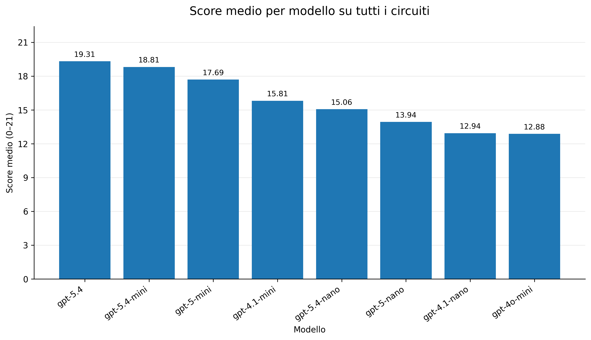

Figura 1 - Score medio per modello sui circuiti analizzati. Il grafico riporta il punteggio medio assegnato dal judge a ciascun modello, aggregando tutte le run disponibili e considerando entrambe le modalita di input. I modelli sono ordinati dal migliore al peggiore rispetto allo score medio. Un valore piu alto indica una migliore capacita diagnostica complessiva.

### Figura 5 - Robustezza modello x circuito

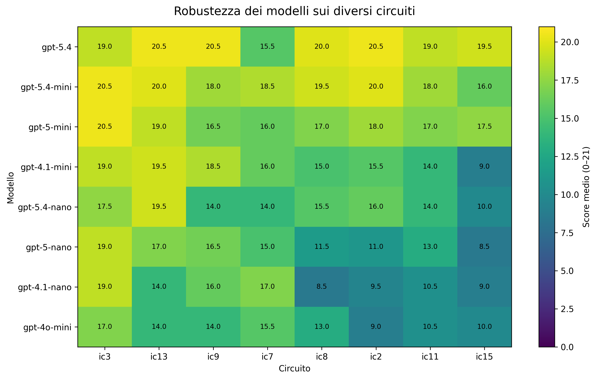

Figura 5 - Robustezza dei modelli sui diversi circuiti. La heatmap mostra lo score medio ottenuto da ciascun modello su ciascun circuito, aggregando le due modalita di input. Le righe sono ordinate dal modello con score medio complessivo piu alto a quello piu basso, mentre le colonne seguono la difficolta media dei circuiti. Il grafico permette di vedere se un modello e stabile su piu circuiti o se crolla su casi specifici.

### Figura 6 - Accuratezza Top-1 e Top-3

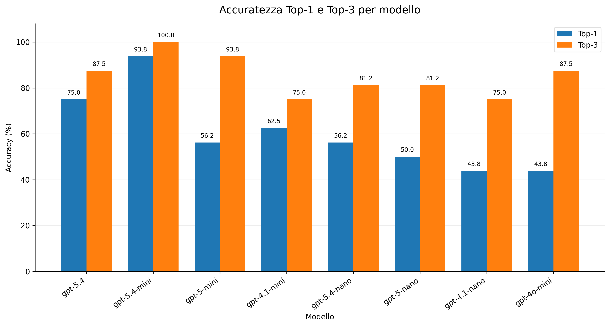

Figura 6 - Accuratezza Top-1 e Top-3 per modello. Il grafico confronta, per ciascun modello, la percentuale di diagnosi corrette al primo tentativo (Top-1) e la percentuale di casi in cui la causa corretta compare almeno tra le prime tre ipotesi (Top-3). Una Top-1 elevata indica maggiore affidabilita nella diagnosi principale; una Top-3 elevata indica utilita come supporto al troubleshooting anche quando la causa corretta non viene messa al primo posto.

### Figura 8 - Score vs costo

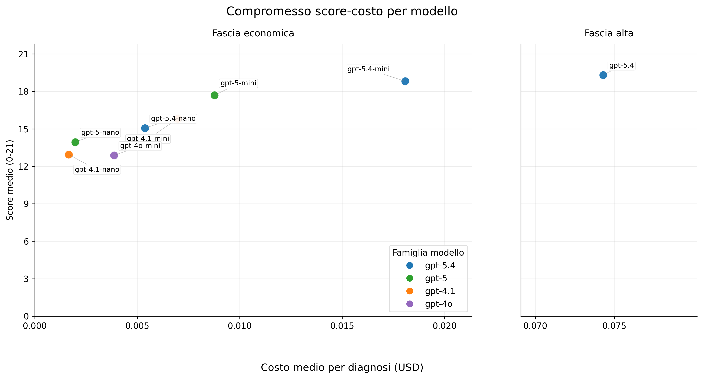

Figura 8 - Compromesso tra score medio e costo per diagnosi. Il grafico mostra, per ciascun modello, la relazione tra costo medio per diagnosi e score medio. L’asse X è espresso in centesimi di dollaro e usa una scala logaritmica per rendere leggibili sia i modelli economici sia quelli più costosi. I punti sono colorati per famiglia di modello.

### Figura 9 - Costo medio per modello

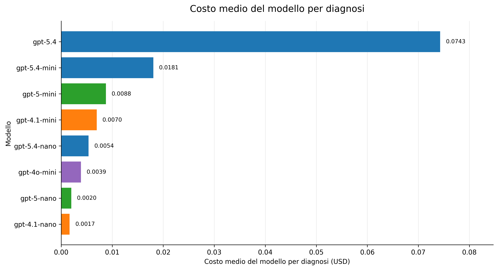

Figura 9 - Costo medio del modello per diagnosi. Il grafico riporta il costo medio stimato del solo modello generativo per ciascuna diagnosi, escludendo il costo del judge. I modelli sono ordinati dal meno costoso al piu costoso, cosi da rendere immediato il confronto economico diretto tra le diverse alternative.

### Figura 2 - Effetto dell'immagine per modello

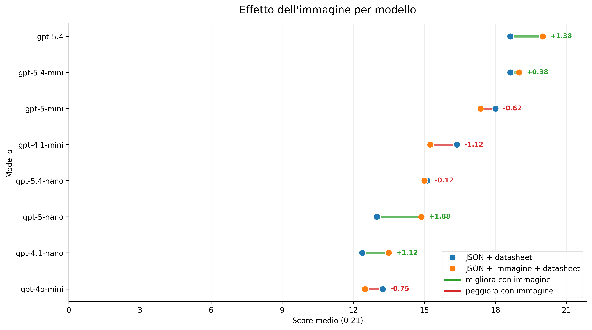

Figura 2 - Effetto dell'immagine per modello. Il grafico collega, per ciascun modello, lo score medio ottenuto con JSON + datasheet e con JSON + immagine + datasheet. Lo spostamento verso destra indica un miglioramento con l'aggiunta dell'immagine; lo spostamento verso sinistra indica un peggioramento. Le etichette numeriche riportano il delta tra le due modalita, rendendo immediato capire quali modelli beneficiano dell'informazione visiva e quali no.

### Figura 3 - Effetto dell'immagine per circuito

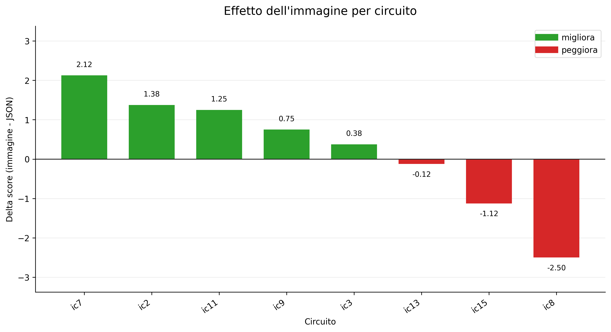

Figura 3 - Variazione dello score con l'aggiunta dell'immagine per circuito. Le barre verdi indicano circuiti in cui JSON + immagine + datasheet migliora lo score medio rispetto a JSON + datasheet; le barre rosse indicano circuiti in cui l'immagine peggiora la prestazione media. La linea orizzontale a zero separa i miglioramenti dai peggioramenti e permette di vedere che l'effetto dell'immagine dipende dal circuito, non e sistematico.

### Figura 4 - Score medio per circuito

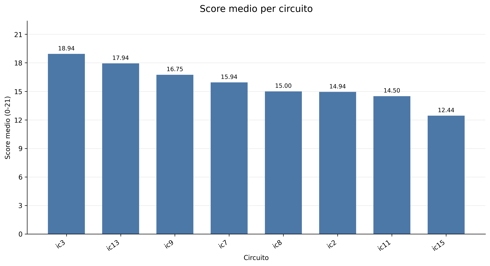

Figura 4 - Score medio per circuito. Il grafico ordina i circuiti dal punteggio medio piu alto al piu basso, aggregando tutti i modelli e le due modalita di input. Un valore alto indica un caso mediamente piu semplice per i modelli; un valore basso evidenzia un circuito piu critico, con diagnosi meno immediata o maggiore ambiguita.

### Figura 7 - Errori gravi medi

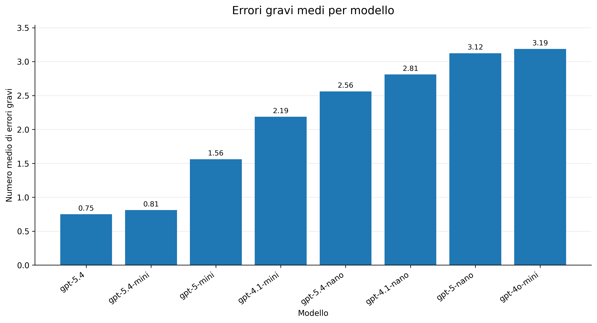

Figura 7 - Errori gravi medi per modello. Il grafico riporta il numero medio di errori gravi commessi da ciascun modello nelle run valutate dal judge. Valori piu bassi indicano maggiore affidabilita pratica; valori piu alti segnalano un rischio maggiore di indicazioni diagnostiche scorrette o fuorvianti.

---

## 12. Figure di appendice

Le figure di appendice sono in `_aggregate/figures_appendix`. Sono utili per approfondire aspetti secondari senza appesantire il corpo principale.

### Figura A2 - Heatmap modello x criterio

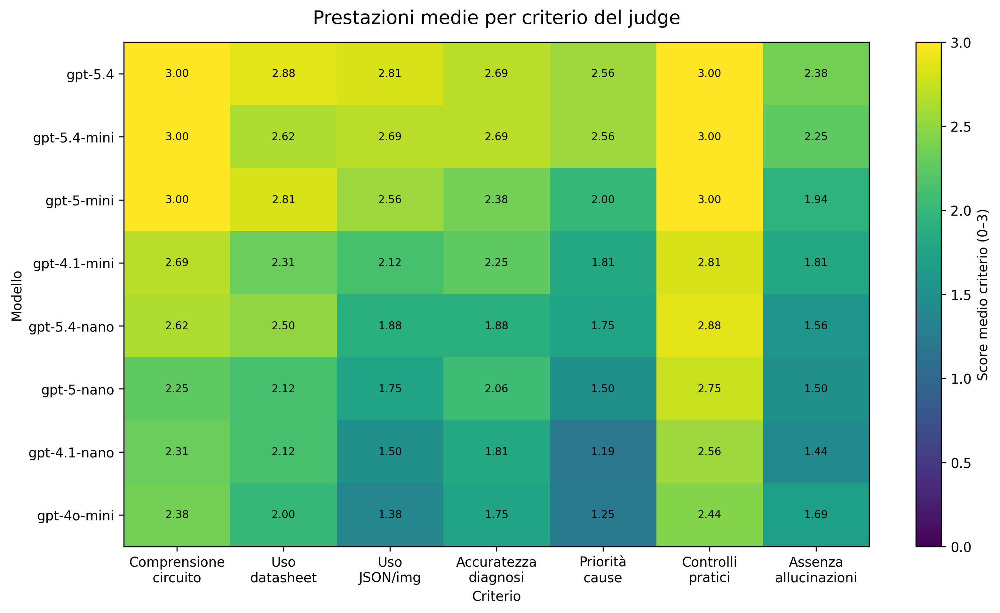

Figura A2 - Prestazioni medie dei modelli sui criteri del judge. La heatmap riporta, per ciascun modello e per ciascun criterio di valutazione, lo score medio ottenuto nelle run analizzate. Le righe sono ordinate in base allo score medio complessivo dei modelli. Il grafico permette di osservare quali aspetti contribuiscono maggiormente alle prestazioni finali, distinguendo ad esempio tra comprensione del circuito, uso del datasheet, accuratezza diagnostica, priorita delle cause, controlli pratici e assenza di allucinazioni.

### Figura A3 - Mappa qualita-stabilita

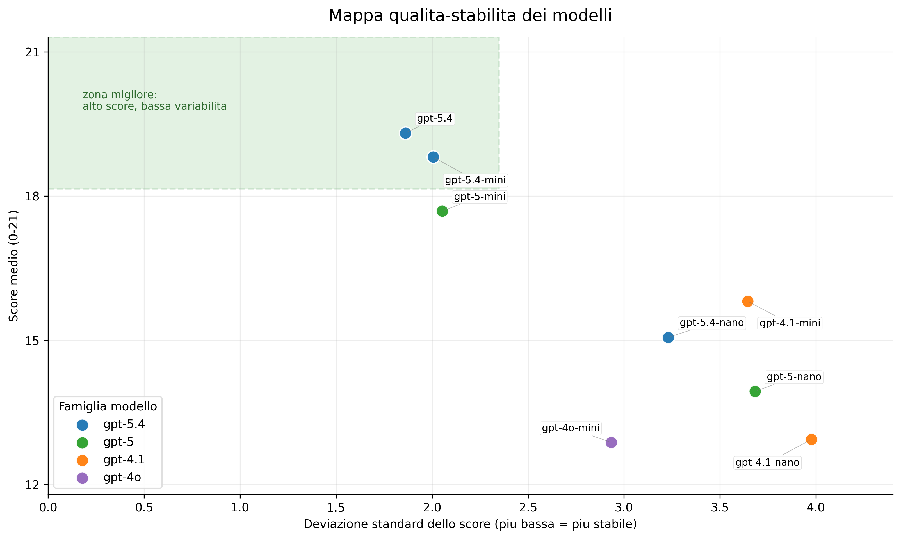

Figura A3 - Mappa qualita-stabilita dei modelli. Il grafico mette in relazione lo score medio con la deviazione standard dello score. I modelli piu interessanti si trovano in alto a sinistra: ottengono un punteggio medio elevato e mostrano una minore variabilita tra le run. La figura integra la classifica per score medio distinguendo i modelli forti ma stabili da quelli piu irregolari.

### Figura A1 - Score vs latenza

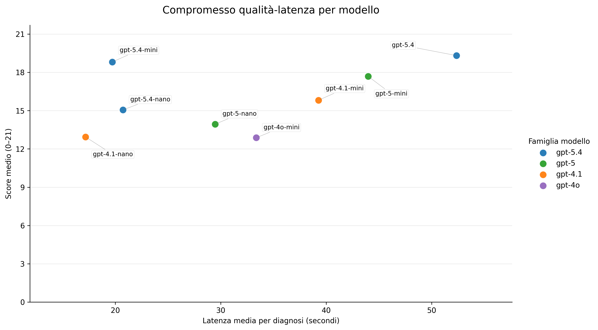

Figura A1 - Compromesso qualita-latenza per modello. Il grafico mette in relazione lo score medio ottenuto da ciascun modello con la latenza media di esecuzione. Ogni punto rappresenta un modello ed e colorato in base alla famiglia di appartenenza. I modelli collocati nella parte alta a sinistra offrono il miglior compromesso tra qualita diagnostica e tempo di risposta. Il grafico integra l'analisi qualita-costo, mostrando la praticabilita dei modelli in scenari in cui la rapidita della diagnosi e rilevante.

---

## 13. Interpretazione dei risultati

### 13.1 Migliore modello in termini assoluti

Il modello con lo score medio piu alto e `gpt-5.4`, con:

- score medio 19.31/21;
- mediana 20;
- deviazione standard 1.86;
- errori gravi medi 0.75.

Questo modello rappresenta il limite superiore della qualita diagnostica nel set di esperimenti. Tuttavia ha anche costo e latenza maggiori:

- costo medio per diagnosi: circa $0.074;
- latenza media: circa 52.35 s.

### 13.2 Miglior compromesso pratico

`gpt-5.4-mini` e il miglior compromesso complessivo:

- score medio 18.81/21, molto vicino a `gpt-5.4`;
- mediana 20;
- Top-1 93.8%, il valore piu alto;
- Top-3 100%;
- costo medio circa $0.018, molto inferiore a `gpt-5.4`;
- latenza media circa 19.72 s.

Per un sistema pratico di assistenza al troubleshooting, `gpt-5.4-mini` appare quindi il candidato piu equilibrato.

### 13.3 Modelli economici

I modelli nano hanno costi molto bassi, ma perdono qualita diagnostica e stabilita. `gpt-5-nano`, `gpt-4.1-nano` e `gpt-4o-mini` hanno score medi tra circa 12.9 e 13.9, con errori gravi medi piu alti. Possono essere utili per analisi preliminari o screening, ma non raggiungono l'affidabilita dei modelli mini o del modello full.

`gpt-5-mini` e interessante: ha score medio 17.69 e Top-3 93.8%, ma Top-1 solo 56.2%. Questo indica che spesso include la causa corretta tra le ipotesi, ma non sempre la mette come causa principale.

### 13.4 Effetto dell'immagine

L'aggiunta dell'immagine non produce un miglioramento globale netto. Lo score medio passa da 15.67 a 15.94, ma Top-1 scende da 64.1% a 56.2%. L'immagine aiuta in circuiti come `ic7`, `ic2` e `ic11`, ma peggiora `ic8` e `ic15`.

Una possibile interpretazione e che l'immagine aggiunga informazione utile quando il JSON e ambiguo o incompleto, ma possa anche distrarre il modello quando lo schema e visivamente complesso o quando l'errore richiede lettura topologica fine del graph.

### 13.5 Difficolta dei circuiti

Il circuito piu semplice risulta `ic3`, con score medio 18.94. Questo e coerente con una causa topologica relativamente chiara: pin M/SS non abilitato.

I circuiti piu difficili sono:

- `ic15`, score medio 12.44;
- `ic11`, score medio 14.50;
- `ic2`, score medio 14.94;
- `ic8`, score medio 15.00.

`ic15` e il caso piu critico perche richiede interpretazione precisa di un convertitore buck e distinzione tra pin funzionalmente centrali (FB, PHASE, BOOT, EN) e pin meno rilevanti come PG.

### 13.6 Criteri del judge

Dalla heatmap dei criteri emerge che alcuni aspetti sono piu facili:

- comprensione generale del circuito;
- controlli pratici.

Altri aspetti distinguono maggiormente i modelli:

- priorita delle cause;
- accuratezza diagnostica;
- assenza di allucinazioni;
- uso corretto di JSON/immagine.

Questo e importante per la tesi: molti modelli sanno descrivere il circuito, ma solo i migliori riescono a ordinare correttamente le cause e a non inventare collegamenti.

---

## 14. Limiti sperimentali

1. **Numero di circuiti limitato**  
   Il dataset include otto circuiti complessi. Sono sufficienti per un confronto iniziale, ma non per una generalizzazione statistica ampia.

2. **Judge automatico**  
   Il judge GPT-5.5 permette valutazioni uniformi e scalabili, ma resta un modello. Le sue valutazioni sono molto utili per confronto relativo, ma non sostituiscono una validazione umana completa.

3. **Latenza variabile**  
   La latenza dipende da condizioni API, carico del servizio e dimensione del prompt. Va interpretata come metrica operativa, non come misura fisica assoluta.

4. **Datasheet in forma estratta**  
   I modelli non ricevono l'intero PDF ma estratti testuali. Questo migliora controllabilita e costo, ma dipende dalla qualita dell'estrazione.

5. **JSON derivato da pipeline di riconoscimento**  
   Il JSON puo contenere warning, terminali ambigui o componenti classificati in modo imperfetto. Questo non e un difetto del test: e parte del problema reale, perche valuta la capacita del modello di ragionare su rappresentazioni non perfette.

---

## 15. Conclusione sintetica per la tesi

La fase sperimentale mostra che una rappresentazione topologica strutturata del circuito, combinata con un estratto mirato del datasheet, consente ai modelli GPT di svolgere diagnosi circuitale con risultati misurabili e confrontabili.

Il modello migliore in qualita assoluta e `gpt-5.4`, ma il miglior compromesso pratico e `gpt-5.4-mini`, che ottiene score quasi equivalente, Top-1 superiore, Top-3 pari al 100%, costo molto piu basso e latenza inferiore.

L'immagine dello schema non migliora sempre la diagnosi: in alcuni circuiti aiuta, in altri introduce rumore. Questo risultato supporta l'importanza del JSON/graph come rappresentazione centrale per il troubleshooting automatico. L'immagine resta utile come supporto, ma non sostituisce la topologia strutturata.

I risultati suggeriscono quindi che un sistema operativo di troubleshooting possa basarsi su:
1. estrazione dello schema in JSON/graph;
2. datasheet testuale mirato;
3. modello GPT mini di nuova generazione.

La valutazione automatica tramite judge è stata invece usata in questa fase sperimentale per confrontare in modo uniforme le risposte dei modelli.

puo produrre diagnosi tecnicamente utili, economicamente sostenibili e riproducibili, specialmente se la pipeline include metriche di controllo come Top-1, Top-3, errori gravi e assenza di allucinazioni.
