# Relazione dettagliata del processo di verifica con modelli GPT - batch_v2

Questo documento ricostruisce la seconda fase sperimentale contenuta nella cartella `experiment_ai/circuiti_complessi/batch_v2`. Lo scopo e fornire una base ordinata per la scrittura della tesi, descrivendo struttura del batch, circuiti analizzati, input forniti ai modelli, gestione dei datasheet, script utilizzati, valutazione automatica tramite judge, CSV aggregati, figure generate e interpretazione finale dei risultati.

La fase `batch_v2` riprende la stessa logica del `batch_v1`, ma con un obiettivo piu mirato: verificare se il JSON prodotto dalla pipeline di riconoscimento e ricostruzione topologica sia sufficiente per ottenere diagnosi di troubleshooting comparabili a quelle ottenute fornendo anche l'immagine dello schema elettrico.

Per ogni circuito sono state testate due configurazioni:

- `JSON + datasheet`
- `JSON + immagine + datasheet`

La domanda sperimentale non e quindi se l'immagine sia inutile in assoluto, ma se la rappresentazione strutturata del circuito, cioe il JSON/graph prodotto dalla pipeline, contenga abbastanza informazione per ottenere risultati diagnostici simili a quelli ottenuti usando anche l'immagine.

---

## 1. Struttura della cartella sperimentale

La cartella principale della fase e:

`experiment_ai/circuiti_complessi/batch_v2`

Contiene otto circuiti:

- `b03`
- `b06`
- `c01`
- `c02`
- `c05`
- `c08`
- `c13`
- `c17`

Ogni circuito contiene una struttura logica coerente con il batch precedente:

| Elemento | Descrizione |
|---|---|
| `circuito.jpg` | Immagine dello schema elettrico usata come input visivo. |
| `circuito.json` | Rappresentazione strutturata del circuito come graph di componenti, terminali, pin, collegamenti e warning. |
| `prompt_json.txt` | Prompt usato per la configurazione `JSON + datasheet`. |
| `prompt_json_img.txt` | Prompt usato per la configurazione `JSON + immagine + datasheet`. |
| `datasheet/` | Cartella con estratti `.txt` dei datasheet, quando sono presenti circuiti integrati o componenti che lo richiedono. |
| `results_json/` | Risposte dei modelli generate usando JSON e datasheet. |
| `results_json_img/` | Risposte dei modelli generate usando JSON, immagine e datasheet. |
| `judge_results/` | Valutazioni prodotte dal judge GPT-5.5 e tabelle locali per circuito. |

La cartella `_aggregate` contiene i risultati unificati:

| File/cartella | Contenuto |
|---|---|
| `all_runs.csv` | Dataset completo di tutte le run valutate. |
| `all_runs.json` | Stesso contenuto di `all_runs.csv` in formato JSON. |
| `all_runs_data_dictionary.csv` | Dizionario delle colonne di `all_runs.csv`. |
| `aggregate_by_model.csv` | Metriche aggregate per modello. |
| `aggregate_by_model_input.csv` | Metriche aggregate per modello e tipo di input. |
| `aggregate_by_circuit.csv` | Metriche aggregate per circuito. |
| `aggregate_by_circuit_input.csv` | Metriche aggregate per circuito e tipo di input. |
| `aggregate_by_input_type.csv` | Confronto globale tra JSON-only e JSON+immagine. |
| `criteria_long.csv` | Punteggi dei singoli criteri del judge in formato lungo. |
| `deltas_image_vs_json.csv` | Delta tra `JSON + immagine + datasheet` e `JSON + datasheet`. |
| `cost_summary*.csv` | Tabelle di costo per modello, circuito e input type. |
| `figures_main/` | Figure principali della tesi. |
| `figures_appendix/` | Figure secondarie/appendice. |

Sono presenti anche i CSV creati da `make_graph_csvs.py` nella cartella `analysis_csv`; questi servono per analisi aggiuntive, mentre le figure finali di questa relazione usano soprattutto i file dentro `_aggregate`.

---

## 2. Modelli confrontati

Sono stati confrontati otto modelli:

| Modello | Ruolo sperimentale |
|---|---|
| `gpt-4o-mini` | Baseline economica precedente. |
| `gpt-4.1-mini` | Modello mini della famiglia 4.1. |
| `gpt-4.1-nano` | Modello nano molto economico, utile per testare il limite inferiore. |
| `gpt-5-nano` | Modello nano moderno. |
| `gpt-5-mini` | Modello mini moderno, buon candidato per compromesso qualita/costo. |
| `gpt-5.4-nano` | Variante nano della famiglia 5.4. |
| `gpt-5.4-mini` | Modello mini della famiglia 5.4, candidato pratico per sistemi operativi. |
| `gpt-5.4` | Modello piu forte usato come baseline alta. |

Ogni modello e stato eseguito su ogni circuito in due configurazioni:

- una run con `JSON + datasheet`;
- una run con `JSON + immagine + datasheet`.

La matrice finale aggregata e quindi:

- 8 circuiti;
- 8 modelli;
- 2 tipi di input;
- 128 run valutate dal judge.

Il dataset aggregato e bilanciato: ogni circuito ha 16 run, cioe 8 JSON-only e 8 JSON+immagine.

---

## 3. Circuiti analizzati

### 3.1 Tabella generale dei circuiti

| Circuito | Tipo circuito | Sintomo fornito al modello | Datasheet usati |
|---|---|---|---|
| `b03` | Indicatore a 3 LED / monitor di livello batteria | L'indicatore a 3 LED non segnala correttamente il livello della batteria: anche variando la tensione di alimentazione i LED non commutano come previsto. | Nessun datasheet specifico. |
| `b06` | Radio / ricevitore semplice con stadio di uscita | La radio si accende, ma in uscita non si sente alcuna stazione: si percepisce al massimo un fruscio debole anche regolando sintonia e volume. | Nessun datasheet specifico nel test. |
| `c01` | Timer con NE555 e LED lampeggiante | Quando alimento il circuito, il LED dovrebbe lampeggiare, ma rimane fisso o non si accende affatto. | NE555, con estratto non completamente generico usato nella run. |
| `c02` | Timer con NE555 e indicatori LED | Quando premo il pulsante, il timer sembra accendersi ma i LED restano fissi o non cambiano come dovrebbero. | NE555. |
| `c05` | Contatore/display con NE555, CD4026 e display 7 segmenti | Quando il circuito conta, il display mostra cifre incomplete: uno o piu segmenti restano sempre spenti o si accendono nel modo sbagliato. | NE555, CD4026, display 7 segmenti. |
| `c08` | Sequenziatore LED con TS555 e CD4017 | Il circuito si accende, ma i LED non scorrono nella sequenza prevista: alcuni restano sempre accesi, altri non si accendono mai oppure la sequenza rimane bloccata. | TS555, CD4017. |
| `c13` | Amplificatore audio con LM1875 | L'amplificatore si accende, ma dall'altoparlante non esce audio oppure si sente solo un suono molto debole e distorto. | LM1875. |
| `c17` | Circuito lampeggiatore/regolatore con LM317T | Quando alimento il circuito, la lampada dovrebbe lampeggiare, ma resta fissa o non si accende affatto. | LM317T. |

### 3.2 Nota sui datasheet mancanti

Nel `batch_v2` sono presenti circuiti senza una cartella datasheet utile, in particolare `b03` e `b06`. In questi casi non e stato creato un datasheet fittizio: gli script sono stati adattati per funzionare anche in assenza di file `.txt` nella cartella `datasheet/`.

Quando il datasheet non e disponibile, il contesto fornito al modello contiene una nota neutra: il datasheet non e presente perche non sono stati inclusi circuiti integrati o perche non e disponibile un estratto specifico. Questo evita di contaminare il test con informazioni inventate e mantiene lo stesso prompt operativo per tutti i circuiti.

Questa scelta e importante per la tesi: la pipeline deve poter lavorare anche su schemi reali in cui non esiste un datasheet associato o in cui il circuito e composto solo da componenti discreti.

### 3.3 Ground truth diagnostica

Per ogni circuito e stata definita una diagnosi di riferimento usata dal judge per valutare Top-1, Top-3, accuratezza tecnica e priorita delle cause. La ground truth non e stata generata automaticamente dal modello valutato, ma costruita combinando:

- analisi del JSON/graph prodotto dalla pipeline;
- osservazione dell'immagine dello schema;
- informazioni essenziali dai datasheet, quando presenti;
- sintomo fornito al modello;
- conoscenza circuitale del blocco funzionale.

La metrica Top-1 indica se la causa principale proposta dal modello coincide con la causa principale attesa. La metrica Top-3 indica invece se la causa corretta compare almeno tra le prime tre ipotesi diagnostiche.

---

## 4. Descrizione dei singoli circuiti

### 4.1 Circuito `b03`

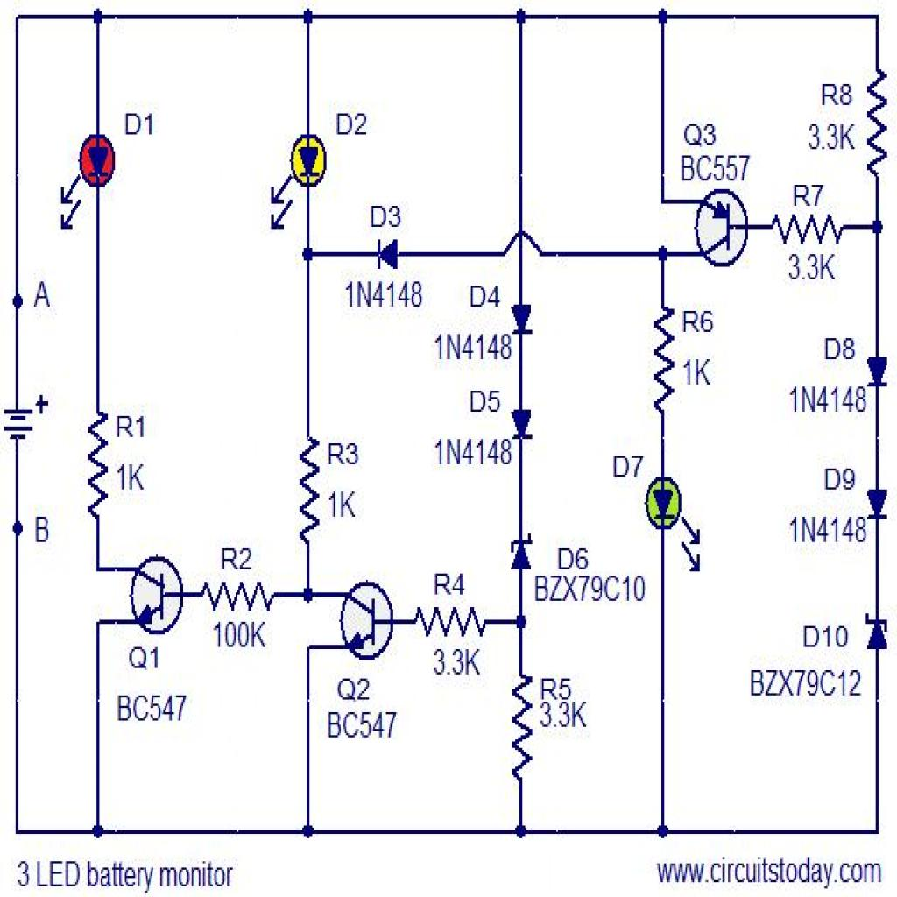

**File principali**

- Immagine: `b03/b03.jpg`
- JSON: `b03/b03.json`
- Prompt JSON-only: `b03/prompt_json.txt`
- Prompt JSON+immagine: `b03/prompt_json_img.txt`
- Datasheet: non presente

**Funzione del circuito**

`b03` e un circuito indicatore di livello con tre LED. Il sintomo riguarda LED che non commutano correttamente al variare della tensione di alimentazione o del livello monitorato.

**Aspetti rilevanti del JSON**

Il JSON descrive LED, resistenze, transistor e collegamenti tra terminali. In questo circuito il graph e utile per ricostruire la catena di soglie e pilotaggio dei LED, ma puo contenere ambiguita nella classificazione di alcuni transistor. Questo rende `b03` un buon caso per testare quanto l'immagine possa aiutare a correggere o integrare la rappresentazione strutturata.

**Risultato del judge**

Il risultato e quasi perfettamente bilanciato:

- JSON-only: 14.88/21;
- JSON+immagine: 15.00/21;
- delta immagine: +0.12.

L'immagine aiuta alcuni modelli, ma ne peggiora altri. Il caso supporta l'idea che il JSON sia gia molto competitivo.

### 4.2 Circuito `b06`

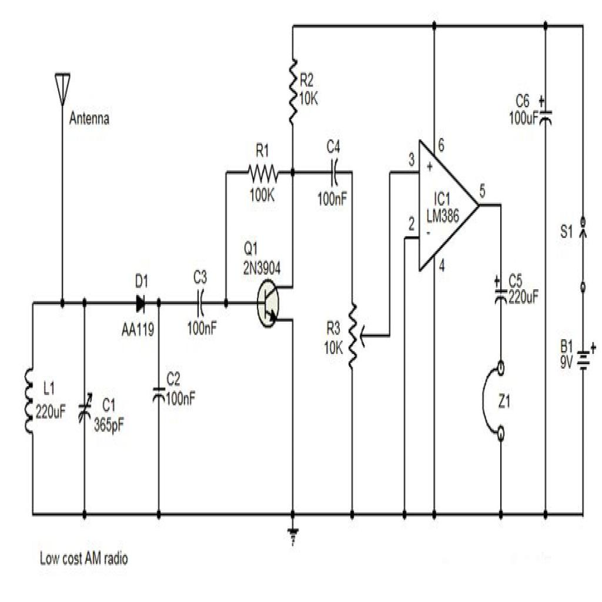

**File principali**

- Immagine: `b06/b06.jpg`
- JSON: `b06/b06.json`
- Prompt JSON-only: `b06/prompt_json.txt`
- Prompt JSON+immagine: `b06/prompt_json_img.txt`
- Datasheet: non presente nel test

**Funzione del circuito**

`b06` rappresenta una radio o ricevitore semplice. Il sintomo e la presenza di alimentazione ma assenza di stazioni udibili, con al massimo un fruscio debole.

**Aspetti rilevanti del JSON**

Il JSON consente di distinguere alimentazione, stadi di segnale, controllo di volume/sintonia e uscita. Il sintomo e volutamente generale: non nomina un altoparlante specifico, per evitare di suggerire una diagnosi troppo vincolata.

**Risultato del judge**

Il risultato e leggermente a favore del JSON:

- JSON-only: 16.12/21;
- JSON+immagine: 15.88/21;
- delta immagine: -0.25.

L'immagine aumenta Top-1 e Top-3, ma non migliora lo score medio. Questo mostra che l'immagine puo aiutare nella priorita della causa senza necessariamente migliorare la qualita complessiva della risposta.

### 4.3 Circuito `c01`

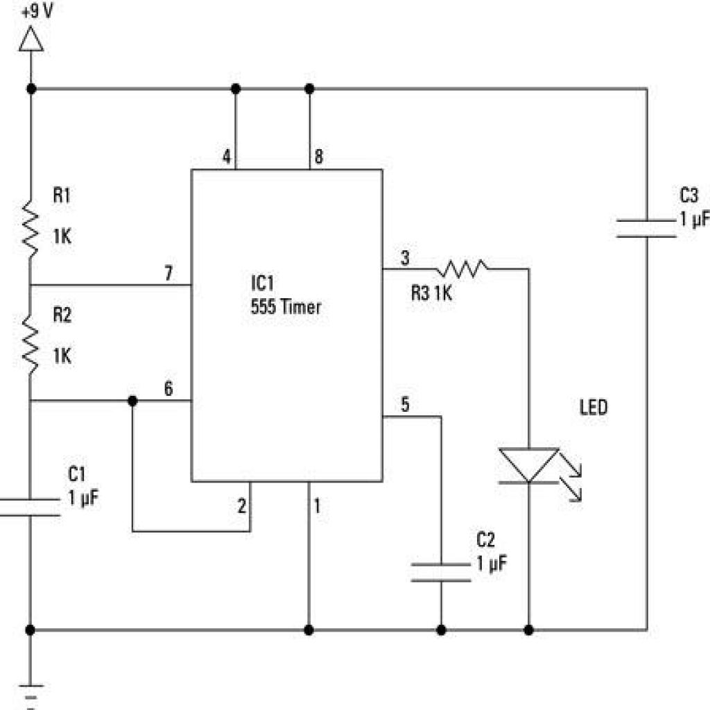

**File principali**

- Immagine: `c01/c01.jpg`
- JSON: `c01/c01.json`
- Datasheet: `c01/datasheet/datasheet.txt`

Nota: per `c01` e stato usato l'estratto datasheet presente al momento della run. Il file descrive correttamente i pin e il funzionamento generale del NE555, ma contiene anche riferimenti a un circuito precedente con due NE555 e uscita audio. Questo rende `c01` un caso meno pulito dal punto di vista del datasheet e va considerato nell'interpretazione.

**Funzione del circuito**

`c01` e un circuito basato su NE555, usato per generare un lampeggio LED. Il sintomo riguarda un LED che dovrebbe lampeggiare ma resta fisso o spento.

**Aspetti rilevanti del JSON**

Il graph deve rappresentare correttamente il NE555, la rete RC temporizzatrice, alimentazione, massa e uscita verso il LED. La diagnosi richiede di distinguere guasti della rete RC da problemi di alimentazione, reset, uscita o LED.

**Risultato del judge**

L'immagine aiuta in modo visibile:

- JSON-only: 12.88/21;
- JSON+immagine: 14.38/21;
- delta immagine: +1.50.

`c01` e uno dei circuiti piu difficili del batch: lo score medio complessivo e 13.63/21. L'immagine migliora il risultato, probabilmente perche aiuta alcuni modelli a interpretare meglio la topologia del timer e a compensare parzialmente il rumore introdotto dall'estratto datasheet non perfettamente aderente al circuito.

### 4.4 Circuito `c02`

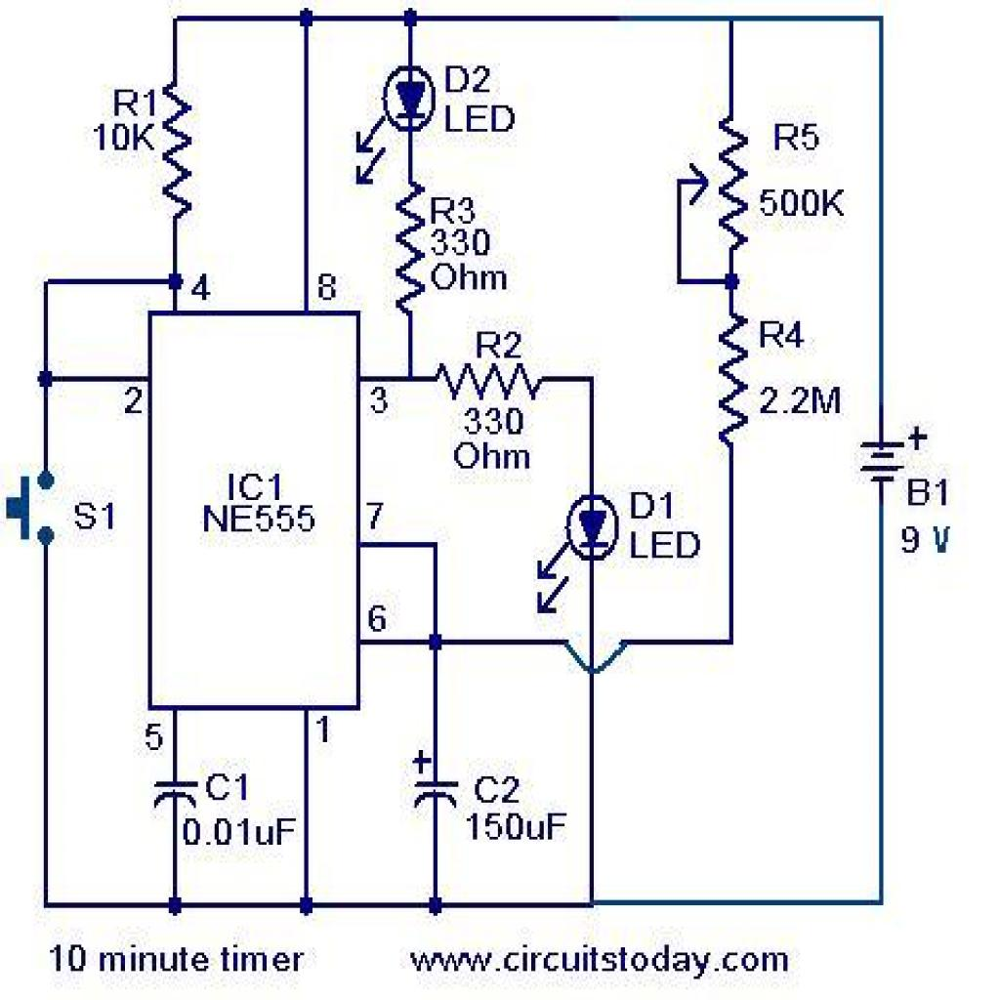

**File principali**

- Immagine: `c02/c02.jpg`
- JSON: `c02/c02.json`
- Datasheet: `c02/datasheet/datasheet.txt`

**Funzione del circuito**

`c02` e un circuito con NE555 e indicatori LED. Il sintomo riguarda un timer che si accende, ma con LED fissi o che non cambiano come previsto.

**Aspetti rilevanti del JSON**

Il JSON descrive NE555, pulsante, rete temporizzatrice, LED e collegamenti. In questo caso la rappresentazione strutturata e particolarmente utile, perche il problema dipende dalla logica di collegamento e dal comportamento atteso del timer.

**Risultato del judge**

`c02` e il caso piu forte a favore del JSON:

- JSON-only: 17.12/21;
- JSON+immagine: 14.38/21;
- delta immagine: -2.75.

Sette modelli su otto peggiorano aggiungendo l'immagine. La Top-3 resta 100% in entrambe le configurazioni, ma lo score medio e la qualita diagnostica sono migliori con il solo JSON. Questo e un dato molto importante: l'immagine puo introdurre rumore quando il graph contiene gia l'informazione topologica piu utile.

### 4.5 Circuito `c05`

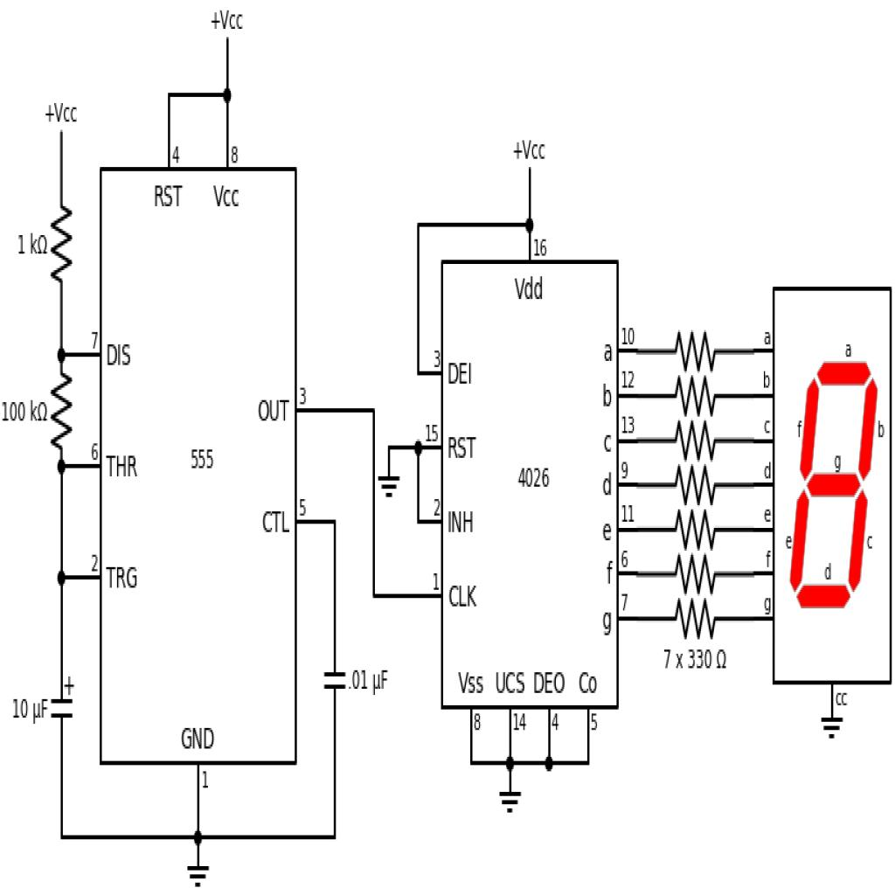

**File principali**

- Immagine: `c05/c05.jpg`
- JSON: `c05/c05.json`
- Datasheet: `c05/datasheet/NE555_datasheet.txt`, `c05/datasheet/CD4026_datasheet.txt`, `c05/datasheet/seven_segment_display_datasheet.txt`

**Funzione del circuito**

`c05` e un circuito di conteggio e visualizzazione. Il NE555 genera il clock, il CD4026 conta e pilota un display a 7 segmenti. Il sintomo riguarda cifre incomplete o segmenti accesi/spenti in modo errato.

**Aspetti rilevanti del JSON**

Il JSON deve rappresentare clock, contatore/driver, display e resistenze dei segmenti. In questo caso la parte visiva e potenzialmente utile perche il guasto riguarda segmenti del display e collegamenti tra driver e display.

**Risultato del judge**

L'immagine migliora il risultato:

- JSON-only: 14.38/21;
- JSON+immagine: 15.62/21;
- delta immagine: +1.25.

Il caso e favorevole all'immagine, ma non invalida la tesi: anche il JSON-only mantiene Top-3 al 100%, quindi la causa corretta e generalmente inclusa tra le ipotesi.

### 4.6 Circuito `c08`

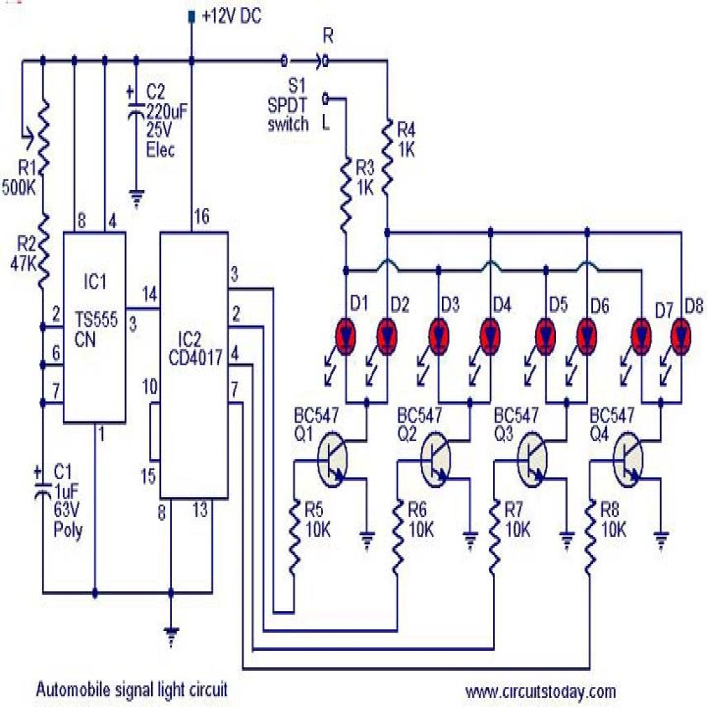

**File principali**

- Immagine: `c08/c08.jpg`
- JSON: `c08/c08.json`
- Datasheet: `c08/datasheet/TS555_datasheet.txt`, `c08/datasheet/CD4017_datasheet.txt`

**Funzione del circuito**

`c08` e un sequenziatore LED basato su TS555 e CD4017. Il sintomo riguarda LED che non scorrono nella sequenza prevista, rimangono bloccati o non si accendono.

**Aspetti rilevanti del JSON**

La diagnosi richiede di capire la catena clock-reset-output: il TS555 deve generare il clock, il CD4017 deve avanzare sulle uscite e la rete LED/resistenze deve convertire le uscite in segnali visibili. Il circuito e piu ambiguo di altri perche alcune connessioni possono sembrare errori o scelte intenzionali di limitazione della sequenza.

**Risultato del judge**

Il risultato e intermedio:

- JSON-only: 13.25/21;
- JSON+immagine: 14.00/21;
- delta immagine: +0.75.

L'immagine aiuta, ma non risolve completamente la difficolta. Top-3 resta 62.5% in entrambe le configurazioni, segno che il circuito e effettivamente critico per i modelli.

### 4.7 Circuito `c13`

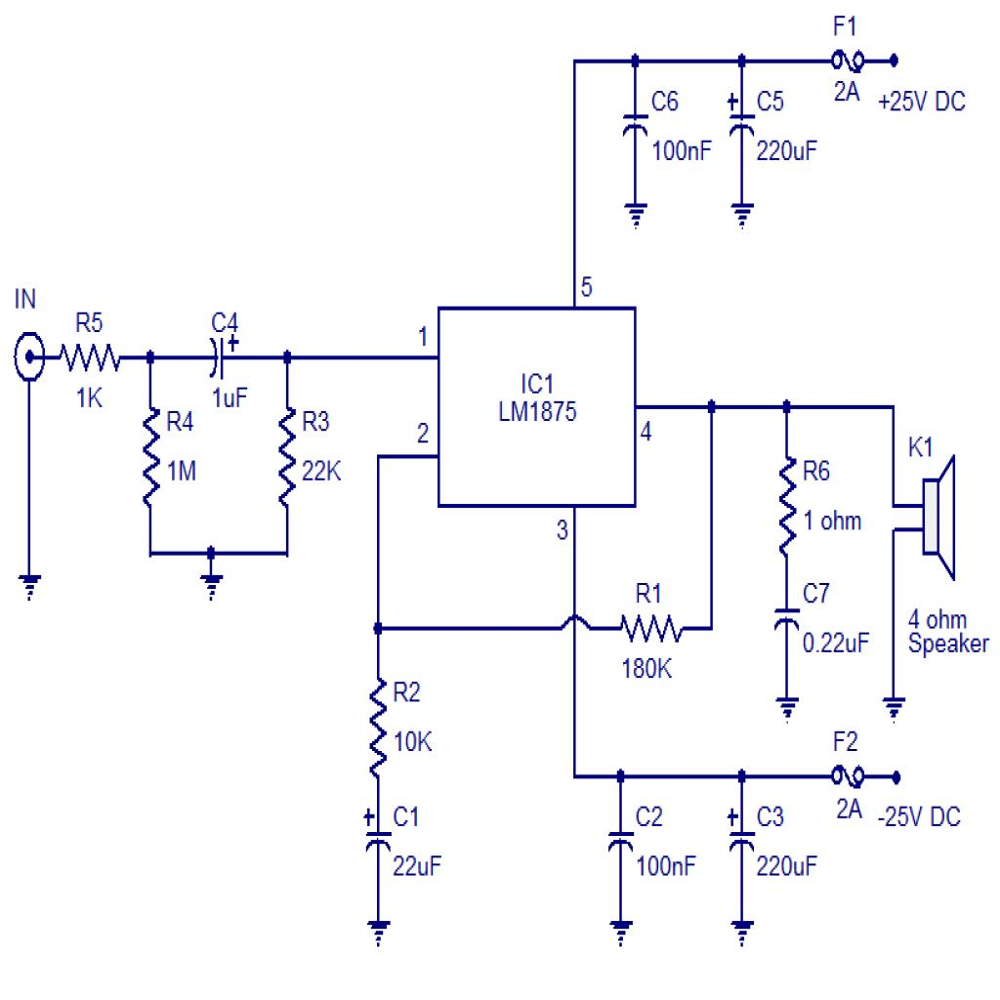

**File principali**

- Immagine: `c13/c13.jpg`
- JSON: `c13/c13.json`
- Datasheet: `c13/datasheet/LM1875_datasheet.txt`

**Funzione del circuito**

`c13` e un amplificatore audio basato su LM1875, con alimentazione duale, ingresso audio, rete di feedback e uscita verso altoparlante. Il sintomo riguarda assenza di audio o audio molto debole e distorto.

**Aspetti rilevanti del JSON**

Il graph contiene informazioni fondamentali: alimentazioni, massa, ingresso, feedback, uscita e carico. Questo rende `c13` un buon caso per verificare se una rappresentazione strutturata ben formata sia sufficiente per una diagnosi audio.

**Risultato del judge**

Il risultato e leggermente a favore del JSON:

- JSON-only: 16.38/21;
- JSON+immagine: 16.00/21;
- delta immagine: -0.38.

L'immagine aumenta Top-3, che passa da 87.5% a 100%, ma non migliora lo score medio. Il circuito supporta l'idea che, quando il graph esplicita bene alimentazione, segnale e feedback, il JSON puo bastare.

### 4.8 Circuito `c17`

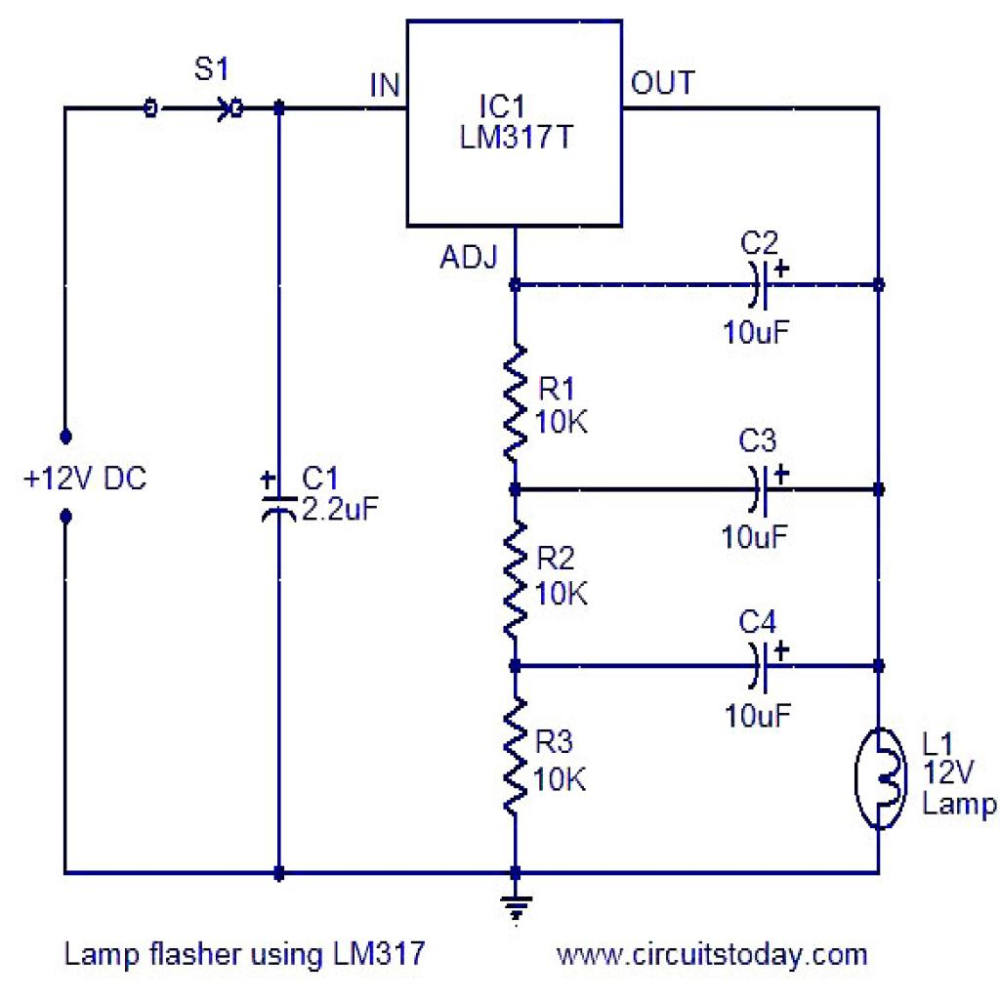

**File principali**

- Immagine: `c17/c17.jpg`
- JSON: `c17/c17.json`
- Datasheet: `c17/datasheet/LM317T_datasheet.txt`

**Funzione del circuito**

`c17` e un circuito con LM317T usato in un'applicazione di lampeggio/regolazione per una lampada. Il sintomo riguarda una lampada che dovrebbe lampeggiare ma resta fissa o non si accende.

**Aspetti rilevanti del JSON**

Il circuito richiede di interpretare alimentazione, regolatore LM317, rete ADJ/OUT/IN, condensatori e lampada. La relazione tra tensione disponibile, dropout del regolatore e carico e centrale per la diagnosi.

**Risultato del judge**

`c17` e il caso piu forte a favore dell'immagine:

- JSON-only: 14.50/21;
- JSON+immagine: 17.25/21;
- delta immagine: +2.75.

Tutti gli otto modelli migliorano con l'immagine. La Top-1 passa da 12.5% a 100%. Questo circuito mostra chiaramente che l'immagine puo essere decisiva quando elementi visivi, polarita, disposizione e interpretazione del regolatore aiutano a ordinare correttamente le cause.

---

## 5. Datasheet ed estratti testuali

Nel `batch_v2` gli estratti datasheet sono stati mantenuti volutamente brevi e generali, in modo da poter essere riusati anche in altri circuiti che usano lo stesso componente.

| Circuito | Estratti datasheet |
|---|---|
| `b03` | Nessun datasheet. |
| `b06` | Nessun datasheet specifico nel test. |
| `c01` | NE555, con estratto usato nella run ma non completamente generico. |
| `c02` | NE555. |
| `c05` | NE555, CD4026, display 7 segmenti. |
| `c08` | TS555, CD4017. |
| `c13` | LM1875. |
| `c17` | LM317T. |

Gli estratti hanno lo scopo di fornire al modello solo le informazioni essenziali:

- funzione generale del componente;
- pin principali;
- condizioni operative rilevanti;
- errori tipici compatibili con il sintomo;
- vincoli pratici utili per troubleshooting.

Non e stato usato il PDF intero come input al modello, per mantenere il prompt controllabile e confrontabile tra le run.

---

## 6. Prompt usati per i modelli sotto test

I prompt sono rimasti standardizzati tra i circuiti. Sono state modificate solo le variabili operative:

- `BATCH_NAME`;
- `CIRCUIT_NAME`;
- `MODEL`;
- `PROBLEM`.

Questa scelta e importante per evitare che il prompt venga ottimizzato manualmente per un singolo circuito. La differenza misurata deve dipendere principalmente dagli input disponibili, cioe JSON/datasheet o JSON/immagine/datasheet, non da una riscrittura specifica del prompt.

### 6.1 Configurazione `JSON + datasheet`

In questa configurazione il modello riceve:

- il sintomo;
- il JSON del circuito;
- l'eventuale testo datasheet;
- una richiesta di diagnosi tecnica con cause ordinate per probabilita e controlli pratici.

L'immagine dello schema non viene fornita.

### 6.2 Configurazione `JSON + immagine + datasheet`

In questa configurazione il modello riceve:

- il sintomo;
- il JSON del circuito;
- l'immagine dello schema elettrico;
- l'eventuale testo datasheet;
- la stessa richiesta diagnostica.

Questa e la configurazione di confronto: permette di misurare quanto l'immagine aggiunga informazione utile rispetto al solo graph.

### 6.3 Gestione del datasheet assente

Gli script sono stati adattati per evitare errori quando la cartella `datasheet/` e assente o non contiene file `.txt`. In questi casi il prompt include una nota neutra. Non vengono creati datasheet artificiali.

---

## 7. Script di esecuzione

Gli script usati si trovano in:

`scripts/GPT`

### 7.1 Generazione risposte JSON-only

Script:

`scripts/GPT/run_one_json.py`

Uso operativo:

```powershell
python scripts/GPT/run_one_json.py
```

Prima dell'esecuzione si impostano nello script:

```python
BATCH_NAME = "batch_v2"
CIRCUIT_NAME = "<circuito>"
MODEL = "<modello>"
PROBLEM = "<sintomo>"
```

Lo script salva le risposte in:

`experiment_ai/circuiti_complessi/batch_v2/<circuito>/results_json`

### 7.2 Generazione risposte JSON + immagine

Script:

`scripts/GPT/run_one_json_image.py`

Uso operativo:

```powershell
python scripts/GPT/run_one_json_image.py
```

Anche qui vengono impostati `BATCH_NAME`, `CIRCUIT_NAME`, `MODEL` e `PROBLEM`.

Lo script salva le risposte in:

`experiment_ai/circuiti_complessi/batch_v2/<circuito>/results_json_img`

### 7.3 Valutazione con judge

Script:

`scripts/GPT/run_judge_one_circuit.py`

Uso operativo:

```powershell
python scripts/GPT/run_judge_one_circuit.py
```

Il judge valuta tutte le risposte del circuito corrente, confrontando output JSON-only e JSON+immagine. L'output va in:

`experiment_ai/circuiti_complessi/batch_v2/<circuito>/judge_results`

### 7.4 Tabelle locali per circuito

Script:

`scripts/GPT/make_judge_tables.py`

Uso operativo:

```powershell
python scripts/GPT/make_judge_tables.py
```

Per `batch_v2` lo script deve avere:

```python
BATCH_NAME = "batch_v2"
CIRCUIT_NAME = "<circuito>"
```

Produce una tabella Markdown locale:

`<circuito>/judge_results/<circuito>_judge_tables.md`

### 7.5 Aggregazione globale

Dopo aver completato tutti i circuiti del batch, si esegue:

```powershell
python scripts/GPT/aggregate_judge_results.py --root "experiment_ai/circuiti_complessi/batch_v2" --dedupe
```

L'opzione `--dedupe` evita doppi conteggi se sono presenti piu summary o run duplicate, mantenendo l'ultima valutazione per combinazione circuito-modello-input.

### 7.6 CSV per grafici

Per generare i CSV aggiuntivi:

```powershell
python scripts/GPT/make_graph_csvs.py --batch-dir "experiment_ai/circuiti_complessi/batch_v2"
```

E importante passare `--batch-dir`, perche lo script ha come default storico `batch_v1`.

### 7.7 Figure principali e appendice

Gli script di plot si trovano in:

`scripts/plot_graphics_result_gpt`

Figure principali:

```powershell
python scripts/plot_graphics_result_gpt/make_main_figures.py --input-dir "experiment_ai/circuiti_complessi/batch_v2/_aggregate"
```

Figure di appendice:

```powershell
python scripts/plot_graphics_result_gpt/make_appendix_figures.py --input-dir "experiment_ai/circuiti_complessi/batch_v2/_aggregate"
```

Le figure generate sono state salvate in:

- `_aggregate/figures_main`
- `_aggregate/figures_appendix`

---

## 8. Processo di valutazione con judge GPT-5.5

Il judge usato e `gpt-5.5`. Per ogni risposta generata dai modelli sotto test, il judge assegna:

- un punteggio totale su 21;
- un verdetto sintetico;
- Top-1 corretto/non corretto;
- Top-3 contenente/non contenente la causa corretta;
- errori gravi;
- allucinazioni;
- punti importanti mancati;
- spiegazione breve.

Il punteggio totale e composto da sette criteri, ciascuno valutato da 0 a 3:

| Criterio | Significato |
|---|---|
| `circuit_understanding` | Comprensione della struttura e funzione del circuito. |
| `datasheet_use` | Uso corretto delle informazioni del datasheet, quando presenti. |
| `json_image_use` | Uso corretto del JSON e, quando disponibile, dell'immagine. |
| `diagnostic_accuracy` | Accuratezza tecnica della diagnosi. |
| `cause_priority` | Ordine corretto delle cause probabili. |
| `practical_checks` | Utilita dei controlli pratici suggeriti. |
| `hallucination_absence` | Assenza di affermazioni inventate o non supportate. |

Questa struttura consente di distinguere tra risposte che descrivono bene il circuito ma sbagliano la causa principale, e risposte che invece danno una diagnosi operativamente utile.

---

## 9. Tabelle principali dai CSV

### 9.1 Confronto globale per tipo di input

| Input type | N | Score medio | Mediana | Std | Top-1 | Top-3 | Errori gravi medi | Allucinazioni medie |
|---|---:|---:|---:|---:|---:|---:|---:|---:|
| JSON + datasheet | 64 | 14.938 | 15.0 | 3.418 | 45.3% | 84.4% | 2.344 | 2.094 |
| JSON + immagine + datasheet | 64 | 15.312 | 15.0 | 3.386 | 60.9% | 85.9% | 2.297 | 2.344 |

Il delta medio dell'immagine e:

`15.312 - 14.938 = +0.374 punti su 21`

Il miglioramento medio e quindi piccolo. L'immagine migliora Top-1 in modo piu evidente, ma Top-3 resta quasi identica. Inoltre le allucinazioni medie aumentano leggermente con l'immagine.

### 9.2 Prestazioni aggregate per modello

| Modello | N | Score medio | Std | Top-1 | Top-3 | Errori gravi medi | Allucinazioni medie | Costo medio modello |
|---|---:|---:|---:|---:|---:|---:|---:|---:|
| `gpt-5.4` | 16 | 18.938 | 1.600 | 81.2% | 93.8% | 0.875 | 0.875 | 0.068916 |
| `gpt-5-mini` | 16 | 17.438 | 2.263 | 68.8% | 100.0% | 1.562 | 1.875 | 0.007699 |
| `gpt-5.4-mini` | 16 | 17.375 | 3.389 | 75.0% | 81.2% | 1.125 | 1.312 | 0.016112 |
| `gpt-4.1-mini` | 16 | 15.625 | 2.619 | 56.2% | 81.2% | 2.438 | 2.500 | 0.005768 |
| `gpt-5.4-nano` | 16 | 14.625 | 1.996 | 43.8% | 87.5% | 2.812 | 2.375 | 0.004959 |
| `gpt-5-nano` | 16 | 13.188 | 2.555 | 31.2% | 93.8% | 3.188 | 3.500 | 0.001677 |
| `gpt-4o-mini` | 16 | 12.188 | 1.704 | 43.8% | 68.8% | 3.250 | 2.250 | 0.003471 |
| `gpt-4.1-nano` | 16 | 11.625 | 1.833 | 25.0% | 75.0% | 3.312 | 3.062 | 0.001346 |

Il modello migliore in qualita assoluta e `gpt-5.4`. Il miglior compromesso pratico e piu discutibile rispetto al `batch_v1`: `gpt-5-mini` ha score leggermente superiore a `gpt-5.4-mini`, Top-3 al 100% e costo medio piu basso; `gpt-5.4-mini` ha Top-1 piu alto ma maggiore variabilita. Per un sistema pratico, `gpt-5-mini` e molto competitivo.

### 9.3 Prestazioni aggregate per circuito

| Circuito | Score medio complessivo | Top-1 | Top-3 |
|---|---:|---:|---:|
| `c13` | 16.188 | 56.2% | 93.8% |
| `b06` | 16.000 | 62.5% | 81.2% |
| `c17` | 15.875 | 56.2% | 100.0% |
| `c02` | 15.750 | 81.2% | 100.0% |
| `c05` | 15.000 | 68.8% | 100.0% |
| `b03` | 14.938 | 50.0% | 68.8% |
| `c01` | 13.625 | 18.8% | 75.0% |
| `c08` | 13.625 | 31.2% | 62.5% |

I circuiti piu difficili risultano `c01` e `c08`. I circuiti piu robusti sono `c13`, `b06`, `c17`, `c02` e `c05`, anche se per motivi diversi.

### 9.4 Delta medio dell'immagine per circuito

| Circuito | JSON-only | JSON+immagine | Delta immagine |
|---|---:|---:|---:|
| `c17` | 14.50 | 17.25 | +2.75 |
| `c01` | 12.88 | 14.38 | +1.50 |
| `c05` | 14.38 | 15.62 | +1.25 |
| `c08` | 13.25 | 14.00 | +0.75 |
| `b03` | 14.88 | 15.00 | +0.12 |
| `b06` | 16.12 | 15.88 | -0.25 |
| `c13` | 16.38 | 16.00 | -0.38 |
| `c02` | 17.12 | 14.38 | -2.75 |

Questa tabella e centrale per la tesi. L'effetto dell'immagine non e uniforme:

- aiuta molto in `c17`;
- peggiora molto in `c02`;
- e quasi neutra in `b03`, `b06` e `c13`;
- aiuta moderatamente in `c01`, `c05` e `c08`.

Il delta medio globale `+0.375` e piccolo anche perche `c17` e `c02` si compensano quasi perfettamente:

- `c17`: somma dei delta sui modelli = +22 punti;
- `c02`: somma dei delta sui modelli = -22 punti.

Se si esclude `c17`, il delta medio dell'immagine scende a circa `+0.036`, cioe praticamente zero. Questo mostra che il vantaggio globale dell'immagine dipende molto da un singolo circuito.

### 9.5 Delta medio dell'immagine per modello

| Modello | Delta medio immagine |
|---|---:|
| `gpt-5.4-mini` | +2.50 |
| `gpt-5.4` | +1.12 |
| `gpt-4.1-nano` | +1.00 |
| `gpt-4o-mini` | +0.38 |
| `gpt-4.1-mini` | +0.00 |
| `gpt-5-nano` | -0.38 |
| `gpt-5-mini` | -0.62 |
| `gpt-5.4-nano` | -1.00 |

L'immagine non aiuta tutti i modelli. Il caso piu evidente e `gpt-5.4-mini`, che guadagna molto con l'immagine. Al contrario, `gpt-5-mini` e `gpt-5.4-nano` peggiorano in media con l'immagine.

### 9.6 Costi complessivi

| Modello | Costo modelli | Costo judge | Costo totale |
|---|---:|---:|---:|
| `gpt-4o-mini` | 0.055535 | 1.398520 | 1.454055 |
| `gpt-4.1-nano` | 0.021538 | 1.454365 | 1.475903 |
| `gpt-4.1-mini` | 0.092286 | 1.463135 | 1.555421 |
| `gpt-5-nano` | 0.026828 | 1.598830 | 1.625658 |
| `gpt-5-mini` | 0.123176 | 1.504120 | 1.627296 |
| `gpt-5.4-nano` | 0.079346 | 1.557875 | 1.637221 |
| `gpt-5.4-mini` | 0.257798 | 1.383905 | 1.641703 |
| `gpt-5.4` | 1.102655 | 1.483110 | 2.585765 |

Il costo totale del batch, includendo modelli sotto test e judge, e:

- costo diagnosi modelli: 1.759161 USD;
- costo judge: 11.843860 USD;
- totale complessivo: 13.603021 USD.

Il costo del judge e molto superiore al costo operativo delle diagnosi. Per la tesi va specificato che il judge appartiene alla fase sperimentale offline, non al sistema finale di troubleshooting.

---

## 10. Figure principali

Le figure principali sono contenute in:

`_aggregate/figures_main`

### Figura 1 - Score medio per modello

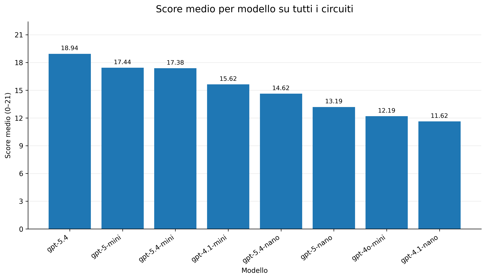

La figura mostra la classifica generale dei modelli. `gpt-5.4` e il migliore in score assoluto; `gpt-5-mini` e `gpt-5.4-mini` sono i candidati pratici piu interessanti.

### Figura 2 - Effetto dell'immagine per modello

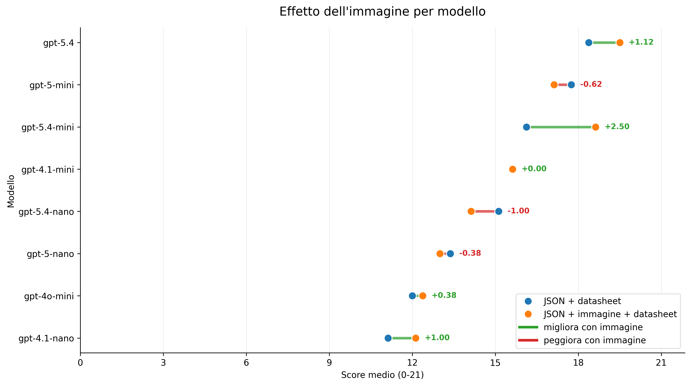

La figura collega lo score medio ottenuto da ciascun modello con JSON-only e con JSON+immagine. Mostra che l'effetto dell'immagine dipende dal modello: alcuni migliorano, altri peggiorano.

### Figura 3 - Effetto dell'immagine per circuito

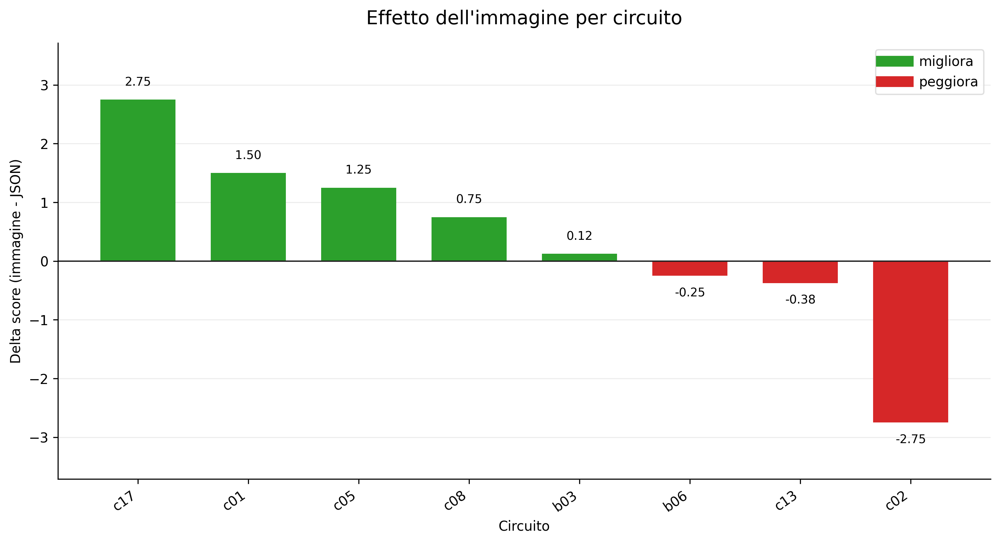

Questa e la figura piu importante per la tesi. Mostra chiaramente che l'immagine non produce un miglioramento sistematico: `c17` migliora molto, `c02` peggiora molto, e diversi circuiti sono quasi neutri.

### Figura 4 - Score medio per circuito

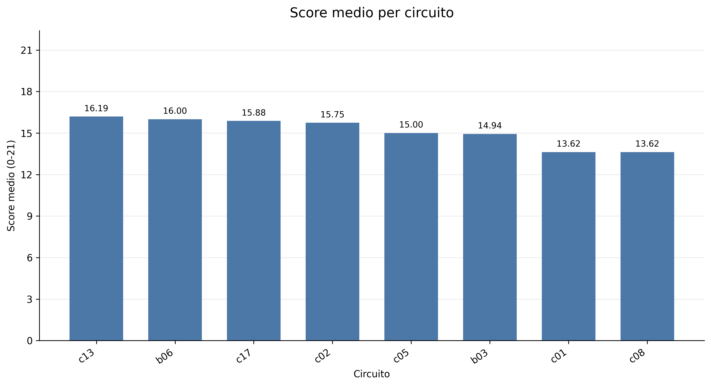

La figura evidenzia la difficolta relativa dei circuiti. `c01` e `c08` sono i casi piu critici, mentre `c13`, `b06`, `c17`, `c02` e `c05` sono mediamente piu robusti.

### Figura 5 - Robustezza modello x circuito

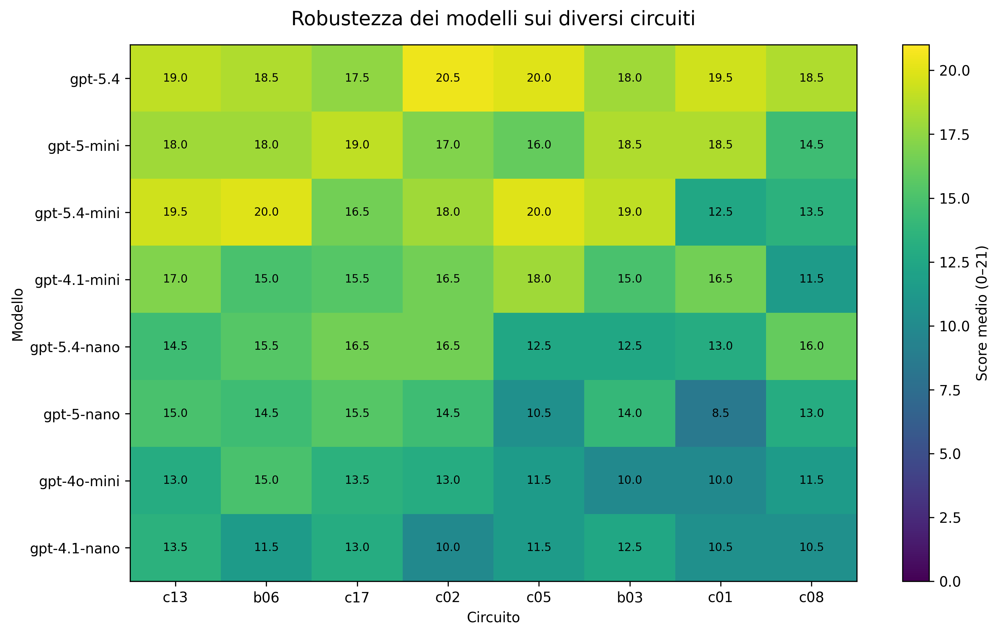

La heatmap mostra che i modelli forti sono relativamente robusti su piu circuiti, ma non immuni da cadute locali. `gpt-5.4` e il piu stabile in alto; `gpt-5.4-mini` e forte ma piu variabile.

### Figura 6 - Accuratezza Top-1 e Top-3

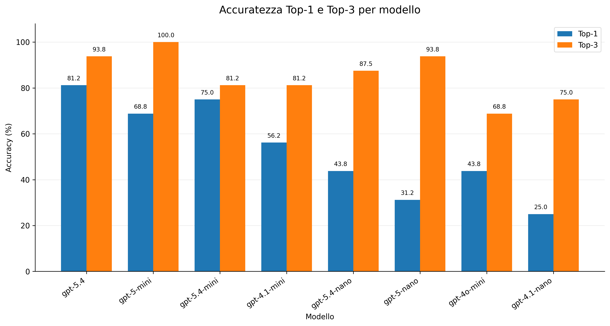

La figura distingue l'affidabilita della causa principale dalla capacita di includere la causa corretta tra le prime ipotesi. `gpt-5-mini` e particolarmente interessante perche raggiunge Top-3 al 100%.

### Figura 7 - Errori gravi medi per modello

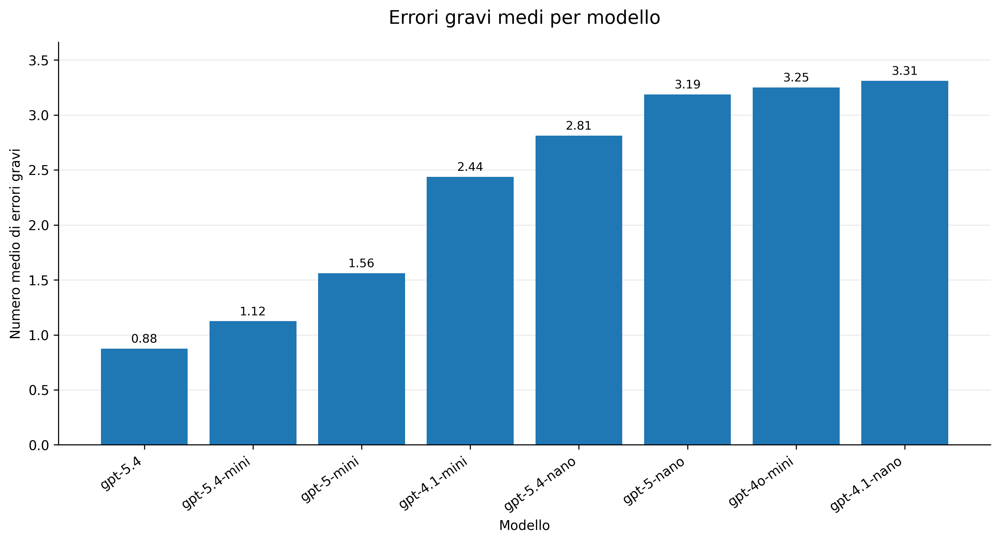

Il grafico mostra che i modelli piu forti riducono nettamente gli errori gravi. Questo e rilevante in un contesto di troubleshooting, dove un errore grave puo portare a controlli inutili o fuorvianti.

### Figura 8 - Score vs costo

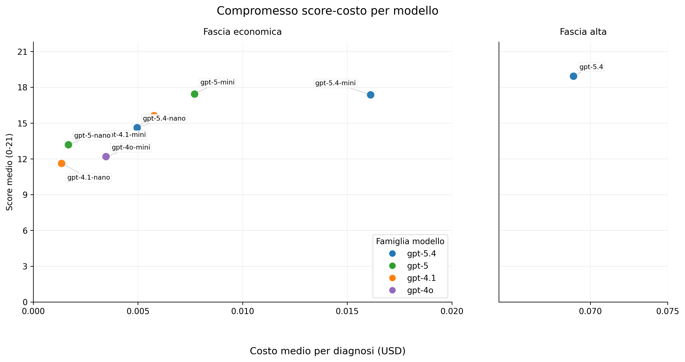

La figura mostra il compromesso qualita/costo. `gpt-5.4` e migliore in qualita, ma molto piu costoso; `gpt-5-mini` e `gpt-5.4-mini` offrono un equilibrio piu pratico.

### Figura 9 - Costo medio per modello

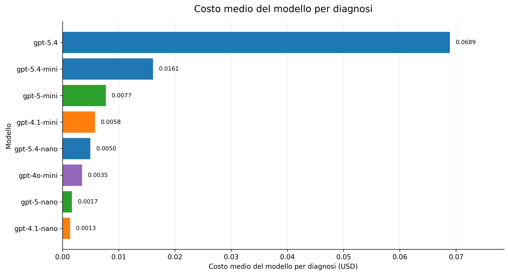

La figura riporta il costo medio stimato per diagnosi, escludendo il judge. Serve a distinguere il costo operativo del sistema dal costo della valutazione sperimentale.

---

## 11. Figure di appendice

Le figure di appendice sono contenute in:

`_aggregate/figures_appendix`

### Figura A1 - Score vs latenza

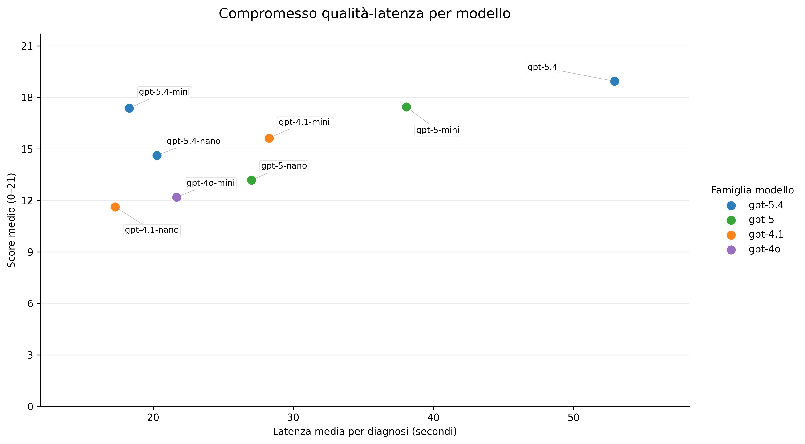

Questa figura mette in relazione score medio e latenza media. E utile per valutare il sistema in scenari in cui il tempo di risposta e importante.

### Figura A2 - Heatmap modello x criterio

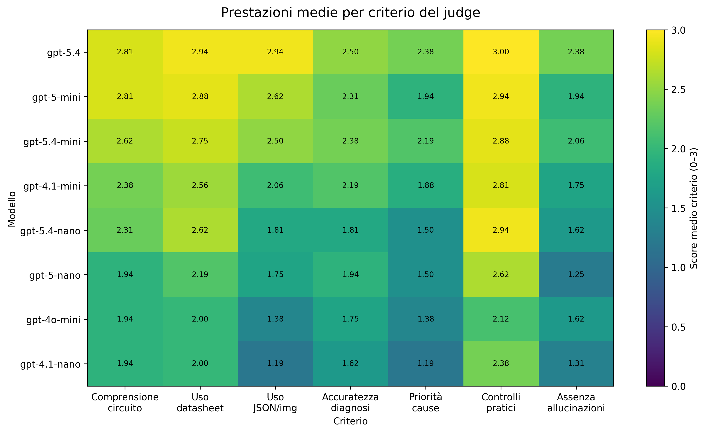

La heatmap per criterio mostra quali aspetti distinguono i modelli: comprensione del circuito, uso del datasheet, accuratezza diagnostica, priorita delle cause, controlli pratici e assenza di allucinazioni.

### Figura A3 - Mappa qualita-stabilita

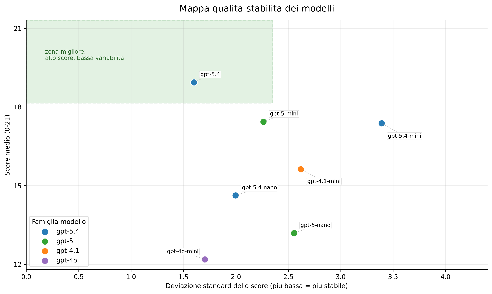

La figura mette in relazione score medio e deviazione standard. I modelli piu desiderabili sono quelli con punteggio alto e variabilita bassa.

---

## 12. Interpretazione dei risultati

### 12.1 La tesi del JSON pipeline

Il risultato complessivo supporta una versione prudente ma forte della tesi:

> Il JSON prodotto dalla pipeline conserva abbastanza informazione strutturale da ottenere diagnosi spesso comparabili a quelle ottenute fornendo anche l'immagine dello schema. L'immagine puo aiutare in casi specifici, ma non introduce un vantaggio sistematico su tutto il batch.

Questa formulazione e piu corretta della frase "il JSON e sempre equivalente all'immagine". I dati mostrano infatti che:

- l'immagine migliora la media globale di soli +0.375 punti su 21;
- la mediana resta 15.0 in entrambe le configurazioni;
- Top-3 e quasi identica: 84.4% contro 85.9%;
- l'immagine aumenta Top-1, ma aumenta anche leggermente le allucinazioni;
- l'effetto dipende molto dal circuito.

### 12.2 Perche l'immagine non e sistematicamente superiore

L'immagine aggiunge informazione visiva, ma questa informazione non e sempre utile. In alcuni casi aiuta a riconoscere disposizione, polarita o componenti; in altri casi puo distrarre il modello, specialmente quando la diagnosi richiede lettura topologica precisa gia presente nel JSON.

Il caso `c02` e il piu chiaro: il JSON-only ottiene 17.12/21, mentre JSON+immagine scende a 14.38/21. Qui il graph sembra fornire l'informazione piu utile per ragionare sul timer, mentre l'immagine introduce rumore.

Il caso opposto e `c17`: l'immagine porta lo score da 14.50 a 17.25 e Top-1 da 12.5% a 100%. Qui la parte visiva aiuta chiaramente a mettere al primo posto la causa corretta.

### 12.3 Significato di Top-1 e Top-3

La differenza tra Top-1 e Top-3 e cruciale:

- Top-1 misura se il modello mette subito la causa corretta come ipotesi principale;
- Top-3 misura se la causa corretta compare almeno tra le prime ipotesi.

Nel `batch_v2`, l'immagine migliora molto Top-1:

- JSON-only: 45.3%;
- JSON+immagine: 60.9%.

Pero Top-3 cambia pochissimo:

- JSON-only: 84.4%;
- JSON+immagine: 85.9%.

Questo significa che, come strumento di supporto al troubleshooting, il JSON-only e gia spesso utile: anche quando non mette la causa corretta al primo posto, tende a includerla tra le ipotesi da verificare.

### 12.4 Migliore modello assoluto

Il migliore in termini assoluti e `gpt-5.4`:

- score medio: 18.938/21;
- Top-1: 81.2%;
- Top-3: 93.8%;
- errori gravi medi: 0.875;
- allucinazioni medie: 0.875.

E il modello piu affidabile per qualita diagnostica, ma ha il costo operativo medio piu alto tra i modelli testati.

### 12.5 Miglior compromesso pratico

Nel `batch_v2`, il miglior compromesso non e unico. Ci sono due candidati:

`gpt-5-mini`:

- score medio: 17.438/21;
- Top-3: 100%;
- costo medio modello: 0.007699 USD;
- variabilita moderata.

`gpt-5.4-mini`:

- score medio: 17.375/21;
- Top-1: 75.0%;
- costo medio modello: 0.016112 USD;
- variabilita piu alta.

Per un sistema pratico, `gpt-5-mini` appare molto interessante per il rapporto qualita/costo e per Top-3 al 100%. `gpt-5.4-mini` resta forte, ma in questo batch e meno stabile.

### 12.6 Modelli economici

I modelli nano sono economici ma meno affidabili. `gpt-5-nano` ha Top-3 molto alta, 93.8%, ma score medio 13.188 e molte allucinazioni. Questo suggerisce che puo proporre ipotesi utili, ma con rumore diagnostico maggiore.

`gpt-4.1-nano` e il piu debole del batch, con score medio 11.625 e Top-1 25.0%. `gpt-4o-mini` e leggermente migliore ma comunque lontano dai modelli della famiglia 5.

### 12.7 Circuiti piu difficili

I circuiti piu difficili sono:

- `c01`, score medio 13.625;
- `c08`, score medio 13.625.

`c01` richiede una buona interpretazione della rete del timer NE555 e, in questa run, e influenzato anche da un estratto datasheet meno pulito rispetto agli altri casi. `c08` richiede di capire la relazione tra TS555, CD4017, reset, clock e sequenza LED. In entrambi i casi il modello deve ordinare correttamente cause che sono tecnicamente vicine tra loro.

### 12.8 Circuiti piu informativi per la tesi

I circuiti piu importanti per interpretare la tesi sono:

- `c02`, perche mostra un forte vantaggio del JSON;
- `c17`, perche mostra un forte vantaggio dell'immagine;
- `c13`, perche mostra che un graph ben strutturato puo bastare per un amplificatore audio;
- `b03`, perche e quasi neutro e mette in evidenza differenze tra modelli;
- `c05`, perche mostra che l'immagine puo aiutare in un problema visivo sui segmenti del display.

Questi casi dimostrano che non esiste una risposta unica: l'immagine e utile quando aggiunge informazione diagnosticamente rilevante; il JSON e forte quando la topologia e gia espressa in modo sufficiente.

---

## 13. Limiti sperimentali

1. **Numero di circuiti limitato**  
   Il batch contiene otto circuiti. Il numero e sufficiente per un confronto controllato, ma non per una generalizzazione statistica ampia.

2. **Judge automatico**  
   Il judge GPT-5.5 consente valutazioni uniformi e scalabili, ma resta un modello. I risultati sono molto utili per confronto relativo, ma non sostituiscono una validazione umana completa.

3. **Ground truth manuale**  
   Le cause attese sono state definite manualmente. Questo aumenta il controllo tecnico, ma introduce una componente interpretativa.

4. **Datasheet estratti e non PDF interi**  
   I modelli ricevono estratti testuali sintetici. Questo rende l'esperimento piu controllabile, ma la qualita dell'estratto influenza la risposta.

5. **Estratto datasheet di `c01` non perfettamente pulito**  
   Nel caso `c01`, l'estratto NE555 usato nella run contiene anche riferimenti a un circuito precedente con due NE555 e uscita audio. Il file resta utile per pinout e funzionamento generale del NE555, ma puo aver introdotto rumore nella diagnosi. Per questo `c01` va interpretato con piu cautela rispetto ai circuiti con estratti datasheet piu puliti.

6. **JSON non perfetto**  
   Il JSON deriva da una pipeline di riconoscimento e puo contenere warning, ambiguita o classificazioni imperfette. Questo non e solo un limite: e anche parte del realismo sperimentale.

7. **Latenza variabile**  
   La latenza dipende da condizioni API, carico del servizio e dimensione del prompt. Va interpretata come indicatore operativo, non come misura assoluta.

8. **Effetto circuito-specifico dell'immagine**  
   Il batch mostra che l'immagine puo aiutare molto in un circuito e peggiorare molto in un altro. La conclusione deve quindi essere formulata in termini di tendenza e comparabilita, non come regola universale.

---

## 14. Conclusione sintetica per la tesi

Il `batch_v2` conferma che la rappresentazione JSON/graph prodotta dalla pipeline e una base solida per il troubleshooting automatico di circuiti elettronici.

Il confronto globale mostra che l'aggiunta dell'immagine produce un miglioramento medio piccolo:

- JSON-only: 14.938/21;
- JSON+immagine: 15.312/21;
- delta: +0.375/21.

Questo risultato non dimostra che il JSON sia sempre migliore dell'immagine, ma mostra che il JSON e spesso competitivo e che l'immagine non produce un vantaggio stabile su tutti i circuiti.

Il dato piu forte a favore della tesi e Top-3: il JSON-only raggiunge 84.4%, praticamente vicino all'85.9% ottenuto con immagine. Per un sistema di supporto al troubleshooting, questo significa che la pipeline JSON riesce spesso a portare la causa corretta tra le ipotesi operative da controllare.

L'immagine resta utile, soprattutto in casi come `c17`, dove migliora drasticamente Top-1 e score medio. Tuttavia casi come `c02` mostrano che l'immagine puo anche peggiorare la diagnosi quando introduce rumore o sposta l'attenzione del modello da relazioni topologiche gia espresse nel graph.

La conclusione piu difendibile e quindi:

> Il JSON della pipeline non sostituisce sempre l'immagine, ma fornisce una rappresentazione strutturata sufficientemente informativa da ottenere diagnosi spesso simili. L'immagine va considerata un supporto aggiuntivo utile in casi specifici, non una condizione sempre necessaria.

Dal punto di vista dei modelli, `gpt-5.4` e il riferimento migliore in qualita assoluta, mentre `gpt-5-mini` emerge come candidato pratico molto forte per rapporto qualita/costo, grazie a score elevato, Top-3 al 100% e costo operativo contenuto.

In sintesi, il `batch_v2` rafforza l'idea centrale della tesi: un sistema di troubleshooting puo basarsi su una pipeline che estrae lo schema in JSON/graph, integra datasheet testuali mirati quando disponibili e usa modelli GPT per generare diagnosi tecniche ordinate, verificabili e confrontabili.
