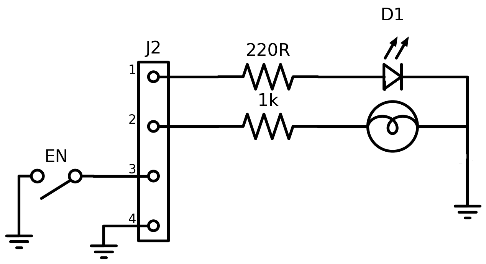

# Test AI — Circuito 01

## Obiettivo
Verificare se l'AI riesce a capire la topologia del circuito a partire dal JSON del passo 05 senza usare l'immagine.

## Immagine del circuito


## JSON usato
File: `16.json`

## Prompt usato
Ti fornisco il JSON topologico di un circuito estratto automaticamente da un diagramma elettrico.

Il JSON contiene:
- la lista dei componenti
- i terminali di ogni componente
- il grafo dei collegamenti tra terminali

Non ci sono net esplicite: i nodi elettrici sono rappresentati implicitamente dai collegamenti tra terminali.

Voglio che tu analizzi il circuito SOLO a partire da questo JSON.

Obiettivo:
verificare se il JSON è sufficiente per ricostruire la topologia del circuito e, se possibile, riconoscere il tipo di circuito.

Regole importanti:
- non usare l'immagine
- non inventare informazioni non presenti
- se qualcosa non è deducibile, scrivilo esplicitamente
- distingui tra deduzione certa, interpretazione probabile e informazione non determinabile
- non assumere automaticamente che più simboli GND siano lo stesso nodo, a meno che il JSON lo renda esplicito
- considera eventuali stati dei componenti, come switch open/closed, separatamente dalla sola connettività dei fili

FORMATO DI OUTPUT OBBLIGATORIO:
- produci SOLO il contenuto del report in Markdown
- racchiudi tutto il report dentro un unico blocco di codice markdown
- il blocco deve iniziare con ```markdown e finire con ```
- non aggiungere spiegazioni prima o dopo il blocco
- non usare canvas
- non creare una risposta discorsiva fuori dal blocco markdown
- il contenuto deve essere copiabile direttamente in un file .md

Usa obbligatoriamente questa struttura:

# Report di analisi topologica

## 1. Componenti presenti
Elenca i componenti in una tabella con:
- ID componente
- classe
- terminali

## 2. Nodi principali ricostruiti
Ricostruisci i nodi elettrici dal grafo dei collegamenti.
Usa nomi progressivi come N1, N2, N3.
Per ogni nodo indica i terminali appartenenti al nodo.

## 3. Terminali sullo stesso nodo
Spiega in modo discorsivo quali terminali sono sullo stesso nodo e cosa rappresentano.

## 4. Topologia generale del circuito
Descrivi i rami principali del circuito.
Quando utile, usa uno schema testuale semplificato.

## 5. Tipo di circuito riconoscibile
Indica se il circuito sembra riconoscibile.
Se sì, proponi una classificazione prudente.
Se no, spiega perché non è possibile identificarlo con certezza.

## 6. Ambiguità e limiti del JSON
Evidenzia:
- informazioni mancanti
- possibili ambiguità
- limiti del formato
- eventuali warning presenti nel JSON

## 7. Sufficienza del JSON
Spiega se il JSON è sufficiente per capire il circuito senza immagine.

## 8. Giudizio finale
Concludi con uno dei seguenti giudizi:
- Topologia chiara
- Topologia parzialmente chiara
- Topologia insufficiente

Motiva il giudizio in massimo 5 righe.

Ecco il JSON:
[INCOLLA QUI IL JSON]


## Valutazione comparativa dei modelli
Data: 27/04/2026

| Modello | Input usato | Componenti | Nodi / topologia | Tipo circuito | Ambiguità | Assenza allucinazioni | Totale /10 | Giudizio finale |
|---|---|---:|---:|---:|---:|---:|---:|---|
| GPT-5.4 / modello forte | Solo JSON | 2 | 2 | 2 | 2 | 2 | 10 | Topologia chiara |
| GPT-5.3 Instant / modello veloce | Solo JSON | 2 | 2 | 2 | 2 | 2 | 10 | Topologia chiara |
| GPT-5.2 Instant / economico | Solo JSON | 2 | 2 | 2 | 2 | 2 | 10 | Topologia chiara |
| o3 / reasoning legacy | Solo JSON | 2 | 2 | 2 | 2 | 2 | 10 | Topologia chiara |

### Legenda

### Scala usata

| Valore | Significato |
|---:|---|
| 2 | Corretto o molto utile |
| 1 | Parziale, incompleto o ambiguo |
| 0 | Errato, insufficiente o non utile |
| N/D | Test non eseguito |

#### Componenti
| Punteggio | Criterio |
|---:|---|
| 2 | Elenca correttamente quasi tutti i componenti e le classi |
| 1 | Riconosce i componenti principali ma omette o confonde qualche elemento |
| 0 | Sbaglia componenti importanti o inventa componenti non presenti |

#### Nodi / topologia
| Punteggio | Criterio |
|---:|---|
| 2 | Ricostruisce correttamente i nodi principali e i collegamenti |
| 1 | Ricostruisce la maggior parte dei nodi ma perde qualche dettaglio |
| 0 | Sbaglia la struttura dei nodi o interpreta male i collegamenti |

#### Tipo di circuito
| Punteggio | Criterio |
|---:|---|
| 2 | Propone una classificazione plausibile e prudente |
| 1 | Capisce solo genericamente il circuito |
| 0 | Classifica il circuito in modo sbagliato o troppo inventato |

#### Ambiguità
| Punteggio | Criterio |
|---:|---|
| 2 | Segnala correttamente limiti importanti del JSON |
| 1 | Segnala solo alcune ambiguità |
| 0 | Non segnala limiti o dà tutto per certo |

#### Assenza allucinazioni
| Punteggio | Criterio |
|---:|---|
| 2 | Non inventa valori, connessioni o funzioni non presenti |
| 1 | Fa qualche ipotesi, ma la segnala come ipotesi |
| 0 | Inventa informazioni o dà per certe cose non presenti |

### Interpretazione del totale

| Totale /10 | Giudizio |
|---:|---|
| 8-10 | Topologia chiara |
| 5-7 | Topologia parzialmente chiara |
| 0-4 | Topologia insufficiente |

### Valutazione manuale GPT-5.4
Report molto buono: riconosce correttamente connettore, LED, lampada, switch, resistenze e GND. Ricostruisce bene i rami `pin1 → R → LED → GND`, `pin2 → R → Lamp → GND`, `pin3 → switch open → GND`, `pin4 → GND`. Segnala correttamente l'ambiguità dei GND multipli e non inventa valori elettrici.
| Criterio | Punteggio | Motivazione |
|---|---:|---|
| Componenti | 2 | Elenca correttamente tutti i componenti presenti: connettore, switch, tre GND, due resistori, lampada e LED. |
| Nodi / topologia | 2 | Ricostruisce correttamente gli 8 nodi principali e descrive bene i rami del circuito. |
| Tipo circuito | 2 | Propone una classificazione prudente come circuito di segnalazione/interfaccia tramite connettore. |
| Ambiguità | 2 | Evidenzia correttamente GND multipli, assenza di valori, ruolo non certo dei pin e stato dello switch. |
| Assenza allucinazioni | 2 | Non inventa valori elettrici o funzioni non presenti; distingue bene tra topologia certa e interpretazione probabile. |

**Totale:** 10/10  
**Giudizio:** Topologia chiara

### Valutazione manuale GPT-5.3 Instant
Report più sintetico del 5.4, ma corretto. Ricostruisce tutti i componenti e gli 8 nodi principali, riconosce i rami LED/lampada, interpreta correttamente lo switch aperto e segnala limiti importanti come GND separati, assenza di alimentazione esplicita e mancanza dei valori dei componenti.
| Criterio | Punteggio | Motivazione |
|---|---:|---|
| Componenti | 2 | Elenca correttamente tutti i componenti presenti: tre GND, switch, connettore, due resistori, lampada e LED. |
| Nodi / topologia | 2 | Ricostruisce correttamente gli 8 nodi principali e distingue bene ramo LED, ramo lampada, ramo switch e pin 4 a GND. |
| Tipo circuito | 2 | Propone una classificazione prudente come circuito con connettore, due carichi resistivi/ottici verso massa e switch aperto. |
| Ambiguità | 2 | Segnala GND multipli, assenza di alimentazione esplicita, mancanza di valori e incertezza sul significato dei pin. |
| Assenza allucinazioni | 2 | Non inventa valori o collegamenti; resta prudente e distingue tra topologia ricostruibile e funzione non certa. |

**Totale:** 10/10  
**Giudizio:** Topologia chiara

### Valutazione manuale GPT-5.2 Instant

Report corretto e sintetico. Ricostruisce tutti i componenti principali, individua correttamente gli 8 nodi, distingue i due rami con carico `resistore-lampada` e `resistore-LED`, interpreta correttamente lo switch aperto e segnala che i tre simboli GND non sono unificati nel JSON. È più prudente nella classificazione funzionale rispetto agli altri modelli, ma non commette errori topologici rilevanti.

| Criterio | Punteggio | Motivazione |
|---|---:|---|
| Componenti | 2 | Elenca correttamente tutti i componenti: tre GND, switch, connettore, due resistori, lampada e LED. |
| Nodi / topologia | 2 | Ricostruisce correttamente gli 8 nodi principali e identifica i rami principali del circuito. |
| Tipo circuito | 2 | Propone una classificazione prudente: due carichi pilotati separatamente da un connettore, con indicatori luminosi e resistenze di limitazione. |
| Ambiguità | 2 | Segnala correttamente GND separati, assenza di sorgente, assenza di valori e ruolo non specificato del connettore. |
| Assenza allucinazioni | 2 | Non inventa valori, alimentazioni o collegamenti non presenti; mantiene distinte deduzioni certe e interpretazioni probabili. |

**Totale:** 10/10  
**Giudizio:** Topologia chiara

### Valutazione manuale o3

Report tecnicamente corretto. Ricostruisce bene tutti i componenti, gli 8 nodi principali e la topologia generale del circuito. Riconosce correttamente i due rami di carico, uno con resistore e LED e uno con resistore e lampada, entrambi verso il nodo `gnd9.3`. Interpreta correttamente lo switch come aperto e segnala la separazione dei tre simboli GND. La formattazione è meno pulita rispetto agli altri modelli, perché contiene una riga anomala iniziale e uno schema testuale non perfettamente leggibile, ma il contenuto tecnico resta corretto.

| Criterio | Punteggio | Motivazione |
|---|---:|---|
| Componenti | 2 | Elenca correttamente tutti i componenti presenti: tre GND, switch, connettore, due resistori, lampada e LED. |
| Nodi / topologia | 2 | Ricostruisce correttamente gli 8 nodi principali e descrive bene i collegamenti tra connettore, resistenze, LED, lampada, switch e GND. |
| Tipo circuito | 2 | Propone una classificazione prudente come scheda/circuito di segnalazione o indicazione con due uscite e uno switch verso massa. |
| Ambiguità | 2 | Segnala correttamente masse multiple, assenza di alimentazione, assenza di valori elettrici e necessità di gestire lo stato dello switch separatamente dal grafo. |
| Assenza allucinazioni | 2 | Non inventa valori o collegamenti; formula l’interpretazione funzionale come probabile e non certa. |

**Totale:** 10/10  
**Giudizio:** Topologia chiara


