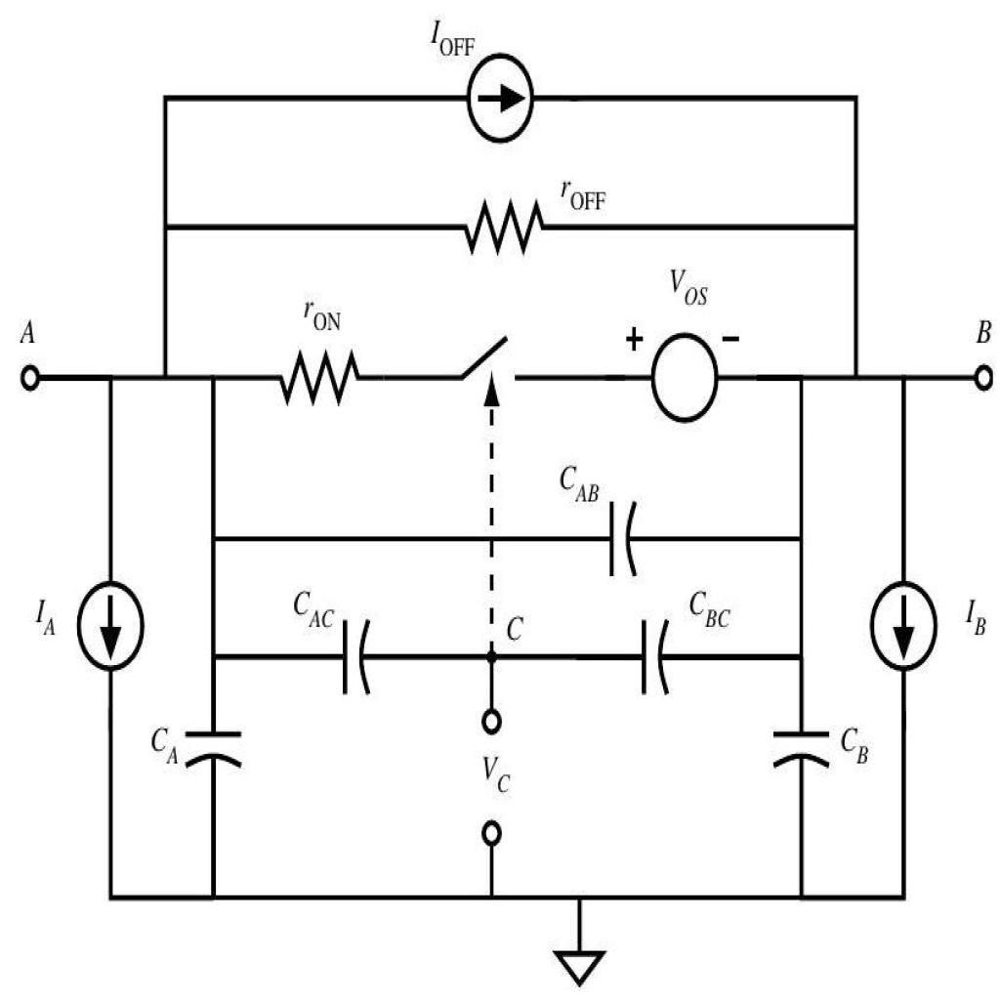

# Test AI — Circuito 03

## Obiettivo
Verificare se l'AI riesce a capire la topologia del circuito a partire dal JSON del passo 05 senza usare l'immagine.

## Immagine del circuito


## JSON usato
File: `1.json`

## Prompt usato
Ti fornisco il JSON topologico di un circuito estratto automaticamente da un diagramma elettrico.

Il JSON contiene:
- la lista dei componenti
- i terminali di ogni componente
- il grafo dei collegamenti tra terminali

Non ci sono net esplicite: i nodi elettrici sono rappresentati implicitamente dai collegamenti tra terminali.

Voglio che tu analizzi il circuito SOLO a partire da questo JSON.

Obiettivo:
verificare se il JSON è sufficiente per ricostruire la topologia del circuito e, se possibile, riconoscere il tipo di circuito.

Regole importanti:
- non usare l'immagine
- non inventare informazioni non presenti
- se qualcosa non è deducibile, scrivilo esplicitamente
- distingui tra deduzione certa, interpretazione probabile e informazione non determinabile
- non assumere automaticamente che più simboli GND siano lo stesso nodo, a meno che il JSON lo renda esplicito
- considera eventuali stati dei componenti, come switch open/closed, separatamente dalla sola connettività dei fili

FORMATO DI OUTPUT OBBLIGATORIO:
- produci SOLO il contenuto del report in Markdown
- racchiudi tutto il report dentro un unico blocco di codice markdown
- il blocco deve iniziare con ```markdown e finire con ```
- non aggiungere spiegazioni prima o dopo il blocco
- non usare canvas
- non creare una risposta discorsiva fuori dal blocco markdown
- il contenuto deve essere copiabile direttamente in un file .md

Usa obbligatoriamente questa struttura:

# Report di analisi topologica

## 1. Componenti presenti
Elenca i componenti in una tabella con:
- ID componente
- classe
- terminali

## 2. Nodi principali ricostruiti
Ricostruisci i nodi elettrici dal grafo dei collegamenti.
Usa nomi progressivi come N1, N2, N3.
Per ogni nodo indica i terminali appartenenti al nodo.

## 3. Terminali sullo stesso nodo
Spiega in modo discorsivo quali terminali sono sullo stesso nodo e cosa rappresentano.

## 4. Topologia generale del circuito
Descrivi i rami principali del circuito.
Quando utile, usa uno schema testuale semplificato.

## 5. Tipo di circuito riconoscibile
Indica se il circuito sembra riconoscibile.
Se sì, proponi una classificazione prudente.
Se no, spiega perché non è possibile identificarlo con certezza.

## 6. Ambiguità e limiti del JSON
Evidenzia:
- informazioni mancanti
- possibili ambiguità
- limiti del formato
- eventuali warning presenti nel JSON

## 7. Sufficienza del JSON
Spiega se il JSON è sufficiente per capire il circuito senza immagine.

## 8. Giudizio finale
Concludi con uno dei seguenti giudizi:
- Topologia chiara
- Topologia parzialmente chiara
- Topologia insufficiente

Motiva il giudizio in massimo 5 righe.


## Valutazione comparativa dei modelli
Data: 27/04/2026

| Modello | Input usato | Componenti | Nodi / topologia | Tipo circuito | Ambiguità | Assenza allucinazioni | Totale /10 | Giudizio finale |
|---|---|---:|---:|---:|---:|---:|---:|---|
| GPT-5.4 / modello forte | Solo JSON | 2 | 2 | 2 | 2 | 2 | 10 | Topologia chiara |
| GPT-5.3 Instant / modello veloce | Solo JSON | 2 | 2 | 2 | 2 | 2 | 10 | Topologia chiara |
| GPT-5.2 Instant / economico | Solo JSON | 2 | 2 | 2 | 2 | 2 | 10 | Topologia chiara |
| o3 / reasoning legacy | Solo JSON | 2 | 2 | 1 | 2 | 1 | 8 | Topologia chiara, interpretazione funzionale troppo specifica |

### Legenda

### Scala usata

| Valore | Significato |
|---:|---|
| 2 | Corretto o molto utile |
| 1 | Parziale, incompleto o ambiguo |
| 0 | Errato, insufficiente o non utile |
| N/D | Test non eseguito |

#### Componenti
| Punteggio | Criterio |
|---:|---|
| 2 | Elenca correttamente quasi tutti i componenti e le classi |
| 1 | Riconosce i componenti principali ma omette o confonde qualche elemento |
| 0 | Sbaglia componenti importanti o inventa componenti non presenti |

#### Nodi / topologia
| Punteggio | Criterio |
|---:|---|
| 2 | Ricostruisce correttamente i nodi principali e i collegamenti |
| 1 | Ricostruisce la maggior parte dei nodi ma perde qualche dettaglio |
| 0 | Sbaglia la struttura dei nodi o interpreta male i collegamenti |

#### Tipo di circuito
| Punteggio | Criterio |
|---:|---|
| 2 | Propone una classificazione plausibile e prudente |
| 1 | Capisce solo genericamente il circuito |
| 0 | Classifica il circuito in modo sbagliato o troppo inventato |

#### Ambiguità
| Punteggio | Criterio |
|---:|---|
| 2 | Segnala correttamente limiti importanti del JSON |
| 1 | Segnala solo alcune ambiguità |
| 0 | Non segnala limiti o dà tutto per certo |

#### Assenza allucinazioni
| Punteggio | Criterio |
|---:|---|
| 2 | Non inventa valori, connessioni o funzioni non presenti |
| 1 | Fa qualche ipotesi, ma la segnala come ipotesi |
| 0 | Inventa informazioni o dà per certe cose non presenti |

### Interpretazione del totale

| Totale /10 | Giudizio |
|---:|---|
| 8-10 | Topologia chiara |
| 5-7 | Topologia parzialmente chiara |
| 0-4 | Topologia insufficiente |

### Valutazione manuale GPT-5.4

Report molto buono. Il modello elenca correttamente i componenti presenti, ricostruisce 6 nodi principali e descrive con precisione i collegamenti tra sorgenti di corrente, condensatori polarizzati, resistori, generatore di tensione, terminali esterni, GND e switch aperto. La classificazione funzionale resta prudente: non forza un tipo di circuito specifico, ma lo descrive come rete multi-nodo con sorgenti, condensatori, resistori, terminali esterni e switch aperto.

| Criterio | Punteggio | Motivazione |
|---|---:|---|
| Componenti | 2 | Elenca correttamente i 17 componenti presenti: terminali esterni, tre sorgenti di corrente, cinque condensatori polarizzati, due resistori, switch, sorgente di tensione e GND. |
| Nodi / topologia | 2 | Ricostruisce correttamente i 6 nodi elettrici e distingue bene i nodi principali `N1`, `N2`, `N3`, il nodo secondario `N4` e i nodi locali `N5-N6` separati dallo switch aperto. |
| Tipo circuito | 2 | Propone una classificazione prudente come rete elettrica multi-nodo con sorgenti, condensatori polarizzati, resistori, terminali esterni e switch aperto, senza inventare una funzione circuitale specifica. |
| Ambiguità | 2 | Segnala correttamente valori mancanti, funzione dei terminali esterni non nota, significato delle sorgenti non determinabile, polarità dei condensatori non verificabile e ruolo dello switch dipendente dallo stato stimato. |
| Assenza allucinazioni | 2 | Non inventa valori, funzioni certe o collegamenti non presenti. Distingue chiaramente tra topologia deducibile e funzione circuitale non determinabile. |

**Totale:** 10/10  
**Giudizio:** Topologia chiara

### Valutazione manuale GPT-5.3 Instant

Report corretto e ben strutturato. Il modello elenca tutti i 17 componenti, ricostruisce correttamente i 6 nodi principali e descrive in modo coerente la rete multi-nodo con sorgenti di corrente, sorgente di tensione, condensatori polarizzati, resistori, terminali esterni, GND e switch aperto. La classificazione funzionale è prudente: parla di rete RC con sorgenti multiple e ramo commutato, senza inventare una funzione specifica non deducibile dal JSON.

| Criterio | Punteggio | Motivazione |
|---|---:|---|
| Componenti | 2 | Elenca correttamente tutti i componenti presenti: terminali, sorgenti di corrente, condensatori polarizzati, resistori, switch, GND e sorgente di tensione. |
| Nodi / topologia | 2 | Ricostruisce correttamente i 6 nodi principali e individua bene i rami tra `N1`, `N2`, `N3`, `N4`, più il ramo locale `N5-N6` interrotto dallo switch aperto. |
| Tipo circuito | 2 | Propone una classificazione prudente come rete RC con sorgenti multiple e ramo commutato. Non forza interpretazioni come filtro, alimentatore o temporizzatore. |
| Ambiguità | 2 | Segnala correttamente assenza di valori elettrici, assenza di net esplicite, stato open dello switch, limiti sul comportamento dinamico e funzione circuitale non determinabile. |
| Assenza allucinazioni | 2 | Non inventa valori, collegamenti o funzioni certe. Distingue correttamente tra topologia deducibile e funzione non determinabile. |

**Totale:** 10/10  
**Giudizio:** Topologia chiara


### Valutazione manuale GPT-5.2 Instant

Report corretto e sintetico. Il modello elenca correttamente tutti i 17 componenti principali, ricostruisce i 6 nodi elettrici e riconosce la struttura multi-nodo con sorgenti di corrente, sorgente di tensione, condensatori polarizzati, resistori, terminali esterni, GND e switch aperto. La classificazione funzionale è prudente: propone una rete analogica con sorgenti multiple e rete RC, ma specifica che non è possibile identificare con certezza una topologia standard dal solo JSON.

| Criterio | Punteggio | Motivazione |
|---|---:|---|
| Componenti | 2 | Elenca correttamente tutti i componenti: terminali, sorgenti di corrente, condensatori polarizzati, resistori, switch, GND e sorgente di tensione. |
| Nodi / topologia | 2 | Ricostruisce correttamente i 6 nodi principali e distingue il nodo GND, i nodi principali della rete e il ramo interrotto dallo switch aperto. |
| Tipo circuito | 2 | Propone una classificazione prudente come rete analogica multi-nodo con sorgenti multiple e rete RC, senza inventare una funzione specifica. |
| Ambiguità | 2 | Segnala correttamente valori mancanti, funzione del circuito non nota, terminali esterni non classificabili, regime AC/DC non deducibile e limiti del formato JSON. |
| Assenza allucinazioni | 2 | Non inventa valori, collegamenti o funzioni certe. Distingue correttamente tra topologia ricostruibile e funzione non determinabile. |

**Totale:** 10/10  
**Giudizio:** Topologia chiara

### Valutazione manuale o3

Report topologicamente corretto. Il modello elenca tutti i componenti, ricostruisce i 6 nodi principali e descrive bene la struttura generale della rete: sorgenti di corrente tra i nodi principali, condensatori polarizzati tra più coppie di nodi, resistori, sorgente di tensione e ramo interrotto dallo switch aperto. Tuttavia, rispetto ai modelli GPT-5.x, introduce alcune interpretazioni funzionali non pienamente deducibili dal solo JSON, come “bus positivo”, “feedback resistente”, “reti di bypass”, “voltage-sense” e possibili funzioni di start-up o calibrazione.

| Criterio | Punteggio | Motivazione |
|---|---:|---|
| Componenti | 2 | Elenca correttamente tutti i componenti presenti: terminali, sorgenti di corrente, condensatori polarizzati, resistori, switch, GND e sorgente di tensione. |
| Nodi / topologia | 2 | Ricostruisce correttamente i 6 nodi principali e distingue bene il nodo GND, i nodi principali della rete e il ramo `resistor22.1 → switch25.1 → voltage_source31.1`. |
| Tipo circuito | 1 | Propone un’interpretazione plausibile, ma troppo specifica rispetto al solo JSON: rete di test, generatore di correnti, filtraggio capacitivo, voltage-sense, start-up o calibrazione non sono deducibili con certezza. |
| Ambiguità | 2 | Segnala correttamente assenza di valori, assenza di net esplicite, mancanza di parametri di simulazione e impossibilità di dedurre completamente il funzionamento. |
| Assenza allucinazioni | 1 | Non inventa collegamenti, ma usa alcune etichette funzionali e interpretazioni circuitali più forti di quanto il JSON consenta. |

**Totale:** 8/10  
**Giudizio:** Topologia chiara, interpretazione funzionale troppo specifica
