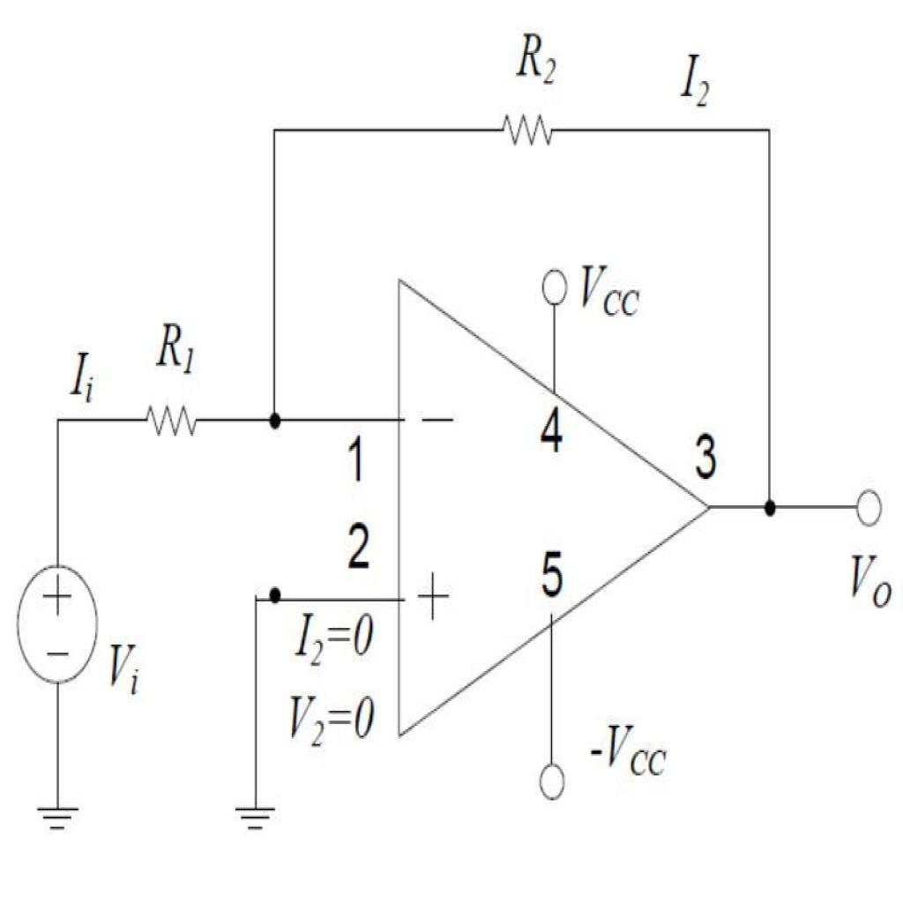

# Test AI — Circuito 04

## Obiettivo
Verificare se l'AI riesce a capire la topologia del circuito a partire dal JSON del passo 05 senza usare l'immagine.

## Immagine del circuito


## JSON usato
File: `6.json`

## Prompt usato
Ti fornisco il JSON topologico di un circuito estratto automaticamente da un diagramma elettrico.

Il JSON contiene:
- la lista dei componenti
- i terminali di ogni componente
- il grafo dei collegamenti tra terminali

Non ci sono net esplicite: i nodi elettrici sono rappresentati implicitamente dai collegamenti tra terminali.

Voglio che tu analizzi il circuito SOLO a partire da questo JSON.

Obiettivo:
verificare se il JSON è sufficiente per ricostruire la topologia del circuito e, se possibile, riconoscere il tipo di circuito.

Regole importanti:
- non usare l'immagine
- non inventare informazioni non presenti
- se qualcosa non è deducibile, scrivilo esplicitamente
- distingui tra deduzione certa, interpretazione probabile e informazione non determinabile
- non assumere automaticamente che più simboli GND siano lo stesso nodo, a meno che il JSON lo renda esplicito
- considera eventuali stati dei componenti, come switch open/closed, separatamente dalla sola connettività dei fili

FORMATO DI OUTPUT OBBLIGATORIO:
- produci SOLO il contenuto del report in Markdown
- racchiudi tutto il report dentro un unico blocco di codice markdown
- il blocco deve iniziare con ```markdown e finire con ```
- non aggiungere spiegazioni prima o dopo il blocco
- non usare canvas
- non creare una risposta discorsiva fuori dal blocco markdown
- il contenuto deve essere copiabile direttamente in un file .md

Usa obbligatoriamente questa struttura:

# Report di analisi topologica

## 1. Componenti presenti
Elenca i componenti in una tabella con:
- ID componente
- classe
- terminali

## 2. Nodi principali ricostruiti
Ricostruisci i nodi elettrici dal grafo dei collegamenti.
Usa nomi progressivi come N1, N2, N3.
Per ogni nodo indica i terminali appartenenti al nodo.

## 3. Terminali sullo stesso nodo
Spiega in modo discorsivo quali terminali sono sullo stesso nodo e cosa rappresentano.

## 4. Topologia generale del circuito
Descrivi i rami principali del circuito.
Quando utile, usa uno schema testuale semplificato.

## 5. Tipo di circuito riconoscibile
Indica se il circuito sembra riconoscibile.
Se sì, proponi una classificazione prudente.
Se no, spiega perché non è possibile identificarlo con certezza.

## 6. Ambiguità e limiti del JSON
Evidenzia:
- informazioni mancanti
- possibili ambiguità
- limiti del formato
- eventuali warning presenti nel JSON

## 7. Sufficienza del JSON
Spiega se il JSON è sufficiente per capire il circuito senza immagine.

## 8. Giudizio finale
Concludi con uno dei seguenti giudizi:
- Topologia chiara
- Topologia parzialmente chiara
- Topologia insufficiente

Motiva il giudizio in massimo 5 righe.

## Valutazione comparativa dei modelli
Data: 27/04/2026

| Modello | Input usato | Componenti | Nodi / topologia | Tipo circuito | Ambiguità | Assenza allucinazioni | Totale /10 | Giudizio finale |
|---|---|---:|---:|---:|---:|---:|---:|---|
| GPT-5.4 / modello forte | Solo JSON | 2 | 2 | 2 | 2 | 2 | 10 | Topologia chiara |
| GPT-5.3 Instant / modello veloce | Solo JSON | 2 | 2 | 2 | 2 | 2 | 10 | Topologia chiara |
| GPT-5.2 Instant / economico | Solo JSON | 2 | 2 | 2 | 2 | 2 | 10 | Topologia chiara |
| o3 / reasoning legacy | Solo JSON | 2 | 2 | 2 | 2 | 1 | 9 | Topologia chiara, interpretazione leggermente troppo assertiva |

### Legenda

### Scala usata

| Valore | Significato |
|---:|---|
| 2 | Corretto o molto utile |
| 1 | Parziale, incompleto o ambiguo |
| 0 | Errato, insufficiente o non utile |
| N/D | Test non eseguito |

#### Componenti
| Punteggio | Criterio |
|---:|---|
| 2 | Elenca correttamente quasi tutti i componenti e le classi |
| 1 | Riconosce i componenti principali ma omette o confonde qualche elemento |
| 0 | Sbaglia componenti importanti o inventa componenti non presenti |

#### Nodi / topologia
| Punteggio | Criterio |
|---:|---|
| 2 | Ricostruisce correttamente i nodi principali e i collegamenti |
| 1 | Ricostruisce la maggior parte dei nodi ma perde qualche dettaglio |
| 0 | Sbaglia la struttura dei nodi o interpreta male i collegamenti |

#### Tipo di circuito
| Punteggio | Criterio |
|---:|---|
| 2 | Propone una classificazione plausibile e prudente |
| 1 | Capisce solo genericamente il circuito |
| 0 | Classifica il circuito in modo sbagliato o troppo inventato |

#### Ambiguità
| Punteggio | Criterio |
|---:|---|
| 2 | Segnala correttamente limiti importanti del JSON |
| 1 | Segnala solo alcune ambiguità |
| 0 | Non segnala limiti o dà tutto per certo |

#### Assenza allucinazioni
| Punteggio | Criterio |
|---:|---|
| 2 | Non inventa valori, connessioni o funzioni non presenti |
| 1 | Fa qualche ipotesi, ma la segnala come ipotesi |
| 0 | Inventa informazioni o dà per certe cose non presenti |

### Interpretazione del totale

| Totale /10 | Giudizio |
|---:|---|
| 8-10 | Topologia chiara |
| 5-7 | Topologia parzialmente chiara |
| 0-4 | Topologia insufficiente |

### Valutazione manuale GPT-5.4

Report molto buono. Il modello ricostruisce correttamente la topologia del circuito: sorgente di tensione collegata a massa, resistore di ingresso, nodo comune tra ingresso dell’operazionale e resistore di retroazione, uscita dell’operazionale collegata al terminale esterno e ai terminali di retroazione, secondo ingresso collegato a massa e terminali ausiliari dell’opamp collegati a terminali esterni. La classificazione come possibile amplificatore invertente è corretta ma prudente, perché il JSON non specifica esplicitamente la polarità degli ingressi `in1` e `in2`.

| Criterio | Punteggio | Motivazione |
|---|---:|---|
| Componenti | 2 | Elenca correttamente i 9 componenti presenti: sorgente di tensione, due GND, due resistori, operazionale e tre terminali esterni. |
| Nodi / topologia | 2 | Ricostruisce correttamente i nodi principali: sorgente verso R1, nodo di ingresso/retroazione, nodo di uscita, ingresso a massa e terminali ausiliari dell’opamp. |
| Tipo circuito | 2 | Propone una classificazione prudente come circuito con operazionale e retroazione resistiva, compatibile con un amplificatore invertente ma non certo dal solo JSON. |
| Ambiguità | 2 | Segnala correttamente l’ambiguità degli ingressi `in1/in2`, la non equivalenza esplicita dei due GND, il ruolo non definito di `aux1/aux2` e l’assenza di valori elettrici. |
| Assenza allucinazioni | 2 | Non inventa valori, guadagni o funzioni certe. Distingue bene tra topologia deducibile e interpretazione funzionale probabile. |

**Totale:** 10/10  
**Giudizio:** Topologia chiara

### Valutazione manuale GPT-5.3 Instant

Report corretto e ben strutturato. Il modello ricostruisce correttamente la topologia principale del circuito: sorgente di tensione, resistore di ingresso, nodo comune tra `resistor22.1_t2`, `resistor22.2_t1` e `operational_amplifier19.1_in1`, uscita dell’operazionale collegata al resistore di retroazione e al terminale esterno, secondo ingresso collegato a un simbolo GND e terminali ausiliari collegati a terminali esterni. La classificazione come possibile amplificatore invertente è prudente e corretta, perché il JSON non specifica esplicitamente quale ingresso dell’opamp sia invertente o non invertente.

| Criterio | Punteggio | Motivazione |
|---|---:|---|
| Componenti | 2 | Elenca correttamente i 9 componenti presenti: sorgente di tensione, due GND, due resistori, operazionale e tre terminali esterni. |
| Nodi / topologia | 2 | Ricostruisce correttamente i 7 nodi principali: sorgente negativa a GND, sorgente positiva verso R1, nodo ingresso/feedback, ingresso opamp a GND, uscita, e due nodi ausiliari dell’opamp. |
| Tipo circuito | 2 | Propone una classificazione prudente come circuito con op-amp e rete resistiva di ingresso/retroazione, compatibile con un amplificatore invertente ma non certo dal solo JSON. |
| Ambiguità | 2 | Segnala correttamente l’ambiguità `in1/in2`, la mancata unificazione esplicita dei GND, il ruolo non definito di `aux1/aux2`, l’assenza di valori e la mancanza di net label. |
| Assenza allucinazioni | 2 | Non inventa valori, guadagni o funzioni certe. Formula l’ipotesi di amplificatore invertente come probabile e non come deduzione certa. |

**Totale:** 10/10  
**Giudizio:** Topologia chiara


### Valutazione manuale GPT-5.2 Instant

Report corretto e sintetico. Il modello ricostruisce correttamente la struttura del circuito: sorgente di tensione, resistore di ingresso, nodo comune tra `resistor22.1_t2`, `resistor22.2_t1` e `operational_amplifier19.1_in1`, uscita dell’operazionale collegata al resistore di retroazione e al terminale esterno, ingresso `in2` collegato a GND e terminali ausiliari collegati a terminali esterni. La classificazione come probabile amplificatore invertente è corretta, ma viene formulata con prudenza.

| Criterio | Punteggio | Motivazione |
|---|---:|---|
| Componenti | 2 | Elenca correttamente i 9 componenti presenti: sorgente di tensione, due GND, due resistori, operazionale e tre terminali esterni. |
| Nodi / topologia | 2 | Ricostruisce correttamente i 7 nodi principali e identifica bene il nodo di ingresso/retroazione, il nodo di uscita e i nodi ausiliari dell’opamp. |
| Tipo circuito | 2 | Riconosce correttamente una configurazione compatibile con amplificatore invertente con retroazione resistiva, ma specifica che non è certa senza semantica `+/-` sugli ingressi. |
| Ambiguità | 2 | Segnala correttamente l’ambiguità degli ingressi `in1/in2`, la non equivalenza esplicita dei due GND, l’assenza di valori e il ruolo non definito di `aux1/aux2`. |
| Assenza allucinazioni | 2 | Non inventa valori, guadagni o collegamenti. Distingue bene tra topologia certa e funzione probabile. |

**Totale:** 10/10  
**Giudizio:** Topologia chiara


### Valutazione manuale o3

Report topologicamente corretto. Il modello ricostruisce bene la struttura del circuito: sorgente di tensione, due GND, due resistori, operazionale e tre terminali esterni. Individua correttamente il nodo di somma/retroazione tra `resistor22.1`, `resistor22.2` e `operational_amplifier19.1_in1`, il nodo di uscita dell’operazionale e i terminali ausiliari collegati ai terminali esterni. La classificazione come amplificatore invertente è plausibile, ma il report è leggermente più assertivo del necessario, perché il JSON non specifica esplicitamente quale ingresso dell’opamp sia invertente o non invertente.

| Criterio | Punteggio | Motivazione |
|---|---:|---|
| Componenti | 2 | Elenca correttamente i 9 componenti presenti: sorgente di tensione, due GND, due resistori, operazionale e tre terminali esterni. |
| Nodi / topologia | 2 | Ricostruisce correttamente i 7 nodi principali e identifica bene il nodo di ingresso/retroazione, il nodo di uscita e i nodi ausiliari dell’operazionale. |
| Tipo circuito | 2 | Riconosce correttamente una configurazione con operazionale e retroazione resistiva, compatibile con un amplificatore invertente. |
| Ambiguità | 2 | Segnala correttamente le masse multiple, l’assenza di valori, il ruolo non definito delle alimentazioni e l’ambiguità sui pin `in1/in2`. |
| Assenza allucinazioni | 1 | Non inventa collegamenti, ma usa in alcuni punti una formulazione troppo forte, chiamando `in1` come ingresso invertente e citando il guadagno `-R2/R1`, che dipende da un’interpretazione non codificata esplicitamente nel JSON. |

**Totale:** 9/10  
**Giudizio:** Topologia chiara, interpretazione leggermente troppo assertiva
