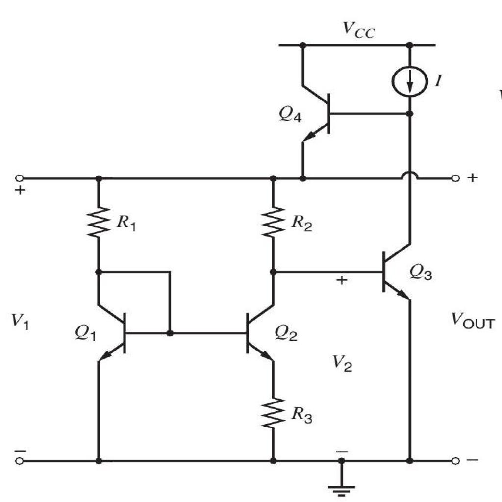

# Test AI — Circuito 05

## Obiettivo
Verificare se l'AI riesce a capire la topologia del circuito a partire dal JSON del passo 05 senza usare l'immagine.

## Immagine del circuito


## JSON usato
File: `5.json`

## Prompt usato
Ti fornisco il JSON topologico di un circuito estratto automaticamente da un diagramma elettrico.

Il JSON contiene:
- la lista dei componenti
- i terminali di ogni componente
- il grafo dei collegamenti tra terminali

Non ci sono net esplicite: i nodi elettrici sono rappresentati implicitamente dai collegamenti tra terminali.

Voglio che tu analizzi il circuito SOLO a partire da questo JSON.

Obiettivo:
verificare se il JSON è sufficiente per ricostruire la topologia del circuito e, se possibile, riconoscere il tipo di circuito.

Regole importanti:
- non usare l'immagine
- non inventare informazioni non presenti
- se qualcosa non è deducibile, scrivilo esplicitamente
- distingui tra deduzione certa, interpretazione probabile e informazione non determinabile
- non assumere automaticamente che più simboli GND siano lo stesso nodo, a meno che il JSON lo renda esplicito
- considera eventuali stati dei componenti, come switch open/closed, separatamente dalla sola connettività dei fili

FORMATO DI OUTPUT OBBLIGATORIO:
- produci SOLO il contenuto del report in Markdown
- racchiudi tutto il report dentro un unico blocco di codice markdown
- il blocco deve iniziare con ```markdown e finire con ```
- non aggiungere spiegazioni prima o dopo il blocco
- non usare canvas
- non creare una risposta discorsiva fuori dal blocco markdown
- il contenuto deve essere copiabile direttamente in un file .md

Usa obbligatoriamente questa struttura:

# Report di analisi topologica

## 1. Componenti presenti
Elenca i componenti in una tabella con:
- ID componente
- classe
- terminali

## 2. Nodi principali ricostruiti
Ricostruisci i nodi elettrici dal grafo dei collegamenti.
Usa nomi progressivi come N1, N2, N3.
Per ogni nodo indica i terminali appartenenti al nodo.

## 3. Terminali sullo stesso nodo
Spiega in modo discorsivo quali terminali sono sullo stesso nodo e cosa rappresentano.

## 4. Topologia generale del circuito
Descrivi i rami principali del circuito.
Quando utile, usa uno schema testuale semplificato.

## 5. Tipo di circuito riconoscibile
Indica se il circuito sembra riconoscibile.
Se sì, proponi una classificazione prudente.
Se no, spiega perché non è possibile identificarlo con certezza.

## 6. Ambiguità e limiti del JSON
Evidenzia:
- informazioni mancanti
- possibili ambiguità
- limiti del formato
- eventuali warning presenti nel JSON

## 7. Sufficienza del JSON
Spiega se il JSON è sufficiente per capire il circuito senza immagine.

## 8. Giudizio finale
Concludi con uno dei seguenti giudizi:
- Topologia chiara
- Topologia parzialmente chiara
- Topologia insufficiente

Motiva il giudizio in massimo 5 righe.


## Valutazione comparativa dei modelli
Data: 27/04/2026

| Modello | Input usato | Componenti | Nodi / topologia | Tipo circuito | Ambiguità | Assenza allucinazioni | Totale /10 | Giudizio finale |
|---|---|---:|---:|---:|---:|---:|---:|---|
| GPT-5.4 / modello forte | Solo JSON | 2 | 1 | 2 | 2 | 1 | 8 | Topologia parzialmente chiara |
| GPT-5.3 Instant / modello veloce | Solo JSON | 2 | 2 | 2 | 2 | 2 | 10 | Topologia chiara |
| GPT-5.2 Instant / economico | Solo JSON | 2 | 2 | 2 | 2 | 2 | 10 | Topologia chiara |
| o3 / reasoning legacy | Solo JSON | 2 | 2 | 1 | 2 | 1 | 8 | Topologia chiara, interpretazione funzionale troppo specifica |

### Legenda

### Scala usata

| Valore | Significato |
|---:|---|
| 2 | Corretto o molto utile |
| 1 | Parziale, incompleto o ambiguo |
| 0 | Errato, insufficiente o non utile |
| N/D | Test non eseguito |

#### Componenti
| Punteggio | Criterio |
|---:|---|
| 2 | Elenca correttamente quasi tutti i componenti e le classi |
| 1 | Riconosce i componenti principali ma omette o confonde qualche elemento |
| 0 | Sbaglia componenti importanti o inventa componenti non presenti |

#### Nodi / topologia
| Punteggio | Criterio |
|---:|---|
| 2 | Ricostruisce correttamente i nodi principali e i collegamenti |
| 1 | Ricostruisce la maggior parte dei nodi ma perde qualche dettaglio |
| 0 | Sbaglia la struttura dei nodi o interpreta male i collegamenti |

#### Tipo di circuito
| Punteggio | Criterio |
|---:|---|
| 2 | Propone una classificazione plausibile e prudente |
| 1 | Capisce solo genericamente il circuito |
| 0 | Classifica il circuito in modo sbagliato o troppo inventato |

#### Ambiguità
| Punteggio | Criterio |
|---:|---|
| 2 | Segnala correttamente limiti importanti del JSON |
| 1 | Segnala solo alcune ambiguità |
| 0 | Non segnala limiti o dà tutto per certo |

#### Assenza allucinazioni
| Punteggio | Criterio |
|---:|---|
| 2 | Non inventa valori, connessioni o funzioni non presenti |
| 1 | Fa qualche ipotesi, ma la segnala come ipotesi |
| 0 | Inventa informazioni o dà per certe cose non presenti |

### Interpretazione del totale

| Totale /10 | Giudizio |
|---:|---|
| 8-10 | Topologia chiara |
| 5-7 | Topologia parzialmente chiara |
| 0-4 | Topologia insufficiente |

### Valutazione manuale GPT-5.4

Report complessivamente buono, ma non perfetto. Il modello elenca correttamente i componenti principali del circuito: quattro transistor NPN, tre resistori, una sorgente di corrente, un GND e quattro terminali esterni. Riconosce in modo prudente che il circuito è una rete analogica a BJT con sorgente di corrente e resistori di polarizzazione. Tuttavia contiene una contraddizione interna nella ricostruzione dei nodi: inizialmente mette correttamente sullo stesso nodo `npn_transistor18.1_B`, `npn_transistor18.1_C`, `npn_transistor18.2_B` e `resistor22.1_t2`, ma nella tabella riassuntiva separa base e collettore di `npn_transistor18.1`, rompendo la lettura del transistor diode-connected.

| Criterio | Punteggio | Motivazione |
|---|---:|---|
| Componenti | 2 | Elenca correttamente i 13 componenti: quattro terminali, tre resistori, quattro transistor NPN, un GND e una sorgente di corrente. |
| Nodi / topologia | 1 | Ricostruisce bene molti nodi principali, ma introduce una contraddizione importante separando in una parte del report base e collettore di `npn_transistor18.1`, che invece risultano sullo stesso nodo insieme alla base di `npn_transistor18.2`. |
| Tipo circuito | 2 | Propone una classificazione prudente come rete analogica a BJT NPN con sorgente di corrente, resistori di polarizzazione e possibile struttura di bias/current-source/current-mirror-like network. |
| Ambiguità | 2 | Segnala correttamente assenza di valori, assenza di net esplicite, terminali esterni non etichettati, informazioni geometriche limitate e classificazione funzionale non univoca. |
| Assenza allucinazioni | 1 | Non inventa valori o funzioni certe, ma la contraddizione sui nodi di `npn_transistor18.1` porta a una descrizione topologica non completamente coerente. |

**Totale:** 8/10  
**Giudizio:** Topologia parzialmente chiara

### Valutazione manuale GPT-5.3 Instant

Report molto buono. Il modello elenca correttamente i 13 componenti presenti: quattro terminali esterni, tre resistori, quattro transistor NPN, un GND e una sorgente di corrente. Ricostruisce in modo coerente i nodi principali e, soprattutto, identifica correttamente il nodo in cui `npn_transistor18.1_B`, `npn_transistor18.1_C`, `npn_transistor18.2_B` e `resistor22.1_t2` sono sullo stesso nodo. Questo permette di riconoscere correttamente `npn_transistor18.1` come transistor con base e collettore cortocircuitati. La classificazione funzionale è prudente: rete analogica a transistor NPN con polarizzazione, sorgente di corrente e possibile struttura di bias/current-mirror-like, senza affermare una funzione certa non deducibile dal JSON.

| Criterio | Punteggio | Motivazione |
|---|---:|---|
| Componenti | 2 | Elenca correttamente i 13 componenti: quattro terminali, tre resistori, quattro transistor NPN, un GND e una sorgente di corrente. |
| Nodi / topologia | 2 | Ricostruisce correttamente i nodi principali e mantiene coerente il nodo `N4`, dove base e collettore di `npn_transistor18.1` sono collegati insieme alla base di `npn_transistor18.2` e a `resistor22.1_t2`. |
| Tipo circuito | 2 | Propone una classificazione prudente come rete analogica a transistor NPN con sorgente di corrente, transistor diode-connected e possibili funzioni di bias/specchio di corrente/stadio analogico. |
| Ambiguità | 2 | Segnala correttamente assenza di valori, mancanza di alimentazioni esplicite, terminali esterni non etichettati, assenza di modelli dei transistor e classificazione funzionale non certa. |
| Assenza allucinazioni | 2 | Non inventa valori, alimentazioni o funzioni certe. Distingue bene tra topologia ricostruibile e funzione circuitale solo probabile. |

**Totale:** 10/10  
**Giudizio:** Topologia chiara


### Valutazione manuale GPT-5.2 Instant

Report molto buono e coerente. Il modello elenca correttamente i 13 componenti del circuito: quattro terminali esterni, tre resistori, quattro transistor NPN, una sorgente di corrente e un GND. Ricostruisce correttamente i nodi principali e identifica in modo esplicito il nodo `N4`, dove `npn_transistor18.1_B`, `npn_transistor18.1_C`, `npn_transistor18.2_B` e `resistor22.1_t2` risultano connessi insieme. Questo permette di riconoscere correttamente `npn_transistor18.1` come transistor con base e collettore cortocircuitati. La classificazione funzionale resta prudente e non inventa una funzione certa del circuito.

| Criterio | Punteggio | Motivazione |
|---|---:|---|
| Componenti | 2 | Elenca correttamente i 13 componenti: quattro terminali, tre resistori, quattro transistor NPN, una sorgente di corrente e un GND. |
| Nodi / topologia | 2 | Ricostruisce correttamente i nodi principali, in particolare il nodo `N4` con base e collettore di `npn_transistor18.1` cortocircuitati insieme alla base di `npn_transistor18.2` e a `resistor22.1_t2`. |
| Tipo circuito | 2 | Propone una classificazione prudente come rete analogica a transistor NPN, possibile bias network, specchio di corrente esteso o stadio analogico, senza affermare una funzione certa. |
| Ambiguità | 2 | Segnala correttamente l’assenza di valori, parametri dei transistor, verso operativo della sorgente di corrente, alimentazioni esplicite e significato dei terminali esterni. |
| Assenza allucinazioni | 2 | Non inventa valori, alimentazioni o funzioni certe. Distingue bene tra topologia certa e interpretazione funzionale probabile. |

**Totale:** 10/10  
**Giudizio:** Topologia chiara


### Valutazione manuale o3

Report topologicamente corretto. Il modello elenca correttamente i 13 componenti, ricostruisce i nodi principali e identifica correttamente il nodo `N4`, dove `npn_transistor18.1_B`, `npn_transistor18.1_C`, `npn_transistor18.2_B` e `resistor22.1_t2` appartengono allo stesso nodo. Questo permette di riconoscere correttamente `npn_transistor18.1` come transistor con base e collettore cortocircuitati. Tuttavia, rispetto a GPT-5.3 e GPT-5.2, o3 introduce una lettura funzionale più spinta, parlando di carico attivo, diodo-specchio, sorgente di corrente di coda e possibile mezzo blocco di amplificatore operazionale. Queste interpretazioni sono plausibili, ma non deducibili con certezza dal solo JSON.

| Criterio | Punteggio | Motivazione |
|---|---:|---|
| Componenti | 2 | Elenca correttamente i 13 componenti: quattro terminali, tre resistori, quattro transistor NPN, una sorgente di corrente e un GND. |
| Nodi / topologia | 2 | Ricostruisce correttamente i nodi principali e mantiene coerente il nodo `N4` con base e collettore di `npn_transistor18.1` cortocircuitati insieme alla base di `npn_transistor18.2` e a `resistor22.1_t2`. |
| Tipo circuito | 1 | Propone una classificazione plausibile, ma troppo specifica rispetto al solo JSON: carico attivo, diodo-specchio, mezzo blocco di opamp o generatore di corrente con mirror attivi non sono identificabili con certezza. |
| Ambiguità | 2 | Segnala correttamente assenza di valori, mancanza di etichette sui terminali, assenza di alimentazioni esplicite e impossibilità di certificare il comportamento del circuito. |
| Assenza allucinazioni | 1 | Non inventa collegamenti, ma usa alcune etichette funzionali più forti di quanto il JSON permetta di dimostrare. |

**Totale:** 8/10  
**Giudizio:** Topologia chiara, interpretazione funzionale troppo specifica
