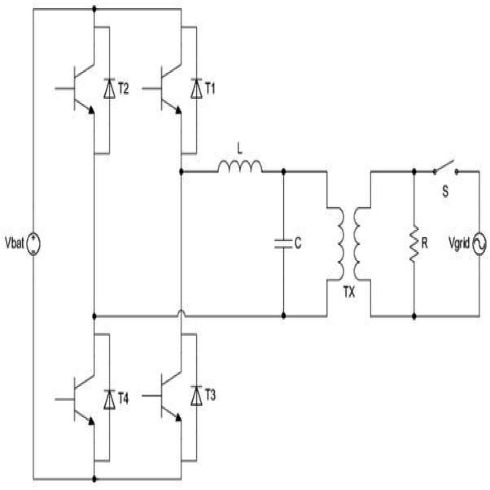

# Test AI — Circuito 06

## Obiettivo
Verificare se l'AI riesce a capire la topologia del circuito a partire dal JSON del passo 05 senza usare l'immagine.

## Immagine del circuito


## JSON usato
File: `5.json`

## Prompt usato
Ti fornisco il JSON topologico di un circuito estratto automaticamente da un diagramma elettrico.

Il JSON contiene:
- la lista dei componenti
- i terminali di ogni componente
- il grafo dei collegamenti tra terminali

Non ci sono net esplicite: i nodi elettrici sono rappresentati implicitamente dai collegamenti tra terminali.

Voglio che tu analizzi il circuito SOLO a partire da questo JSON.

Obiettivo:
verificare se il JSON è sufficiente per ricostruire la topologia del circuito e, se possibile, riconoscere il tipo di circuito.

Regole importanti:
- non usare l'immagine
- non inventare informazioni non presenti
- se qualcosa non è deducibile, scrivilo esplicitamente
- distingui tra deduzione certa, interpretazione probabile e informazione non determinabile
- non assumere automaticamente che più simboli GND siano lo stesso nodo, a meno che il JSON lo renda esplicito
- considera eventuali stati dei componenti, come switch open/closed, separatamente dalla sola connettività dei fili

FORMATO DI OUTPUT OBBLIGATORIO:
- produci SOLO il contenuto del report in Markdown
- racchiudi tutto il report dentro un unico blocco di codice markdown
- il blocco deve iniziare con ```markdown e finire con ```
- non aggiungere spiegazioni prima o dopo il blocco
- non usare canvas
- non creare una risposta discorsiva fuori dal blocco markdown
- il contenuto deve essere copiabile direttamente in un file .md

Usa obbligatoriamente questa struttura:

# Report di analisi topologica

## 1. Componenti presenti
Elenca i componenti in una tabella con:
- ID componente
- classe
- terminali

## 2. Nodi principali ricostruiti
Ricostruisci i nodi elettrici dal grafo dei collegamenti.
Usa nomi progressivi come N1, N2, N3.
Per ogni nodo indica i terminali appartenenti al nodo.

## 3. Terminali sullo stesso nodo
Spiega in modo discorsivo quali terminali sono sullo stesso nodo e cosa rappresentano.

## 4. Topologia generale del circuito
Descrivi i rami principali del circuito.
Quando utile, usa uno schema testuale semplificato.

## 5. Tipo di circuito riconoscibile
Indica se il circuito sembra riconoscibile.
Se sì, proponi una classificazione prudente.
Se no, spiega perché non è possibile identificarlo con certezza.

## 6. Ambiguità e limiti del JSON
Evidenzia:
- informazioni mancanti
- possibili ambiguità
- limiti del formato
- eventuali warning presenti nel JSON

## 7. Sufficienza del JSON
Spiega se il JSON è sufficiente per capire il circuito senza immagine.

## 8. Giudizio finale
Concludi con uno dei seguenti giudizi:
- Topologia chiara
- Topologia parzialmente chiara
- Topologia insufficiente

Motiva il giudizio in massimo 5 righe.


## Valutazione comparativa dei modelli
Data: 27/04/2026

| Modello | Input usato | Componenti | Nodi / topologia | Tipo circuito | Ambiguità | Assenza allucinazioni | Totale /10 | Giudizio finale |
|---|---|---:|---:|---:|---:|---:|---:|---|
| GPT-5.4 / modello forte | Solo JSON | 2 | 2 | 2 | 2 | 2 | 10 | Topologia chiara |
| GPT-5.3 Instant / modello veloce | Solo JSON | 2 | 2 | 2 | 2 | 2 | 10 | Topologia chiara |
| GPT-5.2 Instant / economico | Solo JSON | 2 | 2 | 2 | 2 | 2 | 10 | Topologia chiara |
| o3 / reasoning legacy | Solo JSON | 2 | 2 | 2 | 2 | 1 | 9 | Topologia chiara, interpretazione leggermente troppo specifica |

### Legenda

### Scala usata

| Valore | Significato |
|---:|---|
| 2 | Corretto o molto utile |
| 1 | Parziale, incompleto o ambiguo |
| 0 | Errato, insufficiente o non utile |
| N/D | Test non eseguito |

#### Componenti
| Punteggio | Criterio |
|---:|---|
| 2 | Elenca correttamente quasi tutti i componenti e le classi |
| 1 | Riconosce i componenti principali ma omette o confonde qualche elemento |
| 0 | Sbaglia componenti importanti o inventa componenti non presenti |

#### Nodi / topologia
| Punteggio | Criterio |
|---:|---|
| 2 | Ricostruisce correttamente i nodi principali e i collegamenti |
| 1 | Ricostruisce la maggior parte dei nodi ma perde qualche dettaglio |
| 0 | Sbaglia la struttura dei nodi o interpreta male i collegamenti |

#### Tipo di circuito
| Punteggio | Criterio |
|---:|---|
| 2 | Propone una classificazione plausibile e prudente |
| 1 | Capisce solo genericamente il circuito |
| 0 | Classifica il circuito in modo sbagliato o troppo inventato |

#### Ambiguità
| Punteggio | Criterio |
|---:|---|
| 2 | Segnala correttamente limiti importanti del JSON |
| 1 | Segnala solo alcune ambiguità |
| 0 | Non segnala limiti o dà tutto per certo |

#### Assenza allucinazioni
| Punteggio | Criterio |
|---:|---|
| 2 | Non inventa valori, connessioni o funzioni non presenti |
| 1 | Fa qualche ipotesi, ma la segnala come ipotesi |
| 0 | Inventa informazioni o dà per certe cose non presenti |

### Interpretazione del totale

| Totale /10 | Giudizio |
|---:|---|
| 8-10 | Topologia chiara |
| 5-7 | Topologia parzialmente chiara |
| 0-4 | Topologia insufficiente |

### Valutazione manuale GPT-5.4

Report molto buono. Il modello elenca correttamente i componenti principali del circuito: sorgente di tensione, quattro transistor NPN, quattro diodi, induttore, condensatore, trasformatore, resistore, switch e signal source. Ricostruisce 10 nodi principali coerenti con il diagramma e distingue correttamente il blocco di potenza/commutazione dal lato associato al trasformatore, allo switch, al resistore e alla sorgente di segnale. La classificazione funzionale è prudente: propone una struttura compatibile con convertitore/inverter/driver risonante, ma non forza una topologia specifica.

| Criterio | Punteggio | Motivazione |
|---|---:|---|
| Componenti | 2 | Elenca correttamente i componenti presenti: 4 NPN, 4 diodi, sorgente di tensione, induttore, condensatore, trasformatore, resistore, switch e signal source. |
| Nodi / topologia | 2 | Ricostruisce correttamente i 10 nodi principali. I nodi di alimentazione, i nodi della rete LC, i nodi del trasformatore e i nodi di base dei transistor risultano coerenti con l’immagine. |
| Tipo circuito | 2 | Propone una classificazione prudente come circuito di commutazione/conversione con trasformatore e rete LC, compatibile con inverter, driver o oscillatore risonante, senza affermare una funzione certa. |
| Ambiguità | 2 | Segnala correttamente assenza di valori, assenza di dot convention del trasformatore, mancanza di net label, ruolo non certo dei diodi e impossibilità di distinguere con certezza tra ponte H, push-pull, Royer o convertitore specifico. |
| Assenza allucinazioni | 2 | Non inventa valori, rapporti di trasformazione o funzionamento certo. Le interpretazioni funzionali sono formulate come probabili e non come deduzioni assolute. |

**Totale:** 10/10  
**Giudizio:** Topologia chiara


### Valutazione manuale GPT-5.3 Instant

Report molto buono. Il modello elenca correttamente i componenti principali: sorgente di tensione, quattro transistor NPN, quattro diodi, induttore, condensatore, trasformatore, resistore, switch e signal source. Ricostruisce correttamente i 10 nodi principali e distingue bene la sezione di potenza dalla sezione di controllo/ingresso. La classificazione funzionale è prudente: parla di circuito switching, oscillatore di potenza, convertitore DC-DC o driver per trasformatore, ma senza scegliere una funzione certa.

| Criterio | Punteggio | Motivazione |
|---|---:|---|
| Componenti | 2 | Elenca correttamente tutti i componenti presenti: 4 NPN, 4 diodi, sorgente di tensione, induttore, condensatore, trasformatore, resistore, switch e signal source. |
| Nodi / topologia | 2 | Ricostruisce correttamente i 10 nodi principali. I rail positivo/negativo, i nodi della rete LC, i nodi del trasformatore e i nodi delle basi transistor risultano coerenti con l’immagine. |
| Tipo circuito | 2 | Propone una classificazione prudente come circuito switching/oscillatore/convertitore/driver con trasformatore, senza affermare una topologia specifica non dimostrabile. |
| Ambiguità | 2 | Segnala correttamente assenza di valori, polarità funzionale del trasformatore, verso delle correnti, ruolo dei diodi e funzionamento dinamico. |
| Assenza allucinazioni | 2 | Non inventa valori, rapporti di trasformazione o funzionamento certo. Le interpretazioni sono presentate come probabili e non come conclusioni assolute. |

**Totale:** 10/10  
**Giudizio:** Topologia chiara

### Valutazione manuale GPT-5.2 Instant

Report molto buono e coerente. Il modello elenca correttamente i componenti principali del circuito: sorgente di tensione, quattro transistor NPN, quattro diodi, induttore, condensatore, trasformatore, resistore, switch e signal source. Ricostruisce correttamente i 10 nodi principali e distingue bene la sezione di potenza dalla rete di pilotaggio/ingresso. La classificazione funzionale è prudente: parla di possibile convertitore DC-DC, inverter push-pull o stadio di conversione con trasformatore, ma specifica che la funzione precisa non è determinabile dal solo JSON.

| Criterio | Punteggio | Motivazione |
|---|---:|---|
| Componenti | 2 | Elenca correttamente tutti i componenti presenti: 4 NPN, 4 diodi, sorgente di tensione, induttore, condensatore, trasformatore, resistore, switch e signal source. |
| Nodi / topologia | 2 | Ricostruisce correttamente i 10 nodi principali. I rail di alimentazione, i nodi della rete LC, i terminali del trasformatore e i nodi comuni delle basi dei transistor sono coerenti con l’immagine. |
| Tipo circuito | 2 | Propone una classificazione plausibile e prudente come circuito di conversione/switching con trasformatore, senza identificare in modo assoluto una topologia specifica. |
| Ambiguità | 2 | Segnala correttamente assenza di valori, rapporto spire, polarità del trasformatore, funzione del signal source e comportamento dinamico non determinabile. |
| Assenza allucinazioni | 2 | Non inventa valori, rapporti di trasformazione o modalità operative certe. Le ipotesi funzionali restano esplicitamente probabili. |

**Totale:** 10/10  
**Giudizio:** Topologia chiara

### Valutazione manuale o3

Report topologicamente molto buono. Il modello elenca correttamente i componenti principali: sorgente di tensione, quattro transistor NPN, quattro diodi, induttore, condensatore, trasformatore, resistore, switch e signal source. Ricostruisce correttamente i 10 nodi principali e descrive bene la struttura generale del circuito, distinguendo la sezione di potenza dalla rete secondaria/controllo. Tuttavia, rispetto ai GPT-5.x, o3 tende a spingersi di più nella classificazione funzionale, parlando di ponte H full-bridge, rete risonante serie e possibile convertitore LLC/serie-risonante. Queste interpretazioni sono plausibili, ma non tutte sono dimostrabili con certezza dal solo JSON.

| Criterio | Punteggio | Motivazione |
|---|---:|---|
| Componenti | 2 | Elenca correttamente tutti i componenti presenti: 4 NPN, 4 diodi, sorgente di tensione, induttore, condensatore, trasformatore, resistore, switch e signal source. |
| Nodi / topologia | 2 | Ricostruisce correttamente i 10 nodi principali. I rail di alimentazione, i nodi intermedi dei transistor, la rete LC, il trasformatore e la rete secondaria sono coerenti con l’immagine. |
| Tipo circuito | 2 | Riconosce una struttura plausibile di commutazione con ponte/transistor, rete LC e trasformatore. La classificazione come driver/inverter/convertitore risonante è ragionevole. |
| Ambiguità | 2 | Segnala correttamente assenza di valori, rapporto del trasformatore, polarità degli avvolgimenti, ruolo preciso dei diodi, condizioni operative e strategia di pilotaggio. |
| Assenza allucinazioni | 1 | Non inventa collegamenti, ma usa alcune formulazioni funzionali un po’ troppo forti, come “LLC semplificato” o “rete risonante serie”, che dal solo JSON non sono certificabili con certezza. |

**Totale:** 9/10  
**Giudizio:** Topologia chiara, interpretazione leggermente troppo specifica


