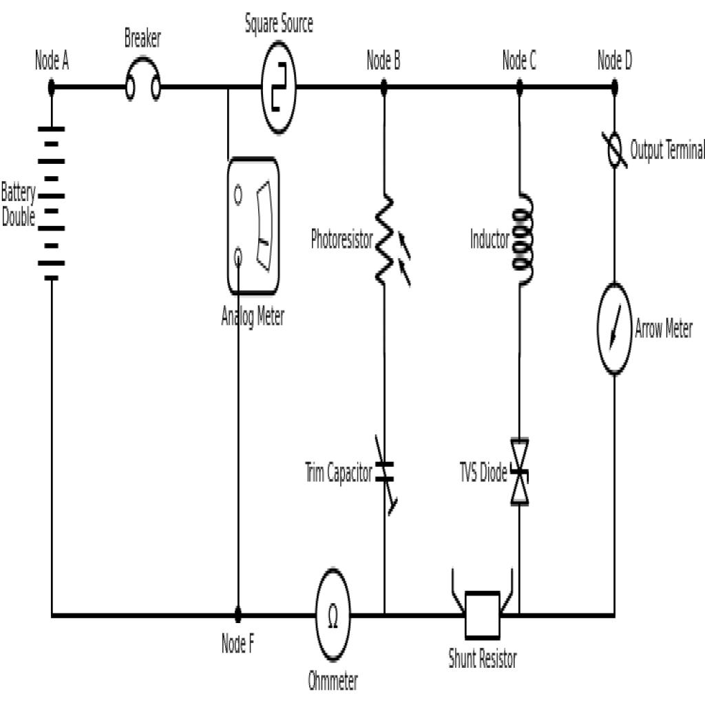

# Test AI — Circuito 01

## Obiettivo
Verificare se l'AI riesce a capire la topologia del circuito a partire dal JSON del passo 05 senza usare l'immagine.

## Immagine del circuito

## JSON usato
File: `6.json`

## Prompt usato
Ti fornisco il JSON topologico di un circuito estratto automaticamente da un diagramma elettrico. Il JSON contiene: - la lista dei componenti - i terminali di ogni componente - il grafo dei collegamenti tra terminali Non ci sono net esplicite: i nodi elettrici sono rappresentati implicitamente dai collegamenti tra terminali. Voglio che tu analizzi il circuito SOLO a partire da questo JSON. Per favore: 1. elenca i componenti presenti 2. individua i nodi principali del circuito 3. spiega quali terminali stanno sullo stesso nodo 4. descrivi la topologia generale del circuito 5. dimmi che tipo di circuito sembra essere, se è riconoscibile 6. evidenzia eventuali ambiguità o limiti del JSON 7. dimmi se il JSON è sufficiente per capire il circuito senza vedere l’immagine Importante: - non inventare informazioni non presenti - se qualcosa non è deducibile, dillo esplicitamente - ragiona in modo strutturato e chiaro Ecco il JSON
Produci solo un file markdown ben strutturato, adatto a essere salvato come report di analisi.