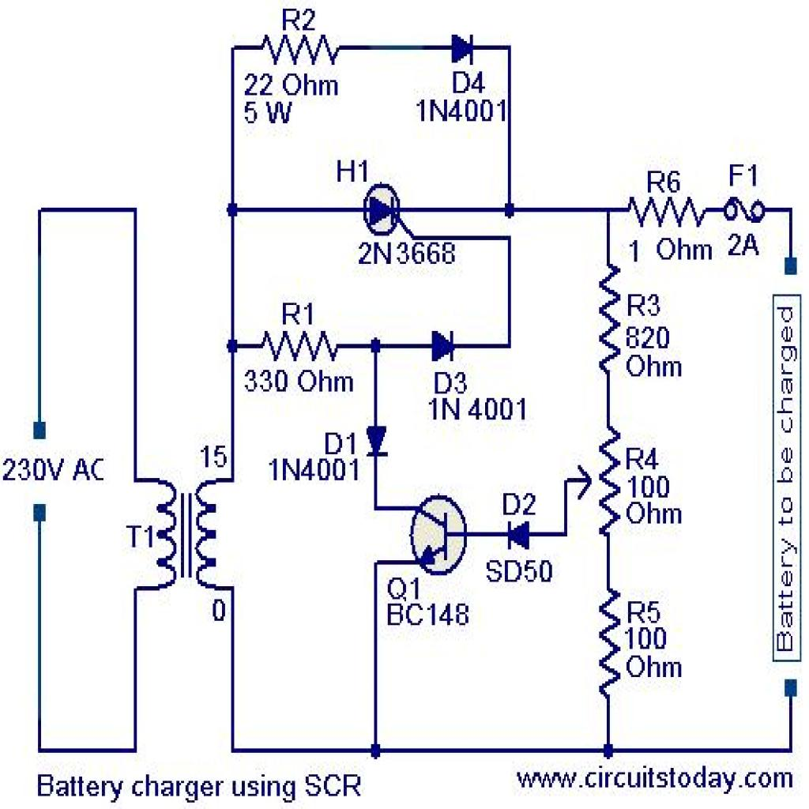

# Test AI — Circuito 07

## Obiettivo
Verificare se l'AI riesce a capire la topologia del circuito a partire dal JSON del passo 05 senza usare l'immagine.

## Immagine del circuito


## JSON usato
File: `5.json`

## Prompt usato
Ti fornisco il JSON topologico di un circuito estratto automaticamente da un diagramma elettrico.

Il JSON contiene:
- la lista dei componenti
- i terminali di ogni componente
- il grafo dei collegamenti tra terminali

Non ci sono net esplicite: i nodi elettrici sono rappresentati implicitamente dai collegamenti tra terminali.

Voglio che tu analizzi il circuito SOLO a partire da questo JSON.

Obiettivo:
verificare se il JSON è sufficiente per ricostruire la topologia del circuito e, se possibile, riconoscere il tipo di circuito.

Regole importanti:
- non usare l'immagine
- non inventare informazioni non presenti
- se qualcosa non è deducibile, scrivilo esplicitamente
- distingui tra deduzione certa, interpretazione probabile e informazione non determinabile
- non assumere automaticamente che più simboli GND siano lo stesso nodo, a meno che il JSON lo renda esplicito
- considera eventuali stati dei componenti, come switch open/closed, separatamente dalla sola connettività dei fili

FORMATO DI OUTPUT OBBLIGATORIO:
- produci SOLO il contenuto del report in Markdown
- racchiudi tutto il report dentro un unico blocco di codice markdown
- il blocco deve iniziare con ```markdown e finire con ```
- non aggiungere spiegazioni prima o dopo il blocco
- non usare canvas
- non creare una risposta discorsiva fuori dal blocco markdown
- il contenuto deve essere copiabile direttamente in un file .md

Usa obbligatoriamente questa struttura:

# Report di analisi topologica

## 1. Componenti presenti
Elenca i componenti in una tabella con:
- ID componente
- classe
- terminali

## 2. Nodi principali ricostruiti
Ricostruisci i nodi elettrici dal grafo dei collegamenti.
Usa nomi progressivi come N1, N2, N3.
Per ogni nodo indica i terminali appartenenti al nodo.

## 3. Terminali sullo stesso nodo
Spiega in modo discorsivo quali terminali sono sullo stesso nodo e cosa rappresentano.

## 4. Topologia generale del circuito
Descrivi i rami principali del circuito.
Quando utile, usa uno schema testuale semplificato.

## 5. Tipo di circuito riconoscibile
Indica se il circuito sembra riconoscibile.
Se sì, proponi una classificazione prudente.
Se no, spiega perché non è possibile identificarlo con certezza.

## 6. Ambiguità e limiti del JSON
Evidenzia:
- informazioni mancanti
- possibili ambiguità
- limiti del formato
- eventuali warning presenti nel JSON

## 7. Sufficienza del JSON
Spiega se il JSON è sufficiente per capire il circuito senza immagine.

## 8. Giudizio finale
Concludi con uno dei seguenti giudizi:
- Topologia chiara
- Topologia parzialmente chiara
- Topologia insufficiente

Motiva il giudizio in massimo 5 righe.


## Valutazione comparativa dei modelli
Data: 27/04/2026

| Modello | Input usato | Componenti | Nodi / topologia | Tipo circuito | Ambiguità | Assenza allucinazioni | Totale /10 | Giudizio finale |
|---|---|---:|---:|---:|---:|---:|---:|---|
| GPT-5.4 / modello forte | Solo JSON | 1 | 2 | 2 | 2 | 2 | 9 | Topologia chiara, ma componenti parzialmente corretti |
| GPT-5.3 Instant / modello veloce | Solo JSON | 1 | 2 | 2 | 2 | 2 | 9 | Topologia chiara, ma componenti parzialmente corretti |
| GPT-5.2 Instant / economico | Solo JSON |  |  |  |  |  |  |  |
| o3 / reasoning legacy | Solo JSON |  |  |  |  |  |  |  |

### Legenda

### Scala usata

| Valore | Significato |
|---:|---|
| 2 | Corretto o molto utile |
| 1 | Parziale, incompleto o ambiguo |
| 0 | Errato, insufficiente o non utile |
| N/D | Test non eseguito |

#### Componenti
| Punteggio | Criterio |
|---:|---|
| 2 | Elenca correttamente quasi tutti i componenti e le classi |
| 1 | Riconosce i componenti principali ma omette o confonde qualche elemento |
| 0 | Sbaglia componenti importanti o inventa componenti non presenti |

#### Nodi / topologia
| Punteggio | Criterio |
|---:|---|
| 2 | Ricostruisce correttamente i nodi principali e i collegamenti |
| 1 | Ricostruisce la maggior parte dei nodi ma perde qualche dettaglio |
| 0 | Sbaglia la struttura dei nodi o interpreta male i collegamenti |

#### Tipo di circuito
| Punteggio | Criterio |
|---:|---|
| 2 | Propone una classificazione plausibile e prudente |
| 1 | Capisce solo genericamente il circuito |
| 0 | Classifica il circuito in modo sbagliato o troppo inventato |

#### Ambiguità
| Punteggio | Criterio |
|---:|---|
| 2 | Segnala correttamente limiti importanti del JSON |
| 1 | Segnala solo alcune ambiguità |
| 0 | Non segnala limiti o dà tutto per certo |

#### Assenza allucinazioni
| Punteggio | Criterio |
|---:|---|
| 2 | Non inventa valori, connessioni o funzioni non presenti |
| 1 | Fa qualche ipotesi, ma la segnala come ipotesi |
| 0 | Inventa informazioni o dà per certe cose non presenti |

### Interpretazione del totale

| Totale /10 | Giudizio |
|---:|---|
| 8-10 | Topologia chiara |
| 5-7 | Topologia parzialmente chiara |
| 0-4 | Topologia insufficiente |

### Valutazione manuale GPT-5.4

Report molto buono dal punto di vista topologico. Il modello ricostruisce correttamente i 13 nodi presenti nel JSON e descrive in modo coerente la struttura del circuito: trasformatore, rete di resistori e diodi, transistor NPN, fusibile e terminali esterni. La descrizione dei nodi è sostanzialmente compatibile con l’immagine: il nodo di uscita/collettore dei diodi viene individuato, il ritorno comune viene separato correttamente e la rete resistiva a destra viene descritta in modo ordinato.

Il limite principale non dipende dal ragionamento del modello, ma dal JSON: il componente H1 / 2N3668, che nello schema reale sembra essere uno SCR/thyristor, viene rappresentato come `diode7.2`. Di conseguenza GPT-5.4 lo tratta come un diodo e non può riconoscere con certezza il circuito come battery charger using SCR. La classificazione finale resta quindi prudente e corretta rispetto al solo JSON.

| Criterio | Punteggio | Motivazione |
|---|---:|---|
| Componenti | 1 | Il modello elenca correttamente i componenti presenti nel JSON, ma rispetto all’immagine reale manca la semantica dello SCR/H1, rappresentato nel JSON come `diode7.2`. |
| Nodi / topologia | 2 | Ricostruisce correttamente i 13 nodi principali e descrive bene i rami tra trasformatore, diodi, resistori, transistor, fusibile e terminali esterni. |
| Tipo circuito | 2 | Propone una classificazione prudente come sottocircuito analogico di alimentazione/controllo con trasformatore, rete diodi-resistenze e transistor NPN. Non forza la classificazione come caricabatterie perché il JSON non contiene la semantica SCR. |
| Ambiguità | 2 | Segnala correttamente assenza di valori, mancanza di net label, terminali esterni non etichettati, ambiguità del trasformatore e impossibilità di identificare con certezza il tipo di circuito. |
| Assenza allucinazioni | 2 | Non inventa valori, funzioni certe o collegamenti non presenti. Rimane fedele al JSON e distingue bene tra deduzione certa e interpretazione probabile. |

**Totale:** 9/10  
**Giudizio:** Topologia chiara, ma componenti parzialmente corretti

### Valutazione manuale GPT-5.3 Instant

Report corretto e sintetico. Il modello elenca tutti i componenti presenti nel JSON e ricostruisce correttamente i 13 nodi principali. La topologia descritta è coerente con l’immagine: ingresso tramite trasformatore, rete di diodi e resistori, transistor NPN, ramo con fusibile e terminali esterni. La classificazione come possibile stadio di alimentazione/raddrizzamento/regolazione è prudente e non eccessivamente forzata.

Il limite principale non dipende direttamente dal modello, ma dal JSON: il componente H1 / 2N3668, che nello schema reale sembra essere uno SCR/thyristor, è rappresentato come `diode7.2`. Per questo il modello non può riconoscere con certezza il circuito come “battery charger using SCR”, anche se la topologia generale viene ricostruita correttamente.

| Criterio | Punteggio | Motivazione |
|---|---:|---|
| Componenti | 1 | Il modello elenca correttamente i componenti presenti nel JSON, ma rispetto all’immagine reale manca la semantica dello SCR/H1, rappresentato come `diode7.2`. |
| Nodi / topologia | 2 | Ricostruisce correttamente i 13 nodi principali e descrive bene i collegamenti tra trasformatore, diodi, resistori, transistor, fusibile e terminali. |
| Tipo circuito | 2 | Propone una classificazione prudente come stadio di alimentazione con possibile raddrizzamento/regolazione, senza forzare una funzione certa. |
| Ambiguità | 2 | Segnala correttamente mancanza di valori, polarità del trasformatore, riferimento di massa, funzione dei nodi e limiti del formato JSON. |
| Assenza allucinazioni | 2 | Non inventa valori, collegamenti o funzioni certe. Rimane fedele al JSON e distingue bene tra topologia ricostruibile e funzione non determinabile. |

**Totale:** 9/10  
**Giudizio:** Topologia chiara, ma componenti parzialmente corretti


### Valutazione manuale GPT-5.2 Instant


### Valutazione manuale o3
