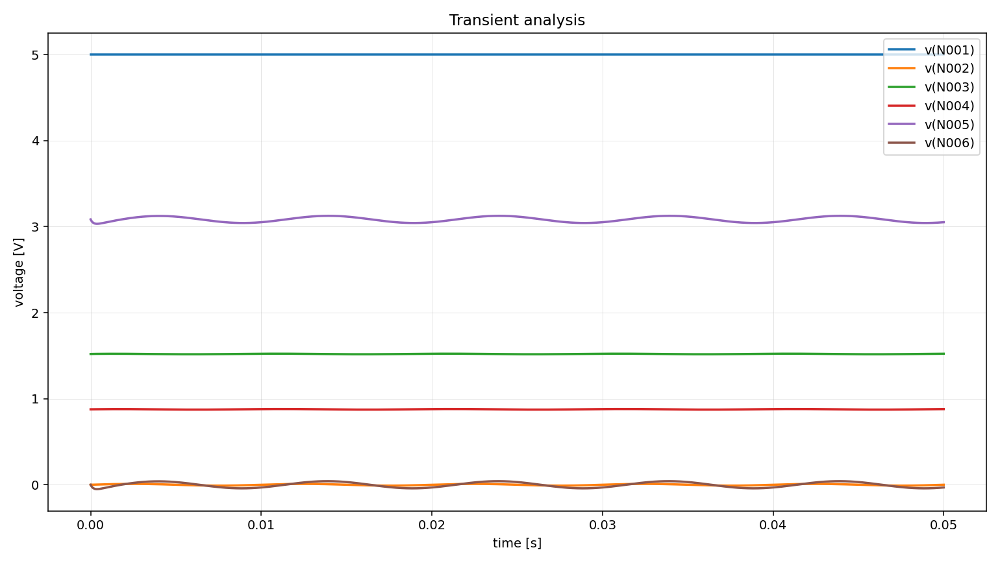

# a04 - ngspice Output and Scenario Report

Questo documento spiega il risultato SPICE ottenuto per `a04` e raccoglie gli
scenari che in futuro potremmo usare per testare ipotesi diagnostiche.

Non e un output della pipeline. E una nota di lavoro per noi.

## Immagine del circuito


## Comando usato

```powershell
python scripts\pipeline_2.0\run_pipeline2.py --batch batchA --circuits a04 --run-spice --ngspice-executable "C:\Users\m.profilo\Spice64\bin\ngspice_con.exe"
```

File principali:

```text
outputs/pipeline2.0/batchA/a04/03_node_map.json
outputs/pipeline2.0/batchA/a04/04_values_bound.json
outputs/pipeline2.0/batchA/a04/06_component_rules.json
outputs/pipeline2.0/batchA/a04/07_netlist.cir
outputs/pipeline2.0/batchA/a04/07_spice_emit_report.json
outputs/pipeline2.0/batchA/a04/08_spice_run.json
outputs/pipeline2.0/batchA/a04/08_ngspice_stdout.txt
outputs/pipeline2.0/batchA/a04/08_ngspice_stderr.txt
outputs/pipeline2.0/batchA/a04/08_tran_raw.csv
outputs/pipeline2.0/batchA/a04/08_tran.csv
outputs/pipeline2.0/batchA/a04/08_tran_plot.png
```

## Transient plot



Il grafico mostra le tensioni esportate dalla simulazione transitoria:

```text
v(N001)
v(N002)
v(N003)
v(N004)
v(N005)
v(N006)
```

## Valori manuali usati

Da `metadata/pipeline2_manual_values/batchA/a04_values.yaml`:

```text
V1 = 5 V DC
V2 = SINE(0 10m 100)
C1 = 100 nF
C2 = 1 uF
C3 = 10 uF
R1 = 2.2 kOhm
R2 = 1 kOhm
R3 = 22 kOhm
R4 = 10 kOhm
R5 = 33 kOhm
Q1 = 2N2222
```

Nota:

```text
L'immagine mostra anche "DC(10m)" e "AC(1 0 0)" accanto alla sorgente V2.
Per la simulazione transitoria abbiamo usato la forma indicata in basso:
SINE(0 10m 100 0.0 0.0).
```

Quindi in SPICE la sorgente di ingresso e:

```spice
SIN(0 0.01 100)
```

## Netlist generata

```spice
* pipeline2.0 netlist
* circuit: a04

Vbattery2_1 N001 0 DC 5
Ccapacitor4_1 N002 N003 100n
Ccapacitor4_2 N004 0 10u
Ccapacitor4_3 N005 N006 1u
Qnpn_transistor18_1 N005 N003 N004 2N2222
Rresistor22_1 N003 0 10k
Rresistor22_2 N001 N003 22k
Rresistor22_3 N001 N005 2.2k
Rresistor22_4 N004 0 1k
Rresistor22_5 N006 0 33k
Vsignal_source23_1 N002 0 SIN(0 0.01 100)

.model 2N2222 NPN(IS=14.34f BF=255.9 VAF=74.03 IKF=0.2847 ISE=14.34f NE=1.307 BR=6.092 NR=1.005 VAR=11.96 IKR=0.0 ISC=0.0 NC=2 RB=10 RC=1 RE=0.1 CJE=22.01p VJE=0.75 MJE=0.377 CJC=7.306p VJC=0.75 MJC=0.3416 TF=411.1p TR=46.91n)

.op
.save all
.tran 0.1ms 50ms

.control
set wr_singlescale
set wr_vecnames
run
wrdata 08_tran.csv time v(N001) v(N002) v(N003) v(N004) v(N005) v(N006)
.endc
.end
```

Significato:

```text
Vbattery2_1: alimentazione VCC da 5 V
Vsignal_source23_1: ingresso sinusoidale da 10 mV a 100 Hz
Ccapacitor4_1: C1, condensatore di accoppiamento in ingresso
Ccapacitor4_2: C3, condensatore di bypass sull'emettitore
Ccapacitor4_3: C2, condensatore di accoppiamento in uscita
Qnpn_transistor18_1: transistor NPN 2N2222, ordine SPICE C-B-E
Rresistor22_1: R4 da 10 kOhm, base verso GND
Rresistor22_2: R3 da 22 kOhm, VCC verso base
Rresistor22_3: R1 da 2.2 kOhm, VCC verso collettore
Rresistor22_4: R2 da 1 kOhm, emettitore verso GND
Rresistor22_5: R5 da 33 kOhm, carico di uscita verso GND
.op: operating point iniziale
.tran: analisi transitoria da 0 a 50 ms
```

## Mappa dei nodi

Da `03_node_map.json`:

```text
0    = battery2.1_negative + capacitor4.2_t2 + gnd9.1_t1 + resistor22.1_t2 + resistor22.4_t2 + resistor22.5_t2 + signal_source23.1_t2
N001 = battery2.1_positive + resistor22.2_t1 + resistor22.3_t1
N002 = capacitor4.1_t1 + signal_source23.1_t1
N003 = capacitor4.1_t2 + npn_transistor18.1_B + resistor22.1_t1 + resistor22.2_t2
N004 = capacitor4.2_t1 + npn_transistor18.1_E + resistor22.4_t1
N005 = capacitor4.3_t1 + npn_transistor18.1_C + resistor22.3_t2
N006 = capacitor4.3_t2 + resistor22.5_t1
```

Interpretazione:

- `0` e la massa SPICE.
- `N001` e `VCC`, alimentazione a 5 V.
- `N002` e l'ingresso sinusoidale prima di C1.
- `N003` e il nodo base, polarizzato dal partitore R3/R4.
- `N004` e il nodo emettitore, con R2 e C3 verso massa.
- `N005` e il nodo collettore, con R1 verso VCC e C2 verso l'uscita.
- `N006` e l'uscita dopo C2, con R5 verso massa.

La pipeline1.0 non segnala terminali scollegati, unmatched o suspicious.

## Risultato del run

Da `08_spice_run.json`:

```json
{
  "status": "success",
  "exit_code": 0,
  "message": "ngspice completed successfully."
}
```

Quindi ngspice ha terminato correttamente.

`08_ngspice_stderr.txt` e vuoto, quindi non ci sono errori tecnici o warning su
stderr.

## stdout e operating point

La soluzione iniziale riportata da ngspice e:

```text
N001 = 5 V
N002 = 0 V
N003 = 1.5202 V
N004 = 0.8769 V
N005 = 3.0844 V
N006 = 0 V
```

Interpretazione:

- `N001 = 5 V`: alimentazione corretta.
- `N002 = 0 V`: la sinusoide parte da 0 V.
- `N003 = 1.52 V`: base polarizzata dal partitore R3/R4.
- `N004 = 0.877 V`: emettitore circa 0.64 V sotto la base.
- `N005 = 3.084 V`: collettore a un valore intermedio, quindi transistor non saturo.
- `N006 = 0 V`: uscita accoppiata in AC tramite C2, con R5 verso massa.

Il transistor e in una zona sensata:

```text
vbe = 0.643637 V
ic  = 0.000886595 A
ib  = 6.25739e-06 A
ie  = -0.000892853 A
```

Quindi:

```text
Vbe circa 0.64 V
Ic circa 0.887 mA
Ib circa 6.26 uA
Ie circa 0.893 mA
```

Questi valori sono coerenti con un piccolo amplificatore BJT polarizzato in zona
attiva.

La corrente della batteria e circa:

```text
vbattery2_1#branch = -0.00104 A
```

Quindi l'alimentazione fornisce circa 1 mA, valore plausibile per questo circuito.

## CSV e transient plot

Lo step `08` produce due CSV:

```text
08_tran_raw.csv
08_tran.csv
```

`08_tran_raw.csv` e il file grezzo prodotto da ngspice.

`08_tran.csv` e il CSV pulito dalla pipeline:

```csv
time,v(N001),v(N002),v(N003),v(N004),v(N005),v(N006)
0.0,5.0,0.0,1.5201957,0.876891599,3.08437585,0.0
1e-06,5.0,6.28318489e-06,1.52020193,0.87689162,3.08395993,-0.00041590983
```

Range dei nodi nel CSV:

```text
v(N001): 5.0000 V -> 5.0000 V
v(N002): -0.0100 V -> +0.0100 V
v(N003): 1.5168 V -> 1.5235 V
v(N004): 0.8737 V -> 0.8801 V
v(N005): 3.0332 V -> 3.1260 V
v(N006): -0.0508 V -> +0.0415 V
```

Interpretazione:

- `N001` resta fisso a 5 V.
- `N002` e l'ingresso sinusoidale da circa 20 mV picco-picco.
- `N003` e la base: oscilla poco intorno a 1.52 V.
- `N004` e l'emettitore: segue la base con una piccola variazione.
- `N005` e il collettore: oscilla intorno a circa 3.08 V.
- `N006` e l'uscita dopo C2: oscilla intorno a 0 V.

L'uscita `N006` e centrata intorno a 0 V perche C2 rimuove la componente DC del
collettore e lascia passare soprattutto la variazione AC verso R5.

Guadagno approssimativo:

```text
input N002  circa 20 mVpp
output N006 circa 92 mVpp
gain circa 92 / 20 = 4.6
```

Quindi la simulazione mostra un'amplificazione del segnale.

## Il risultato ha senso?

Si, il risultato ha senso rispetto alla netlist generata e all'immagine.

Le parti piu solide sono:

- alimentazione a 5 V corretta;
- partitore di base R3/R4 coerente;
- transistor polarizzato in zona attiva;
- collettore a circa 3.08 V;
- emettitore a circa 0.877 V;
- uscita AC accoppiata tramite C2;
- segnale di uscita amplificato rispetto all'ingresso;
- ngspice non segnala errori.

`a04` e quindi un circuito molto utile per validare:

- supporto `Signal_Source` sinusoidale;
- supporto `NPN_Transistor`;
- `.tran`;
- CSV pulito;
- plot PNG.

## Limiti e assunzioni

La sorgente e stata modellata come:

```spice
SIN(0 0.01 100)
```

Questa scelta segue la scritta `SINE(0 10m 100 0.0 0.0)` visibile
nell'immagine.

Non abbiamo modellato separatamente:

```text
DC(10m)
AC(1 0 0)
```

Per la simulazione transitoria di base va bene cosi. In futuro, se servira una
analisi AC vera, potremo introdurre anche `.ac` e usare il parametro `AC`.

Altro limite:

```text
2N2222 e un modello SPICE generico.
```

E sufficiente per una prima simulazione, ma non e una caratterizzazione
specifica del componente reale.

## Domanda fatta all'agente

Per questa nuova sessione di test, il sintomo dato all'agente e stato:

```text
Il circuito dovrebbe amplificare il segnale, ma in uscita vedo un segnale troppo debole o quasi nullo. Quale potrebbe essere il problema?
```

La risposta iniziale dell'agente e risultata coerente con il comportamento del
circuito simulato.

In particolare l'agente ha riconosciuto che:

- la simulazione e pulita;
- non emergono errori topologici;
- il transistor e polarizzato correttamente;
- l'uscita a `N006` e accoppiata in AC, quindi in DC e normale vederla vicino a
  0 V;
- il punto diagnostico piu importante e che l'ingresso simulato e molto piccolo
  (`10 mV`).

## Risposta iniziale dell'agente su a04

La diagnosi di fondo dell'agente e stata:

```text
il circuito e attivo e simulabile, ma l'uscita puo sembrare molto piccola
semplicemente perche il segnale di ingresso e molto piccolo
```

Questa lettura e coerente con i dati:

- `Vsignal_source23_1 = SIN(0 0.01 100)`
- `v(N002)` e di circa `20 mVpp`
- `v(N006)` e presente ma resta di ampiezza modesta
- `N006 = 0 V` nel punto di lavoro DC non e un errore, ma un effetto normale
  del condensatore di accoppiamento `Ccapacitor4_3`

Quindi, a differenza di `a03`, qui l'agente non deve correggere la topologia:
deve ragionare sul comportamento analogico del circuito.

## Scenari diagnostici proposti dall'agente

### Scenario 1 - Cambiare ampiezza del segnale di ingresso

Definizione scenario proposta dall'agente:

```json
{
  "scenario_id": "scenario_1",
  "title": "Aumentare l'ampiezza del segnale di ingresso",
  "actions": [
    {
      "type": "change_source_value",
      "target": "Vsignal_source23_1",
      "value": "SIN(0 0.1 100)"
    }
  ],
  "rerun_from": "07",
  "analysis": "tran",
  "compare": ["v(N002)", "v(N005)", "v(N006)"]
}
```

Perche ha senso:

- e lo scenario piu naturale rispetto al sintomo;
- modifica solo l'ampiezza di ingresso;
- lascia invariata la topologia e il bias DC del circuito.

Questo e anche lo scenario che abbiamo eseguito per primo.

### Esito reale di scenario_1

Lo scenario e stato eseguito con successo e ha dato:

```text
status = resolved_candidate
```

Confronto principale sul transitorio:

```text
v(N002): 0.0199969 Vpp -> 0.1999690 Vpp
v(N005): 0.0928058 Vpp -> 0.9469943 Vpp
v(N006): 0.0923912 Vpp -> 0.9429835 Vpp
```

Interpretazione:

- l'ingresso cresce di circa 10 volte;
- il collettore `N005` cresce anch'esso in modo netto;
- l'uscita accoppiata `N006` cresce in modo molto evidente;
- `stderr` resta vuoto anche nello scenario.

Quindi lo scenario conferma bene l'ipotesi iniziale:

```text
il circuito funziona, ma con un ingresso da soli 10 mV l'uscita puo sembrare
troppo debole; aumentando l'ampiezza del segnale, l'uscita cresce in modo
coerente
```

### Scenario 2 - Rimuovere o modificare C3

Nella prima stesura questo era uno scenario tecnico plausibile.

Nella nuova risposta dell'agente, lo scenario equivalente proposto come seconda
ipotesi e invece:

```json
{
  "scenario_id": "scenario_2",
  "title": "Verificare se l'alimentazione da 5 V limita l'escursione",
  "actions": [
    {
      "type": "change_source_value",
      "target": "Vbattery2_1",
      "value": "10V"
    }
  ],
  "rerun_from": "07",
  "analysis": "tran",
  "compare": ["v(N003)", "v(N004)", "v(N005)", "v(N006)", "i(vbattery2_1#branch)"]
}
```

L'idea e verificare se il limite dell'uscita possa dipendere anche dal margine
di swing disponibile con soli `5 V` di alimentazione.

### Scenario 3 - Cambiare il carico R5

Anche qui, la prima stesura proponeva uno scenario analogico sensato.

Nella nuova risposta dell'agente, il terzo scenario proposto e:

```json
{
  "scenario_id": "scenario_3",
  "title": "Forzare temporaneamente l'ingresso VIN",
  "actions": [
    {
      "type": "drive_node_voltage",
      "target": "N002",
      "value": "0.1V"
    }
  ],
  "rerun_from": "04",
  "analysis": "op",
  "compare": ["v(N002)", "v(N003)", "v(N005)", "i(vbattery2_1#branch)"]
}
```

Questo scenario e piu artificiale e meno naturale del primo, ma puo servire
come test di isolamento del ramo di amplificazione.

## Cosa abbiamo imparato dalla prima risposta

Per `a04`, il comportamento dell'agente e diverso rispetto ai casi topologici:

- non cerca errori strutturali inesistenti;
- riconosce che il circuito e sano e simulabile;
- ragiona su ampiezza, guadagno, swing e comportamento del segnale.

Questa e una buona validazione del fatto che l'agente non usa sempre la stessa
logica, ma adatta il ragionamento al tipo di circuito.

## Cosa abbiamo imparato dallo scenario eseguito

Dopo l'esecuzione reale di `scenario_1`, abbiamo una conferma forte di questa
lettura:

- il circuito non e guasto;
- l'uscita non era "assente", ma semplicemente piccola;
- il parametro piu importante per spiegare il sintomo era davvero l'ampiezza
  del segnale di ingresso.

Questo rende `a04` un caso molto diverso da `a03`:

- in `a03` il problema principale era topologico;
- in `a04` la topologia e sana, e la diagnosi passa attraverso il comportamento
  analogico del circuito.

## Priorita pratica

Per `a04`, la priorita non e correggere la topologia: la node map sembra
coerente.

La priorita dovrebbe essere:

1. usare `a04` come caso pulito di amplificatore BJT;
2. mantenere `.tran` come analisi principale;
3. usare `scenario_1` come conferma diagnostica del caso base;
4. in futuro aggiungere `.ac` solo quando serve studiare la risposta in
   frequenza;
5. tenere gli scenari su alimentazione, carico e condensatori come possibili
   sviluppi futuri.

## Interpretazione finale

`a04` e un circuito molto buono per la Pipeline 2.0.

La pipeline riesce a:

- leggere il graph JSON;
- associare valori manuali;
- emettere una sorgente sinusoidale;
- modellare un transistor NPN 2N2222;
- eseguire `.tran`;
- produrre CSV pulito;
- generare un plot PNG leggibile.

Il risultato e tecnicamente coerente: il transistor e polarizzato correttamente,
il segnale di ingresso viene accoppiato alla base tramite C1, il collettore
oscilla intorno al punto di lavoro e l'uscita dopo C2 mostra un segnale
amplificato e centrato intorno a 0 V.

Dopo `scenario_1`, la conclusione diagnostica piu forte e:

```text
il circuito e simulabile e funziona in modo coerente; il sintomo "uscita troppo
debole" e spiegato soprattutto dal fatto che il segnale di ingresso iniziale e
molto piccolo
```

Quindi `a04` e un ottimo caso per l'agente perche mostra che il sistema sa:

- distinguere un circuito sano da un circuito topologicamente rotto;
- leggere correttamente un sintomo di prestazione;
- proporre uno scenario naturale;
- confermare la diagnosi con una simulazione transitoria coerente.
