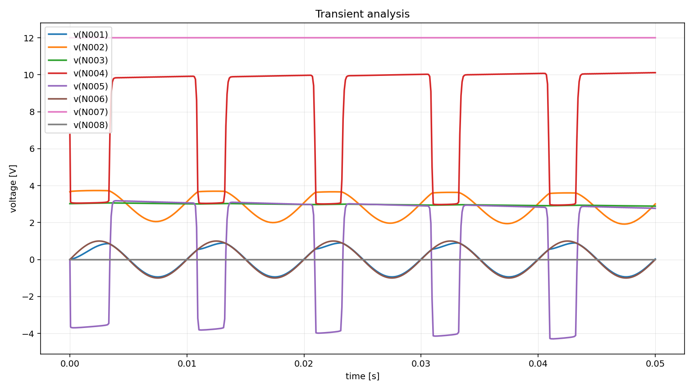

# a06 - ngspice Output and Scenario Report

Questo documento spiega il risultato SPICE ottenuto per `a06` e raccoglie gli
scenari che in futuro potremmo usare per testare ipotesi diagnostiche.

Non e un output della pipeline. E una nota di lavoro per noi.

## Immagine del circuito


## Comando usato

```powershell
python scripts\pipeline_2.0\run_pipeline2.py --batch batchA --circuits a06 --run-spice --ngspice-executable "C:\Users\m.profilo\Spice64\bin\ngspice_con.exe"
```

File principali:

```text
outputs/pipeline2.0/batchA/a06/03_node_map.json
outputs/pipeline2.0/batchA/a06/04_values_bound.json
outputs/pipeline2.0/batchA/a06/06_component_rules.json
outputs/pipeline2.0/batchA/a06/07_netlist.cir
outputs/pipeline2.0/batchA/a06/07_spice_emit_report.json
outputs/pipeline2.0/batchA/a06/08_spice_run.json
outputs/pipeline2.0/batchA/a06/08_ngspice_stdout.txt
outputs/pipeline2.0/batchA/a06/08_ngspice_stderr.txt
outputs/pipeline2.0/batchA/a06/08_tran_raw.csv
outputs/pipeline2.0/batchA/a06/08_tran.csv
outputs/pipeline2.0/batchA/a06/08_tran_plot.png
```

## Transient plot



Il grafico mostra le tensioni esportate dalla simulazione transitoria:

```text
v(N001)
v(N002)
v(N003)
v(N004)
v(N005)
v(N006)
v(N007)
v(N008)
```

## Valori manuali usati

Da `metadata/pipeline2_manual_values/batchA/a06_values.yaml`:

```text
VCC = 12 V
VEE = 0 V
vs = AC 1, modellata per .tran come SIN(0 1 100)
Rs = 1 kOhm
Cc1 = 1 uF
base resistor high = 100 kOhm
base resistor low = 47 kOhm
collector resistor = 6.8 kOhm
emitter resistor = 3.9 kOhm
CE = 100 uF
Cc2 = 10 uF
RL = 10 kOhm
Q1 = 2N2222
```

Nota importante:

```text
L'immagine indica "AC 1", ma non mostra una frequenza per una simulazione .tran.
Per poter eseguire la transitoria abbiamo assunto 100 Hz.
```

Quindi in SPICE la sorgente di ingresso e:

```spice
SIN(0 1 100)
```

## Netlist generata

```spice
* pipeline2.0 netlist
* circuit: a06

VVCC N007 0 DC 12
VVEE N008 0 DC 0
Ccapacitor4_1 N001 N002 1u
Ccapacitor4_2 N003 0 100u
Ccapacitor4_3 N004 N005 10u
Qnpn_transistor18_1 N004 N002 N003 2N2222
Rresistor22_1 N006 N001 1k
Rresistor22_2 N007 N002 100k
Rresistor22_3 N002 0 47k
Rresistor22_4 N007 N004 6.8k
Rresistor22_5 N003 N008 3.9k
Rresistor22_6 N005 0 10k
Vsignal_source23_1 N006 0 SIN(0 1 100)

.model 2N2222 NPN(IS=14.34f BF=255.9 VAF=74.03 IKF=0.2847 ISE=14.34f NE=1.307 BR=6.092 NR=1.005 VAR=11.96 IKR=0.0 ISC=0.0 NC=2 RB=10 RC=1 RE=0.1 CJE=22.01p VJE=0.75 MJE=0.377 CJC=7.306p VJC=0.75 MJC=0.3416 TF=411.1p TR=46.91n)

.op
.save all
.tran 0.1ms 50ms

.control
set wr_singlescale
set wr_vecnames
run
wrdata 08_tran.csv time v(N001) v(N002) v(N003) v(N004) v(N005) v(N006) v(N007) v(N008)
.endc
.end
```

Significato:

```text
VVCC: alimentazione positiva da 12 V
VVEE: riferimento VEE a 0 V
Vsignal_source23_1: sorgente sinusoidale di ingresso
Rresistor22_1: Rs da 1 kOhm
Ccapacitor4_1: Cc1 da 1 uF, accoppiamento ingresso-base
Rresistor22_2: 100 kOhm, VCC verso base
Rresistor22_3: 47 kOhm, base verso GND
Qnpn_transistor18_1: transistor NPN 2N2222, ordine SPICE C-B-E
Rresistor22_4: 6.8 kOhm, VCC verso collettore
Rresistor22_5: 3.9 kOhm, emettitore verso VEE
Ccapacitor4_2: CE da 100 uF, bypass emettitore verso GND
Ccapacitor4_3: Cc2 da 10 uF, accoppiamento uscita
Rresistor22_6: RL da 10 kOhm verso GND
.tran: analisi transitoria da 0 a 50 ms
```

## Mappa dei nodi

Da `03_node_map.json`:

```text
0    = capacitor4.2_t2 + gnd9.1_t1 + gnd9.2_t1 + gnd9.3_t1 + gnd9.4_t1 + resistor22.3_t2 + resistor22.6_t2 + signal_source23.1_t2
N001 = capacitor4.1_t1 + resistor22.1_t2
N002 = capacitor4.1_t2 + npn_transistor18.1_B + resistor22.2_t2 + resistor22.3_t1
N003 = capacitor4.2_t1 + npn_transistor18.1_E + resistor22.5_t1
N004 = capacitor4.3_t1 + npn_transistor18.1_C + resistor22.4_t2
N005 = capacitor4.3_t2 + resistor22.6_t1 + terminal26.3_t1
N006 = resistor22.1_t1 + signal_source23.1_t1
N007 = resistor22.2_t1 + resistor22.4_t1 + terminal26.1_t1
N008 = resistor22.5_t2 + terminal26.2_t1
```

Interpretazione:

- `0` e la massa SPICE.
- `N007` e `VCC`, alimentazione a 12 V.
- `N008` e `VEE`, forzato a 0 V tramite `VVEE`.
- `N006` e il nodo della sorgente `vs`.
- `N001` e il nodo dopo `Rs`, prima di `Cc1`.
- `N002` e il nodo base del transistor.
- `N003` e il nodo emettitore.
- `N004` e il nodo collettore.
- `N005` e l'uscita `vo` dopo `Cc2`, con `RL` verso massa.

La pipeline1.0 non segnala terminali scollegati, unmatched o suspicious.

La node map segnala quattro gruppi di massa uniti:

```json
{
  "ground_groups_count": 4,
  "multiple_ground_groups_merged_as_node_0": true
}
```

Questo e accettabile per SPICE: i diversi simboli di massa dell'immagine vengono
uniti nel nodo `0`.

## Gestione di VCC e VEE

Nel graph non ci sono batterie esplicite. `VCC` e `VEE` sono terminali esterni:

```text
terminal26.1_t1 -> VCC 12 V
terminal26.2_t1 -> VEE 0 V
```

Per questo nel file valori sono state dichiarate due supply manuali:

```text
VCC = 12 V verso GND
VEE = 0 V verso GND
```

La netlist emette:

```spice
VVCC N007 0 DC 12
VVEE N008 0 DC 0
```

`VVEE` serve a dire esplicitamente a SPICE che il terminale `VEE` del graph,
cioe `N008`, corrisponde elettricamente a 0 V.

## Risultato del run

Da `08_spice_run.json`:

```json
{
  "status": "success",
  "exit_code": 0,
  "message": "ngspice completed successfully."
}
```

Quindi ngspice ha terminato correttamente.

`08_ngspice_stderr.txt` e vuoto, quindi non ci sono errori tecnici o warning su
stderr.

## stdout e operating point

La soluzione iniziale riportata da ngspice e:

```text
N007 = 12 V
N008 = 0 V
N001 = 0 V
N002 = 3.664 V
N003 = 3.024 V
N004 = 6.763 V
N005 = 0 V
N006 = 0 V
```

Interpretazione:

- `N007 = 12 V`: VCC corretto.
- `N008 = 0 V`: VEE corretto.
- `N006 = 0 V`: la sinusoide parte da 0 V.
- `N001 = 0 V`: nodo dopo Rs, prima di Cc1, in DC bloccato dal condensatore.
- `N002 = 3.664 V`: base polarizzata dal partitore 100 kOhm / 47 kOhm.
- `N003 = 3.024 V`: emettitore circa 0.64 V sotto la base.
- `N004 = 6.763 V`: collettore a un valore intermedio, compatibile con zona attiva.
- `N005 = 0 V`: uscita accoppiata in AC tramite Cc2, con RL verso massa.

Il partitore di base senza carico darebbe:

```text
12 * 47 / (100 + 47) = circa 3.84 V
```

SPICE trova `N002 = 3.664 V`, valore plausibile perche la base assorbe corrente.

Nel blocco finale del `stdout`, ngspice riporta anche valori di dispositivo dopo
la transitoria. Quel blocco non coincide necessariamente con l'operating point
iniziale, quindi per il comportamento dinamico conviene usare CSV e plot.

## CSV e transient plot

Lo step `08` produce due CSV:

```text
08_tran_raw.csv
08_tran.csv
```

`08_tran_raw.csv` e il file grezzo prodotto da ngspice.

`08_tran.csv` e il CSV pulito dalla pipeline:

```csv
time,v(N001),v(N002),v(N003),v(N004),v(N005),v(N006),v(N007),v(N008)
0.0,0.0,3.66400021,3.02445816,6.76332305,0.0,0.0,12.0,0.0
1e-06,0.00036081169,3.66436076,3.02445826,6.72267119,-0.040651451,0.000628318489,12.0,0.0
```

Range dei nodi nel CSV:

```text
v(N001): -0.9448 V -> +0.8974 V
v(N002): 1.9181 V -> 3.7340 V
v(N003): 2.8891 V -> 3.0625 V
v(N004): 2.9456 V -> 10.1166 V
v(N005): -4.2927 V -> +3.1815 V
v(N006): -1.0000 V -> +1.0000 V
v(N007): 12.0000 V -> 12.0000 V
v(N008): 0.0000 V -> 0.0000 V
```

Interpretazione:

- `N006` e l'ingresso sinusoidale da 2 V picco-picco.
- `N007` resta fisso a 12 V.
- `N008` resta fisso a 0 V.
- `N002`, la base, oscilla molto per effetto del segnale di ingresso accoppiato.
- `N003`, l'emettitore, resta molto piu stabile grazie a R emitter e CE.
- `N004`, il collettore, oscilla in modo ampio.
- `N005`, uscita dopo Cc2, e accoppiata verso il carico con riferimento a massa. Con l'ingresso grande usato qui non e perfettamente simmetrica rispetto a 0 V.

Guadagno approssimativo:

```text
input N006  circa 2.0 Vpp
output N005 circa 7.47 Vpp
gain circa 7.47 / 2.0 = 3.7
```

Quindi la simulazione mostra amplificazione.

## Il risultato ha senso?

Si, il risultato ha senso rispetto alla netlist generata e all'immagine.

Le parti piu solide sono:

- `VCC` a 12 V corretto;
- `VEE` forzato a 0 V;
- partitore di base coerente;
- transistor polarizzato con base circa 0.64 V sopra l'emettitore all'inizio;
- collettore a un valore intermedio;
- uscita accoppiata tramite Cc2;
- segnale di uscita amplificato rispetto all'ingresso;
- ngspice non segnala errori.

La parte da interpretare con prudenza e l'ampiezza del segnale di ingresso.

Con `SIN(0 1 100)`, l'ingresso e grande:

```text
2 V picco-picco
```

Dal CSV:

```text
Vbe = v(N002) - v(N003)
range circa -1.00 V -> +0.69 V
```

Quindi il transistor entra ed esce da zone di conduzione diverse durante la
sinusoide. Questo significa che il comportamento non e puramente piccolo segnale
e puo includere distorsione o clipping.

## Limiti e assunzioni

Il limite principale e la sorgente:

```text
L'immagine mostra "AC 1", ma non indica la frequenza per una simulazione .tran.
Abbiamo assunto 100 Hz.
```

Inoltre `AC 1` in molti contesti SPICE indica ampiezza per analisi `.ac`, non
necessariamente una sorgente transitoria da 1 V. Per poter eseguire `.tran`, per
ora l'abbiamo modellata come:

```spice
SIN(0 1 100)
```

Questa scelta e utile per testare la pipeline, ma non va interpretata come unico
comportamento possibile del circuito reale.

Altro limite:

```text
2N2222 e un modello SPICE generico.
```

E sufficiente per una prima simulazione, ma non e una caratterizzazione
specifica del componente reale.

## Scenari diagnostici candidati

### Scenario 1 - Ridurre l'ampiezza di ingresso

Definizione scenario proposta dall'agente:

```json
{
  "scenario_id": "scenario_1",
  "title": "Ridurre l'ampiezza del segnale di ingresso",
  "actions": [
    {
      "type": "change_source_value",
      "target": "Vsignal_source23_1",
      "value": "SIN(0 0.1 100)"
    }
  ],
  "rerun_from": "07",
  "analysis": "tran",
  "compare": ["v(N006)", "v(N004)", "v(N005)"]
}
```

Perche ha senso:

- il sintomo riguarda una uscita molto ampia e poco pulita;
- la run base usa un ingresso molto grande per uno stadio di questo tipo:
  `SIN(0 1 100)`;
- quindi la prima ipotesi naturale e che il transistor stia lavorando fuori da
  un regime piccolo segnale.

### Esito reale di scenario_1

Lo scenario e stato eseguito con successo e ha dato:

```text
status = partially_resolved
```

Confronto principale sul transitorio:

```text
v(N006): 1.9999996 Vpp -> 0.2000000 Vpp
v(N004): 7.1709869 Vpp -> 6.8432072 Vpp
v(N005): 7.4741747 Vpp -> 6.9551392 Vpp
```

Interpretazione:

- l'ingresso viene davvero ridotto di 10 volte;
- il comportamento del circuito cambia;
- pero l'uscita resta ancora molto ampia e non diventa automaticamente un caso
  di piccolo segnale pulito.

Quindi `scenario_1` e utile, ma non chiude il caso:

```text
l'overdrive di ingresso e probabilmente parte del problema, ma non basta da
solo a spiegare tutta la distorsione osservata
```

### Scenario 2 - Aggiungere analisi AC futura

Obiettivo: studiare la risposta in frequenza dell'amplificatore.

Azione possibile:

- introdurre `.ac`;
- usare il parametro `AC 1` della sorgente;
- misurare guadagno su varie frequenze.

Effetto atteso:

- stima della banda passante;
- effetto di Cc1, CE e Cc2 visibile in frequenza.

### Scenario 3 - Rimuovere o modificare CE

Obiettivo: capire l'effetto del condensatore di bypass sull'emettitore.

Azione possibile:

- rimuovere CE;
- ridurre o aumentare CE;
- rieseguire `.tran`.

Effetto atteso:

- senza CE il guadagno dovrebbe diminuire;
- con CE piu grande il bypass dell'emettitore dovrebbe essere piu efficace.

### Scenario 4 - Cambiare RL

Obiettivo: verificare quanto il carico influenza l'uscita.

Azione possibile:

- provare carichi piu bassi o piu alti di 10 kOhm;
- confrontare ampiezza di `N005`.

Effetto atteso:

- un carico piu basso puo ridurre l'ampiezza di uscita;
- un carico piu alto puo aumentare l'ampiezza disponibile.

## Domanda fatta all'agente

Per questa nuova sessione di test, il sintomo dato all'agente e stato:

```text
Il circuito amplifica, ma l'uscita mi sembra troppo distorta o poco pulita. Quale potrebbe essere il problema?
```

La risposta iniziale dell'agente e risultata in gran parte coerente:

- ha riconosciuto che il circuito e simulabile;
- ha capito che il problema non e topologico;
- ha proposto come primo scenario proprio la riduzione dell'ampiezza di
  ingresso.

Nota importante di lettura:

- nella risposta iniziale l'agente ha insistito un po' troppo su alcuni valori
  finali di `stdout` come se rappresentassero direttamente il bias iniziale del
  transistor;
- nel nostro markdown manteniamo invece come riferimento principale l'operating
  point iniziale e il comportamento del `tran.csv`, che qui sono i dati piu
  affidabili.

## Cosa abbiamo imparato dalla prima risposta

L'agente ha comunque centrato un punto utile:

```text
il caso a06 non e un problema di topologia, ma di comportamento analogico e di
regime di funzionamento dello stadio
```

Questo e coerente con il fatto che:

- il circuito e simulabile;
- il transistor ha un bias iniziale plausibile;
- l'ingresso scelto per la `.tran` e grande (`SIN(0 1 100)`).

## Cosa abbiamo imparato dallo scenario eseguito

Dopo l'esecuzione reale di `scenario_1`, la situazione diventa piu chiara:

- ridurre l'ingresso modifica davvero il comportamento del circuito;
- quindi l'ampiezza del segnale di ingresso e sicuramente una variabile
  rilevante;
- pero l'uscita resta ancora ampia e non perfettamente pulita.

Questo significa che `a06` non si chiude come `a04`.

In forma sintetica:

```text
scenario_1 conferma che l'ingresso troppo grande contribuisce al problema, ma
non basta da solo a spiegare tutta la distorsione
```

Quindi il passo successivo sensato e chiedere all'agente quale ipotesi sia ora
la piu probabile tra:

- polarizzazione/punto di lavoro;
- headroom di collettore / alimentazione;
- altra causa analogica del singolo stadio.

## Domanda successiva fatta all'agente

Dopo l'esecuzione di `scenario_1`, la domanda fatta in chat e stata:

```text
Ho ridotto l'ampiezza dell'ingresso, ma l'uscita resta comunque poco pulita e molto ampia. Quale ipotesi è adesso la più probabile?
```

Questa domanda e importante perche segna il passaggio da:

- prima ipotesi semplice: ingresso troppo grande

a:

- nuova ipotesi da affinare in base ai risultati sperimentali ottenuti.

## Seconda risposta dell'agente su a06

La seconda risposta dell'agente e stata buona, perche non e rimasta bloccata
sulla prima ipotesi.

La nuova lettura proposta dall'agente e:

```text
l'ipotesi "ingresso troppo grande" e stata solo parzialmente confermata; la
causa piu probabile adesso e il comportamento intrinseco dello stadio cosi
polarizzato e caricato
```

### Perche la risposta e utile

L'agente ha aggiornato il ragionamento in modo coerente:

- ha riconosciuto che `scenario_1` ha modificato davvero il circuito;
- ha osservato che `v(N006)` si riduce molto, ma `v(N004)` e `v(N005)` restano
  comunque con escursioni grandi;
- ha concluso che l'ampiezza di ingresso e parte del problema, ma non tutta la
  spiegazione;
- ha spostato l'attenzione su:
  - polarizzazione del transistor
  - headroom di collettore / alimentazione
  - non linearita dello stadio

Questa e una buona evoluzione del caso, perche l'agente non continua a ripetere
la stessa diagnosi iniziale anche dopo che i risultati sperimentali l'hanno
indebolita.

### Prossimo scenario proposto dall'agente

L'agente ha proposto come scenario successivo:

```json
{
  "scenario_id": "scenario_2",
  "title": "Ridurre l'alimentazione VVCC",
  "actions": [
    {
      "type": "change_source_value",
      "target": "VVCC",
      "value": "6V"
    }
  ],
  "rerun_from": "07",
  "analysis": "tran",
  "compare": ["v(N004)", "v(N005)", "i(vvcc#branch)"]
}
```

Perche ha senso:

- dopo aver testato l'effetto dell'ingresso, il passo successivo naturale e
  testare il ruolo dell'alimentazione;
- `VVCC` influenza sia il collettore sia la polarizzazione del ramo di base;
- quindi e una leva plausibile per capire se il problema e soprattutto di swing
  disponibile o di assetto dello stadio.

### Esito reale di scenario_2

Lo scenario e stato eseguito con successo e ha dato:

```text
status = partially_resolved
```

Confronto principale sul transitorio:

```text
v(N004): 7.1709869 Vpp -> 3.9618966 Vpp
v(N005): 7.4741747 Vpp -> 4.0558457 Vpp
i(vvcc#branch): -0.00085346 A -> -0.000353063 A
```

Interpretazione:

- ridurre `VVCC` modifica in modo netto il comportamento del circuito;
- si riduce l'escursione del collettore `N004`;
- si riduce anche l'escursione dell'uscita `N005`;
- diminuisce anche l'assorbimento dalla sorgente di alimentazione.

Quindi `scenario_2` rafforza l'idea che il problema non dipenda solo
dall'ampiezza di ingresso, ma anche dall'assetto dello stadio e dal margine di
escursione reso possibile dall'alimentazione.

In forma sintetica:

```text
scenario_2 conferma che anche VVCC e una leva diagnostica importante del caso
```

## Domanda successiva fatta all'agente

Dopo l'esecuzione di `scenario_2`, la domanda fatta in chat e:

```text
Ho ridotto sia l'ingresso sia VVCC e l'uscita cambia davvero, ma resta ancora non pulita. Quale elemento del punto di lavoro o della rete di bias è adesso il più sospetto?
```

Questa domanda serve a far evolvere il caso da:

- analisi di stimolo (`Vsignal_source23_1`)
- analisi di alimentazione (`VVCC`)

verso:

- analisi del bias e della rete che imposta il punto di lavoro del transistor.

## Priorita pratica

Per `a06`, la priorita non e correggere la topologia: la node map sembra
coerente.

La priorita dovrebbe essere:

1. documentare bene la gestione `VCC/VEE`;
2. dichiarare l'assunzione sulla sorgente `SIN(0 1 100)`;
3. usare `a06` come caso con supply esterne e amplificatore BJT;
4. verificare prima l'effetto dell'ampiezza di ingresso;
5. verificare anche l'effetto di `VVCC`;
6. poi passare a scenari su bias o rete di polarizzazione;
7. in futuro valutare anche analisi `.ac`.

## Interpretazione finale

`a06` e un buon caso per validare la Pipeline 2.0 su circuiti con alimentazioni
esterne.

La pipeline riesce a:

- leggere il graph JSON;
- associare valori manuali;
- trasformare terminali `VCC` e `VEE` in supply SPICE;
- emettere una sorgente sinusoidale;
- modellare un transistor NPN 2N2222;
- eseguire `.tran`;
- produrre CSV pulito;
- generare un plot PNG leggibile.

Il risultato e tecnicamente coerente: VCC e VEE sono corretti, il transistor ha
un bias iniziale plausibile, e l'uscita mostra un segnale amplificato.

La conclusione va pero letta insieme all'assunzione sull'ingresso: usando
`SIN(0 1 100)`, il circuito lavora con un segnale grande, quindi non e un test
di piccolo segnale puro.

Dopo `scenario_1`, la conclusione aggiornata diventa:

```text
a06 e un circuito sano ma ancora aperto dal punto di vista diagnostico: la
riduzione dell'ingresso aiuta a capire il problema, ma non basta ancora a
spiegare completamente la distorsione osservata
```

Dopo la seconda risposta dell'agente, la conclusione si rafforza cosi:

```text
il caso a06 non si spiega piu solo con "ingresso troppo grande"; l'ipotesi ora
piu probabile e che lo stadio, con questa polarizzazione e questa alimentazione,
lavori ancora in modo troppo non lineare o con escursione troppo ampia
```

Dopo anche `scenario_2`, la lettura diventa ancora piu forte:

```text
sia l'ampiezza dell'ingresso sia VVCC influenzano in modo evidente l'uscita, ma
nessuna delle due leve da sola chiude il caso; il punto sospetto si sposta
sempre di piu sulla rete di bias e sul regime di lavoro complessivo dello stadio
```

## Domanda successiva fatta all'agente

Dopo aver visto che sia `scenario_1` sia `scenario_2` hanno dato solo
`partially_resolved`, la domanda fatta in chat e:

```text
I primi scenari hanno mostrato che il problema non dipende solo dall'ampiezza del segnale. Quale scenario proporresti ora per testare direttamente la rete di bias del transistor e capire se e li la vera causa della distorsione?
```

Questa domanda serve a spostare la diagnosi su un piano ancora piu mirato.
Non vogliamo piu:

- variare genericamente l'ingresso;
- variare genericamente l'alimentazione;

ma vogliamo invece:

- testare direttamente la rete di bias del transistor;
- verificare se il nodo base e davvero il punto piu sensibile del caso.

## Cosa ha risposto l'agente

La risposta dell'agente, in questo passaggio, e complessivamente buona e
coerente con le evidenze gia raccolte.

I punti principali della risposta sono questi:

- ha ricapitolato correttamente che `scenario_1` e `scenario_2` hanno dato solo
  evidenza parziale;
- ha individuato `N002` come nodo base del transistor;
- ha riconosciuto che `Rresistor22_2` e `Rresistor22_3` formano la rete di bias
  della base;
- ha proposto come prossimo passo un test piu mirato sulla polarizzazione,
  evitando un'altra variazione generica di ingresso o alimentazione.

In pratica, l'agente ha detto:

```text
adesso ha senso isolare la bias network, non continuare a variare in modo
globale solo il livello del segnale o il valore di VVCC
```

Questa direzione e sensata perche:

- `scenario_1` ha mostrato che l'ingresso conta;
- `scenario_2` ha mostrato che conta anche l'alimentazione;
- quindi il prossimo dubbio naturale e capire se il vero centro del problema
  sia il punto di lavoro del transistor.

## Scenario 3 proposto dall'agente

Lo scenario proposto e il seguente:

```json
{
  "scenario_id": "scenario_3",
  "title": "Forzare la base del transistor per isolare la rete di bias",
  "hypothesis": "Se la distorsione dipende principalmente dalla rete di bias su N002, forzando direttamente la tensione di base deve cambiare in modo significativo il comportamento di v(N004) e v(N005).",
  "actions": [
    {
      "type": "drive_node_voltage",
      "target": "N002",
      "value": "2V"
    }
  ],
  "rerun_from": "04",
  "analysis": "tran",
  "compare": [
    "v(N002)",
    "v(N004)",
    "v(N005)"
  ]
}
```

## Valutazione dello scenario proposto

Questo scenario e diagnosticamente interessante perche:

- agisce direttamente sul nodo di base;
- non tocca in modo indistinto tutto il circuito;
- puo dirci se la distorsione e fortemente sensibile alla polarizzazione del
  transistor.

Il punto da leggere con prudenza e il valore `2V`:

- non va interpretato come "valore corretto" del circuito reale;
- e un valore di test scelto per SPICE;
- serve per capire se la rete di bias e davvero la leva dominante del caso.

Quindi la lettura giusta non e:

```text
l'agente ha trovato il bias corretto
```

ma piuttosto:

```text
l'agente ha proposto un test mirato per capire se la base del transistor e il
punto chiave della distorsione residua
```

## Conclusione aggiornata prima di eseguire scenario 3

Prima di eseguire `scenario_3`, la situazione del caso `a06` puo essere
riassunta cosi:

- il circuito e simulabile;
- la topologia non sembra il problema;
- l'ingresso conta, ma non basta da solo a spiegare tutto;
- anche `VVCC` conta in modo evidente;
- il sospetto piu forte si sta spostando sulla rete di bias del transistor;
- `scenario_3` e il primo scenario davvero pensato per isolare quel sospetto.

In forma sintetica:

```text
fin qui il problema non e risolto, ma la diagnosi si sta restringendo in modo
credibile verso la polarizzazione del transistor, in particolare attorno al nodo
N002
```

## Esecuzione reale di scenario 3

`scenario_3` e stato poi eseguito davvero.

Il file di stato prodotto dalla pipeline e:

```json
{
  "status": "spice_success",
  "scenario_id": "scenario_3",
  "spice_status": "success",
  "spice_exit_code": 0,
  "diagnostic_outcome": {
    "status": "partially_resolved",
    "label": "Partially resolved"
  }
}
```

Quindi:

- lo scenario e stato applicato correttamente;
- ngspice e stato eseguito senza errori;
- la pipeline lo etichetta ancora come `partially_resolved`.

## Cosa mostrano i risultati di scenario 3

Il confronto `base vs scenario` mostra questi numeri principali:

- `v(N002).vpp`: da `1.81588499` a `0.0`
- `v(N004).vpp`: da `7.17098688` a `0.00103702`
- `v(N005).vpp`: da `7.47417467` a `0.0010554680893`

La lettura fisica di questi numeri e molto forte:

- `N002` viene effettivamente bloccato a una tensione costante;
- l'oscillazione del collettore `N004` praticamente scompare;
- anche l'uscita `N005` collassa praticamente a zero.

In pratica, forzando la base a `2V`, lo stadio quasi smette di oscillare.

## Interpretazione diagnostica di scenario 3

Anche se la pipeline lo chiama ancora `partially_resolved`, questo scenario e
molto informativo.

Non va letto come:

```text
scenario_3 ha risolto il circuito
```

perche non abbiamo dimostrato che `2V` sia il valore "giusto" del circuito
reale.

Va letto invece cosi:

```text
scenario_3 conferma in modo netto che il comportamento dell'uscita dipende in
modo fortissimo dalla polarizzazione della base
```

Questa e, finora, la conferma piu forte raccolta nel caso `a06`.

Rispetto agli scenari precedenti:

- `scenario_1` mostrava che conta l'ampiezza di ingresso;
- `scenario_2` mostrava che conta anche `VVCC`;
- `scenario_3` mostra che agire direttamente sulla base cambia in modo drastico
  l'intero stadio.

Quindi il sospetto sulla rete di bias non e piu solo plausibile:

```text
e supportato da una prova SPICE molto forte
```

## Domanda successiva fatta all'agente

Dopo l'esecuzione di `scenario_3`, la domanda fatta in chat e:

```text
Lo scenario 3 mostra che forzando la base l'uscita quasi si annulla. Quale scenario proporresti ora per capire se il problema sta nel partitore di bias della base oppure nel ramo di emettitore?
```

Questa domanda e importante perche restringe ulteriormente il campo.

Adesso non stiamo piu chiedendo:

- se il problema dipende dal segnale;
- se il problema dipende dall'alimentazione;
- se la base conta;

ma stiamo chiedendo:

- se il nodo piu critico e il partitore di base `Rresistor22_2` /
  `Rresistor22_3`;
- oppure se conta di piu il ramo di emettitore `Rresistor22_5` /
  `Ccapacitor4_2`.

## Conclusione aggiornata dopo scenario 3

Dopo `scenario_3`, la lettura del caso `a06` diventa:

```text
il problema non e ancora risolto, ma la diagnosi e molto piu stretta: la base e
una leva dominante del comportamento dello stadio, quindi la causa residua va
cercata prima di tutto tra rete di bias della base e ramo di emettitore
```

## Cosa ha risposto l'agente alla domanda successiva

Alla domanda:

```text
Lo scenario 3 mostra che forzando la base l'uscita quasi si annulla. Quale scenario proporresti ora per capire se il problema sta nel partitore di bias della base oppure nel ramo di emettitore?
```

l'agente ha risposto in modo coerente.

L'idea centrale della risposta e questa:

- `scenario_3` ha gia mostrato che la base e una leva dominante;
- quindi il test complementare piu pulito non e tornare a cambiare ingresso o
  alimentazione;
- il test giusto adesso e intervenire direttamente sull'altro lato del
  transistor, cioe sull'emettitore `N003`.

Questa impostazione e sensata perche cerca davvero di distinguere:

- **partitore di base**: `Rresistor22_2` / `Rresistor22_3`
- **ramo di emettitore**: `Rresistor22_5` / `Ccapacitor4_2` / `VVEE`

In altre parole, l'agente non sta piu allargando il problema: lo sta
restringendo in modo ordinato.

## Scenario 4 proposto dall'agente

Lo scenario proposto e:

```json
{
  "scenario_id": "scenario_4",
  "title": "Forzare l'emettitore per isolare il ramo di emettitore",
  "hypothesis": "Se il problema dipende soprattutto dal ramo di emettitore su N003, forzando direttamente la tensione di emettitore devono cambiare in modo significativo v(N004) e v(N005).",
  "actions": [
    {
      "type": "drive_node_voltage",
      "target": "N003",
      "value": "3V"
    }
  ],
  "rerun_from": "04",
  "analysis": "tran",
  "compare": [
    "v(N003)",
    "v(N004)",
    "v(N005)"
  ]
}
```

## Valutazione dello scenario 4 proposto

Questo scenario e ben costruito per tre motivi:

- e il complementare diretto di `scenario_3`;
- non modifica tutto il circuito, ma solo il nodo dell'emettitore;
- permette una lettura comparativa molto chiara:
  - se anche l'emettitore domina il comportamento, allora il ramo di
    emettitore e un sospetto forte;
  - se invece il forcing su `N003` incide meno del forcing su `N002`, allora il
    sospetto principale resta piu vicino al partitore di base.

Anche qui il valore `3V` va letto come valore di test SPICE e non come
ricostruzione del valore "vero" del circuito.

La lettura corretta dello scenario e quindi:

```text
scenario_4 non vuole ancora correggere il circuito, ma separare in modo piu
chiaro il peso della base da quello dell'emettitore
```

## Conclusione aggiornata prima di eseguire scenario 4

Prima dell'esecuzione reale di `scenario_4`, la situazione del caso `a06` e:

- `scenario_1` ha confermato il ruolo dell'ampiezza di ingresso;
- `scenario_2` ha confermato il ruolo dell'alimentazione;
- `scenario_3` ha mostrato una dipendenza fortissima dalla base;
- `scenario_4` e il test naturale per capire se il ramo di emettitore pesa
  quanto o meno del partitore di base.

In forma sintetica:

```text
la diagnosi di a06 e ormai entrata nella fase fine: non stiamo piu cercando se
il circuito reagisce, ma quale parte del punto di lavoro del transistor governa
davvero la distorsione residua
```

## Esecuzione reale di scenario 4

`scenario_4` e stato poi eseguito davvero.

Il file di stato prodotto dalla pipeline e:

```json
{
  "status": "spice_success",
  "scenario_id": "scenario_4",
  "spice_status": "success",
  "spice_exit_code": 0,
  "diagnostic_outcome": {
    "status": "partially_resolved",
    "label": "Partially resolved"
  }
}
```

Quindi:

- lo scenario e stato applicato correttamente;
- ngspice e stato eseguito senza errori;
- anche qui la pipeline assegna l'etichetta `partially_resolved`.

## Cosa mostrano i risultati di scenario 4

Il confronto `base vs scenario` mostra questi numeri principali:

- `v(N003).vpp`: da `0.17341613` a `0.0`
- `v(N004).vpp`: da `7.17098688` a `6.91887726`
- `v(N005).vpp`: da `7.47417467` a `7.28685642`

La lettura fisica di questi numeri e molto diversa da `scenario_3`:

- `N003` viene davvero bloccato a una tensione costante;
- pero `N004` continua a oscillare quasi come nella run base;
- anche `N005` cambia solo in modo moderato e non collassa affatto.

In pratica, forzando l'emettitore a `3V`, il circuito cambia, ma resta vicino al
comportamento del caso base.

## Interpretazione diagnostica di scenario 4

Questo scenario e importante soprattutto per confronto con `scenario_3`.

Ricordiamo:

- `scenario_3` forzava la **base** e quasi annullava l'uscita;
- `scenario_4` forza l'**emettitore**, ma l'uscita resta molto simile al caso
  base.

Quindi la lettura diagnostica piu forte e:

```text
tra base ed emettitore, la leva dominante resta chiaramente la base
```

Il ramo di emettitore non e irrilevante, perche qualcosa cambia.
Pero conta meno della rete di bias della base.

In modo piu esplicito:

- il ramo di emettitore e un fattore secondario o di rifinitura;
- il sospetto principale resta sul partitore di base
  `Rresistor22_2` / `Rresistor22_3`.

## Conclusione aggiornata dopo scenario 4

Dopo `scenario_4`, il caso `a06` puo essere riassunto cosi:

- il problema non e topologico;
- l'ampiezza di ingresso conta, ma non basta da sola a spiegare il sintomo;
- anche `VVCC` influenza il comportamento dello stadio;
- la prova piu forte resta il forcing della base;
- il forcing dell'emettitore modifica meno l'uscita rispetto al forcing della
  base.

Quindi la conclusione migliore, a questo punto, e:

```text
la causa principale del comportamento anomalo va cercata prima nella rete di
bias della base del transistor; il ramo di emettitore resta un sospetto
secondario
```

## Nota di metodo emersa durante il caso

Durante il lavoro su `a06` e emersa una regola pratica importante per
l'automazione:

```text
serve un limite massimo di scenari eseguibili per circuito, altrimenti la
diagnosi rischia di diventare un loop senza chiusura
```

La scelta adottata ora e:

- massimo `5` scenari eseguibili per ogni circuito;
- quando ne resta solo uno, l'agente deve proporre un solo scenario finale;
- dopo il quinto scenario, l'agente deve smettere di proporre nuove esecuzioni
  e fornire una conclusione diagnostica finale completa.

## Scenario finale proposto dall'agente

Dopo l'introduzione esplicita del limite di `5` scenari, la domanda fatta in
chat e stata:

```text
Questo e l'ultimo scenario disponibile prima della chiusura del caso. Proponi
un solo scenario finale, il piu utile possibile, per confermare se la causa
principale del problema e il partitore di bias della base. Dopo questo scenario
dovrai fornire una conclusione diagnostica finale completa.
```

L'agente ha risposto in modo coerente con il vincolo:

- ha proposto **un solo scenario finale**;
- ha scelto ancora il nodo base `N002`, non l'emettitore;
- ha proposto un test piu pulito di `scenario_3`, cioe fissare la base al suo
  livello DC nominale anziche a un valore arbitrario.

Lo scenario proposto e:

```json
{
  "scenario_id": "scenario_5",
  "title": "Bloccare la base al suo livello DC nominale per verificare il partitore di bias",
  "hypothesis": "Se la causa principale del problema e il partitore di bias della base su N002, forzare N002 al livello DC osservato nel run base deve ridurre in modo marcato la variazione di v(N004) e v(N005).",
  "actions": [
    {
      "type": "drive_node_voltage",
      "target": "N002",
      "value": "3.664V"
    }
  ],
  "rerun_from": "04",
  "analysis": "tran",
  "compare": [
    "v(N002)",
    "v(N004)",
    "v(N005)"
  ]
}
```

## Esecuzione reale di scenario 5

`scenario_5` e stato poi eseguito davvero.

Il file di stato prodotto dalla pipeline e:

```json
{
  "status": "spice_success",
  "scenario_id": "scenario_5",
  "spice_status": "success",
  "spice_exit_code": 0,
  "diagnostic_outcome": {
    "status": "partially_resolved",
    "label": "Partially resolved"
  }
}
```

Quindi:

- lo scenario e stato applicato correttamente;
- ngspice e stato eseguito senza errori;
- anche qui la classificazione automatica resta `partially_resolved`.

## Cosa mostrano i risultati di scenario 5

Il confronto `base vs scenario` mostra questi numeri principali:

- `v(N002).vpp`: da `1.81588499` a `0.0`
- `v(N004).vpp`: da `7.17098688` a `0.0`
- `v(N005).vpp`: da `7.47417467` a `4.0757619499999996e-11`

La lettura fisica di questi numeri e molto forte:

- `N002` viene davvero fissato al suo livello DC nominale;
- `N004` smette completamente di oscillare;
- `N005` va praticamente a variazione nulla.

In pratica, quando la base viene bloccata al suo valore DC del run base,
l'uscita si spegne quasi completamente.

## Interpretazione diagnostica di scenario 5

Questo e il risultato piu forte raccolto nell'intero caso `a06`.

Rispetto ai passaggi precedenti:

- `scenario_3` mostrava gia che la base e una leva dominante;
- `scenario_4` mostrava che l'emettitore conta molto meno;
- `scenario_5` conferma in modo ancora piu pulito che la dinamica d'uscita
  dipende soprattutto dalla modulazione presente su `N002`.

La lettura giusta non e:

```text
abbiamo trovato il componente fisico guasto
```

ma piuttosto:

```text
abbiamo localizzato con buona forza la causa del comportamento nel sottosistema
che governa la base del transistor
```

## Domanda finale fatta all'agente

Dopo l'esecuzione del quinto scenario, e stata fatta la domanda finale di
chiusura:

```text
Abbiamo esaurito i 5 scenari. Fornisci ora la conclusione diagnostica finale
completa del caso a06, spiegando chiaramente se il problema e risolto,
localizzato oppure ancora inconclusivo.
```

## Cosa ha risposto l'agente nella chiusura finale

La risposta finale dell'agente e nel complesso buona e coerente con i dati.

I punti piu importanti sono questi:

- ha dichiarato correttamente che il problema **non e risolto formalmente**;
- ha dichiarato correttamente che il caso e **diagnosticamente localizzato**;
- ha riconosciuto `scenario_3` e `scenario_5` come evidenze piu forti;
- ha riconosciuto che il ramo di emettitore non ha mostrato lo stesso peso;
- ha chiuso il caso senza proporre ulteriori scenari eseguibili.

L'unico punto da leggere con un po di prudenza e che la risposta finale allarga
la localizzazione non solo al partitore `Rresistor22_2` / `Rresistor22_3`, ma
all'intero percorso di pilotaggio della base:

- `signal_source23.1`
- `resistor22.1`
- `capacitor4.1`
- rete di bias `resistor22.2` / `resistor22.3`

Questa estensione e plausibile, ma la prova piu forte raccolta da SPICE resta
soprattutto sul nodo `N002` e sulla sua rete di polarizzazione/pilotaggio.

## Conclusione finale del caso a06

La conclusione finale migliore, mettendo insieme tutti gli output reali e la
chiusura dell'agente, e:

```text
il problema non e stato risolto in senso definitivo, ma e stato localizzato con
buona forza attorno al nodo base N002 e alla rete che ne governa la
polarizzazione e il pilotaggio; il ramo di emettitore resta secondario
```

In forma piu pratica:

- `a06` non e un caso di errore topologico;
- `a06` non si spiega solo con ingresso troppo grande;
- `a06` non si spiega solo con `VVCC`;
- la leva dominante del comportamento e la base del transistor;
- il sospetto principale va cercato nella rete di bias/pilotaggio della base;
- il ramo di emettitore non e il protagonista del problema.

Quindi `a06` puo essere considerato **chiuso** nella categoria:

```text
root cause localized
```

## Verifica finale del markdown

Ripassando l'intero caso, la sequenza documentata ora e coerente con i file
prodotti:

1. run base SPICE eseguibile e coerente;
2. `scenario_1` e `scenario_2` mostrano che ingresso e alimentazione contano;
3. `scenario_3` mostra che la base domina il comportamento;
4. `scenario_4` mostra che l'emettitore pesa meno;
5. `scenario_5` conferma in modo finale la centralita di `N002`;
6. la chiusura finale dell'agente conclude correttamente con una causa
   localizzata, non con un problema risolto.
