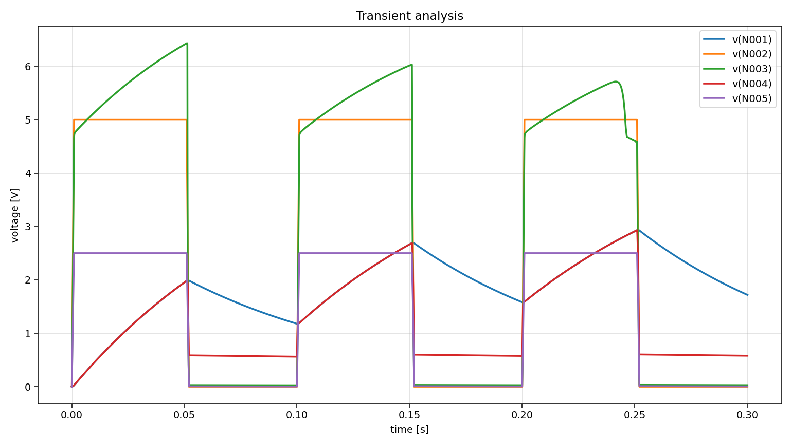

# a08 - ngspice Output and Scenario Report

Questo documento raccoglie la nuova esecuzione di `a08` con web chat e agente.

Non e un output della pipeline. E una nota di lavoro per noi.

## Circuit image


## Base pipeline run

Comando usato:

```powershell
python scripts\pipeline_2.0\run_pipeline2.py --batch batchA --circuits a08 --run-spice --ngspice-executable "C:\Users\m.profilo\Spice64\bin\ngspice_con.exe"
```

File principali:

```text
outputs/pipeline2.0/batchA/a08/03_node_map.json
outputs/pipeline2.0/batchA/a08/04_values_bound.json
outputs/pipeline2.0/batchA/a08/06_component_rules.json
outputs/pipeline2.0/batchA/a08/07_netlist.cir
outputs/pipeline2.0/batchA/a08/07_spice_emit_report.json
outputs/pipeline2.0/batchA/a08/08_spice_run.json
outputs/pipeline2.0/batchA/a08/08_ngspice_stdout.txt
outputs/pipeline2.0/batchA/a08/08_ngspice_stderr.txt
outputs/pipeline2.0/batchA/a08/08_tran.csv
outputs/pipeline2.0/batchA/a08/08_tran_plot.png
```

## Transient plot



## Initial symptom

Domanda iniziale usata in chat:

```text
Il LED non lampeggia come mi aspetterei, quale potrebbe essere il problema?
```

## Initial agent response

La nuova prima risposta dell'agente, dopo il reset del contesto chat, resta
coerente ma sposta leggermente il focus diagnostico rispetto alla versione
precedente.

### Stato della simulazione

L'agente riconosce correttamente che:

- ngspice e stato eseguito con successo;
- `08_ngspice_stderr.txt` e vuoto;
- sono presenti `08_tran.csv` e `08_tran_plot.png`;
- non ci sono segnali forti di errore topologico.

Questa parte e corretta: `a08` non e un caso di fallimento SPICE, quindi ha
senso restare in modalita di diagnosi elettrica e non chiedere subito
l'immagine.

### Diagnosi iniziale

In questa versione l'agente mette in evidenza soprattutto la struttura del ramo
LED/transistor:

- il LED `Dled12_1` e tra `N002` e `N003`, non verso massa;
- l'emettitore del transistor non e a massa, ma sul nodo `N005`;
- `N005` e a sua volta condizionato da `Rresistor22_3` e `Rresistor22_2`;
- `N001` mostra comunque una dinamica lenta coerente con la rete RC.

Quindi la diagnosi iniziale diventa:

- il circuito e simulabile;
- il segnale c'e davvero;
- il comportamento non sembra quello di un lampeggiatore ON/OFF netto;
- il problema puo dipendere sia dalla struttura del ramo LED/transistor sia
  dalla temporizzazione RC;
- inoltre l'ampiezza `0-5 V` della sorgente e dichiarata come assunzione
  manuale, quindi resta una variabile diagnostica plausibile.

Anche questa diagnosi e prudente e ben formulata:

- non finge di sapere gia la causa unica;
- non attribuisce il problema a topologia sbagliata;
- non richiede immagine;
- mantiene l'ipotesi aperta tra:
  - ampiezza della sorgente
  - bias/pilotaggio della base
  - costante di tempo RC
  - struttura del ramo LED/transistor

### Scenari iniziali proposti

L'agente propone tre scenari semplici, tutti eseguibili e non combinati.

#### Scenario 1

Titolo:

```text
Aumentare l'ampiezza della sorgente di ingresso
```

Idea:

- modificare `Vsignal_source23_1`
- passare da `PULSE(0 5 ...)` a `PULSE(0 10 ...)`

Valutazione:

- scenario naturale;
- coerente con il fatto che l'ampiezza 0-5 V e una nostra assunzione manuale;
- sensato, ma non il piu interno alla struttura del circuito.

#### Scenario 2

Titolo:

```text
Ridurre la resistenza di base Rresistor22_4
```

Idea:

- modificare `Rresistor22_4` da `68k` a `33k`

Valutazione:

- scenario buono;
- agisce direttamente sul pilotaggio della base;
- usa correttamente la nuova primitiva `change_component_value`;
- ma in questa nuova lettura iniziale non e il primo scenario piu informativo.

#### Scenario 3

Titolo:

```text
Ridurre la capacita Ccapacitor4_1
```

Idea:

- modificare `Ccapacitor4_1` da `10u` a `1u`

Valutazione:

- scenario coerente;
- testa bene l'ipotesi della costante di tempo troppo lenta;
- resta generale e non artificiale;
- in questa nuova diagnosi iniziale e il candidato piu interessante come primo
  scenario da eseguire.

### Richiesta immagine

L'agente conclude con:

```text
Richiede immagine: no
```

Anche questo e coerente con le regole attuali del prompt: il circuito e
simulabile, il graph e internamente abbastanza coerente e non ci sono indizi
forti per passare subito a correzione topologica.

### Nota tecnica

La risposta salvata in `11_agent_response_chat.md` presenta ancora un problema
di encoding nel testo italiano (per esempio `e`, `capacita`, ecc.).

Questo non invalida il ragionamento dell'agente, ma va sistemato nella web chat
o nel salvataggio della risposta.

### Decisione operativa

Con questa nuova risposta iniziale, il primo scenario scelto da eseguire e:

```text
scenario 3
```

Motivo:

- e il test piu coerente con il ramo RC, che qui emerge come direzione
  diagnostica molto promettente;
- e piu "intrinseco" del test sulla sorgente;
- e piu informativo, in questo specifico ramo di prova, del solo intervento
  sulla resistenza di base.

## Scenario 1

### User request

```text
Esegui scenario 1
```

### Agent proposal

```text
Scenario selezionato: variare l'ampiezza della sorgente di ingresso.

Azione tecnica eseguita:

- `change_source_value`
- target: `Vsignal_source23_1`
- valore: `PULSE(0 10 0 1ms 1ms 50ms 100ms)`

Obiettivo diagnostico:

- verificare se la sorgente abbia ancora un ruolo forte nel comportamento del
  circuito;
- capire se la sorgente possa competere con l'evidenza forte gia ottenuta sul
  ramo RC.
```

### Execution result

```text
La run scenario e stata eseguita correttamente.

Netlist scenario modificata:

Vsignal_source23_1 N002 0 PULSE(0 10 0 1ms 1ms 50ms 100ms)

Stato step 12:

- action applied: yes
- spice status: success
- diagnostic outcome: partially_resolved
```

Dettagli principali da `scenario_comparison.json`:

```text
v(N001).vpp: 2.9355 -> 5.8455
v(N004).vpp: 2.9312 -> 5.6928
v(N003).vpp: 6.4351 -> 12.9591
```

### Interpretation

```text
Questo scenario e molto forte, piu di quanto ci aspettassimo.

La variazione della sorgente produce effetti molto ampi proprio sui tre nodi
chiave:

- `N001`, cioe il nodo RC;
- `N004`, cioe la base del transistor;
- `N003`, cioe il nodo del ramo LED/transistor.

Conclusione pratica:

- la sorgente non e affatto una leva secondaria;
- non possiamo piu leggere `a08` come caso dominato solo dalla costante di
  tempo RC;
- il comportamento sembra dipendere in modo importante dall'interazione tra:
  - ampiezza della sorgente
  - temporizzazione RC
  - trasferimento verso la base del transistor
```

## Scenario 2

### User request

```text
Non eseguito in questo ramo di prova.
```

### Agent proposal

```text
In questo ramo di prova, la modifica su `Rresistor22_4` non e stata eseguita
come scenario 2 iniziale.
```

### Execution result

```text
Non eseguito in questo ramo di prova.
```

### Interpretation

```text
Non applicabile in questo ramo di prova. La stessa idea viene ripresa piu avanti
come `scenario_4`, dopo l'evidenza forte ottenuta da `scenario_3`.
```

## Scenario 3

### User request

```text
Esegui scenario 3
```

### Agent proposal

```text
Scenario selezionato: modificare la costante di tempo del nodo `N001`.

Azione tecnica eseguita:

- `change_component_value`
- target: `Ccapacitor4_1`
- valore: `1u`

Obiettivo diagnostico:

- verificare se la costante di tempo del ramo RC e la vera causa del mancato
  lampeggio atteso;
- osservare se una riduzione del condensatore accelera e rafforza la risposta
  del circuito.
```

### Execution result

```text
La run scenario e stata eseguita correttamente.

Netlist scenario modificata:

Ccapacitor4_1 N001 0 1u

Stato step 12:

- action applied: yes
- spice status: success
- diagnostic outcome: partially_resolved
```

Dettagli principali da `scenario_comparison.json`:

```text
v(N001).vpp: 2.9355 -> 4.8249
v(N004).vpp: 2.9312 -> 3.7853
v(N003).vpp: 6.4351 -> 7.2251
```

### Interpretation

```text
Anche in questo nuovo ramo di prova, scenario 3 risulta molto informativo.

Qui il circuito reagisce in modo netto:

- il nodo RC `N001` aumenta fortemente la sua escursione;
- la base `N004` cambia in modo marcato;
- anche `N003` mostra una variazione sensibile.

Quindi l'ipotesi sulla costante di tempo del ramo RC risulta rafforzata in modo
chiaro.

Conclusione pratica:

- scenario 3 non dimostra ancora da solo che il LED stia lampeggiando in modo
  corretto;
- pero mostra che la temporizzazione e una leva molto piu promettente della sola
  modifica di `Rresistor22_4`;
- in questo punto del lavoro la direzione diagnostica piu forte sembra il ramo
  RC, non il solo pilotaggio resistivo della base.
```

## Additional scenarios or combined scenarios

### Follow-up question after scenario 3

Domanda usata:

```text
Ho eseguito scenario 3 e il ramo RC cambia in modo molto netto. Qual e adesso l'ipotesi piu probabile? Conviene provare scenario 2 come supporto, scenario 1 sulla sorgente, oppure proporresti direttamente uno scenario combinato?
```

### Agent answer

L'agente usa correttamente l'unica evidenza eseguita disponibile, cioe
`scenario_3`, e costruisce la diagnosi successiva in modo prudente.

Punti chiave della risposta:

- riconosce che `scenario_3` modifica in modo netto `N001`, `N004` e `N003`;
- conclude che la direzione piu promettente e la catena:
  - nodo RC `N001`
  - trasferimento verso la base
  - effetto sul transistor e quindi sul ramo LED
- non da priorita alla sorgente `Vsignal_source23_1`, perche il drive e gia
  presente e funzionante;
- non passa ancora a uno scenario combinato, perche esiste una sola evidenza
  eseguita e conviene prima isolare il secondo elemento della stessa ipotesi.

### Key diagnostic conclusion

La conclusione intermedia dell'agente e questa:

```text
la causa piu probabile e nel trasferimento temporale RC -> base del transistor
```

In particolare:

- `scenario_3` ha rafforzato l'ipotesi sul ramo RC;
- il prossimo elemento piu naturale da testare non e la sorgente, ma
  `Rresistor22_4`, cioe il collegamento tra `N001` e `N004`.

### Scenario 4 proposed

Titolo proposto:

```text
Rendere piu forte il pilotaggio della base da N001
```

JSON tecnico proposto:

```json
{
  "scenario_id": "scenario_4",
  "title": "Rendere piu forte il pilotaggio della base da N001",
  "hypothesis": "Dopo l'evidenza di scenario_3, il comportamento del LED e probabilmente dominato dal trasferimento RC verso la base tramite Rresistor22_4 piu che dalla sola sorgente di ingresso.",
  "actions": [
    {
      "type": "change_component_value",
      "target": "Rresistor22_4",
      "value": "33k"
    }
  ],
  "rerun_from": "07",
  "analysis": "tran",
  "compare": ["v(N001)", "v(N004)", "v(N003)"]
}
```

### Evaluation of the proposal

Questo scenario ha senso.

Anche se formalmente si chiama `scenario_4`, in pratica e un test di supporto
mirato su `Rresistor22_4`, quindi:

- non e ancora un combinato;
- non e un salto artificiale;
- resta coerente con la regola di testare prima il secondo elemento della stessa
  ipotesi forte, prima di combinare piu azioni.

In questo ramo di prova, la scelta dell'agente e prudente e ben motivata.

## Scenario 4

### User request

```text
Esegui questo scenario
```

### Agent proposal

```text
Scenario selezionato: rendere piu forte il pilotaggio della base da N001.

Azione tecnica eseguita:

- `change_component_value`
- target: `Rresistor22_4`
- valore: `33k`

Obiettivo diagnostico:

- verificare se, dopo l'evidenza forte ottenuta sul ramo RC, anche il
  collegamento `N001 -> Rresistor22_4 -> N004` aggiunge un effetto diagnostico
  utile;
- capire se `Rresistor22_4` sia un fattore dominante oppure secondario.
```

### Execution result

```text
La run scenario e stata eseguita correttamente.

Netlist scenario modificata:

Rresistor22_4 N001 N004 33k

Stato step 12:

- action applied: yes
- spice status: success
- diagnostic outcome: partially_resolved
```

Dettagli principali da `scenario_comparison.json`:

```text
v(N001).vpp: 2.9355 -> 2.8791
v(N004).vpp: 2.9312 -> 2.8748
v(N003).vpp: 6.4351 -> 6.4355
```

### Interpretation

```text
Questo scenario e tecnicamente valido ma diagnosticamente debole.

Le grandezze chiave cambiano tutte, ma in modo molto piccolo:

- `N001` quasi non cambia;
- `N004` quasi non cambia;
- `N003`, il nodo piu vicino al LED, resta praticamente identico.

Quindi `Rresistor22_4` non sembra il fattore dominante del problema.

Conclusione pratica:

- il ramo RC resta la pista piu forte;
- la riduzione di `Rresistor22_4` aggiunge poco;
- il ruolo di `Rresistor22_4` appare secondario rispetto a `Ccapacitor4_1`.
```

### Follow-up question after scenarios 3 and 4

Domanda usata:

```text
Ho eseguito scenario 3 e scenario 4. Scenario 3 cambia molto il circuito, mentre scenario 4 aggiunge pochissimo. A questo punto qual e la conclusione diagnostica piu probabile? Conviene ancora provare scenario 1 sulla sorgente oppure il fattore dominante sembra ormai la costante di tempo RC?
```

### Agent answer

La risposta dell'agente prima di eseguire `scenario_1` era prudente e sensata
per i dati disponibili in quel momento.

Dopo l'esecuzione di `scenario_1`, il quadro cambia in modo importante:

- la sorgente produce un effetto addirittura piu forte di `scenario_3` sui nodi
  chiave;
- quindi la lettura "domina solo la rete RC" non e piu sufficiente.

### Final question after scenario 1

Domanda usata:

```text
Ho eseguito anche scenario 1. Rispetto al base run, scenario 1 cambia ancora piu di scenario 3 i nodi N001, N004 e N003. A questo punto qual e la conclusione diagnostica finale piu probabile? Sembra dominare solo la rete RC, oppure il comportamento dipende dall'interazione tra ampiezza della sorgente e temporizzazione RC?
```

### Expected direction

Dopo l'esecuzione di `scenario_1`, la conclusione attesa non dovrebbe piu essere
"domina solo la rete RC".

La lettura piu onesta, a questo punto, e che il comportamento di `a08` dipende
fortemente dall'interazione tra:

- sorgente `Vsignal_source23_1`
- rete RC su `N001`
- trasferimento verso la base `N004`

## Final diagnostic conclusion

### Agent final answer

L'agente risponde in modo convincente e abbastanza prudente.

Punti chiave della risposta finale:

- `scenario_1` e il test con effetto piu forte tra quelli eseguiti;
- `scenario_3` conferma che la rete RC conta davvero;
- `scenario_4` ridimensiona il ruolo del solo `Rresistor22_4`;
- quindi il comportamento non e spiegato bene da una sola rete RC autosufficiente;
- la conclusione piu probabile e una **interazione tra ampiezza della sorgente e
  temporizzazione RC**, con evidenza piu forte a favore della sorgente come leva
  principale tra gli esperimenti svolti.

### Final interpretation

La conclusione finale piu solida per `a08`, sulla base dei test eseguiti, e:

```text
il comportamento non dipende solo dalla rete RC;
dipende dall'interazione tra sorgente di ingresso e temporizzazione RC,
con effetto piu forte osservato quando aumenta l'ampiezza di Vsignal_source23_1
```

Questa formulazione e coerente con i tre scenari eseguiti:

- `scenario_3`: effetto forte, quindi RC rilevante;
- `scenario_4`: effetto debole, quindi il solo `Rresistor22_4` non domina;
- `scenario_1`: effetto molto forte, quindi la sorgente non e secondaria.

### Stato finale del caso a08

Per questo circuito possiamo considerare il caso ben esplorato a livello
diagnostico:

- la topologia non mostra errori forti;
- il circuito e simulabile;
- gli scenari hanno individuato le leve che contano davvero;
- la risposta finale dell'agente e credibile e ben motivata.

## Final update with last question and answer

Questa sezione aggiorna in modo pulito il report con l'ultima domanda fatta in
chat e con la conclusione finale effettivamente raggiunta.

### Last user question

```text
Ho eseguito anche scenario 1. Rispetto al base run, scenario 1 cambia ancora piu di scenario 3 i nodi N001, N004 e N003. A questo punto qual e la conclusione diagnostica finale piu probabile? Sembra dominare solo la rete RC, oppure il comportamento dipende dall'interazione tra ampiezza della sorgente e temporizzazione RC?
```

### Last agent answer

La risposta finale dell'agente e coerente con i numeri osservati nei confronti
scenario/base:

- `scenario_1` ha l'effetto piu forte sui nodi chiave;
- `scenario_3` conferma che la rete RC e davvero rilevante;
- `scenario_4` mostra invece che il solo intervento su `Rresistor22_4` non
  spiega il comportamento.

In sintesi, l'agente conclude che:

```text
il comportamento non dipende solo dalla rete RC;
dipende dall'interazione tra ampiezza della sorgente e temporizzazione RC,
con evidenza piu forte a favore dell'ampiezza della sorgente come leva
principale tra gli scenari eseguiti
```

### Why this answer is good

Questa conclusione e quella giusta da salvare come esito finale del caso `a08`,
perche:

- non forza altri scenari inutili;
- non riduce tutto al solo ramo RC;
- usa correttamente il fatto che `scenario_1` cambia piu di `scenario_3` i nodi
  `N001`, `N004` e `N003`;
- mantiene comunque `scenario_3` come evidenza importante sul ruolo della rete
  RC.

### Final takeaway for a08

Per `a08`, la lettura finale piu solida e:

- **non solo RC**;
- **non solo pilotaggio base tramite `Rresistor22_4`**;
- **interazione tra sorgente e temporizzazione RC**;
- **sorgente come leva singola piu forte tra gli scenari testati**.
