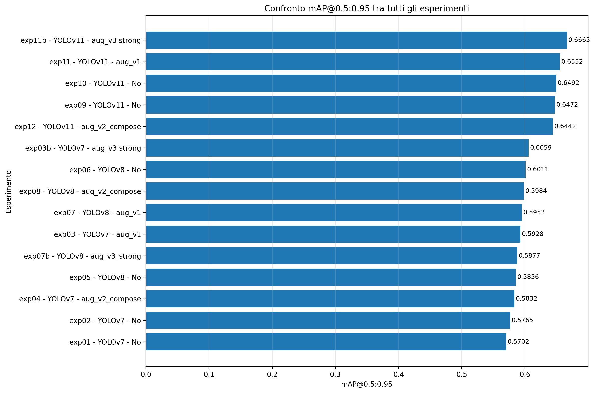
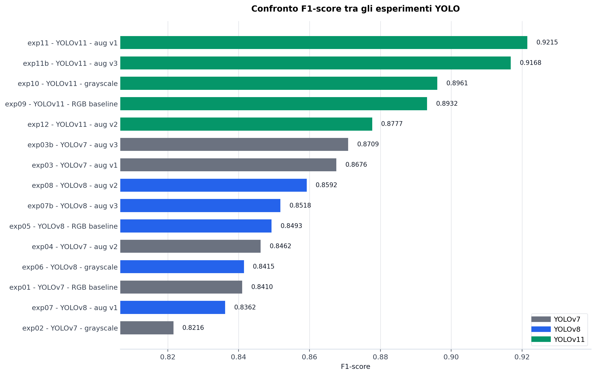
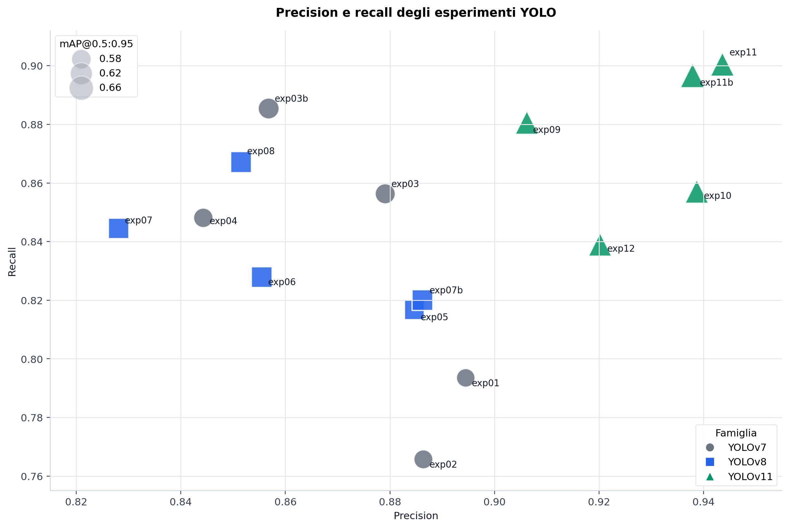
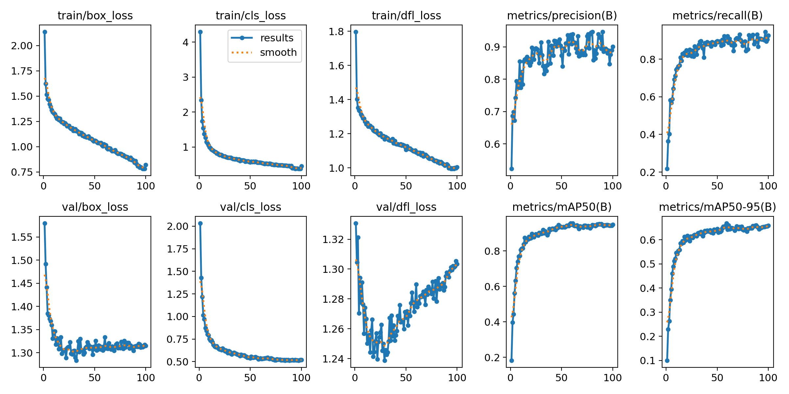
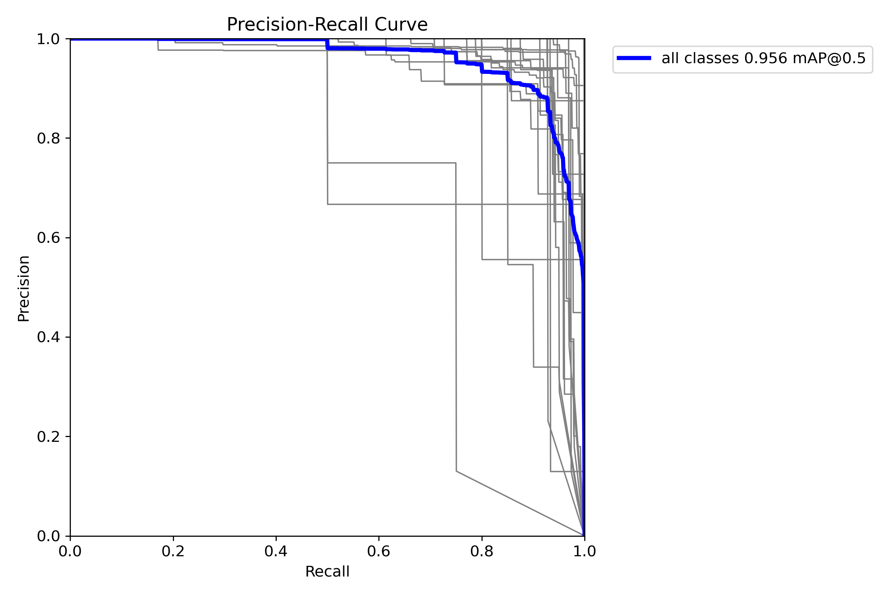
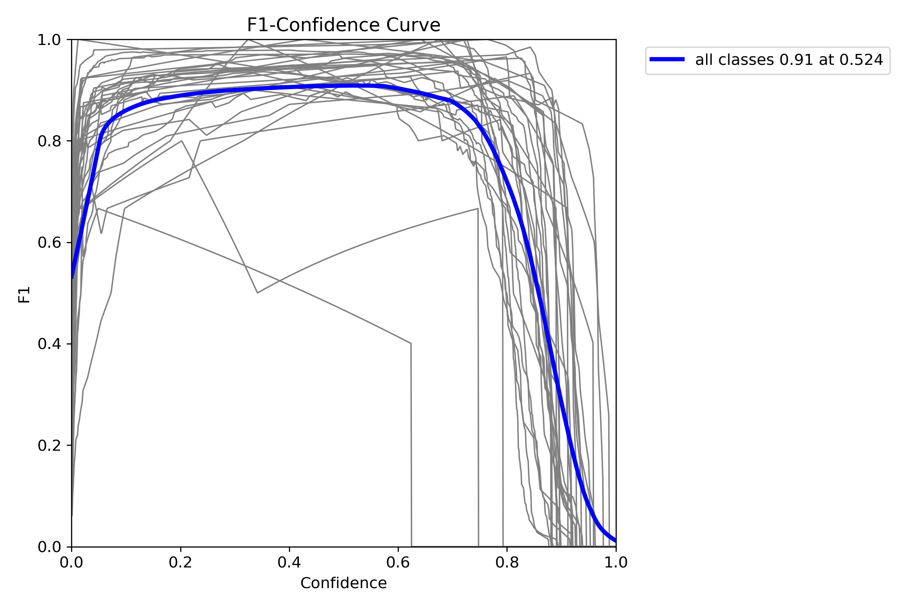
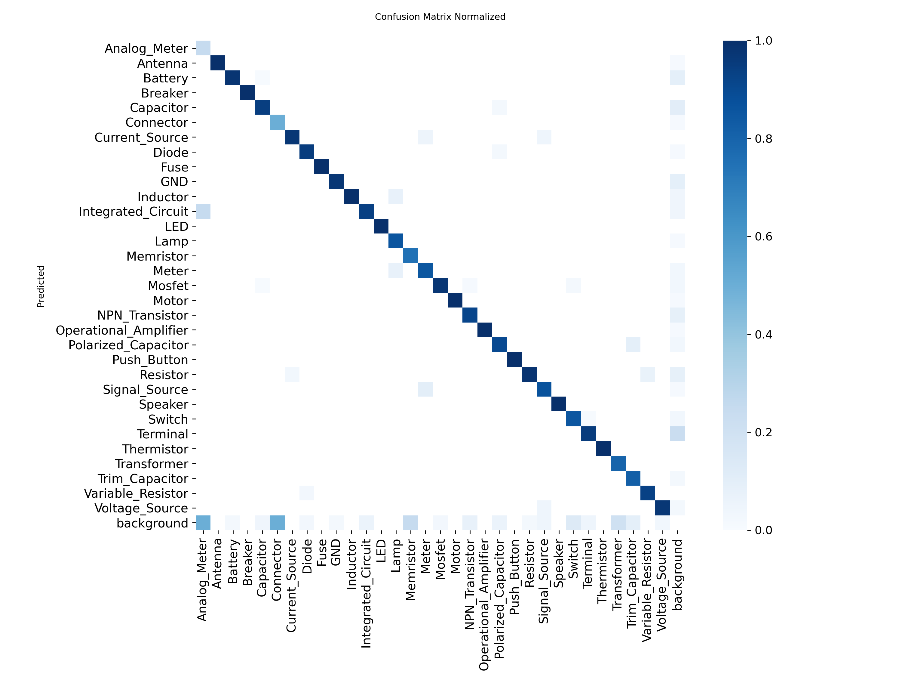
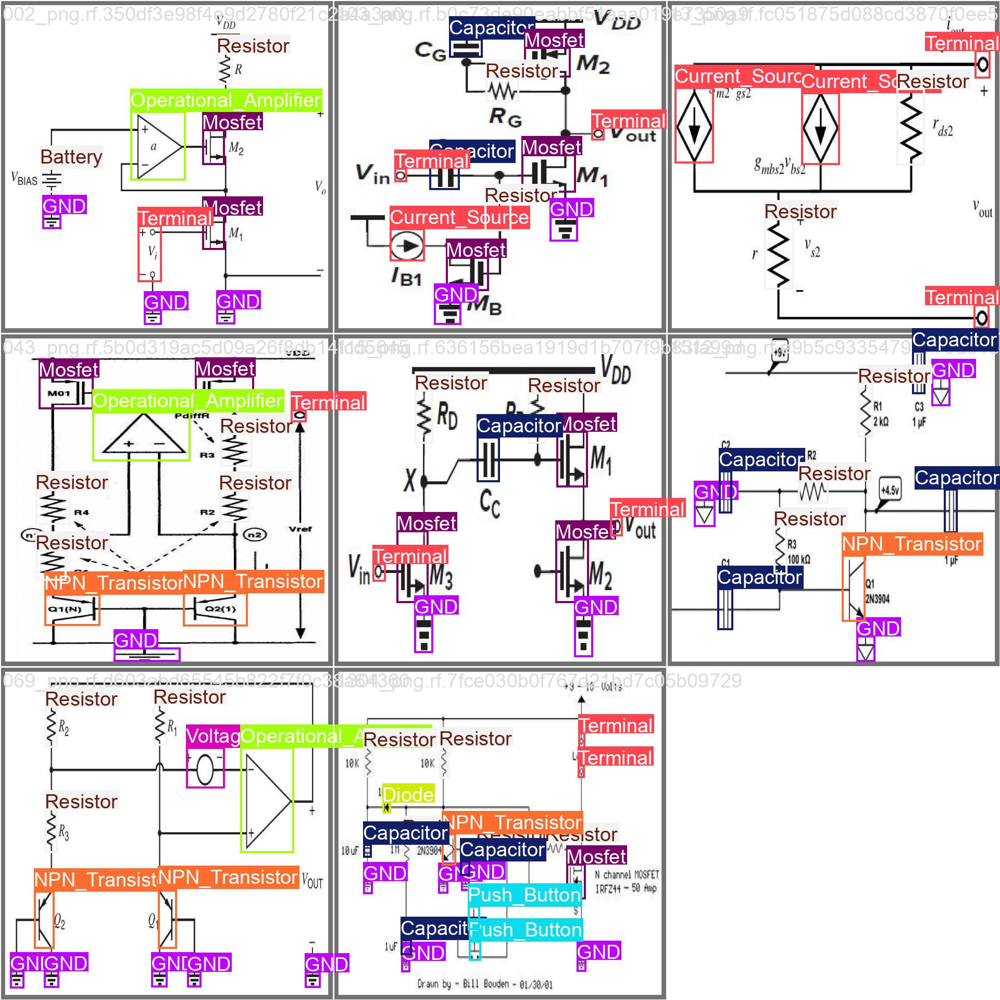
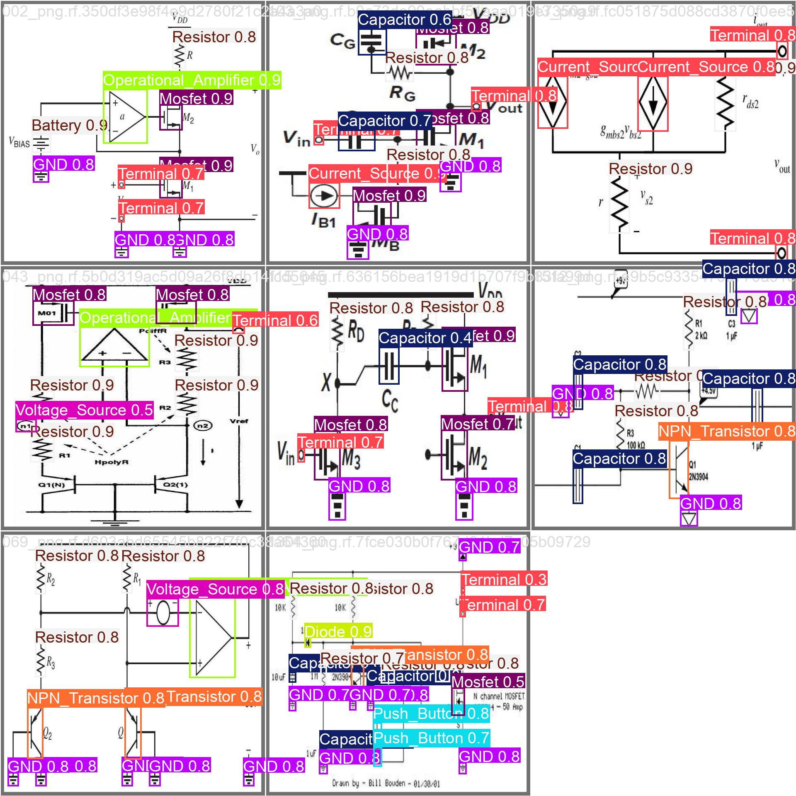

# Capitolo X — Risultati sperimentali dell'object detection

## X.1 Obiettivo dell'analisi

Questa fase sperimentale ha avuto l'obiettivo di individuare il detector più adatto al riconoscimento dei simboli presenti negli schemi elettrici. Il confronto ha coinvolto tre famiglie di modelli — YOLOv7, YOLOv8 e YOLOv11 — e cinque diverse configurazioni dei dati: immagini RGB originali, immagini in scala di grigi e tre politiche di data augmentation offline.

La selezione finale non è stata basata su una sola metrica. Precision e recall descrivono rispettivamente l'affidabilità delle predizioni e la capacità di recuperare i simboli realmente presenti; l'F1-score ne misura il compromesso. Le metriche mAP valutano invece la qualità complessiva della detection: `mAP@0.5` a una soglia IoU permissiva e `mAP@0.5:0.95` mediando soglie progressivamente più severe. Quest'ultima è stata considerata il criterio principale per la scelta operativa, perché le fasi successive della pipeline dipendono non soltanto dalla classe assegnata, ma anche dalla precisione geometrica delle bounding box.

## X.2 Protocollo sperimentale

Il dataset utilizzato per il benchmark comprende 628 immagini e 32 classi di simboli elettrici. Gli split, mantenuti invariati durante gli esperimenti, sono riportati nella Tabella X.1. La revisione `dataset_v3` attualmente conservata nella repository contiene invece 627 immagini e annotazioni aggiornate; rappresenta uno snapshot successivo e non deve essere utilizzata per ricostruire la numerosità dei training qui analizzati.

**Tabella X.1 — Composizione del dataset di riferimento.**

| Split | Immagini | Incidenza sul totale |
| --- | ---: | ---: |
| Training | 440 | 70,1% |
| Validation | 126 | 20,1% |
| Test | 62 | 9,9% |
| **Totale** | **628** | **100,0%** |

Tutte le immagini sono state ridimensionate a 1024 × 1024 pixel e annotate nel formato YOLO. Il validation set contiene 1.625 istanze. Per rendere il confronto il più possibile omogeneo, ogni training è stato eseguito per 100 epoche con batch size 4 su GPU Tesla T4 da 16 GB. Per YOLOv8 e YOLOv11 sono stati impiegati pesi pre-addestrati, ottimizzatore automatico, seed 0 ed esecuzione deterministica. Alcune sessioni sono state riprese dal checkpoint `last.pt` dopo l'interruzione del runtime Colab. Nel capitolo le epoche sono numerate uniformemente da 1 a 100: gli indici 0–99 presenti nei log YOLOv7 sono stati pertanto convertiti aggiungendo un'unità.

Per ciascun esperimento è stata selezionata la riga del training con il valore massimo di `mAP@0.5:0.95`. Le metriche riportate nelle sezioni successive si riferiscono quindi alla medesima regola di selezione del best checkpoint. L'F1-score è stato calcolato come media armonica di precision e recall:

> **F1-score = 2 × (Precision × Recall) / (Precision + Recall)**

### X.2.1 Allineamento delle fonti sperimentali

Negli output sono conservate due esecuzioni della configurazione YOLOv11 con augmentation forte. La run preliminare, nella cartella `exp11b_yolo11_rgb_aug_strong_v3`, raggiunge precision 0,9404, recall 0,9049, F1-score 0,9223, `mAP@0.5` 0,9476 e `mAP@0.5:0.95` 0,6666 alla epoch 97. Questi sono i valori riportati nel PDF riepilogativo preliminare.

Il benchmark consolidato utilizza invece la successiva run `exp11b1_yolo11_rgb_aug_strong_v3`, indicata sinteticamente come `exp11b` nelle tabelle finali. Quest'ultima ottiene una `mAP@0.5:0.95` più alta, pari a 0,6687, e una `mAP@0.5` pari a 0,9559; è inoltre il checkpoint effettivamente referenziato dalla pipeline. Per evitare di contare due volte la stessa configurazione sperimentale, la run preliminare è documentata in questa nota ma non inclusa nella tabella master delle 15 configurazioni. In caso di divergenza tra il PDF preliminare e i report aggiornati, fanno fede i file `results.csv` e il checkpoint usato dal codice della pipeline.

## X.3 Varianti del dataset e data augmentation

Le trasformazioni sono state applicate offline al solo training set; validation e test sono rimasti invariati. Questa scelta evita che immagini derivate dallo stesso campione compaiano sia nell'addestramento sia nella valutazione.

**Tabella X.2 — Varianti del dataset impiegate.**

| Variante | Immagini train | Trasformazione principale | Scopo |
| --- | ---: | --- | --- |
| RGB baseline | 440 | Nessuna | Riferimento comune |
| Grayscale | 440 | Conversione integrale in scala di grigi | Valutare il contributo dell'informazione cromatica |
| `aug_v1` | 880 | Affine e fotometrica lieve | Aumentare la variabilità senza alterare fortemente la struttura |
| `aug_v2_compose` | 726 | Composizione affiancata di due diagrammi | Creare combinazioni spaziali e densità di simboli nuove |
| `aug_v3 strong` | 880 | Affine e fotometrica forte | Aumentare robustezza a rotazioni, traslazioni e variazioni di acquisizione |

La politica `aug_v1` genera una copia trasformata per ogni immagine originale. Comprende rotazioni entro ±7°, traslazioni entro ±3%, scala nell'intervallo 0,97–1,03, leggere variazioni di luminosità e contrasto e rumore gaussiano. Le bounding box con visibilità inferiore al 30% vengono escluse.

La variante `aug_v2_compose` aggiunge un numero di campioni pari al 65% del training set originale. Ogni nuova immagine affianca due diagrammi, separati da uno spazio bianco, quindi ridimensiona e centra il risultato su una tela 1024 × 1024. Il 35% delle composizioni riceve inoltre una lieve perturbazione fotometrica. Questa strategia aumenta il numero di simboli per immagine, ma modifica anche la distribuzione spaziale delle bounding box.

La politica `aug_v3 strong` genera anch'essa una copia per ogni immagine originale, applicando rotazioni con modulo compreso tra 25° e 45°, traslazioni tra l'8% e il 15% e scala nell'intervallo 0,93–1,07. Sono aggiunte variazioni di luminosità e contrasto nel 75% dei casi e rumore gaussiano nel 50%; la visibilità minima accettata per una bounding box è pari al 20%.

## X.4 Risultati complessivi

Il benchmark consolidato comprende 15 configurazioni: cinque per ciascuna famiglia YOLO. La Tabella X.3 raccoglie i risultati con una precisione uniforme a quattro cifre decimali.

**Tabella X.3 — Risultati di tutti gli esperimenti completati.**

| Exp. | Modello | Input | Augmentation | Precision | Recall | F1-score | mAP@0.5 | mAP@0.5:0.95 | Best epoch |
| --- | --- | --- | --- | ---: | ---: | ---: | ---: | ---: | ---: |
| exp01 | YOLOv7 | RGB | Nessuna | 0,8945 | 0,7935 | 0,8410 | 0,8245 | 0,5702 | 88 |
| exp02 | YOLOv7 | Grayscale | Nessuna | 0,8864 | 0,7657 | 0,8216 | 0,8272 | 0,5765 | 94 |
| exp03 | YOLOv7 | RGB | `aug_v1` | 0,8791 | 0,8563 | 0,8676 | 0,8836 | 0,5928 | 70 |
| exp04 | YOLOv7 | RGB | `aug_v2_compose` | 0,8443 | 0,8481 | 0,8462 | 0,8587 | 0,5832 | 75 |
| exp03b | YOLOv7 | RGB | `aug_v3 strong` | 0,8568 | 0,8854 | 0,8709 | 0,8972 | 0,6059 | 98 |
| exp05 | YOLOv8 | RGB | Nessuna | 0,8847 | 0,8167 | 0,8493 | 0,8553 | 0,5856 | 80 |
| exp06 | YOLOv8 | Grayscale | Nessuna | 0,8555 | 0,8279 | 0,8415 | 0,8760 | 0,6012 | 58 |
| exp07 | YOLOv8 | RGB | `aug_v1` | 0,8281 | 0,8445 | 0,8362 | 0,8879 | 0,5953 | 43 |
| exp08 | YOLOv8 | RGB | `aug_v2_compose` | 0,8515 | 0,8671 | 0,8592 | 0,8818 | 0,6024 | 77 |
| exp07b | YOLOv8 | RGB | `aug_v3 strong` | 0,8862 | 0,8200 | 0,8518 | 0,8747 | 0,6001 | 93 |
| exp09 | YOLOv11 | RGB | Nessuna | 0,9062 | 0,8806 | 0,8932 | 0,9115 | 0,6472 | 70 |
| exp10 | YOLOv11 | Grayscale | Nessuna | 0,9387 | 0,8571 | 0,8961 | 0,9300 | 0,6492 | 78 |
| exp11 | YOLOv11 | RGB | `aug_v1` | **0,9436** | **0,9005** | **0,9215** | 0,9513 | 0,6553 | 63 |
| exp12 | YOLOv11 | RGB | `aug_v2_compose` | 0,9202 | 0,8390 | 0,8777 | 0,9146 | 0,6443 | 34 |
| **exp11b** | **YOLOv11** | **RGB** | **`aug_v3 strong`** | 0,9379 | 0,8967 | 0,9168 | **0,9559** | **0,6687** | 59 |

**Figura X.1 — Confronto globale della `mAP@0.5:0.95`.** Le cinque configurazioni YOLOv11 occupano le prime cinque posizioni. La run `exp11b` raggiunge il valore massimo, pari a 0,6687.

**Figura X.2 — Confronto globale dell'F1-score.** `exp11` ottiene il miglior equilibrio tra precision e recall; `exp11b` si colloca immediatamente dopo.

**Figura X.3 — Relazione tra precision e recall.** La dimensione dei punti rappresenta la `mAP@0.5:0.95`. Gli esperimenti YOLOv11 si concentrano nella regione a precision e recall più elevate; `exp11` e `exp11b` costituiscono le due soluzioni dominanti.

## X.5 Analisi per famiglia

### X.5.1 YOLOv7

La baseline RGB di YOLOv7 (`exp01`) mostra una precision elevata, pari a 0,8945, ma una recall più contenuta (0,7935). La conversione grayscale (`exp02`) incrementa solo marginalmente le metriche mAP e riduce ulteriormente recall e F1-score. L'eliminazione del colore non produce quindi un vantaggio complessivo per questa famiglia.

Le trasformazioni offline migliorano soprattutto la capacità di recuperare i simboli. `aug_v1` porta la recall a 0,8563 e l'F1-score a 0,8676. La composizione di diagrammi (`exp04`) è meno efficace: il guadagno rispetto alla baseline rimane limitato e la precision scende a 0,8443. Il risultato migliore della famiglia è `exp03b`, addestrato con augmentation forte. Rispetto alla baseline, la recall cresce di 0,0919, l'F1-score di 0,0299 e la `mAP@0.5:0.95` di 0,0357. Il costo è una diminuzione della precision di 0,0377.

L'augmentation forte sposta quindi YOLOv7 verso un comportamento più sensibile: il detector perde una parte dell'affidabilità delle singole predizioni, ma omette molti meno simboli e migliora la qualità media della localizzazione.

### X.5.2 YOLOv8

YOLOv8 parte da una baseline leggermente superiore a YOLOv7 nelle metriche di copertura e mAP, ma non nella precision. La conversione grayscale (`exp06`) aumenta `mAP@0.5` da 0,8553 a 0,8760 e `mAP@0.5:0.95` da 0,5856 a 0,6012, pur riducendo l'F1-score. Il preprocessing in scala di grigi favorisce pertanto la localizzazione, ma non il bilanciamento complessivo.

Nessuna politica di augmentation domina tutte le metriche. `exp07` ottiene la migliore `mAP@0.5` della famiglia (0,8879); `exp07b` la migliore precision (0,8862); `exp08` raggiunge invece la migliore recall (0,8671), il miglior F1-score (0,8592) e la migliore `mAP@0.5:0.95` (0,6024). Per questo motivo `exp08` è la configurazione YOLOv8 più equilibrata.

Il margine tra le migliori run YOLOv7 e YOLOv8 è tuttavia ridotto: sulla metrica più severa `exp03b` supera `exp08` di 0,0035. I risultati non supportano quindi una superiorità netta di YOLOv8 rispetto a YOLOv7 in questo specifico esperimento.

### X.5.3 YOLOv11

YOLOv11 introduce il miglioramento più evidente. Già la baseline RGB (`exp09`) supera le baseline delle due famiglie precedenti in tutte le metriche: rispetto a YOLOv8 RGB, la `mAP@0.5:0.95` cresce da 0,5856 a 0,6472, mentre l'F1-score passa da 0,8493 a 0,8932.

La versione grayscale (`exp10`) incrementa precision e metriche mAP rispetto alla baseline RGB, ma riduce la recall da 0,8806 a 0,8571. Anche in questa famiglia la perdita dell'informazione cromatica produce quindi un compromesso, non un miglioramento uniforme.

La politica leggera `aug_v1` (`exp11`) fornisce il miglior bilanciamento dell'intero studio. Essa raggiunge la precision massima (0,9436), la recall massima (0,9005) e il miglior F1-score (0,9215). L'augmentation forte (`exp11b`) produce valori appena inferiori su queste tre metriche, ma raggiunge la migliore `mAP@0.5` (0,9559) e la migliore `mAP@0.5:0.95` (0,6687).

La variante compose (`exp12`) è la meno convincente del gruppo YOLOv11. La sua `mAP@0.5:0.95` è lievemente inferiore persino alla baseline RGB e la recall scende a 0,8390. La composizione affiancata aumenta artificialmente densità e centralità dei simboli, creando una distribuzione spaziale meno simile a quella del validation set; i risultati suggeriscono che questo scarto di dominio annulli il beneficio della maggiore numerosità.

## X.6 Confronto delle migliori configurazioni

La Tabella X.4 confronta la migliore configurazione di ciascuna famiglia secondo la metrica severa, mantenendo anche precision, recall e F1-score per evitare una lettura unidimensionale.

**Tabella X.4 — Miglior esperimento per famiglia.**

| Famiglia | Esperimento | Precision | Recall | F1-score | mAP@0.5 | mAP@0.5:0.95 |
| --- | --- | ---: | ---: | ---: | ---: | ---: |
| YOLOv7 | exp03b, `aug_v3 strong` | 0,8568 | 0,8854 | 0,8709 | 0,8972 | 0,6059 |
| YOLOv8 | exp08, `aug_v2_compose` | 0,8515 | 0,8671 | 0,8592 | 0,8818 | 0,6024 |
| **YOLOv11** | **exp11b, `aug_v3 strong`** | **0,9379** | **0,8967** | **0,9168** | **0,9559** | **0,6687** |

YOLOv11 `exp11b` supera la migliore configurazione YOLOv7 di 0,0811 in precision, 0,0460 in F1-score, 0,0587 in `mAP@0.5` e 0,0628 in `mAP@0.5:0.95`. Rispetto alla migliore configurazione YOLOv8, il vantaggio sulla metrica severa è pari a 0,0662. Il confronto tra famiglie mostra pertanto una separazione consistente, non limitata a un'unica metrica.

## X.7 Scelta del modello finale

La selezione conclusiva è stata effettuata tra le due run YOLOv11 più forti: `exp11` e `exp11b`.

**Tabella X.5 — Confronto tra i due candidati finali.**

| Metrica | exp11 — `aug_v1` | exp11b — `aug_v3 strong` | Differenza exp11b − exp11 |
| --- | ---: | ---: | ---: |
| Precision | **0,9436** | 0,9379 | −0,0057 |
| Recall | **0,9005** | 0,8967 | −0,0037 |
| F1-score | **0,9215** | 0,9168 | −0,0047 |
| mAP@0.5 | 0,9513 | **0,9559** | +0,0046 |
| mAP@0.5:0.95 | 0,6553 | **0,6687** | +0,0134 |

`exp11` è preferibile se l'unico obiettivo è massimizzare il compromesso precision–recall. Tuttavia, `exp11b` perde meno di mezzo punto percentuale assoluto in F1-score e guadagna 1,34 punti percentuali in `mAP@0.5:0.95`. Il miglioramento è quindi concentrato proprio sulla misura più sensibile alla qualità della localizzazione.

Per la pipeline completa è stato scelto **YOLOv11 con augmentation forte, esperimento `exp11b`**. La cartella sorgente del checkpoint è denominata `exp11b1_yolo11_rgb_aug_strong_v3`; nei riepiloghi e nel seguito della tesi la run è indicata in forma abbreviata come `exp11b`. Il file operativo è `weights/best.pt`, corrispondente al best checkpoint individuato alla epoch 59.

La scelta è motivata da quattro elementi:

1. ottiene la migliore `mAP@0.5` e la migliore `mAP@0.5:0.95` tra tutti i 15 esperimenti;
2. mantiene precision, recall e F1-score molto vicini ai rispettivi massimi globali;
3. mostra un training stabile, con crescita rapida delle metriche e plateau elevato;
4. offre bounding box mediamente più accurate, proprietà rilevante per le successive stime geometriche di terminali e connessioni.

**Figura X.4 — Andamento del training di YOLOv11 `exp11b`.** Le loss di training diminuiscono regolarmente; le metriche di validazione crescono rapidamente e si stabilizzano nella seconda metà dell'addestramento. Il massimo della `mAP@0.5:0.95` è raggiunto alla epoch 59.

**Figura X.5 — Curva precision–recall del modello selezionato.** L'area sottesa alle curve conferma una buona separazione per la maggior parte delle classi e una `mAP@0.5` globale prossima a 0,956.

**Figura X.6 — Curva F1–confidence del modello selezionato.** Il massimo aggregato è circa 0,92 a una confidence prossima a 0,467. Nella pipeline la soglia generale è stata fissata a 0,40 e successivamente adattata per alcune classi più difficili.

## X.8 Analisi qualitativa del modello selezionato

La matrice di confusione normalizzata presenta una diagonale nettamente marcata per la maggior parte delle 32 classi. Ciò indica che gli errori tra categorie diverse sono limitati. Le criticità più visibili riguardano il background, ovvero simboli reali non rilevati o predizioni spurie, e le classi meno rappresentate.

**Figura X.7 — Matrice di confusione normalizzata di YOLOv11 `exp11b`.** Le celle diagonali sono elevate per quasi tutte le classi. Restano più fragili alcune categorie rare o geometricamente ambigue, tra cui `Antenna`, `Analog_Meter`, `Switch` e `Terminal`.

Le immagini di validazione confermano che il modello gestisce schemi con densità e stili grafici differenti e rileva contemporaneamente numerose categorie. Gli errori residui hanno un impatto potenzialmente maggiore sui simboli piccoli, rari o caratterizzati da tratti sottili, poiché una variazione ridotta della bounding box produce una variazione IoU relativamente grande.

**Figura X.8 — Ground truth di un batch di validazione.**

**Figura X.9 — Predizioni di YOLOv11 `exp11b` sul medesimo batch.** Il confronto visuale permette di osservare la copertura dei simboli e gli eventuali scostamenti delle bounding box.

## X.9 Effetto delle strategie di preprocessing

Il confronto trasversale consente di formulare tre osservazioni generali.

In primo luogo, la conversione grayscale non è universalmente vantaggiosa. Essa migliora le metriche mAP nelle tre famiglie rispetto alle rispettive baseline RGB, ma spesso riduce precision, recall o F1-score. Il colore contiene quindi un'informazione limitata per la struttura dei simboli, ma non del tutto irrilevante per il bilanciamento complessivo del detector.

In secondo luogo, l'augmentation lieve e quella forte risultano più affidabili della composizione artificiale. `aug_v1` produce il miglior F1-score globale con YOLOv11; `aug_v3 strong` produce la migliore mAP severa con YOLOv7 e YOLOv11. La politica compose è competitiva soltanto in YOLOv8 e peggiora chiaramente il risultato di YOLOv11. Non è dunque sufficiente aumentare il numero di immagini: le trasformazioni devono preservare una distribuzione visiva coerente con i diagrammi reali.

Infine, l'effetto della stessa augmentation dipende dall'architettura. `aug_v3 strong` migliora nettamente YOLOv7 e YOLOv11, ma in YOLOv8 privilegia la precision senza migliorare il bilancio complessivo. Questo risultato giustifica l'esecuzione del confronto fattoriale, invece dell'assunzione che una politica ottimale per una famiglia sia automaticamente ottimale per le altre.

## X.10 Limiti dell'esperimento

I risultati descrivono in modo coerente il comportamento delle configurazioni sul medesimo validation set, ma devono essere letti considerando alcuni limiti. Ogni configurazione è rappresentata da una singola run con un singolo split; non sono quindi disponibili deviazioni standard o intervalli di confidenza ottenuti da più seed. Le differenze molto piccole, specialmente tra run della stessa famiglia, non possono essere interpretate come evidenza di superiorità statistica.

Il dataset presenta inoltre uno sbilanciamento tra classi. Le metriche aggregate possono nascondere prestazioni meno stabili sulle categorie rare, mentre il numero ridotto di esempi rende più sensibili le metriche per classe. Infine, la selezione è stata condotta sul validation set; il test set deve rimanere separato per la valutazione conclusiva dell'intera pipeline.

Questi limiti non modificano la scelta operativa, poiché il distacco tra YOLOv11 e le famiglie precedenti è ampio e coerente su tutte le metriche. Invitano però a interpretare con cautela le differenze più contenute tra `exp11` ed `exp11b`.

## X.11 Conclusioni

Il confronto sperimentale mostra che YOLOv11 è la famiglia più adatta al riconoscimento dei simboli elettrici nel dataset considerato. La sua baseline supera già le migliori baseline YOLOv7 e YOLOv8, mentre le politiche di augmentation permettono un ulteriore miglioramento.

`exp11`, con augmentation lieve, raggiunge il miglior compromesso precision–recall; `exp11b`, con augmentation forte, raggiunge la migliore qualità media di detection e localizzazione. Poiché la pipeline successiva utilizza la geometria delle bounding box per stimare terminali e connessioni, è stato selezionato il checkpoint **YOLOv11 `exp11b`**, con `mAP@0.5 = 0,9559` e `mAP@0.5:0.95 = 0,6687`.

Il risultato della prima parte della tesi è quindi un detector capace di riconoscere 32 classi di simboli, con precision e recall entrambe prossime a 0,90 o superiori, integrato come primo stadio della pipeline di ricostruzione dello schema elettrico.

---

## Tracciabilità dei risultati

I valori e le figure del capitolo derivano dai seguenti artefatti del repository:

- report aggregato: [`results_comparison_summary.md`](./results_comparison_summary.md);
- report YOLOv7: [`results_yolov7.md`](./results_yolov7.md);
- report YOLOv8: [`results_yolov8.md`](./results_yolov8.md);
- report YOLOv11: [`results_yolov11.md`](./results_yolov11.md);
- riepilogo preliminare in PDF: [`electrical_symbols_yolo_thesis_summary.pdf`](./electrical_symbols_yolo_thesis_summary.pdf), da leggere insieme alla nota di allineamento della Sezione X.2.1;
- log e grafici grezzi: cartelle [`outputs/yolo7`](../../outputs/yolo7), [`outputs/yolo8`](../../outputs/yolo8) e [`outputs/yolo11`](../../outputs/yolo11);
- script di augmentation: [`scripts/augmentation`](../../scripts/augmentation);
- selezione operativa del checkpoint: [`01_detect_components.py`](../../scripts/pipeline_1.0/01_detect_components.py).
