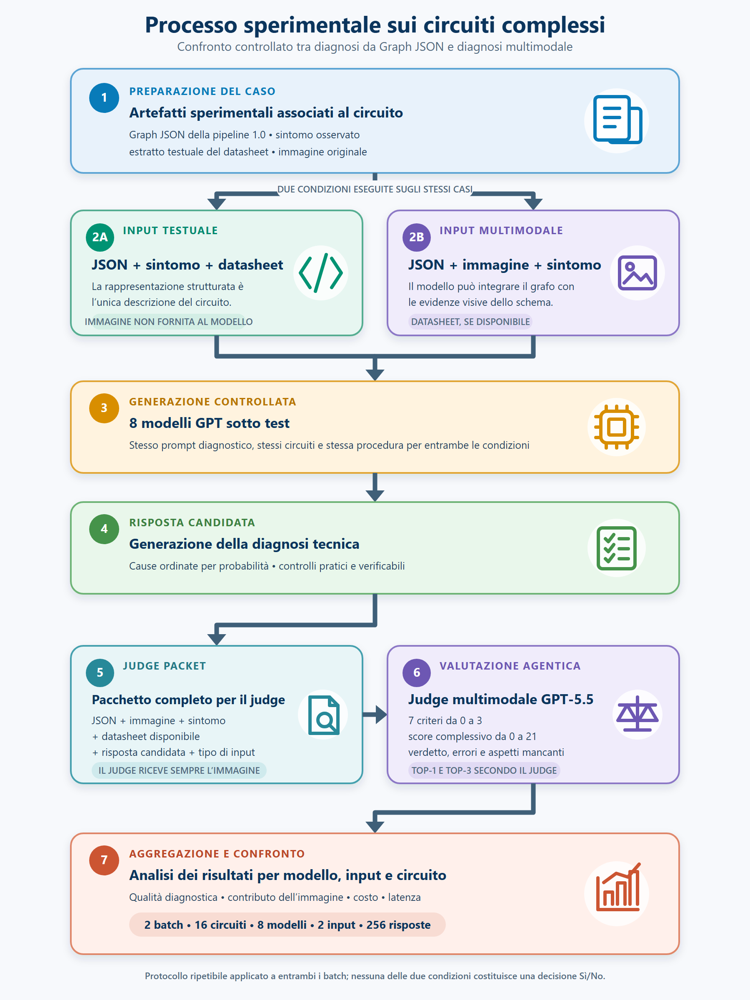

# Valutazione diagnostica dei modelli AI su circuiti complessi

## 1. Obiettivo dell'esperimento

La verifica topologica descritta nel capitolo precedente ha valutato se il Graph JSON prodotto dalla pipeline 1.0 conservasse i componenti, i terminali e i collegamenti visibili nello schema elettrico. Una rappresentazione topologicamente fedele, tuttavia, non è automaticamente utile per un'attività di diagnosi. Il passaggio successivo consiste quindi nel verificare se l'informazione strutturata estratta dalla pipeline possa essere utilizzata da un modello di Artificial Intelligence per formulare ipotesi di guasto tecnicamente plausibili, ordinate e verificabili.

L'esperimento sui circuiti complessi è stato progettato con questo obiettivo. A partire da un sintomo associato a ciascun circuito, diversi modelli linguistici ricevono il Graph JSON, un eventuale estratto del datasheet e, in una seconda configurazione, anche l'immagine originale dello schema. Il compito del modello è interpretare il circuito, individuare le cause più probabili del malfunzionamento e proporre controlli pratici coerenti con le evidenze disponibili.

Il confronto non riguarda pertanto soltanto la capacità generale dei modelli di descrivere un circuito elettronico. L'interesse principale è stabilire se il Graph JSON costituisca una rappresentazione intermedia sufficientemente informativa per supportare il troubleshooting automatico e quale contributo aggiuntivo venga fornito dall'immagine.

### 1.1 Posizione dell'esperimento nel percorso della tesi

La valutazione occupa una posizione intermedia tra due esperimenti distinti:

1. la verifica immagine–Graph JSON, che misura la fedeltà topologica dell'output della pipeline 1.0;
2. la valutazione end-to-end delle modalità CHAT e AGENT, che considera la pipeline 2.0, gli scenari SPICE, l'interazione con l'utente e il processo diagnostico completo.

Il percorso sperimentale può essere sintetizzato come segue:

```text
Fedeltà della rappresentazione topologica
                    ↓
Utilità diagnostica del Graph JSON
                    ↓
Efficacia del sistema agentico end-to-end
```

Nel primo esperimento l'oggetto della valutazione è il grafo; in questo esperimento è la risposta diagnostica generata a partire dal grafo; nell'esperimento finale è invece l'intera traiettoria seguita dall'applicativo. Questa separazione consente di isolare progressivamente la qualità della rappresentazione, la capacità di ragionamento dei modelli e l'efficacia del sistema software completo.

È inoltre necessario distinguere il nome `batch_v2` dalla pipeline 2.0. `batch_v2` identifica esclusivamente il secondo gruppo di circuiti dell'esperimento descritto in questo capitolo. I Graph JSON utilizzati derivano ancora dalla pipeline topologica 1.0; la pipeline 2.0 viene valutata successivamente nell'esperimento CHAT–AGENT.

### 1.2 Domande sperimentali

L'esperimento è organizzato attorno a quattro domande principali:

1. **Sufficienza della rappresentazione strutturata:** il Graph JSON, insieme alle informazioni tecniche disponibili, contiene abbastanza informazione per produrre una diagnosi utile senza mostrare al modello lo schema originale?
2. **Contributo dell'immagine:** l'aggiunta dell'immagine migliora sistematicamente accuratezza, priorità delle cause e qualità dei controlli pratici oppure il suo effetto dipende dal circuito e dal modello?
3. **Effetto della capacità del modello:** modelli mini o nano possono raggiungere risultati confrontabili con un modello più avanzato quando ricevono una rappresentazione topologica esplicita?
4. **Compromesso operativo:** quale modello offre il rapporto più favorevole tra qualità diagnostica, costo e latenza?

Le risposte a queste domande sono rilevanti sia dal punto di vista dell'Artificial Intelligence sia da quello dell'ingegneria del software. Il Graph JSON può infatti essere interpretato come un'interfaccia strutturata tra un sottosistema percettivo, responsabile della comprensione dello schema, e un sottosistema di ragionamento, responsabile della diagnosi.

## 2. Disegno sperimentale



**Figura X.25 — Processo sperimentale della valutazione diagnostica sui circuiti complessi.** Per ciascun circuito vengono eseguite entrambe le configurazioni di input sugli stessi otto modelli. La risposta candidata viene successivamente valutata da un judge multimodale mediante un pacchetto informativo completo: anche quando l'immagine non è fornita al modello sotto test, essa è sempre disponibile al judge. I risultati strutturati sono infine aggregati per batch, circuito, modello e modalità di input.

### 2.1 Configurazioni di input

Ogni combinazione circuito–modello viene eseguita in due condizioni controllate.

| Configurazione | Informazioni fornite al modello | Finalità |
|---|---|---|
| **JSON + datasheet** | Sintomo, Graph JSON ed eventuali estratti testuali dei datasheet | Misurare la capacità diagnostica basata sulla rappresentazione strutturata, senza accesso allo schema originale. |
| **JSON + immagine + datasheet** | Sintomo, Graph JSON, immagine dello schema ed eventuali estratti testuali dei datasheet | Misurare il contributo incrementale dell'informazione visiva rispetto al Graph JSON. |

Nella prima configurazione il modello deve ricostruire il funzionamento del circuito mediante i campi `components`, `terminal_metadata`, `graph` e `warnings` presenti nel JSON. Nella seconda può utilizzare anche la disposizione visiva, i valori leggibili, i designator e gli elementi non rappresentati in modo completo nel grafo.

Il confronto è appaiato: per ogni circuito, lo stesso modello viene valutato in entrambe le condizioni. Il delta associato all'immagine è definito come:

$$
\Delta S_{\mathrm{image}} = S_{\mathrm{JSON+image}} - S_{\mathrm{JSON}}.
$$

Un valore positivo indica un miglioramento dello score con l'immagine, mentre un valore negativo segnala una riduzione. Il delta non viene interpretato isolatamente, ma insieme alle variazioni di Top-1, Top-3, errori gravi e allucinazioni.

### 2.2 Unità di valutazione e matrice sperimentale

L'unità elementare dell'esperimento è una risposta diagnostica prodotta da uno specifico modello, su uno specifico circuito e con una specifica configurazione di input.

La matrice finale comprende:

| Elemento | Numero |
|---|---:|
| Batch | 2 |
| Circuiti | 16 |
| Modelli per circuito | 8 |
| Configurazioni per modello | 2 |
| Risposte valutate per circuito | 16 |
| Risposte valutate per batch | 128 |
| **Risposte complessive** | **256** |

Sono presenti 128 risposte prodotte con JSON e datasheet e 128 risposte prodotte aggiungendo l'immagine. Tutte le 256 combinazioni batch–circuito–modello–input risultano univoche. Questa struttura bilanciata consente di confrontare direttamente le due modalità senza differenze nella numerosità dei gruppi.

L'esperimento utilizza una singola esecuzione per ciascuna combinazione. Le differenze osservate descrivono pertanto le risposte effettivamente raccolte e non costituiscono una stima della variabilità stocastica ottenibile ripetendo più volte la stessa richiesta.

### 2.3 Circuiti del Batch v1

Il primo batch comprende otto circuiti complessi con funzioni differenti.

| Circuito | Blocco principale | Funzione | Sintomo diagnostico |
|---|---|---|---|
| `ic2` | ADC0804 + AT89S51 | Voltmetro digitale con display multiplexati | Su una delle due cifre mancano alcuni segmenti. |
| `ic3` | TDA1553Q | Amplificatore audio stereo BTL | Il circuito non produce audio sugli altoparlanti. |
| `ic7` | TDA1516BQ | Amplificatore audio mono BTL | Il circuito non produce audio sullo speaker. |
| `ic8` | HT8950A + HT82V733 | Modificatore vocale e amplificatore | È presente rumore, ma il segnale audio non viene riprodotto correttamente. |
| `ic9` | Due NE555 | Generatore sonoro ding-dong | Il circuito non produce suono sullo speaker. |
| `ic11` | TC4423 | Driver per motore DC | Il motore non gira. |
| `ic13` | L298 | Driver H-bridge per motore DC | Il motore non gira. |
| `ic15` | ISL85410 | Convertitore DC-DC step-down | Il circuito si accende, ma la tensione di uscita non è corretta. |

Il batch include amplificatori, timer, circuiti digitali, driver di potenza e un convertitore switching. La varietà funzionale riduce il rischio che il confronto rifletta soltanto la conoscenza di una singola famiglia circuitale.

### 2.4 Circuiti del Batch v2

Il secondo batch amplia la valutazione con altri otto circuiti.

| Circuito | Blocco principale | Funzione | Sintomo diagnostico |
|---|---|---|---|
| `b03` | Transistor, diodi e LED | Indicatore di livello della batteria | I LED non commutano correttamente al variare della tensione. |
| `b06` | Stadi discreti e amplificazione | Radio o ricevitore semplice | Si percepisce al massimo un fruscio, senza ricevere stazioni. |
| `c01` | NE555 | Lampeggiatore LED | Il LED rimane fisso o non si accende. |
| `c02` | NE555 | Timer con indicatori LED | I LED restano fissi o non cambiano come previsto. |
| `c05` | NE555 + CD4026 | Contatore con display a sette segmenti | Alcuni segmenti restano spenti o si accendono erroneamente. |
| `c08` | TS555 + CD4017 | Sequenziatore LED | La sequenza rimane bloccata o alcuni LED non si accendono. |
| `c13` | LM1875 | Amplificatore audio | L'audio è assente, debole o distorto. |
| `c17` | LM317T | Lampeggiatore/regolatore per lampada | La lampada rimane fissa o non si accende. |

Per tutti gli otto circuiti del Batch v2, sia le immagini sia i Graph JSON coincidono esattamente con gli artefatti già impiegati nella verifica topologica immagine–grafo. Il secondo batch realizza quindi un collegamento sperimentale diretto: gli stessi output precedentemente valutati per fedeltà vengono ora utilizzati come input di un compito diagnostico.

### 2.5 Datasheet ed estratti testuali

I PDF originali sono conservati nelle directory `datasheet/` come fonti documentali, ma non vengono inviati integralmente ai modelli. Gli script leggono e concatenano esclusivamente i file `.txt`, contenenti estratti dedicati a funzione, pinout, alimentazione, pin di controllo e condizioni operative rilevanti.

Questa scelta riduce la dimensione e la variabilità del contesto, ma introduce una dipendenza dalla qualità dell'estratto. Il caso `c01`, per esempio, utilizza un testo relativo al NE555 che contiene anche riferimenti residui a un differente circuito con due timer e uscita audio; i suoi risultati devono pertanto essere interpretati con maggiore cautela.

Nel Batch v2, `b03` e `b06` non dispongono di un estratto datasheet. In questi casi il prompt contiene una nota neutra e il modello deve basarsi sul Graph JSON e, nella condizione multimodale, sull'immagine. L'assenza del datasheet evita l'introduzione di informazioni artificiali, ma rende il criterio `datasheet_use` non direttamente confrontabile con quello dei circuiti dotati di documentazione tecnica.

## 3. Modelli confrontati

Sono stati selezionati otto modelli appartenenti a differenti fasce di capacità e costo.

| Modello | Fascia sperimentale | Ruolo nel confronto |
|---|---|---|
| `gpt-4o-mini` | Mini | Baseline economica di generazione precedente. |
| `gpt-4.1-mini` | Mini | Baseline leggera con capacità di ragionamento intermedia. |
| `gpt-4.1-nano` | Nano | Configurazione a costo minimo della famiglia 4.1. |
| `gpt-5-nano` | Nano | Modello compatto della famiglia 5. |
| `gpt-5-mini` | Mini | Candidato orientato al compromesso tra qualità e costo. |
| `gpt-5.4-nano` | Nano | Modello compatto di generazione più recente. |
| `gpt-5.4-mini` | Mini | Candidato avanzato per l'impiego operativo. |
| `gpt-5.4` | Full | Baseline forte per la qualità diagnostica massima. |

I modelli della famiglia GPT-5 sono stati eseguiti con reasoning effort `low`. Ogni risposta può utilizzare fino a 10.000 token di output e viene salvata insieme a modello, circuito, configurazione, sintomo, latenza e token utilizzati.

Il confronto tra modelli non viene utilizzato soltanto per costruire una classifica. L'obiettivo è verificare se l'esplicitazione della topologia mediante Graph JSON permetta a modelli più piccoli di avvicinarsi alle prestazioni di un modello full e se tale vantaggio sia economicamente significativo.

## 4. Processo di generazione delle diagnosi

### 4.1 Prompt diagnostico

I prompt sono standardizzati tra i due batch e tra tutti i circuiti. Cambiano esclusivamente il modello, l'identificativo del circuito, il sintomo e gli artefatti inseriti nei placeholder. I file `prompt_json.txt` condividono lo stesso hash SHA-256, così come tutti i file `prompt_json_img.txt`.

Il modello deve:

- descrivere brevemente la funzione del circuito;
- identificare componenti, terminali e pin rilevanti per il sintomo;
- controllare alimentazioni, masse, ingressi, uscite, carichi e pin di controllo;
- ordinare le cause dalla più probabile alla meno probabile;
- privilegiare le cause supportate dagli artefatti rispetto a ipotesi generiche;
- associare a ogni causa un controllo pratico;
- dichiarare ambiguità o disaccordi tra JSON e immagine;
- evitare valori, misure, componenti o collegamenti non presenti nei dati.

Queste istruzioni trasformano il compito in una diagnosi vincolata dalle evidenze, anziché in una semplice generazione di suggerimenti generici.

### 4.2 Esecuzione e tracciabilità

Le risposte JSON-only sono prodotte mediante `scripts/GPT/run_one_json.py`, mentre la condizione multimodale utilizza `scripts/GPT/run_one_json_image.py`. In quest'ultimo caso l'immagine JPEG viene codificata come data URL e inviata con dettaglio `original`.

I risultati vengono salvati separatamente:

```text
<circuito>/results_json/
<circuito>/results_json_img/
```

Ogni file conserva la risposta testuale e i principali metadati operativi. Gli script richiedono tuttavia l'impostazione manuale di `MODEL`, `BATCH_NAME`, `CIRCUIT_NAME` e `PROBLEM`; inoltre i singoli record non conservano l'hash completo di tutti gli input. La presenza degli artefatti originali consente di ricostruire l'esperimento, ma una futura versione dovrebbe serializzare automaticamente configurazione, hash e versione dello script insieme a ogni risposta.

## 5. Protocollo di valutazione

### 5.1 Judge multimodale

Le 256 risposte sono state valutate da `gpt-5.5`, utilizzato come judge separato dai modelli sotto test. Per ogni risposta il judge riceve:

1. il sintomo;
2. il Graph JSON;
3. l'immagine dello schema;
4. gli estratti datasheet disponibili;
5. la risposta da valutare;
6. l'indicazione della configurazione ricevuta dal modello sotto test.

Il judge dispone sempre dell'immagine come strumento di verifica. Quando valuta una risposta JSON-only, il prompt gli impone di non penalizzare il modello per la mancata citazione di un'immagine che non faceva parte del suo input. Questa asimmetria è intenzionale: il modello genera la diagnosi con informazioni limitate, mentre il judge utilizza il contesto più completo disponibile per controllarla.

Il nome del modello sotto test non viene inserito nel testo del prompt di valutazione. Rimane nei metadati gestiti dallo script, ma il judge deve basare il giudizio esclusivamente sul contenuto della risposta.

### 5.2 Criteri e score

Il judge assegna sette sottopunteggi compresi tra 0 e 3.

| Criterio | Significato |
|---|---|
| `circuit_understanding` | Comprensione della funzione generale e dei blocchi del circuito. |
| `datasheet_use` | Uso corretto di pinout, funzioni e condizioni operative disponibili. |
| `json_image_use` | Uso appropriato del JSON e, quando fornita, dell'immagine. |
| `diagnostic_accuracy` | Coerenza tecnica delle cause proposte con circuito e sintomo. |
| `cause_priority` | Capacità di ordinare le ipotesi in base alla loro plausibilità. |
| `practical_checks` | Utilità e realizzabilità dei controlli suggeriti. |
| `hallucination_absence` | Assenza di componenti, collegamenti, valori o difetti inventati. |

Lo score complessivo è calcolato come:

$$
S_{\mathrm{diagnostic}} = \sum_{k=1}^{7} S_k,
\qquad 0 \leq S_{\mathrm{diagnostic}} \leq 21.
$$

Per tutte le 256 valutazioni, lo score salvato coincide con la somma dei sette criteri e il JSON del judge è stato analizzato correttamente.

Oltre ai punteggi, il judge restituisce:

- un verdetto `Sì`, `Parziale` o `No`;
- il campo `top1_correct`;
- il campo `top3_contains_correct`;
- errori gravi;
- allucinazioni;
- aspetti importanti omessi;
- punti di forza e spiegazione sintetica.

### 5.3 Interpretazione di Top-1 e Top-3

Nel protocollo eseguito, la diagnosi di riferimento non viene fornita al judge mediante un artefatto esterno e immutabile. Il judge ricostruisce le cause attese a partire da sintomo, JSON, immagine e datasheet e valuta rispetto a esse la risposta del modello. Le liste `expected_primary_causes` vengono quindi generate durante ciascuna valutazione e possono differire nella formulazione e nell'ordine tra run dello stesso circuito.

Di conseguenza, Top-1 e Top-3 devono essere interpretate come metriche assegnate dal judge:

- **Top-1 secondo il judge:** la prima causa proposta dal modello viene considerata coerente con la causa principale ricostruita dal valutatore;
- **Top-3 secondo il judge:** almeno una causa considerata corretta dal valutatore compare tra le prime tre ipotesi del modello.

Queste metriche sono utili per il confronto relativo tra modelli e configurazioni, ma non equivalgono a un'accuracy deterministica calcolata contro una ground truth indipendente e congelata. La distinzione sarà mantenuta nell'analisi dei risultati e nei limiti sperimentali.

## 6. Risultati del Batch v1

### 6.1 Quadro generale

Il Batch v1 comprende 128 risposte: otto circuiti, otto modelli e due configurazioni di input per ciascuna combinazione circuito–modello. Lo score medio complessivo è pari a 15,805 su 21, con mediana 17. Il judge classifica 57 risposte come `Sì` (44,5%), 70 come `Parziale` (54,7%) e una come `No` (0,8%). La prevalenza del verdetto intermedio indica che molte diagnosi sono utilizzabili, ma contengono imprecisioni, ordinamenti delle cause non ottimali o controlli pratici incompleti.

| Indicatore | Risultato |
|---|---:|
| Risposte valutate | 128 |
| Score medio | 15,805/21 |
| Score mediano | 17/21 |
| Top-1 secondo il judge | 60,2% |
| Top-3 secondo il judge | 85,2% |
| Errori maggiori medi per risposta | 2,125 |
| Allucinazioni medie per risposta | 2,070 |
| Verdetti `Sì` | 57 (44,5%) |
| Verdetti `Parziale` | 70 (54,7%) |
| Verdetti `No` | 1 (0,8%) |

La distanza tra Top-1 e Top-3 è pari a 25 punti percentuali. Il risultato mostra che i modelli individuano spesso almeno una causa plausibile entro le prime tre ipotesi, ma non sempre la collocano al primo posto. Per un sistema di supporto al troubleshooting, la Top-3 descrive l'utilità della lista di controlli; la Top-1 rimane tuttavia più importante quando la diagnosi deve guidare direttamente l'ordine delle verifiche.

### 6.2 Confronto tra i modelli

La tabella seguente aggrega, per ogni modello, gli otto circuiti e le due modalità di input. Il costo riportato riguarda esclusivamente il modello che genera la diagnosi e non include il judge, impiegato soltanto nel protocollo sperimentale.

| Modello | Score medio | Mediana | Dev. std. | Top-1 judge | Top-3 judge | Errori maggiori medi | Costo medio [USD] | Latenza media [s] |
|---|---:|---:|---:|---:|---:|---:|---:|---:|
| `gpt-5.4` | **19,31** | 20,0 | 1,86 | 75,0% | 87,5% | **0,75** | 0,074290 | 52,35 |
| `gpt-5.4-mini` | 18,81 | 20,0 | 2,01 | **93,8%** | **100,0%** | 0,81 | 0,018072 | 19,72 |
| `gpt-5-mini` | 17,69 | 18,0 | 2,05 | 56,2% | 93,8% | 1,56 | 0,008771 | 43,97 |
| `gpt-4.1-mini` | 15,81 | 16,5 | 3,64 | 62,5% | 75,0% | 2,19 | 0,006978 | 39,26 |
| `gpt-5.4-nano` | 15,06 | 15,5 | 3,23 | 56,2% | 81,2% | 2,56 | 0,005380 | 20,73 |
| `gpt-5-nano` | 13,94 | 13,5 | 3,68 | 50,0% | 81,2% | 3,12 | 0,001973 | 29,47 |
| `gpt-4.1-nano` | 12,94 | 13,0 | 3,98 | 43,8% | 75,0% | 2,81 | **0,001656** | **17,18** |
| `gpt-4o-mini` | 12,88 | 13,0 | 2,93 | 43,8% | 87,5% | 3,19 | 0,003872 | 33,36 |


**Figura X.26 — Score medio per modello nel Batch v1.** Il punteggio aggrega gli otto circuiti e le due configurazioni di input. `gpt-5.4` ottiene il valore massimo, seguito a 0,50 punti da `gpt-5.4-mini`; `gpt-5-mini` occupa la terza posizione, mentre gli altri cinque modelli rimangono sotto i 16 punti medi.

`gpt-5.4` ottiene lo score medio più elevato, pari a 19,31, e il numero medio più basso di errori maggiori, pari a 0,75. `gpt-5.4-mini` segue a soli 0,50 punti di distanza, ma raggiunge la migliore Top-1 secondo il judge, 93,8%, e una Top-3 del 100%. La differenza non è contraddittoria: lo score complessivo premia sette dimensioni della risposta, mentre Top-1 considera esclusivamente la priorità della prima causa. Nel Batch v1 il modello full produce quindi risposte mediamente più complete, ma il modello mini ordina più spesso al primo posto una causa accettata dal judge.

Il terzo risultato è ottenuto da `gpt-5-mini`, con 17,69 punti e Top-3 del 93,8%. La sua Top-1 del 56,2% e gli 1,56 errori maggiori medi mostrano tuttavia una distanza più ampia dai due modelli della famiglia 5.4. Sotto i 16 punti medi, le prestazioni diventano meno stabili: le deviazioni standard superano 3 punti per `gpt-4.1-mini`, `gpt-5.4-nano`, `gpt-5-nano` e `gpt-4.1-nano`.

Il caso di `gpt-4o-mini` evidenzia perché non sia sufficiente osservare una sola metrica. Pur ottenendo lo score medio più basso e il maggior numero medio di errori maggiori, mantiene una Top-3 dell'87,5%. Il modello riesce quindi spesso a includere una causa plausibile nella lista, ma la risposta complessiva e la sua affidabilità tecnica restano inferiori.


**Figura X.27 — Top-1 e Top-3 secondo il judge per modello nel Batch v1.** `gpt-5.4-mini` raggiunge il 93,8% in Top-1 e il 100% in Top-3. Il confronto con lo score medio mostra che la completezza complessiva della risposta e la corretta priorità della prima causa rappresentano dimensioni correlate, ma non equivalenti. Le percentuali sono attribuite dal judge e non derivano da una ground truth esterna congelata.

### 6.3 Effetto dell'immagine

L'aggiunta dell'immagine produce uno score medio pari a 15,938, contro 15,672 della configurazione JSON-only. Il miglioramento aggregato è quindi limitato a 0,266 punti su 21. Il numero medio di errori maggiori e di allucinazioni diminuisce leggermente, mentre Top-1 e Top-3 secondo il judge non migliorano.

| Configurazione | N | Score medio | Top-1 judge | Top-3 judge | Errori maggiori medi | Allucinazioni medie | Costo medio [USD] | Latenza media [s] |
|---|---:|---:|---:|---:|---:|---:|---:|---:|
| JSON + datasheet | 64 | 15,672 | **64,1%** | **85,9%** | 2,172 | 2,094 | 0,014492 | 33,39 |
| JSON + immagine + datasheet | 64 | **15,938** | 56,2% | 84,4% | **2,078** | **2,047** | 0,015757 | 30,62 |


**Figura X.28 — Effetto dell'immagine sullo score medio dei modelli nel Batch v1.** I punti confrontano la configurazione JSON-only con quella multimodale. Quattro modelli migliorano e quattro peggiorano; il beneficio più elevato è osservato per `gpt-5-nano`, mentre `gpt-4.1-mini` presenta la riduzione media maggiore. Il grafico conferma che l'effetto dell'immagine dipende dal modello.

Nel confronto appaiato delle 64 coppie modello–circuito, l'immagine aumenta lo score in 29 casi, non lo modifica in 13 e lo riduce in 22. Il vantaggio visivo non è quindi sistematico e cambia in funzione sia del modello sia del circuito.

| Modello | Delta medio immagine | Casi migliorati | Invariati | Peggiorati |
|---|---:|---:|---:|---:|
| `gpt-5-nano` | **+1,875** | 5 | 2 | 1 |
| `gpt-5.4` | +1,375 | 6 | 1 | 1 |
| `gpt-4.1-nano` | +1,125 | 3 | 4 | 1 |
| `gpt-5.4-mini` | +0,375 | 4 | 2 | 2 |
| `gpt-5.4-nano` | −0,125 | 3 | 1 | 4 |
| `gpt-5-mini` | −0,625 | 3 | 1 | 4 |
| `gpt-4o-mini` | −0,750 | 3 | 1 | 4 |
| `gpt-4.1-mini` | **−1,125** | 2 | 1 | 5 |

`gpt-5.4` è il modello più coerentemente favorito dall'immagine: migliora in sei circuiti su otto e perde score in uno solo. `gpt-5-nano` presenta il delta medio più elevato, +1,875, ma parte da una baseline più bassa. Al contrario, quattro modelli mostrano un delta medio negativo. L'informazione visiva aggiuntiva può quindi correggere lacune del grafo, ma può anche introdurre elementi difficili da interpretare, enfatizzare dettagli secondari o indurre il modello a modificare una diagnosi già corretta dal solo JSON.

### 6.4 Differenze tra i circuiti

La difficoltà non è uniforme. `ic3`, l'amplificatore stereo basato su TDA1553Q, raggiunge lo score medio più alto e la dispersione più bassa. `ic15`, il convertitore step-down ISL85410, è invece il caso più difficile e variabile.

| Circuito | Score medio | Dev. std. | Errori maggiori medi | Delta medio immagine |
|---|---:|---:|---:|---:|
| `ic3` | **18,938** | **1,298** | **0,938** | +0,375 |
| `ic13` | 17,938 | 2,585 | 1,250 | −0,125 |
| `ic9` | 16,750 | 2,385 | 1,875 | +0,750 |
| `ic7` | 15,938 | 2,331 | 2,312 | **+2,125** |
| `ic8` | 15,000 | 4,373 | 2,312 | **−2,500** |
| `ic2` | 14,938 | 4,479 | 2,125 | +1,375 |
| `ic11` | 14,500 | 3,354 | 2,875 | +1,250 |
| `ic15` | **12,438** | 4,415 | **3,312** | −1,125 |


**Figura X.29 — Effetto dell'immagine sullo score medio dei circuiti nel Batch v1.** L'immagine favorisce soprattutto `ic7`, `ic2` e `ic11`; produce invece una variazione negativa in `ic13`, `ic15` e, in modo particolarmente evidente, `ic8`. La distribuzione dei delta dimostra che il contributo visivo è legato alle caratteristiche dello schema e non costituisce un miglioramento generalizzabile a tutti i casi.

L'immagine è particolarmente utile per `ic7`, `ic2` e `ic11`, che migliorano rispettivamente di 2,125, 1,375 e 1,250 punti medi. L'effetto opposto si osserva in `ic8`, dove sei modelli su otto peggiorano e il delta medio raggiunge −2,500 punti. Anche `ic15` perde 1,125 punti; in questo circuito la Top-1 passa dal 37,5% della condizione JSON-only allo 0% della condizione multimodale.

Il risultato di `ic15` richiede attenzione perché concentra anche l'unico verdetto `No` del batch. La risposta è stata prodotta da `gpt-4.1-mini` con JSON e datasheet, ha ottenuto 8/21 e contiene cinque errori maggiori. Il modello interpreta erroneamente un terminale non connesso come pin `BOOT` e propone come causa principale l'assenza del condensatore bootstrap, mentre il judge identifica nel Graph JSON una diversa anomalia topologica relativa al nodo `PHASE`. Il caso dimostra che la presenza di una rappresentazione strutturata non elimina gli errori di associazione semantica tra terminali, pin e funzione elettrica.

`ic8` presenta un comportamento differente: non è il circuito con lo score assoluto più basso, ma è quello per cui l'immagine produce la riduzione più ampia. Il risultato suggerisce che, in schemi densi e con più blocchi integrati, la modalità multimodale non garantisce automaticamente una migliore selezione delle evidenze. La rappresentazione visiva e il grafo devono essere integrati correttamente; la semplice disponibilità di entrambi non assicura un ragionamento più accurato.

### 6.5 Analisi dei costi e del compromesso operativo

Il costo medio per diagnosi varia di oltre un ordine di grandezza tra i modelli. I valori riguardano esclusivamente la generazione della risposta diagnostica: il costo del judge è escluso perché appartiene al protocollo di valutazione e non all'esecuzione ordinaria del sistema. Le cifre descrivono inoltre le tariffe applicate durante l'esperimento e devono essere interpretate come misure operative delle run raccolte, non come prezzi invariabili nel tempo.


**Figura X.30 — Compromesso tra score medio e costo per diagnosi nel Batch v1.** I modelli economici e il modello full sono mostrati in due pannelli per preservare la leggibilità, mantenendo la stessa scala verticale dello score. `gpt-5.4-mini` si colloca nella regione con qualità elevata e costo intermedio; `gpt-5.4` migliora lo score di 0,50 punti, ma appartiene a una fascia di costo nettamente superiore.

`gpt-5.4` costa mediamente 0,074290 USD per diagnosi. `gpt-5.4-mini` riduce il costo a 0,018072 USD, pari a circa il 75,7% in meno, conservando il 97,4% dello score medio del modello full. `gpt-5-mini` scende ulteriormente a 0,008771 USD, ma perde 1,12 punti rispetto a `gpt-5.4-mini` e presenta una Top-1 sensibilmente inferiore.


**Figura X.31 — Costo medio del solo modello generativo per diagnosi nel Batch v1.** Il grafico rende esplicita la distanza economica tra `gpt-5.4` e le configurazioni mini e nano. I valori non includono il judge e coincidono con i costi registrati negli artefatti sperimentali.

I modelli nano presentano i costi assoluti più bassi: `gpt-4.1-nano` raggiunge il minimo di 0,001656 USD per diagnosi. Il risparmio è però associato a uno score medio di 12,94, una Top-1 del 43,8% e 2,81 errori maggiori medi. La soluzione meno costosa non coincide quindi con quella più efficiente quando si considerano insieme qualità, priorità diagnostica e affidabilità.

La configurazione multimodale aumenta il costo medio del modello da 0,014492 a 0,015757 USD, ossia di circa l'8,7%. La latenza media osservata diminuisce da 33,39 a 30,62 secondi, ma, trattandosi di una singola esecuzione per combinazione e di chiamate effettuate in momenti differenti, questa variazione non permette di attribuire all'immagine una riduzione strutturale del tempo di risposta.

Nel solo Batch v1, `gpt-5.4-mini` rappresenta pertanto il compromesso operativo più convincente: resta vicino al massimo score, ottiene i migliori valori Top-1 e Top-3 secondo il judge, mantiene meno di un errore maggiore medio e presenta costo e latenza molto inferiori rispetto al modello full. Questa conclusione rimane provvisoria e deve essere verificata sul Batch v2.

### 6.6 Sintesi provvisoria del Batch v1

Nel Batch v1 emergono tre risultati principali. Primo, `gpt-5.4` e `gpt-5.4-mini` costituiscono un gruppo nettamente superiore per score e contenimento degli errori. Secondo, `gpt-5.4-mini` offre il miglior risultato sulla priorità diagnostica e un compromesso operativo favorevole: costa circa un quarto di `gpt-5.4`, presenta una latenza media inferiore e mantiene uno score distante soltanto 0,50 punti. Terzo, l'immagine ha un effetto condizionato dal contesto: il piccolo incremento medio nasconde miglioramenti e peggioramenti rilevanti sui singoli modelli e circuiti.

La scelta definitiva del modello non può tuttavia essere formulata sul solo Batch v1. Il vantaggio di `gpt-5.4-mini` deve essere verificato sul Batch v2, che include circuiti differenti e due casi privi di datasheet. Questa seconda valutazione permetterà di distinguere un risultato stabile da un vantaggio limitato alla prima selezione sperimentale.

## 7. Risultati del Batch v2

### 7.1 Quadro generale

Anche il Batch v2 comprende 128 risposte, ottenute combinando otto circuiti, otto modelli e due configurazioni di input. Tutte le 128 combinazioni circuito–modello–input previste risultano presenti una sola volta. Lo score medio complessivo è pari a 15,125 su 21, con mediana 15. Il judge assegna 46 verdetti `Sì` (35,9%), 80 `Parziale` (62,5%) e due `No` (1,6%). Rispetto a una risposta pienamente corretta, la criticità più frequente non è quindi l'assenza totale di una diagnosi plausibile, ma una risposta solo parzialmente affidabile, incompleta o non correttamente ordinata.

| Indicatore | Risultato |
|---|---:|
| Risposte valutate | 128 |
| Score medio | 15,125/21 |
| Score mediano | 15/21 |
| Top-1 secondo il judge | 53,1% |
| Top-3 secondo il judge | 85,2% |
| Errori maggiori medi per risposta | 2,320 |
| Allucinazioni medie per risposta | 2,219 |
| Verdetti `Sì` | 46 (35,9%) |
| Verdetti `Parziale` | 80 (62,5%) |
| Verdetti `No` | 2 (1,6%) |

La differenza tra Top-1 e Top-3 raggiunge 32,1 punti percentuali. In più di otto risposte su dieci il judge riconosce almeno una causa corretta tra le prime tre, ma soltanto in poco più della metà dei casi la prima ipotesi viene considerata corretta. Il Batch v2 conferma pertanto la capacità dei modelli di costruire una rosa diagnostica utile, ma mostra anche la difficoltà di assegnare la priorità corretta alle cause individuate.

### 7.2 Confronto tra i modelli

La tabella aggrega, per ciascun modello, gli otto circuiti e le due modalità di input. Come nel Batch v1, il costo comprende soltanto la generazione della diagnosi e non la successiva valutazione del judge.

| Modello | Score medio | Mediana | Dev. std. | Top-1 judge | Top-3 judge | Errori maggiori medi | Costo medio [USD] | Latenza media [s] |
|---|---:|---:|---:|---:|---:|---:|---:|---:|
| `gpt-5.4` | **18,94** | **19,0** | **1,60** | **81,2%** | 93,8% | **0,88** | 0,068916 | 52,92 |
| `gpt-5-mini` | 17,44 | 18,0 | 2,26 | 68,8% | **100,0%** | 1,56 | 0,007699 | 38,07 |
| `gpt-5.4-mini` | 17,38 | **19,0** | 3,39 | 75,0% | 81,2% | 1,12 | 0,016112 | 18,29 |
| `gpt-4.1-mini` | 15,62 | 17,0 | 2,62 | 56,2% | 81,2% | 2,44 | 0,005768 | 28,27 |
| `gpt-5.4-nano` | 14,62 | 14,5 | 2,00 | 43,8% | 87,5% | 2,81 | 0,004959 | 20,27 |
| `gpt-5-nano` | 13,19 | 14,0 | 2,56 | 31,2% | 93,8% | 3,19 | 0,001677 | 27,01 |
| `gpt-4o-mini` | 12,19 | 12,5 | 1,70 | 43,8% | 68,8% | 3,25 | 0,003471 | 21,68 |
| `gpt-4.1-nano` | 11,62 | 12,0 | 1,83 | 25,0% | 75,0% | 3,31 | **0,001346** | **17,29** |


**Figura X.32 — Score medio per modello nel Batch v2.** `gpt-5.4` mantiene il punteggio più elevato. `gpt-5-mini` e `gpt-5.4-mini` formano il secondo gruppo, separati da appena 0,063 punti medi; gli altri modelli rimangono sotto i 16 punti.

`gpt-5.4` è primo per score medio, Top-1 e contenimento degli errori maggiori. La deviazione standard di 1,60, la più bassa tra i tre modelli con score superiore a 17, indica inoltre una buona regolarità sui circuiti esaminati. Rispetto al Batch v1, il primato del modello full risulta quindi confermato anche su un insieme differente di schemi.

La seconda posizione per score medio passa a `gpt-5-mini`, con 17,438 punti, contro i 17,375 di `gpt-5.4-mini`. La differenza di 0,063 punti è troppo piccola per sostenere, sulla base di una sola osservazione per combinazione, una superiorità sostanziale. Le metriche complementari descrivono infatti un quadro articolato: `gpt-5-mini` raggiunge una Top-3 del 100%, mentre `gpt-5.4-mini` presenta mediana più alta, Top-1 migliore, meno errori maggiori e una latenza media inferiore. Inoltre, la deviazione standard di `gpt-5.4-mini`, pari a 3,39, segnala prestazioni meno uniformi nel Batch v2.


**Figura X.33 — Top-1 e Top-3 secondo il judge per modello nel Batch v2.** `gpt-5.4` ottiene la Top-1 più elevata, mentre `gpt-5-mini` include almeno una causa accettata dal judge nelle prime tre ipotesi in tutte le 16 risposte. Le percentuali rappresentano giudizi del valutatore e non accuracy calcolate contro una ground truth esterna congelata.

I modelli nano raggiungono in alcuni casi una Top-3 elevata, ma mostrano score più bassi e più errori maggiori. Il caso di `gpt-5-nano` è particolarmente esplicativo: la Top-3 del 93,8% è uguale a quella di `gpt-5.4`, ma lo score medio scende da 18,94 a 13,19 e gli errori maggiori crescono da 0,88 a 3,19. L'inclusione di una causa plausibile nella lista non garantisce dunque che il resto della diagnosi sia corretto, sufficientemente motivato o privo di indicazioni fuorvianti.

### 7.3 Effetto dell'immagine

Nel Batch v2 l'aggiunta dell'immagine aumenta lo score medio da 14,938 a 15,312, con un delta di +0,375 punti. La Top-1 secondo il judge cresce di 15,6 punti percentuali e la Top-3 di 1,5 punti. Gli errori maggiori diminuiscono lievemente, mentre le allucinazioni aumentano da 2,094 a 2,344 per risposta.

| Configurazione | N | Score medio | Top-1 judge | Top-3 judge | Errori maggiori medi | Allucinazioni medie | Costo medio [USD] | Latenza media [s] |
|---|---:|---:|---:|---:|---:|---:|---:|---:|
| JSON + datasheet | 64 | 14,938 | 45,3% | 84,4% | 2,344 | **2,094** | **0,012882** | **27,81** |
| JSON + immagine + datasheet | 64 | **15,312** | **60,9%** | **85,9%** | **2,297** | 2,344 | 0,014605 | 28,14 |


**Figura X.34 — Effetto dell'immagine sullo score medio dei modelli nel Batch v2.** Quattro modelli migliorano, uno rimane invariato e tre peggiorano. `gpt-5.4-mini` presenta il delta positivo più elevato, mentre `gpt-5.4-nano` registra la riduzione maggiore.

Nel confronto appaiato delle 64 coppie modello–circuito, la configurazione multimodale migliora lo score in 32 casi, lo lascia invariato in 10 e lo peggiora in 22. Il beneficio aggregato è quindi accompagnato da una forte dipendenza dal modello.

| Modello | Delta medio immagine | Casi migliorati | Invariati | Peggiorati |
|---|---:|---:|---:|---:|
| `gpt-5.4-mini` | **+2,500** | 5 | 1 | 2 |
| `gpt-5.4` | +1,125 | 5 | 1 | 2 |
| `gpt-4.1-nano` | +1,000 | 5 | 0 | 3 |
| `gpt-4o-mini` | +0,375 | 3 | 4 | 1 |
| `gpt-4.1-mini` | 0,000 | 4 | 1 | 3 |
| `gpt-5-nano` | −0,375 | 3 | 1 | 4 |
| `gpt-5-mini` | −0,625 | 4 | 1 | 3 |
| `gpt-5.4-nano` | **−1,000** | 3 | 1 | 4 |

Il miglioramento medio di `gpt-5.4-mini` è rilevante e contribuisce a compensare alcune prestazioni deboli nella condizione JSON-only. Al contrario, `gpt-5-mini` raggiunge il secondo score aggregato pur presentando un delta medio negativo con l'immagine. Anche in questo batch, quindi, la multimodalità non agisce come un incremento uniforme di informazione utile: il modello deve selezionare e riconciliare correttamente le evidenze visive con la rappresentazione topologica.

### 7.4 Differenze tra i circuiti

`c13` ottiene lo score medio più alto, seguito da `b06` e `c17`. `c01` e `c08` condividono invece il valore medio più basso. La graduatoria per score non coincide però con quella dell'effetto dell'immagine: `c17` è il circuito maggiormente favorito dalla modalità multimodale, mentre `c02` subisce il peggioramento più marcato.

| Circuito | Score medio | Dev. std. | Errori maggiori medi | Delta medio immagine |
|---|---:|---:|---:|---:|
| `c13` | **16,188** | 2,455 | 2,188 | −0,375 |
| `b06` | 16,000 | 2,915 | 2,125 | −0,250 |
| `c17` | 15,875 | **2,421** | 1,875 | **+2,750** |
| `c02` | 15,750 | 3,419 | **1,750** | **−2,750** |
| `c05` | 15,000 | 3,889 | 2,375 | +1,250 |
| `b03` | 14,938 | 3,508 | 2,438 | +0,125 |
| `c01` | **13,625** | 4,075 | 2,875 | +1,500 |
| `c08` | **13,625** | 3,059 | **2,938** | +0,750 |


**Figura X.35 — Effetto dell'immagine sullo score medio dei circuiti nel Batch v2.** Tutti gli otto modelli migliorano su `c17`; sette su otto peggiorano su `c02`. I due delta, uguali in valore assoluto e opposti nel segno, mostrano quanto il contributo visivo dipenda dalle caratteristiche del singolo schema.

Per `c17`, l'immagine migliora tutte le otto risposte e porta la Top-1 dal 12,5% al 100%. `c02` mostra un comportamento apparentemente opposto: lo score diminuisce in sette casi su otto, con un delta medio di −2,750, ma la Top-1 cresce dal 75,0% all'87,5%. Non si tratta di un'incoerenza nei dati. La Top-1 valuta soltanto la prima causa, mentre lo score considera sette criteri; una risposta può quindi collocare correttamente la causa principale e, nello stesso tempo, peggiorare per completezza, uso delle evidenze, verificabilità o presenza di errori e allucinazioni.

I circuiti `b03` e `b06` sono stati valutati senza un estratto di datasheet disponibile; il prompt comunica esplicitamente tale assenza al modello. `b06` raggiunge comunque il secondo score medio del batch, mentre `b03` si colloca in sesta posizione. L'assenza del datasheet non determina pertanto, da sola, la difficoltà del caso: grafo, sintomo ed eventuale immagine possono fornire evidenze sufficienti. Il risultato non consente tuttavia di misurare isolatamente l'effetto del datasheet, poiché i circuiti non sono stati ripetuti in entrambe le condizioni con e senza documento.

I due verdetti `No` aiutano a qualificare gli errori più critici. Nel caso `b03`, `gpt-4o-mini` con input multimodale ottiene 10/21, non raggiunge né Top-1 né Top-3 e commette quattro errori maggiori. La risposta interpreta il transistor PNP BC557 come un dispositivo NPN o come un guasto transistorico generico, senza ricostruire correttamente la polarità e senza proporre soglie e controlli mirati. Nel caso `c08`, `gpt-5.4-mini` con JSON-only ottiene 11/21, tre errori maggiori e nessun successo Top-1 o Top-3: considera erroneamente il collegamento Q4–RESET del CD4017 come un difetto di cablaggio e non rileva il terminale disconnesso `resistor22.4_t1` indicato dal grafo. Questi esempi mostrano che gli errori gravi derivano soprattutto da interpretazioni funzionali scorrette della topologia o dall'omissione di anomalie strutturali esplicite, non soltanto da diagnosi formulate in modo poco dettagliato.

### 7.5 Analisi dei costi e del compromesso operativo

Anche nel Batch v2 il modello con la qualità media più elevata è nettamente più costoso delle alternative mini e nano. I costi rappresentano le run registrate durante l'esperimento, escludono il judge e non devono essere interpretati come un listino stabile nel tempo.


**Figura X.36 — Compromesso tra score medio e costo per diagnosi nel Batch v2.** `gpt-5.4` massimizza la qualità ma rimane isolato nella fascia di costo più alta. `gpt-5-mini` e `gpt-5.4-mini` raggiungono score quasi equivalenti con profili operativi differenti.

`gpt-5.4` costa mediamente 0,068916 USD per diagnosi. `gpt-5.4-mini` riduce il costo di circa il 76,6%, fino a 0,016112 USD. `gpt-5-mini` scende a 0,007699 USD, circa l'88,8% in meno rispetto al modello full e il 52,2% in meno rispetto a `gpt-5.4-mini`, ottenendo in questo batch uno score medio leggermente superiore a quello del modello mini della famiglia 5.4.


**Figura X.37 — Costo medio del solo modello generativo per diagnosi nel Batch v2.** `gpt-4.1-nano` presenta il costo minimo, mentre `gpt-5.4` appartiene a una scala economica nettamente superiore. Il costo del judge non è incluso.

Il vantaggio economico di `gpt-5-mini` deve essere letto insieme alle altre metriche. Rispetto a `gpt-5.4-mini`, presenta una Top-3 migliore e uno score sostanzialmente equivalente, ma una Top-1 inferiore di 6,2 punti percentuali, più errori maggiori e una latenza media più che doppia. `gpt-5.4-mini` rimane quindi competitivo quando la priorità diagnostica, la rapidità e il contenimento degli errori hanno un peso maggiore; `gpt-5-mini` risulta invece particolarmente interessante quando prevalgono costo e capacità di includere la causa corretta tra le prime tre ipotesi.

La configurazione multimodale aumenta il costo medio da 0,012882 a 0,014605 USD per diagnosi, pari a circa il 13,4%. La latenza media passa da 27,81 a 28,14 secondi. Anche in questo caso, una singola esecuzione per combinazione non consente di attribuire valore generale alla piccola differenza temporale osservata.

### 7.6 Sintesi provvisoria del Batch v2

Il Batch v2 conferma il primato qualitativo di `gpt-5.4`, che ottiene lo score e la Top-1 più elevati e il numero più basso di errori maggiori. Alle sue spalle, tuttavia, il risultato è meno netto rispetto al Batch v1: `gpt-5-mini` e `gpt-5.4-mini` hanno score medi pressoché equivalenti, ma punti di forza differenti. Il primo massimizza la Top-3 e riduce il costo; il secondo ordina meglio la causa principale, commette meno errori e risponde più rapidamente.

L'immagine produce un beneficio aggregato più visibile, soprattutto sulla Top-1, ma aumenta le allucinazioni e continua a mostrare effetti opposti tra circuiti e modelli. I casi `c17` e `c02` dimostrano che la stessa modalità di input può rafforzare o indebolire sensibilmente la diagnosi. I due verdetti negativi evidenziano inoltre errori sostanziali di interpretazione dei componenti e della topologia, che una pipeline destinata al supporto tecnico dovrebbe intercettare prima di presentare la risposta all'utente.

La scelta conclusiva non viene formulata su questo batch isolato. Il passo successivo consiste nel confrontare congiuntamente Batch v1 e Batch v2, verificando stabilità delle prestazioni, compromesso costo–qualità e robustezza rispetto alla modalità di input.

## 8. Confronto congiunto e scelta del modello

### 8.1 Confronto tra i due batch

L'analisi congiunta comprende 256 risposte, corrispondenti a 16 circuiti, otto modelli e due configurazioni di input. Ciascun modello è quindi rappresentato da 32 valutazioni: 16 nel Batch v1 e 16 nel Batch v2. I due batch non costituiscono repliche sugli stessi circuiti, ma insiemi complementari di casi; il loro confronto misura pertanto la stabilità della graduatoria su schemi differenti, non la ripetibilità della medesima esecuzione.

| Indicatore | Batch v1 | Batch v2 | Variazione v2 − v1 |
|---|---:|---:|---:|
| Risposte valutate | 128 | 128 | 0 |
| Score medio | 15,805 | 15,125 | −0,680 |
| Top-1 secondo il judge | 60,2% | 53,1% | −7,1 p.p. |
| Top-3 secondo il judge | 85,2% | 85,2% | 0,0 p.p. |
| Errori maggiori medi | 2,125 | 2,320 | +0,195 |
| Allucinazioni medie | 2,070 | 2,219 | +0,149 |
| Costo medio del modello [USD] | 0,015124 | 0,013743 | −0,001381 |
| Latenza media [s] | 32,00 | 27,98 | −4,02 |

Il Batch v2 presenta uno score medio inferiore di 0,680 punti e una Top-1 più bassa di 7,1 punti percentuali, mentre la Top-3 rimane invariata. Aumentano lievemente anche errori maggiori e allucinazioni. Il secondo insieme appare quindi più difficile soprattutto nella selezione e nell'ordinamento della causa principale, ma conserva la stessa capacità aggregata di includere almeno una causa accettata dal judge tra le prime tre.

Questa differenza non deve essere interpretata come un decadimento temporale dei modelli. I circuiti, i sintomi e la disponibilità dei datasheet non sono identici nei due batch; in particolare, nel Batch v2 due casi sono privi di estratto documentale. Anche costo e latenza descrivono le specifiche chiamate effettuate e possono dipendere dalla lunghezza degli input e degli output, dal carico del servizio e dalla complessità del ragionamento. Il dato più significativo è quindi la persistenza della struttura generale della classifica, non la variazione assoluta tra le due medie.

### 8.2 Stabilità della graduatoria

`gpt-5.4` mantiene la prima posizione in entrambi i batch. `gpt-5.4-mini` è secondo nel Batch v1 e terzo, a soli 0,063 punti da `gpt-5-mini`, nel Batch v2. `gpt-5-mini` rimane invece nel gruppo immediatamente successivo ai due modelli 5.4. Gli altri cinque modelli non superano mai 16 punti medi in nessuno dei due insiemi.

| Modello | Score Batch v1 | Score Batch v2 | Variazione | Posizione v1 | Posizione v2 |
|---|---:|---:|---:|---:|---:|
| `gpt-5.4` | **19,312** | **18,938** | −0,374 | 1 | 1 |
| `gpt-5.4-mini` | 18,812 | 17,375 | −1,437 | 2 | 3 |
| `gpt-5-mini` | 17,688 | 17,438 | −0,250 | 3 | 2 |
| `gpt-4.1-mini` | 15,812 | 15,625 | −0,187 | 4 | 4 |
| `gpt-5.4-nano` | 15,062 | 14,625 | −0,437 | 5 | 5 |
| `gpt-5-nano` | 13,938 | 13,188 | −0,750 | 6 | 6 |
| `gpt-4o-mini` | 12,875 | 12,188 | −0,687 | 8 | 7 |
| `gpt-4.1-nano` | 12,938 | 11,625 | −1,313 | 7 | 8 |

La principale variazione riguarda `gpt-5.4-mini`, che perde 1,437 punti tra i due batch. Il modello resta tuttavia nel gruppo di testa e mantiene la seconda posizione nell'aggregazione complessiva. La riduzione deriva da alcuni casi locali difficili, tra cui `c01` e `c08`, e si riflette nella deviazione standard più elevata osservata nel Batch v2. `gpt-5-mini` è più stabile nello score medio, ma presenta in entrambi i batch più errori maggiori di `gpt-5.4-mini`.

L'ordine delle prime sei posizioni è sostanzialmente stabile; soltanto `gpt-5.4-mini` e `gpt-5-mini`, separati da una differenza minima nel secondo batch, si scambiano la seconda e la terza posizione. Anche `gpt-4o-mini` e `gpt-4.1-nano` si scambiano le ultime due posizioni. La convergenza dei due esperimenti rafforza quindi l'evidenza che le famiglie full e mini più recenti siano più adatte al compito rispetto alle configurazioni nano.

### 8.3 Prestazioni aggregate sui 16 circuiti

La tabella seguente riassume le 32 valutazioni disponibili per ciascun modello. La mediana e la deviazione standard sono calcolate sulle singole risposte dei due batch, mentre costo e latenza rappresentano la media delle chiamate registrate.

| Modello | Score medio | Mediana | Dev. std. | Top-1 judge | Top-3 judge | Errori maggiori medi | Allucinazioni medie | Costo medio [USD] | Latenza media [s] |
|---|---:|---:|---:|---:|---:|---:|---:|---:|---:|
| `gpt-5.4` | **19,125** | **20,0** | **1,773** | 78,1% | 90,6% | **0,812** | **0,875** | 0,071603 | 52,63 |
| `gpt-5.4-mini` | 18,094 | 19,0 | 2,922 | **84,4%** | 90,6% | 0,969 | 1,281 | 0,017092 | 19,01 |
| `gpt-5-mini` | 17,562 | 18,0 | 2,199 | 62,5% | **96,9%** | 1,562 | 1,875 | 0,008235 | 41,02 |
| `gpt-4.1-mini` | 15,719 | 17,0 | 3,225 | 59,4% | 78,1% | 2,312 | 2,500 | 0,006373 | 33,77 |
| `gpt-5.4-nano` | 14,844 | 15,0 | 2,737 | 50,0% | 84,4% | 2,688 | 2,281 | 0,005170 | 20,50 |
| `gpt-5-nano` | 13,562 | 14,0 | 3,242 | 40,6% | 87,5% | 3,156 | 3,312 | 0,001825 | 28,24 |
| `gpt-4o-mini` | 12,531 | 13,0 | 2,462 | 43,8% | 78,1% | 3,219 | 2,188 | 0,003671 | 27,52 |
| `gpt-4.1-nano` | 12,281 | 12,0 | 3,215 | 34,4% | 75,0% | 3,062 | 2,844 | **0,001501** | **17,23** |

`gpt-5.4` è il riferimento per qualità assoluta: ottiene il miglior score, la dispersione più contenuta e i valori minimi di errori maggiori e allucinazioni. `gpt-5.4-mini` perde 1,031 punti medi, ma raggiunge la Top-1 più elevata dell'intero confronto e pareggia la Top-3 del modello full. La distanza ridotta negli errori maggiori, 0,969 contro 0,812, indica che il risparmio operativo non è associato a un aumento drastico delle criticità tecniche.

`gpt-5-mini` ottiene la migliore Top-3, pari al 96,9%, ma la Top-1 si ferma al 62,5%. Il criterio `cause_priority`, osservato direttamente nei dati del judge, presenta una media di 1,969/3, contro 2,375 di `gpt-5.4-mini` e 2,469 di `gpt-5.4`. Il modello individua quindi spesso una causa utile, ma tende più frequentemente a non collocarla nella posizione corretta. In un sistema di troubleshooting questa differenza è rilevante, perché l'ordine delle verifiche incide sul tempo necessario per isolare il guasto.

I modelli nano sono competitivi sul costo assoluto, ma non sul profilo complessivo di affidabilità. Nessuno raggiunge 15 punti medi e tutti superano 2,6 errori maggiori per risposta; il valore più basso del gruppo è 2,688 per `gpt-5.4-nano`. Il basso costo non compensa quindi la maggiore probabilità di produrre controlli basati su interpretazioni incomplete o errate del circuito.

### 8.4 Risultato complessivo della modalità multimodale

Aggregando entrambi i batch, le due configurazioni comprendono 128 risposte ciascuna. L'immagine aumenta lo score medio di 0,320 punti e la Top-1 di 3,9 punti percentuali; la Top-3 rimane invariata. Gli errori maggiori diminuiscono lievemente, mentre le allucinazioni aumentano.

| Configurazione | N | Score medio | Top-1 judge | Top-3 judge | Errori maggiori medi | Allucinazioni medie | Costo medio [USD] | Latenza media [s] |
|---|---:|---:|---:|---:|---:|---:|---:|---:|
| JSON + datasheet | 128 | 15,305 | 54,7% | 85,2% | 2,258 | **2,094** | **0,013687** | 30,60 |
| JSON + immagine + datasheet | 128 | **15,625** | **58,6%** | 85,2% | **2,188** | 2,195 | 0,015181 | **29,38** |

Nel confronto appaiato delle 128 combinazioni modello–circuito, l'immagine migliora lo score in 61 casi, non lo modifica in 23 e lo riduce in 44. Il contributo visivo è dunque positivo in media, ma non universale. `gpt-5.4-mini` e `gpt-5.4` sono i modelli che ne beneficiano maggiormente e con maggiore continuità: i loro delta medi sono rispettivamente +1,438 e +1,250 punti. `gpt-5-mini` mostra invece un delta medio di −0,625.

Il costo medio della configurazione multimodale aumenta del 10,9% rispetto al solo JSON. La latenza osservata è inferiore di 1,22 secondi, ma questa differenza non può essere attribuita causalmente all'immagine. Nel complesso, la modalità multimodale è giustificata quando l'informazione visiva può compensare omissioni o ambiguità del grafo; non dovrebbe tuttavia essere considerata automaticamente più affidabile. La risposta deve rimanere ancorata alle evidenze strutturate e segnalare eventuali conflitti tra immagine e Graph JSON.

### 8.5 Scelta motivata del modello

La valutazione conduce a distinguere due obiettivi. Se si considera esclusivamente la qualità diagnostica, `gpt-5.4` è il modello migliore: raggiunge 19,125/21, presenta la minore variabilità e commette meno errori e allucinazioni. Se invece il modello deve essere integrato in una pipeline interattiva, qualità, costo e latenza devono essere valutati congiuntamente.

In questo secondo scenario, **`gpt-5.4-mini` viene scelto come modello operativo di riferimento**. La decisione è sostenuta dai seguenti risultati:

- conserva il 94,6% dello score medio di `gpt-5.4`, con una differenza di 1,031 punti su 21;
- raggiunge la migliore Top-1 complessiva, pari all'84,4%, e una Top-3 del 90,6%;
- mantiene gli errori maggiori sotto uno per risposta, con una media di 0,969;
- riduce il costo medio del 76,1% rispetto a `gpt-5.4`;
- riduce la latenza media del 63,9%, passando da 52,63 a 19,01 secondi;
- trae un beneficio medio dall'immagine di 1,438 punti, il più alto tra i modelli analizzati congiuntamente.

`gpt-5-mini` costituisce l'alternativa orientata al risparmio. Costa il 51,8% in meno di `gpt-5.4-mini` e ottiene una Top-3 superiore, ma perde 0,532 punti medi, presenta una Top-1 inferiore di 21,9 punti percentuali, commette 0,593 errori maggiori in più per risposta e ha una latenza superiore del 115,8%. Per una pipeline che deve proporre all'utente una diagnosi ordinata, controllabile e tempestiva, questi svantaggi hanno un peso maggiore del risparmio economico aggiuntivo.

La scelta di `gpt-5.4-mini` non implica che ogni sua risposta sia affidabile. Il verdetto `No` osservato su `c08` e le prestazioni deboli su `c01` mostrano la necessità di mantenere controlli di coerenza, riferimenti espliciti alle evidenze del grafo e una gestione prudente dell'incertezza. Il modello deve essere considerato un componente di supporto al troubleshooting e non un sostituto della verifica tecnica.

### 8.6 Conclusioni dell'esperimento

L'esperimento dimostra che il Graph JSON prodotto dalla prima pipeline contiene informazioni utilizzabili per un compito diagnostico più complesso della sola verifica topologica. I modelli migliori riescono a combinare struttura del circuito, sintomo e documentazione tecnica per individuare cause plausibili e proporre controlli pratici. La Top-3 aggregata dell'85,2% per entrambi i batch indica una buona capacità di includere ipotesi pertinenti, mentre la Top-1 più bassa mostra che l'ordinamento delle cause rimane il principale margine di miglioramento.

L'immagine fornisce un contributo medio positivo ma dipendente dal caso: può recuperare dettagli mancanti nel grafo oppure introdurre interpretazioni concorrenti e allucinazioni. La progettazione della pipeline deve quindi favorire un'integrazione controllata delle due rappresentazioni, attribuendo priorità alle evidenze verificabili e rendendo espliciti i conflitti.

Tra gli otto modelli, `gpt-5.4` rappresenta il limite superiore di qualità, mentre `gpt-5.4-mini` offre il miglior equilibrio operativo osservato. Questa conclusione è valida per il campione sperimentale analizzato e deve essere letta insieme ai limiti del protocollo: una sola esecuzione per combinazione, circuiti differenti tra i batch, due casi privi di datasheet e metriche Top-1/Top-3 assegnate da un judge che ricostruisce dinamicamente le cause attese. I risultati non costituiscono pertanto una generalizzazione statistica definitiva, ma forniscono un'evidenza comparativa coerente per motivare la scelta progettuale della pipeline.
