# Risultati della verifica topologica dei Graph JSON

## 1. Obiettivo della verifica

La pipeline topologica 1.0 trasforma l'immagine di uno schema elettrico in una rappresentazione strutturata del circuito. Dopo il rilevamento dei componenti, l'assegnazione delle istanze, la stima dei terminali e l'estrazione dei fili, il quinto stadio costruisce un Graph JSON nel quale i nodi sono i terminali dei componenti e gli archi rappresentano i collegamenti ricavati dallo schema.

Prima di utilizzare questa rappresentazione come input di un sistema automatico di troubleshooting, è necessario verificare che il grafo conservi correttamente l'informazione topologica osservabile nell'immagine. L'esperimento descritto in questo capitolo valuta pertanto la corrispondenza tra gli schemi elettrici originali e il campo `graph` generato dalla pipeline.

La domanda sperimentale principale è la seguente:

> I collegamenti terminale-terminale dichiarati nel Graph JSON sono coerenti con i fili e i terminali visibili nell'immagine originale del circuito?

La verifica considera inoltre tre aspetti complementari:

1. se la struttura prodotta rimane utilizzabile come base topologica anche in presenza di errori locali;
2. quali categorie di errore compaiono con maggiore frequenza;
3. se gli errori osservati compromettono la struttura principale del circuito oppure rimangono circoscritti a singoli componenti, terminali o collegamenti.

### 1.1 Perimetro della valutazione

L'esperimento misura esclusivamente la fedeltà della rappresentazione rispetto a ciò che è visibile nello schema. Non valuta:

- il corretto funzionamento elettrico del circuito;
- la validità progettuale dello schema originale;
- la correttezza dei valori dei componenti;
- la simulabilità del circuito o la possibilità di ottenere direttamente una netlist SPICE;
- la qualità di una successiva diagnosi automatica;
- la capacità del Graph JSON di correggere o completare informazioni assenti nell'immagine.

Questa delimitazione è importante per interpretare correttamente i risultati: il punteggio ottenuto esprime una valutazione di fedeltà immagine-grafo, non una misura generale dell'accuratezza elettrica della pipeline.

## 2. Materiale sperimentale

La verifica è stata eseguita su 38 circuiti, suddivisi in quattro batch mantenuti separati durante l'esecuzione e l'analisi.

| Batch | Numero di circuiti | Identificativi |
|---|---:|---|
| A | 10 | `a01`-`a10` |
| B | 10 | `b01`-`b10` |
| C1 | 10 | `c01`-`c08`, `c17`, `c18` |
| C2 | 8 | `c09`-`c16` |
| **Totale** | **38** | — |

Per ciascun circuito sono stati utilizzati:

- l'immagine originale dello schema elettrico;
- il Graph JSON originale prodotto dalla pipeline 1.0;
- il prompt comune di valutazione;
- il vocabolario delle classi e dei terminali definito in `metadata/class_terminals_v1.yaml`.

I risultati finali sono conservati nelle seguenti directory:

```text
experiment_ai/verify_json_img/
|-- batchA/output_gpt5_4_final_curated/
|-- batchB/output_gpt5_4/
|-- batchC1/output_gpt5_4/
`-- batchC2/output_gpt5_4/
```

Ogni directory contiene le risposte strutturate del giudice, un file CSV riepilogativo, un report Markdown e i grafici generati automaticamente. La separazione dei batch è stata preservata: l'eventuale sintesi sui 38 circuiti viene impiegata soltanto come riepilogo descrittivo dei risultati finali.

### 2.1 Selezione dei risultati del Batch A

Per il Batch A è stata utilizzata esclusivamente la cartella `output_gpt5_4_final_curated`. Essa contiene otto risultati provenienti dall'esecuzione finale con reasoning effort `low` e due risultati sottoposti a controllo aggiuntivo:

- `a07` è stato sostituito con il risultato del rerun a effort `medium`, poiché l'esecuzione iniziale aveva prodotto un falso positivo nella lettura del trasformatore;
- `a09` è stato sostituito con il risultato del rerun singolo a effort `medium`, che ha confermato la presenza di un problema topologico.

Le esecuzioni precedenti rimangono disponibili nella directory `_archive_runs`, ma non sono incluse nelle statistiche finali. Questa selezione sarà considerata nell'interpretazione dei risultati e nella discussione dei limiti metodologici.

## 3. Protocollo di valutazione

La valutazione è stata eseguita mediante un giudice multimodale `gpt-5.4`, orchestrato dallo script:

```text
scripts/GPT/verifica_json_img/judge_image_graph.py
```

Per ogni circuito il processo può essere rappresentato come segue:

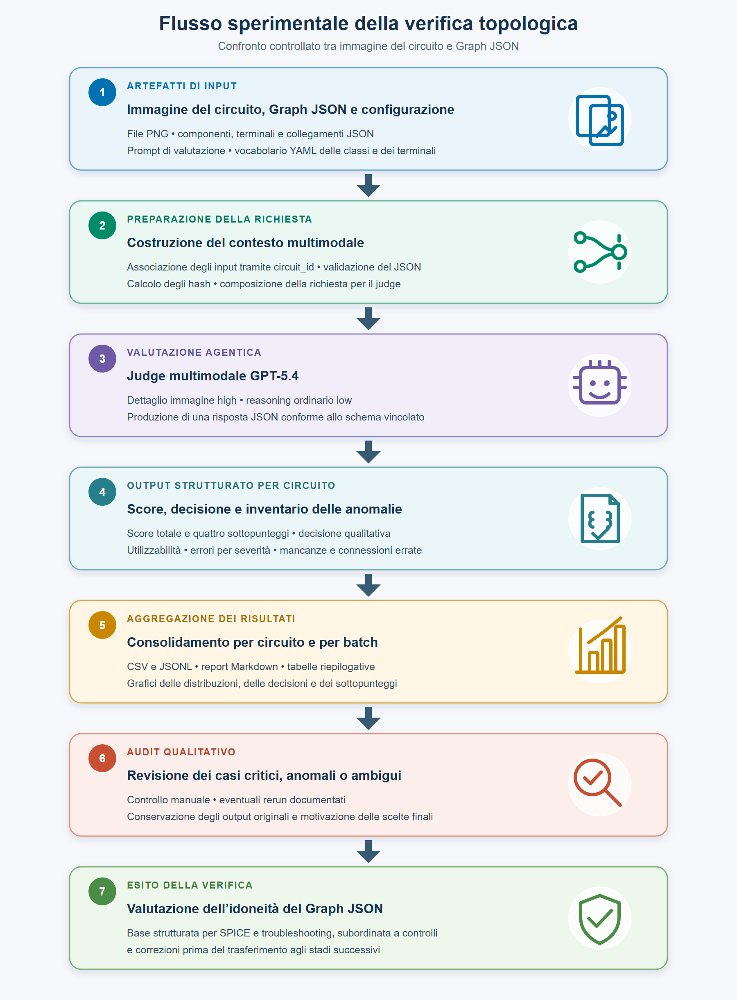

**Figura X.10 — Flusso sperimentale della verifica topologica immagine–Graph JSON.** Immagine, Graph JSON e configurazione costituiscono gli artefatti di ingresso della richiesta multimodale. Il judge produce una valutazione strutturata per circuito; i risultati vengono quindi aggregati per batch e sottoposti ad audit qualitativo prima di stabilire l'idoneità del grafo come base per gli stadi successivi.

Il giudice utilizza l'immagine come riferimento visivo e il Graph JSON come rappresentazione da verificare. Il file YAML fornisce esclusivamente il vocabolario delle classi e dei terminali: non può essere usato per inventare componenti, pin o collegamenti non supportati dall'immagine e dal JSON. Non vengono forniti datasheet e il giudice non deve dedurre funzioni dei pin ricorrendo a conoscenza esterna.

Il confronto viene effettuato cercando, tra gli altri, i seguenti problemi:

- collegamenti visibili mancanti nel grafo;
- collegamenti presenti nel grafo ma non visibili nell'immagine;
- fusione errata di due nodi distinti (`net fuse`);
- separazione errata di un unico nodo (`net split`);
- terminali associati al componente sbagliato;
- errori di polarità o di ruolo sui componenti direzionali e multi-terminale;
- componenti o terminali mancanti quando la loro assenza modifica la connettività rappresentata.

Il protocollo impone inoltre di non considerare automaticamente come errori:

- lo scambio di `instance_id` tra componenti equivalenti, quando esiste una permutazione coerente con l'immagine;
- l'imprecisione della classe, se terminali e collegamenti sono topologicamente equivalenti;
- gli incroci di fili privi di un punto di giunzione;
- warning che non corrispondono a una reale contraddizione tra immagine e grafo;
- valori elettrici, reference designator o label che non modificano la topologia.

### 3.1 Configurazione riproducibile

La configurazione finale impiegata è riassunta di seguito.

| Elemento | Configurazione |
|---|---|
| Modello giudice | `gpt-5.4` |
| Dettaglio dell'immagine | `high` |
| Reasoning effort ordinario | `low` |
| Formato della risposta | JSON conforme a schema vincolato |
| Prompt | `experiment_ai/verify_json_img/prompt.txt` |
| Hash abbreviato del prompt | `19f1ee29c0c6` |
| Vocabolario | `metadata/class_terminals_v1.yaml` |
| Hash abbreviato del vocabolario | `7e5491a8cdf0` |

L'uso degli hash permette di identificare la versione esatta del prompt e del vocabolario associata ai risultati finali.

## 4. Sistema di punteggio

Il giudice assegna quattro sottopunteggi, la cui somma determina l'`image_graph_fidelity_score`:

$$
S_{\mathrm{fidelity}} = S_{\mathrm{components}} + S_{\mathrm{terminals}} + S_{\mathrm{connections}} + S_{\mathrm{semantics}}.
$$

| Criterio | Intervallo | Significato |
|---|---:|---|
| `components` | 0-10 | Presenza e coerenza dei componenti necessari come endpoint dei collegamenti. |
| `terminals_pins` | 0-25 | Identità dei terminali, pin, polarità, ruoli terminali, OCR utile e stato degli switch quando rilevante per la connettività. |
| `graph_connections` | 0-55 | Fedeltà dei collegamenti terminale-terminale dichiarati nel campo `graph`. |
| `visible_semantics` | 0-10 | Coerenza dei metadati visibili e dei warning utili all'interpretazione dei collegamenti. |
| **Totale** | **0-100** | **Fedeltà complessiva tra immagine e Graph JSON.** |

Il criterio `graph_connections` contribuisce per 55 punti su 100 perché rappresenta l'oggetto principale dell'esperimento. La semplice presenza dei componenti non è quindi sufficiente a ottenere un punteggio elevato se i loro terminali risultano collegati a nodi errati.

### 4.1 Classi qualitative di fedeltà

Al punteggio numerico è associata una decisione qualitativa.

| Decisione | Soglia orientativa | Interpretazione |
|---|---:|---|
| `VERY_HIGH` | 90-100 | I collegamenti principali sono corretti; gli eventuali errori sono minori e non alterano la topologia principale. |
| `HIGH` | 75-89 | La struttura principale è corretta, ma sono presenti errori locali. |
| `MEDIUM` | 55-74 | Il grafo rappresenta solo parzialmente l'immagine e contiene errori importanti. |
| `LOW` | 0-54 | Il grafo è gravemente incompatibile o troppo incompleto rispetto all'immagine. |

Le soglie sono orientative e vengono integrate da regole di coerenza. In particolare, una valutazione non può essere `VERY_HIGH` in presenza di un errore critico su un collegamento principale o di un punteggio basso in `graph_connections`; fusioni o separazioni gravi delle net comportano una decisione `MEDIUM` o `LOW`.

### 4.2 Severità degli errori

Gli errori individuati sono classificati in tre livelli:

- **critico**: contraddizione certa che altera un nodo o un ramo principale, come una grave `net fuse`, una grave `net split`, la fusione tra alimentazione e massa o il collegamento di un terminale principale alla rete sbagliata;
- **maggiore**: errore locale significativo, come un collegamento mancante o aggiunto, un terminale importante assente, una polarità errata o la perdita di un terminale collegato;
- **minore**: imprecisione che non modifica sostanzialmente la connettività, come una classe semanticamente imperfetta ma topologicamente equivalente, una label OCR parzialmente errata o un warning non grave.

Il numero di errori non coincide con il numero di circuiti non corretti: una singola valutazione può contenere più segnalazioni e circuiti con errori minori possono mantenere una struttura topologica pienamente utilizzabile.

### 4.3 Utilizzabilità come base topologica

Oltre allo score e alla decisione qualitativa, il giudice restituisce il campo booleano `usable_as_graph_base`. Il valore è `true` quando il Graph JSON conserva una struttura terminale-terminale utile e correggibile; è `false` soltanto quando il grafo risulta troppo incompleto o contiene collegamenti gravemente incompatibili con l'immagine.

Questo indicatore non certifica che il circuito sia già convertibile in una netlist SPICE. Esprime invece l'idoneità del grafo a essere impiegato come base strutturata per successive fasi di controllo, correzione o arricchimento semantico.

## 5. Risultati aggregati

I risultati riportati in questa sezione sono stati ricalcolati direttamente dai quattro file `judge_results.csv` finali. Per il Batch A è stato considerato esclusivamente l'output curato indicato nella Sezione 2.1. La deviazione standard riportata nelle tabelle è quella campionaria.

### 5.1 Distribuzione degli score per batch

| Batch | Circuiti | Media | Mediana | Deviazione standard | Minimo | Massimo |
|---|---:|---:|---:|---:|---:|---:|
| A | 10 | 93,000 | 97,000 | 9,043 | 74 | 98 |
| B | 10 | 89,500 | 92,000 | 8,114 | 70 | 95 |
| C1 | 10 | 93,600 | 95,000 | 5,777 | 78 | 98 |
| C2 | 8 | 93,625 | 94,500 | 3,420 | 86 | 97 |

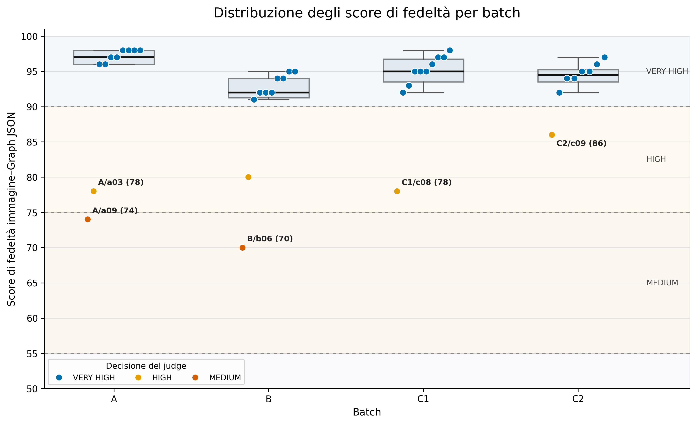

**Figura X.11 — Distribuzione degli score di fedeltà immagine–Graph JSON.** Ogni punto rappresenta un circuito e il colore identifica la decisione assegnata dal judge; i box riassumono mediana e dispersione all'interno di ciascun batch. Le linee tratteggiate separano le fasce qualitative. Sono annotati i cinque casi che determinano le principali riduzioni dello score.

La figura mostra che la maggior parte delle osservazioni è concentrata nella fascia `VERY_HIGH`. I Batch C1 e C2 presentano distribuzioni più compatte, mentre la maggiore dispersione dei Batch A e B è associata rispettivamente ai casi `a09` e `b06`. I valori inferiori risultano pertanto circoscritti a circuiti specifici e non indicano un degrado uniforme dell'intero batch.

Il Batch B presenta lo score medio più basso, pari a 89,500, e contiene anche il minimo assoluto dell'esperimento, pari a 70. I Batch C1 e C2 ottengono le medie più alte; in particolare, il Batch C2 mostra la deviazione standard più contenuta, indicando risultati più concentrati e privi di cadute marcate.

Nel Batch A la differenza tra media e mediana è dovuta soprattutto alla presenza di `a09`, che ottiene uno score sensibilmente inferiore rispetto agli altri circuiti. La mediana pari a 97 mostra quindi che il risultato tipico del batch è più elevato di quanto suggerito dalla sola media.

### 5.2 Distribuzione delle decisioni qualitative

| Batch | `VERY_HIGH` | `HIGH` | `MEDIUM` | `LOW` | Utilizzabili come base |
|---|---:|---:|---:|---:|---:|
| A | 8 | 1 | 1 | 0 | 10/10 |
| B | 8 | 1 | 1 | 0 | 10/10 |
| C1 | 9 | 1 | 0 | 0 | 10/10 |
| C2 | 7 | 1 | 0 | 0 | 8/8 |
| **Totale** | **32** | **4** | **2** | **0** | **38/38** |

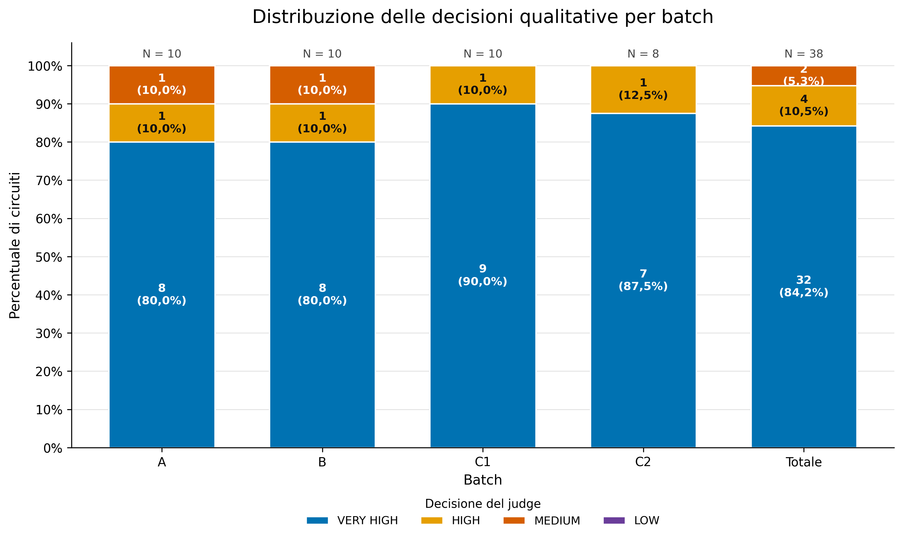

**Figura X.12 — Distribuzione percentuale delle decisioni qualitative.** Le barre sono normalizzate al 100% per consentire il confronto tra i batch, dato che C2 contiene otto circuiti mentre gli altri ne contengono dieci. Ogni segmento riporta sia il numero di casi sia la relativa percentuale; la barra finale sintetizza l'intero insieme di 38 circuiti.

La rappresentazione evidenzia che A e B condividono la stessa distribuzione qualitativa, con otto casi `VERY_HIGH`, un caso `HIGH` e un caso `MEDIUM`. Nei Batch C1 e C2 non sono invece presenti risultati `MEDIUM`: tutti i circuiti sono classificati almeno `HIGH`. L'assenza della classe `LOW` è comune a tutti i batch.

Complessivamente, 32 circuiti su 38, pari all'84,21%, sono classificati `VERY_HIGH`. Quattro circuiti, pari al 10,53%, appartengono alla classe `HIGH`, mentre due circuiti, pari al 5,26%, sono classificati `MEDIUM`. Nessun circuito riceve una valutazione `LOW`.

Il campo `usable_as_graph_base` è `true` per tutti i 38 circuiti. Questo risultato indica che anche i grafi con errori importanti conservano, secondo il judge, una struttura terminale-terminale riconoscibile e correggibile. Non implica tuttavia che tutti i grafi siano privi di errori o direttamente convertibili in una netlist simulabile.

### 5.3 Sintesi descrittiva sui 38 circuiti

Considerando congiuntamente i risultati finali dei quattro batch si ottiene la seguente sintesi descrittiva:

| Indicatore | Valore |
|---|---:|
| Circuiti valutati | 38 |
| Score medio | 92,368/100 |
| Mediana | 95,000/100 |
| Deviazione standard | 7,023 |
| Score minimo | 70 |
| Score massimo | 98 |
| Circuiti almeno `HIGH` | 36/38 (94,74%) |
| Circuiti utilizzabili come base | 38/38 (100%) |

Questi valori costituiscono un riepilogo descrittivo e non una stima di accuratezza rispetto a una ground truth annotata collegamento per collegamento. In particolare, lo score medio di 92,368 non deve essere interpretato come «accuratezza della pipeline pari al 92,368%», poiché deriva dalla valutazione strutturata di un judge multimodale.

### 5.4 Andamento dei sottopunteggi

| Batch | Componenti /10 | Terminali e pin /25 | Collegamenti /55 | Semantica visibile /10 |
|---|---:|---:|---:|---:|
| A | 9,700 | 22,700 | 52,000 | 8,600 |
| B | 9,600 | 21,400 | 50,100 | 8,400 |
| C1 | 9,900 | 22,600 | 52,400 | 8,700 |
| C2 | 9,875 | 22,375 | 52,000 | 9,375 |
| **Media complessiva** | **9,763** | **22,263** | **51,605** | **8,737** |

Il sottopunteggio medio relativo ai componenti è molto vicino al massimo, indicando che gli endpoint necessari alla costruzione del grafo sono generalmente presenti e coerenti. Anche `graph_connections`, che rappresenta il 55% dello score complessivo, raggiunge una media elevata di 51,605 su 55.

Le riduzioni più visibili interessano `terminals_pins` e `visible_semantics`. Ciò è coerente con la natura della pipeline: la ricostruzione dei ruoli terminali, delle polarità e delle informazioni semantiche visibili richiede una lettura più fine rispetto alla sola presenza del componente. Il Batch B registra i valori medi più bassi in tutti e quattro i criteri e concentra anche il maggior numero di errori maggiori.

## 6. Analisi degli errori

### 6.1 Distribuzione per severità

| Batch | Errori critici | Errori maggiori | Errori minori |
|---|---:|---:|---:|
| A | 1 | 4 | 12 |
| B | 1 | 14 | 16 |
| C1 | 0 | 6 | 15 |
| C2 | 0 | 9 | 13 |
| **Totale** | **2** | **33** | **56** |

I due errori critici sono concentrati nei Batch A e B, con un caso in ciascun batch. Nei Batch C1 e C2 non vengono segnalati errori critici. Gli errori minori sono i più numerosi, mentre il Batch B presenta il maggior numero di errori maggiori.

Il conteggio aggregato non descrive da solo l'impatto sul singolo circuito. Più errori possono essere associati alla stessa valutazione e un errore minore può riguardare una label o una proprietà terminale senza modificare la struttura elettrica principale. Per questo motivo i conteggi devono essere letti insieme allo score, alla decisione qualitativa e alla descrizione fornita dal judge.

### 6.2 Tipologie strutturate di anomalia

Oltre alla severità, gli output del judge distinguono tre liste di anomalie direttamente collegate al confronto tra immagine e JSON.

| Tipologia | Numero di segnalazioni |
|---|---:|
| Elementi o collegamenti mancanti dal JSON | 24 |
| Elementi o collegamenti aggiunti nel JSON | 11 |
| Collegamenti del grafo giudicati errati | 29 |

Le tre categorie non sono necessariamente mutuamente esclusive: una stessa anomalia topologica può contribuire alla descrizione di più aspetti dell'errore. I valori non devono quindi essere sommati per stimare il numero complessivo di difetti indipendenti.

La presenza di 29 segnalazioni relative ai collegamenti conferma che la parte più delicata non è generalmente il rilevamento dell'endpoint, ma la ricostruzione esatta della sua appartenenza a una net. I casi più rilevanti riguardano fusioni o separazioni di nodi, collegamenti locali mancanti e associazioni terminale-componente non corrette. La distribuzione fortemente sbilanciata verso errori minori e maggiori, con soli due errori critici, suggerisce tuttavia che le anomalie siano prevalentemente localizzate e non corrispondano a un fallimento generalizzato della costruzione del grafo.

## 7. Analisi dei singoli batch

Questa sezione approfondisce separatamente i quattro batch per mostrare come i risultati aggregati si distribuiscano sui singoli circuiti. Per garantire la tracciabilità con gli output sperimentali vengono utilizzate anche le figure originali prodotte dallo script di valutazione e conservate nelle rispettive directory `plots`.

La struttura di analisi è mantenuta costante per tutti i batch:

1. distribuzione degli score dei singoli circuiti;
2. profilo degli errori suddivisi per severità;
3. composizione dello score nei quattro sottopunteggi;
4. interpretazione sintetica dei risultati più rilevanti.

Le figure di dettaglio non sostituiscono i grafici complessivi delle Sezioni 5 e 6: ne costituiscono un approfondimento, utile a identificare i circuiti responsabili delle differenze tra media, mediana e dispersione.

### 7.1 Batch A

Il Batch A comprende dieci circuiti e viene analizzato utilizzando esclusivamente i risultati presenti nella directory finale curata `output_gpt5_4_final_curated`. Lo score medio è 93,000, la mediana è 97,000 e tutti i Graph JSON sono considerati utilizzabili come base topologica. Otto circuiti sono classificati `VERY_HIGH`, uno `HIGH` e uno `MEDIUM`.

#### 7.1.1 Distribuzione degli score

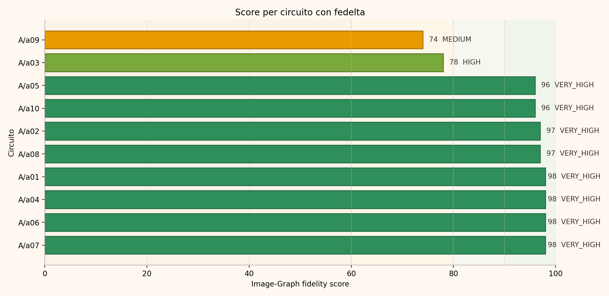

**Figura X.13 — Score di fedeltà dei circuiti del Batch A.** La figura originale del report ordina i dieci circuiti in base all'`image_graph_fidelity_score` e associa a ciascun valore la decisione qualitativa del judge. Otto circuiti si collocano tra 96 e 98, mentre `a03` e `a09` rappresentano i due casi da approfondire.

La distribuzione è fortemente concentrata nella fascia superiore: sei circuiti raggiungono almeno 97 punti e nessuno è classificato `LOW`. `a03` ottiene 78 punti ed è classificato `HIGH`; `a09`, con 74 punti, è l'unico caso `MEDIUM`. La differenza tra la mediana, pari a 97, e la media, pari a 93, è quindi dovuta principalmente a questi due valori inferiori, in particolare ad `a09`.

#### 7.1.2 Profilo degli errori

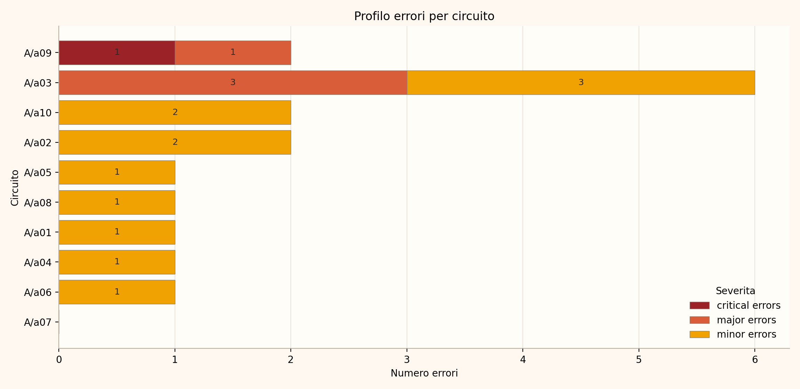

**Figura X.14 — Profilo degli errori del Batch A suddivisi per severità.** Nonostante il nome tecnico del file originale, la figura rappresenta il numero di errori critici, maggiori e minori individuati in ciascun circuito. `a09` è l'unico caso con un errore critico; `a03` presenta il maggior numero complessivo di anomalie, ma nessuna di severità critica.

Nel Batch A vengono registrati complessivamente un errore critico, quattro errori maggiori e dodici errori minori. La maggior parte dei circuiti `VERY_HIGH` presenta soltanto una o due imprecisioni minori; `a07` non contiene segnalazioni nella valutazione finale. Il confronto tra `a03` e `a09` mostra perché il solo numero degli errori non è sufficiente a interpretare la qualità del grafo: `a03` contiene sei segnalazioni, ma conserva la struttura principale e rimane `HIGH`; `a09` contiene soltanto due segnalazioni, una delle quali è però critica e altera la separazione tra due nodi.

Gli errori critici e maggiori finali sono concentrati in due circuiti: otto casi su dieci non presentano errori di queste severità. La tabella seguente riporta l'inventario completo delle cinque segnalazioni non minori, ricavato dalle risposte JSON originali del judge.

| Circuito | Severità | Tipo | Evidenza nel Graph JSON | Impatto sulla rappresentazione |
|---|---|---|---|---|
| `a03` | Maggiore | Collegamento mancante | `signal_source23.1_t1` e `switch25.1_t1` risultano entrambi senza connessioni. | Il ramo AC visibile tra la sorgente e il contatto del relè non viene ricostruito. |
| `a03` | Maggiore | Identità del componente errata | L'unica batteria `B1` visibile è rappresentata mediante `battery2.1` e `battery2.2`, ciascuna usata con un solo terminale. | I rail principali restano riconoscibili, ma viene persa l'identità della batteria come singolo componente a due terminali. |
| `a03` | Maggiore | Stato dello switch incoerente | `switch25.1` contiene `state: closed`, mentre il contatto `RL1` appare aperto nell'immagine. | Il metadato contraddice lo stato visibile e potrebbe indurre una ricostruzione funzionale errata della connettività. |
| `a09` | **Critica** | `net fuse` | `connector5.1_pin4`, `resistor22.1_t1`, `capacitor4.1_t2` e `gnd9.3_t1` sono inseriti nello stesso nodo. | Due net distinte nell'immagine vengono fuse, modificando direttamente la topologia del circuito. |
| `a09` | Maggiore | Collegamento mancante | `lamp13.1_t2` e `gnd9.5_t1` risultano entrambi non connessi. | Il ramo di ritorno della lampada verso massa è assente dal grafo. |

L'unico errore critico è quindi una fusione di net, cioè una delle anomalie più rilevanti per una rappresentazione topologica: terminali appartenenti a nodi distinti diventano indistinguibili nel grafo. I quattro errori maggiori hanno impatti differenti. Il collegamento AC e il ritorno a massa della lampada sono omissioni topologiche dirette; la batteria separata altera l'identità degli endpoint; lo stato errato del contatto introduce invece una contraddizione semantica che può cambiare l'interpretazione della connettività.

Gli errori minori riguardano prevalentemente imprecisioni di classe o modellazione che non cambiano i nodi principali. In `a03`, ad esempio, un diodo è classificato come LED, LDR e RV1 sono semplificati mediante classi resistive e il contatto del relè è modellato come switch indipendente. Queste approssimazioni restano rilevanti per un eventuale arricchimento semantico o per la generazione di una netlist, ma non hanno lo stesso impatto immediato della fusione o dell'omissione di una net.

#### 7.1.3 Composizione dello score

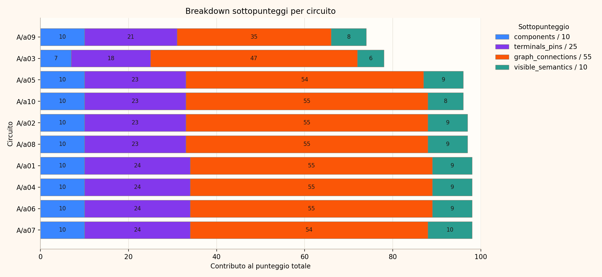

**Figura X.15 — Composizione dello score dei circuiti del Batch A.** La figura originale mostra il contributo dei criteri `components`, `terminals_pins`, `graph_connections` e `visible_semantics` al punteggio totale. La riduzione di `a09` è determinata soprattutto da `graph_connections`, mentre `a03` presenta penalizzazioni distribuite anche sul riconoscimento dei componenti, sui terminali e sulla semantica visibile.

Il dato più rilevante riguarda `graph_connections`. Sei circuiti raggiungono il massimo di 55 punti in questo criterio; `a05` e `a07` ottengono 54 punti, mentre `a03` scende a 47 e `a09` a 35. Nel caso `a09`, il punteggio elevato in `components`, pari a 10 su 10, non compensa l'errore nella ricostruzione delle net: ciò conferma che la corretta identificazione degli endpoint non garantisce da sola la fedeltà topologica del grafo.

#### 7.1.4 Interpretazione del Batch A

I tre casi principali del Batch A sono sintetizzati nella tabella seguente.

| Circuito | Score | Decisione | Critici | Maggiori | Minori | Interpretazione principale |
|---|---:|---|---:|---:|---:|---|
| `a03` | 78 | `HIGH` | 0 | 3 | 3 | Struttura di controllo conservata, ma collegamento mancante nel ramo AC, batteria separata in due componenti e stato dello switch non coerente. |
| `a07` | 98 | `VERY_HIGH` | 0 | 0 | 0 | Grafo finale coerente; caso metodologico di falso positivo del judge nel run iniziale. |
| `a09` | 74 | `MEDIUM` | 1 | 1 | 0 | Fusione errata tra due nodi distinti e collegamento della lampada alla massa inferiore mancante. |

**Caso `a03`.** Il Graph JSON conserva correttamente la struttura principale del ramo di controllo, comprendente il partitore LDR–RV1, i transistor, il relè e il diodo posto in parallelo alla bobina. Le anomalie sono concentrate nel ramo AC e nella rappresentazione di alcuni elementi: manca il collegamento visibile tra la sorgente AC e il contatto del relè, la batteria viene rappresentata mediante due componenti distinti e lo switch è indicato come chiuso nonostante il simbolo appaia aperto. Il grafo resta quindi utilizzabile, ma non raggiunge una corrispondenza quasi perfetta con l'immagine.

**Caso `a07`.** Nel run iniziale con reasoning effort `low`, il judge aveva assegnato 72 punti e una decisione `MEDIUM`, interpretando erroneamente il ramo del trasformatore come un filo continuo che il JSON avrebbe separato. La revisione manuale ha mostrato che il collegamento attraversa il trasformatore e non deve essere rappresentato come una singola net. Il rerun con effort `medium` ha assegnato 98 punti e non ha rilevato errori. Il caso non documenta una modifica della pipeline, ma una correzione della valutazione: costituisce quindi un esempio concreto della necessità di controllare manualmente gli esiti anomali prodotti da un judge multimodale.

**Caso `a09`.** Il risultato `MEDIUM` è stato confermato dal rerun a effort `medium`. Il Graph JSON descrive correttamente gran parte del circuito, ma unisce erroneamente il nodo inferiore di `C1` e della massa con il nodo formato da `J1 pin 4` e `R3`, che nell'immagine risultano separati. Inoltre non rappresenta il collegamento della lampada alla massa inferiore. Si tratta quindi di un errore topologico effettivo e localizzato, non di una semplice imprecisione semantica. Il grafo rimane correggibile, ma richiede la separazione del nodo fuso e l'aggiunta del collegamento mancante.

Nel complesso, il Batch A mostra che la pipeline ricostruisce fedelmente la topologia nella maggioranza dei circuiti, mentre i risultati inferiori sono riconducibili a errori specifici e identificabili. Il risultato non autorizza però un uso privo di controlli dell'output: la `net fuse` di `a09` propagherebbe a valle un nodo elettrico inesistente, mentre i collegamenti mancanti di `a03` e `a09` produrrebbero rami incompleti. Questi errori possono influenzare sia una futura generazione di netlist sia il ragionamento di un agente di troubleshooting che assuma il Graph JSON come fonte topologica.

Anche il valore `usable_as_graph_base = true` deve essere interpretato in questo senso: il grafo conserva una struttura utile e correggibile, ma non è necessariamente corretto senza ulteriori verifiche. Per un sistema software affidabile risultano quindi importanti la conservazione dei warning, il controllo dei terminali non connessi, la rilevazione di possibili fusioni di net e una procedura di revisione dei casi anomali. Il caso `a07` evidenzia inoltre che tale controllo deve riguardare anche il livello di valutazione agentica: score inattesi, errori critici e letture visive ambigue devono essere verificati prima di essere consolidati nei risultati finali.

### 7.2 Batch B

Il Batch B comprende dieci circuiti e presenta i risultati complessivamente più deboli tra i quattro gruppi analizzati. Lo score medio è 89,500, la mediana è 92,000 e la deviazione standard è 8,114. Otto circuiti sono classificati `VERY_HIGH`, uno `HIGH` e uno `MEDIUM`; tutti rimangono utilizzabili come base topologica secondo il judge.

#### 7.2.1 Distribuzione degli score

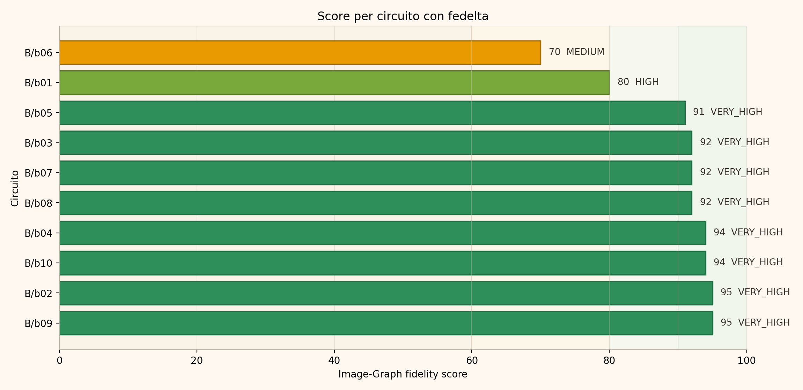

**Figura X.16 — Score di fedeltà dei circuiti del Batch B.** La figura originale del report mostra una distribuzione concentrata tra 91 e 95 punti per otto circuiti. `b01`, con 80 punti, è classificato `HIGH`; `b06`, con 70 punti, rappresenta il minimo del batch e dell'intero esperimento ed è classificato `MEDIUM`.

La distanza tra i due casi più deboli e il resto del batch è marcata. Escludendo `b01` e `b06`, gli otto circuiti rimanenti presentano score compresi in un intervallo ristretto di quattro punti. La media inferiore rispetto agli altri batch dipende quindi soprattutto dai due casi problematici, mentre la mediana pari a 92 descrive meglio la prestazione centrale del gruppo.

#### 7.2.2 Profilo degli errori

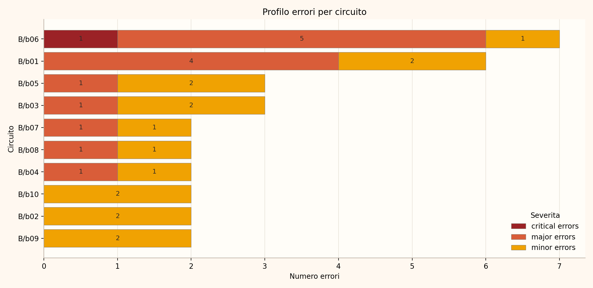

**Figura X.17 — Profilo degli errori del Batch B suddivisi per severità.** La figura originale evidenzia la concentrazione delle segnalazioni in `b06`, con un errore critico e cinque maggiori, e in `b01`, con quattro errori maggiori. Gli altri errori non minori sono distribuiti singolarmente tra cinque circuiti.

Il Batch B contiene complessivamente un errore critico, quattordici errori maggiori e sedici minori. Soltanto `b02`, `b09` e `b10` non presentano errori critici o maggiori; negli altri sette circuiti il judge rileva almeno una segnalazione non minore. Questo rende B il batch con il maggior numero di errori maggiori, anche se molte segnalazioni riguardano l'identità semantica dei terminali e non una fusione o separazione completa delle net.

| Circuito | Critici | Maggiori | Principali aspetti negativi rilevati |
|---|---:|---:|---|
| `b01` | 0 | 4 | Ingressi dell'opamp scambiati; terminali B/C/E dei due BJT assegnati ai nodi errati; rete comune delle basi e ramo superiore di Q2 non ricostruiti correttamente. |
| `b03` | 0 | 1 | Il transistor PNP superiore destro è modellato come NPN e presenta ruoli E/C non coerenti con il simbolo. |
| `b04` | 0 | 1 | Identità e posizione della base del transistor Q1 non allineate al simbolo visibile. |
| `b05` | 0 | 1 | I due terminali del connettore cuffia J1/J2 non sono rappresentati come endpoint del grafo. |
| `b06` | 1 | 5 | Possibile fusione della rail di massa con il ramo batteria/interruttore; mapping dei pin LM386 incoerente; condensatore variabile e carico Z1 mancanti; ramo C5 associato a un endpoint errato. |
| `b07` | 0 | 1 | Drain e source del MOSFET inferiore risultano entrambi associati al nodo di massa. |
| `b08` | 0 | 1 | Il terminale superiore della sorgente di corrente, visibilmente diretto verso VDD, è lasciato non connesso. |

Il conteggio deve essere interpretato con cautela perché le segnalazioni non sono tutte indipendenti. In `b01`, ad esempio, l'assegnazione errata dei terminali dei transistor contribuisce anche alla mancata ricostruzione della rete comune delle basi e del ramo di Q2. In `b06`, l'assenza del carico di uscita e l'associazione di C5 a un componente improprio descrivono due manifestazioni correlate dello stesso sottocircuito non ricostruito correttamente. Il numero degli errori quantifica quindi le anomalie riportate dal judge, non necessariamente altrettante cause indipendenti della pipeline.

#### 7.2.3 Composizione dello score

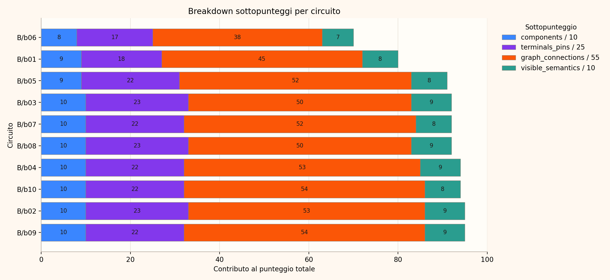

**Figura X.18 — Composizione dello score dei circuiti del Batch B.** La figura originale mostra che le riduzioni di `b01` e `b06` coinvolgono soprattutto `terminals_pins` e `graph_connections`. `b06` ottiene 17/25 e 38/55 nei due criteri; `b01` raggiunge rispettivamente 18/25 e 45/55.

Nessun circuito del Batch B raggiunge il massimo di 55 punti in `graph_connections`. I valori più alti sono 54 per `b09` e `b10`; `b01` e `b06` si distaccano dal resto del gruppo a causa di errori che modificano l'identità dei terminali o lasciano incompleti alcuni rami. La riduzione non è quindi riconducibile soltanto a classi o label imperfette, ma coinvolge informazioni necessarie per interpretare correttamente i nodi elettrici.

#### 7.2.4 Interpretazione del Batch B

I due casi che determinano maggiormente la distribuzione del Batch B sono riepilogati di seguito.

| Circuito | Score | Decisione | Critici | Maggiori | Minori | Interpretazione principale |
|---|---:|---|---:|---:|---:|---|
| `b01` | 80 | `HIGH` | 0 | 4 | 2 | Struttura generale riconoscibile, ma ingressi dell'opamp e terminali dei BJT non coerenti con il simbolo e con i nodi visibili. |
| `b06` | 70 | `MEDIUM` | 1 | 5 | 1 | Più sottocircuiti incompleti o ambigui: rail di alimentazione, pin LM386, circuito di sintonia e ramo di uscita. |

**Caso `b01`.** Il grafo mantiene i componenti principali, i tre resistori, l'opamp, i transistor, il nodo di uscita e la massa, ma presenta errori rilevanti nell'identificazione dei terminali. I due ingressi dell'opamp risultano scambiati; per entrambi i BJT, base e collettore vengono associati alla massa mentre gli emettitori sono utilizzati come rami superiori. Ne derivano anche la perdita della rete comune tra le basi e l'assenza del collegamento tra il ramo superiore di Q2 e il nodo principale. Pur rimanendo riconoscibile a livello globale, una rappresentazione di questo tipo non è direttamente affidabile per una conversione verso SPICE: lo scambio dei terminali di un transistor o degli ingressi di un opamp può modificare radicalmente il comportamento del modello elettrico.

**Caso `b06`.** Il judge assegna 70 punti e segnala come errore critico la fusione tra la rail inferiore di massa e il ramo batteria/interruttore. Vengono inoltre riportati cinque errori maggiori: mapping non coerente degli ingressi e dei pin di alimentazione dell'LM386, assenza del condensatore variabile C1, omissione del trasduttore Z1 e collegamento del condensatore C5 verso un endpoint classificato come `breaker` invece che verso il carico. Queste anomalie interessano alimentazione, sintonia, amplificazione e uscita e spiegano i punteggi ridotti in `terminals_pins` e `graph_connections`.

La valutazione di `b06` deve tuttavia essere presentata come parzialmente incerta. La revisione manuale documentata nella relazione sperimentale osserva che la lettura della rail batteria/massa e di alcuni endpoint di sintonia e uscita non è completamente univoca nell'immagine. Di conseguenza, l'errore critico rappresenta la decisione del judge finale, ma non può essere considerato una ground truth manuale incontrovertibile. Il risultato `MEDIUM` identifica correttamente un circuito che richiede revisione, senza dimostrare che tutte e sei le segnalazioni non minori corrispondano a difetti indipendenti e certi del Graph JSON.

Negli altri circuiti gli errori sono più circoscritti. `b03`, `b04` e `b07` mostrano soprattutto problemi nell'identità o nel ruolo dei terminali di transistor e MOSFET; `b05` e `b08` omettono endpoint visibili. Questi casi mantengono score `VERY_HIGH` perché la struttura principale delle net resta in gran parte rappresentata, ma evidenziano un limite importante per gli stadi successivi: una topologia globalmente riconoscibile non garantisce che ogni terminale possieda la semantica necessaria per simulazione e diagnosi.

Nel complesso, il Batch B conferma l'utilità del Graph JSON come base strutturata, ma fornisce anche l'evidenza negativa più forte dell'esperimento. La presenza di errori su pin, terminali multiporta e rami omessi indica che gli output non devono essere trasferiti automaticamente a una netlist o a un agente diagnostico senza controlli di coerenza. Dal punto di vista software, risultano particolarmente importanti la validazione del numero e del ruolo dei terminali, il controllo degli endpoint non connessi e la gestione esplicita dell'incertezza del judge nei circuiti visivamente complessi.
### 7.3 Batch C1

Il Batch C1 comprende dieci circuiti e ottiene uno score medio di 93,600, una mediana di 95,000 e una deviazione standard di 5,777. Nove circuiti sono classificati `VERY_HIGH` e uno `HIGH`; non sono presenti risultati `MEDIUM` o `LOW` né errori critici. Tutti i Graph JSON sono considerati utilizzabili come base topologica.

#### 7.3.1 Distribuzione degli score

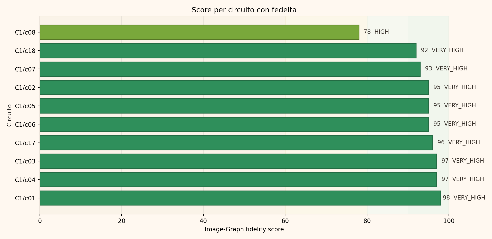

**Figura X.19 — Score di fedeltà dei circuiti del Batch C1.** La figura originale mostra nove risultati compresi tra 92 e 98 punti. `c08`, con 78 punti e decisione `HIGH`, è l'unico caso nettamente separato dal resto della distribuzione.

La mediana pari a 95 e l'assenza di casi `MEDIUM` indicano una buona stabilità complessiva. La differenza tra media e mediana dipende principalmente da `c08`; gli altri nove circuiti occupano un intervallo di soli sei punti. Il risultato inferiore di `c08` non corrisponde a un errore critico, ma alla perdita di una parte della connettività di un selettore multi-terminale.

#### 7.3.2 Profilo degli errori

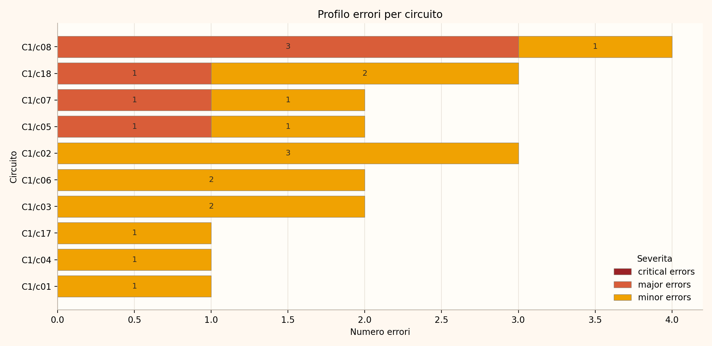

**Figura X.20 — Profilo degli errori del Batch C1 suddivisi per severità.** Nel batch non sono presenti errori critici. `c08` concentra tre errori maggiori collegati alla rappresentazione incompleta del selettore SPDT; `c05`, `c07` e `c18` presentano un errore maggiore ciascuno. Le restanti segnalazioni sono minori.

Complessivamente, il Batch C1 contiene sei errori maggiori e quindici minori. Quattro circuiti presentano almeno un errore maggiore, mentre gli altri sei contengono soltanto errori minori. L'assenza di errori critici significa che il judge non ha rilevato fusioni o separazioni gravi delle net principali, ma non implica che ogni ramo o terminale visibile sia stato rappresentato.

| Circuito | Maggiori | Principali aspetti negativi rilevati | Impatto sulla rappresentazione |
|---|---:|---|---|
| `c05` | 1 | Il terminale superiore del resistore da 1 kΩ è lasciato scollegato invece di raggiungere `+Vcc`. | Il ramo di alimentazione della rete temporizzatrice del 555 risulta incompleto. |
| `c07` | 1 | Un terminale del secondo pulsante è flottante, mentre nell'immagine il pulsante collega i nodi `CLK` e `RST`. | Viene perso uno dei due collegamenti necessari a rappresentare il comando. |
| `c08` | 3 | Il selettore SPDT è ridotto a uno switch a due terminali; il secondo ramo verso uno dei resistori da 1 kΩ è assente e la connettività di commutazione risulta incompleta. | I due percorsi alternativi del selettore non sono entrambi disponibili nel grafo. |
| `c18` | 1 | Manca il pin di alimentazione inferiore dell'opamp `IC2a`, visibilmente collegato a `-15V DC`. | Il componente è rappresentato senza uno dei collegamenti di alimentazione visibili. |

Le tre segnalazioni maggiori di `c08` non rappresentano tre cause completamente indipendenti. La riduzione di un simbolo SPDT a un componente con due soli terminali determina sia la perdita fisica del secondo throw, sia l'assenza del collegamento al relativo resistore, sia una connettività di stato incapace di descrivere i due percorsi alternativi. Il conteggio esprime quindi tre conseguenze verificabili di un'unica limitazione strutturale della modellazione dello switch.

Gli errori di `c05`, `c07` e `c18` sono invece omissioni di endpoint o collegamenti visibili. Pur essendo locali, possono essere rilevanti negli stadi successivi: una resistenza scollegata dall'alimentazione, un pulsante con un terminale flottante o un opamp privo di una supply producono una rappresentazione incompleta anche quando le altre net del circuito sono corrette.

#### 7.3.3 Composizione dello score

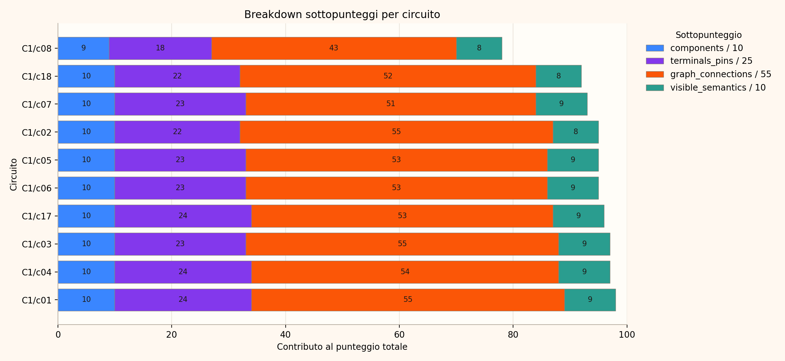

**Figura X.21 — Composizione dello score dei circuiti del Batch C1.** `c08` presenta la riduzione più evidente in `terminals_pins`, con 18/25, e in `graph_connections`, con 43/55. Negli altri circuiti il punteggio relativo ai collegamenti varia tra 51 e 55.

Tre circuiti, `c01`, `c02` e `c03`, raggiungono il massimo di 55 punti in `graph_connections`. `c04` ottiene 54 punti; `c05`, `c06` e `c17` ne ottengono 53; `c18` scende a 52 e `c07` a 51. La distribuzione mostra quindi che, al di fuori di `c08`, le penalizzazioni sono generalmente associate a singoli endpoint o a imprecisioni semantiche e non a una perdita estesa della struttura del grafo.

#### 7.3.4 Interpretazione del Batch C1

I quattro circuiti con errori maggiori sono riepilogati nella tabella seguente.

| Circuito | Score | Decisione | Critici | Maggiori | Minori | Interpretazione principale |
|---|---:|---|---:|---:|---:|---|
| `c05` | 95 | `VERY_HIGH` | 0 | 1 | 1 | Collegamento superiore di un resistore verso `+Vcc` mancante. |
| `c07` | 93 | `VERY_HIGH` | 0 | 1 | 1 | Secondo pulsante rappresentato con un terminale non connesso. |
| `c08` | 78 | `HIGH` | 0 | 3 | 1 | Selettore SPDT ridotto a switch a due terminali, con perdita di uno dei due rami. |
| `c18` | 92 | `VERY_HIGH` | 0 | 1 | 2 | Pin di alimentazione inferiore di un opamp assente dal JSON. |

**Caso `c08`.** Il grafo rappresenta correttamente la parte principale composta da timer 555, contatore CD4017, quattro transistor e reti LED, ma non conserva la struttura del selettore S1. Nell'immagine S1 è un dispositivo SPDT con un contatto comune e due uscite distinte verso i resistori R3 e R4; nel JSON è ridotto a uno switch con due terminali e un solo ramo. Uno dei resistori rimane quindi scollegato e il grafo non può descrivere entrambe le alternative di commutazione. La posizione effettiva del cursore è parzialmente ambigua alla risoluzione disponibile, ma la presenza di tre terminali e di due rami distinti è visibile: l'errore principale riguarda quindi la struttura del componente, non soltanto lo stato assegnato.

**Casi `c05`, `c07` e `c18`.** Questi circuiti mantengono score `VERY_HIGH` perché le rispettive strutture principali risultano fedeli. Le omissioni restano tuttavia tecnicamente significative. In `c05` è incompleto il collegamento della rete temporizzatrice all'alimentazione; in `c07` il secondo pulsante non collega entrambi i nodi visibili; in `c18` manca una delle alimentazioni dell'opamp. Si tratta di errori locali che non distruggono il grafo complessivo, ma che impediscono di considerare l'output immediatamente completo per simulazione o analisi funzionale.

Il Batch C1 costituisce un risultato complessivamente solido, ma evidenzia due classi di limite della pipeline. La prima riguarda i componenti con più stati o più terminali, come lo switch SPDT, che non possono essere ridotti senza perdita a un modello a due terminali. La seconda riguarda gli endpoint periferici o di alimentazione, che possono rimanere non connessi pur in presenza di una topologia principale corretta. Dal punto di vista software, questi risultati suggeriscono la necessità di validare il numero atteso di terminali in base alla classe e di controllare sistematicamente supply, pulsanti e terminali segnalati come flottanti prima dell'impiego del Graph JSON nelle fasi successive.
### 7.4 Batch C2

Il Batch C2 comprende otto circuiti e presenta la distribuzione più compatta tra i quattro gruppi: lo score medio è 93,625, la mediana è 94,500 e la deviazione standard è 3,420. Sette circuiti sono classificati `VERY_HIGH` e uno `HIGH`; non sono presenti risultati `MEDIUM` o `LOW` né errori critici. Tutti i Graph JSON sono considerati utilizzabili come base topologica.

#### 7.4.1 Distribuzione degli score

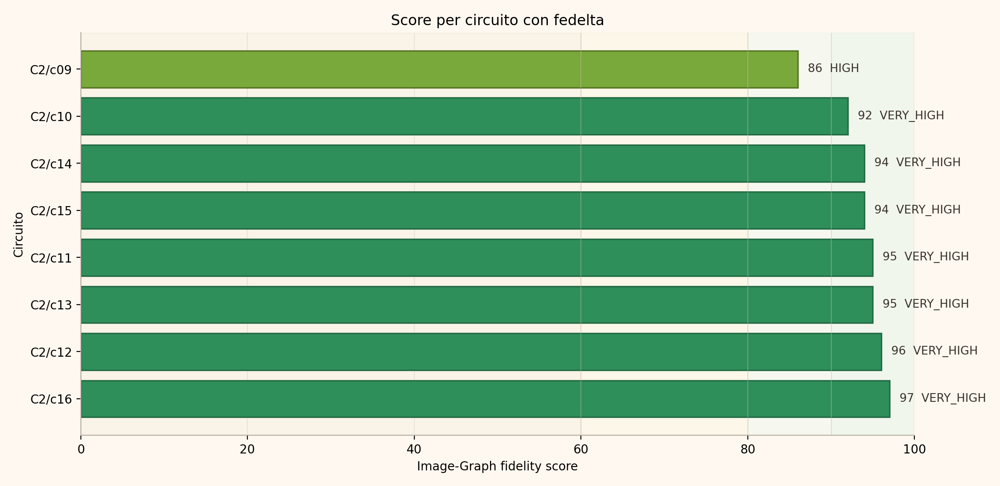

**Figura X.22 — Score di fedeltà dei circuiti del Batch C2.** Gli otto risultati sono compresi tra 86 e 97 punti. `c09`, con 86 punti e decisione `HIGH`, è il caso più debole; gli altri sette circuiti ottengono score tra 92 e 97 e sono classificati `VERY_HIGH`.

L'intervallo complessivo di undici punti e la deviazione standard ridotta indicano una maggiore uniformità rispetto agli altri batch. Anche il minimo, rappresentato da `c09`, resta al di sopra della soglia `HIGH`. La distribuzione non presenta quindi un caso dominante paragonabile ad `a09`, `b06` o `c08`, sebbene `c09` concentri diverse anomalie locali.

#### 7.4.2 Profilo degli errori

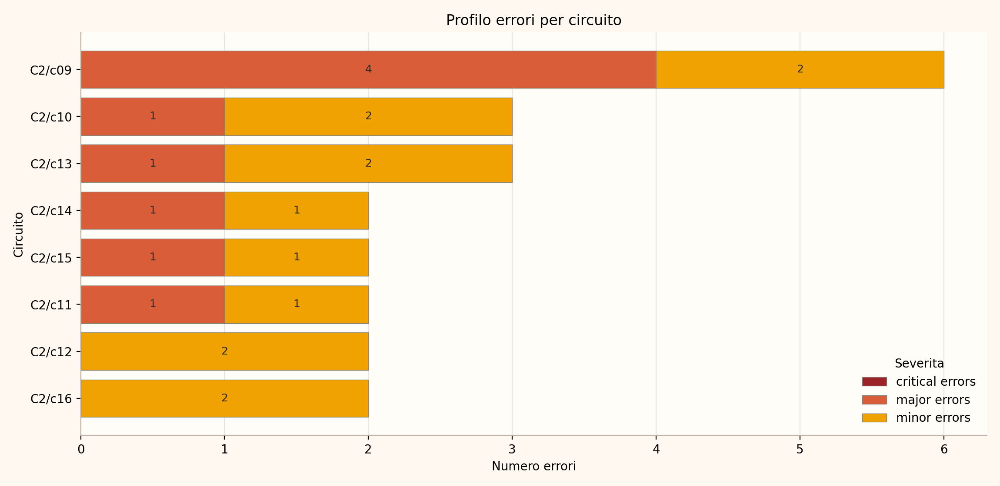

**Figura X.23 — Profilo degli errori del Batch C2 suddivisi per severità.** Non vengono segnalati errori critici. `c09` presenta quattro errori maggiori e due minori; `c10`, `c11`, `c13`, `c14` e `c15` ricevono una segnalazione maggiore ciascuno. `c12` e `c16` contengono soltanto errori minori.

Il conteggio ufficiale del judge comprende nove errori maggiori e tredici minori. Sei circuiti su otto presentano almeno una segnalazione maggiore. La rilettura qualitativa delle risposte strutturate mostra però che alcune di queste classificazioni riguardano esclusivamente geometria o semantica e, in almeno un caso, risultano internamente contraddittorie. I valori vengono mantenuti invariati per preservare i risultati del protocollo, ma non tutte le nove segnalazioni devono essere interpretate come errori topologici confermati.

| Circuito | Maggiori secondo il judge | Principali aspetti negativi rilevati | Esito della rilettura qualitativa |
|---|---:|---|---|
| `c09` | 4 | Separazione del nodo comune nella zona P3.1/transistor/massa e due fusioni tra uscite resistive e pin del display sinistro. | Errori topologici plausibili, sebbene le segnalazioni sul nodo inferiore siano correlate e il cablaggio locale sia visivamente fitto. |
| `c10` | 1 | Microfono M1 assente dal JSON e relativo nodo con C1/R5 non rappresentato completamente. | Omissione di componente ed endpoint topologico chiaramente descritta. |
| `c11` | 1 | Geometria del secondo terminale dello switch non coerente con il vocabolario standard. | La stessa risposta dichiara corretta la connettività principale; la severità `major` appare eccessiva e parzialmente duplicata da un errore minore. |
| `c13` | 1 | Presunta inversione della polarità del condensatore di ingresso C4. | Segnalazione internamente contraddittoria: immagine e JSON collocano entrambi il terminale positivo sul lato destro; l'errore non risulta confermato. |
| `c14` | 1 | C1 e C2 non polarizzati nell'immagine ma modellati come `Polarized_Capacitor`. | Imprecisione di classe/semantica con nodi corretti; più coerente con una severità minore che con un errore topologico maggiore. |
| `c15` | 1 | Pin 10 dell'IC non collegato al terminale esterno etichettato `C`. | Collegamento visibile mancante e quindi anomalia topologica locale confermata dal report. |

Il caso `c13` è particolarmente importante per valutare l'affidabilità del judge. La descrizione dell'errore afferma che il segno positivo di C4 è visibile a destra e, contemporaneamente, riporta che il JSON assegna `positive` a destra e `negative` a sinistra; le due evidenze sono coerenti, ma la risposta conclude comunque che i terminali siano invertiti. Il conteggio e lo score ufficiali non vengono corretti retroattivamente, tuttavia la segnalazione non deve essere usata come prova di un difetto della pipeline.

Anche `c11` e `c14` mostrano una distinzione necessaria tra fedeltà topologica e semantica. Nel primo caso i nodi dello switch sono corretti e l'anomalia riguarda `relative_position`; nel secondo, la classe dei condensatori è imprecisa ma i collegamenti restano coerenti. Questi casi suggeriscono che il numero grezzo degli errori maggiori sovrastimi parzialmente i difetti topologici effettivi del Batch C2.

#### 7.4.3 Composizione dello score

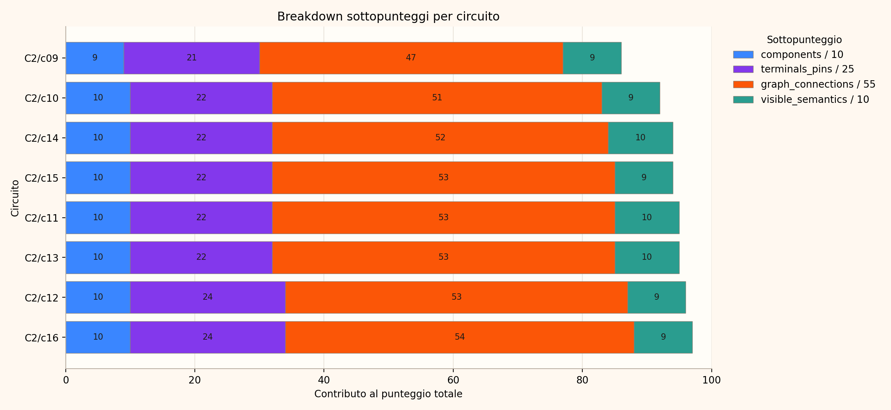

**Figura X.24 — Composizione dello score dei circuiti del Batch C2.** `c09` presenta i sottopunteggi più bassi in `components`, `terminals_pins` e `graph_connections`, rispettivamente 9/10, 21/25 e 47/55. Gli altri sette circuiti mantengono almeno 51 punti su 55 nei collegamenti.

`c16` ottiene il valore più alto in `graph_connections`, pari a 54; `c11`, `c12`, `c13` e `c15` raggiungono 53; `c14` ottiene 52 e `c10` 51. Nessun circuito raggiunge 55 punti, ma la riduzione rispetto al massimo rimane contenuta al di fuori di `c09`. La composizione dello score conferma quindi che il batch conserva una qualità topologica elevata, mentre alcune penalizzazioni derivano da componenti mancanti o dalla semantica dei terminali.

#### 7.4.4 Interpretazione del Batch C2

I casi più informativi sono riepilogati di seguito, distinguendo le anomalie topologiche dalle segnalazioni semantiche o dubbie.

| Circuito | Score | Decisione | Critici | Maggiori | Minori | Interpretazione principale |
|---|---:|---|---:|---:|---:|---|
| `c09` | 86 | `HIGH` | 0 | 4 | 2 | Struttura generale conservata, ma possibili split/fusioni nella zona transistor–massa e nei collegamenti del display sinistro. |
| `c10` | 92 | `VERY_HIGH` | 0 | 1 | 2 | Microfono e relativo nodo di ingresso non rappresentati. |
| `c11` | 95 | `VERY_HIGH` | 0 | 1 | 1 | Connettività corretta; imprecisione geometrica del terminale dello switch probabilmente sovrastimata. |
| `c13` | 95 | `VERY_HIGH` | 0 | 1 | 2 | Major non confermato a causa della contraddizione interna nella valutazione della polarità di C4. |
| `c14` | 94 | `VERY_HIGH` | 0 | 1 | 1 | Classe dei condensatori imprecisa, ma topologia corretta. |
| `c15` | 94 | `VERY_HIGH` | 0 | 1 | 1 | Collegamento tra pin 10 e terminale esterno `C` mancante. |

**Caso `c09`.** Il Graph JSON conserva la struttura principale del voltmetro digitale, comprendente ADC0804, microcontrollore AT89S51, bus D0–D7, rete di reset, display e transistor di pilotaggio. Le anomalie si concentrano nella zona inferiore destra: il judge segnala la separazione del nodo condiviso tra P3.1, transistor e massa e due fusioni non visibili tra uscite resistive e pin del display sinistro. Le prime due segnalazioni sul nodo inferiore descrivono aspetti correlati della stessa area problematica; inoltre il cablaggio è fitto e il mapping dei resistori verso i segmenti non è completamente univoco. Il caso resta quindi `HIGH`: presenta errori locali plausibili e da verificare, ma non una perdita generalizzata della struttura.

**Casi `c10` e `c15`.** Le due omissioni sono circoscritte ma topologicamente concrete. In `c10` non è presente il microfono M1 e manca quindi l'endpoint condiviso con C1 e R5; in `c15` il pin 10 dell'L298 non raggiunge il terminale esterno `C` visibile nell'immagine. Questi errori mostrano che anche uno score `VERY_HIGH` può accompagnarsi alla perdita di un componente periferico o di un collegamento esterno necessario per descrivere completamente il circuito.

**Casi `c11`, `c13` e `c14`.** Questi risultati costituiscono soprattutto evidenza sui limiti del processo di valutazione. Le relative segnalazioni non dimostrano una connettività errata: `c11` riguarda la posizione relativa di un terminale dello switch, `c13` contiene una conclusione incompatibile con le evidenze riportate e `c14` riguarda la classe dei condensatori. Per la tesi è quindi corretto conservarle nei conteggi ufficiali, ma trattarle come possibili sovrastime del judge anziché come errori topologici accertati.

Nel complesso, il Batch C2 mostra una topologia stabile e priva di errori critici, ma offre anche la dimostrazione più chiara che la valutazione automatica richiede un audit qualitativo. Dal punto di vista agentico, uno schema di output vincolato e regole esplicite non eliminano completamente incoerenze logiche o problemi di severità. Per un processo software riproducibile è pertanto necessario conservare sia il risultato originale sia l'esito della revisione, evitando modifiche retroattive non documentate agli score e distinguendo tra metrica automatica e interpretazione tecnica finale.

## 8. Discussione

I risultati ottenuti consentono di rispondere positivamente, ma con alcune condizioni, alla domanda sperimentale posta alla base della verifica: i Graph JSON prodotti dalla pipeline conservano generalmente una rappresentazione fedele e strutturata dei collegamenti visibili nelle immagini, ma non possono essere considerati automaticamente corretti o direttamente utilizzabili per la simulazione. La valutazione complessiva mostra infatti uno score medio di 92,368/100, con 32 circuiti su 38 classificati `VERY_HIGH` e 36 su 38 almeno `HIGH`. Tutti i risultati sono inoltre indicati dal judge come utilizzabili come base topologica. Queste evidenze sostengono l'impiego del Graph JSON come rappresentazione intermedia della pipeline, purché sia accompagnato da controlli di coerenza prima delle elaborazioni successive.

### 8.1 Confronto trasversale tra i batch

Le differenze tra i quattro batch sono limitate e riconducibili prevalentemente a pochi circuiti problematici. I Batch C1 e C2 ottengono le medie più elevate, rispettivamente 93,600 e 93,625, e non presentano errori critici. Il Batch C2 mostra inoltre la dispersione minore, con una deviazione standard pari a 3,420, mentre C1 è penalizzato principalmente dal caso `c08`. Il Batch A raggiunge una mediana di 97, superiore alla propria media di 93, perché la maggior parte dei risultati è concentrata nella parte alta della distribuzione e il valore complessivo viene ridotto soprattutto da `a09`. Una dinamica analoga, ma più marcata, interessa il Batch B: gli otto circuiti migliori sono compresi tra 91 e 95 punti, mentre `b01` e soprattutto `b06` determinano la media più bassa dell'esperimento, pari a 89,500.

La distribuzione suggerisce quindi che gli errori non derivino da un degrado uniforme della pipeline. Le prestazioni inferiori sono associate a caratteristiche specifiche degli schemi: componenti multi-terminale, terminali con ruoli elettrici distinti, selettori con più stati, rail di alimentazione vicine ad altre net e aree con cablaggio visivamente denso. La complessità rilevante non coincide necessariamente con il numero assoluto di componenti, ma con l'ambiguità geometrica e semantica necessaria per associare correttamente ogni endpoint al relativo nodo.

### 8.2 Punti di forza della rappresentazione prodotta

Il risultato più stabile riguarda la presenza dei componenti necessari come endpoint del grafo. Il sottopunteggio medio `components` è pari a 9,763/10, indicando che la pipeline individua generalmente gli elementi necessari alla costruzione della rappresentazione. Anche `graph_connections`, che pesa 55 punti sul totale, raggiunge una media di 51,605/55. La combinazione di questi due valori mostra che, nella maggioranza dei casi, il Graph JSON non è soltanto formalmente valido, ma conserva anche la struttura principale delle net visibili.

Questa proprietà è importante dal punto di vista dell'ingegneria del software. Una rappresentazione intermedia non deve necessariamente risolvere in un solo passaggio tutti gli aspetti elettrici del circuito, ma deve offrire una struttura sufficientemente stabile, tracciabile e correggibile. Il Graph JSON soddisfa generalmente questa esigenza: componenti, terminali e connessioni sono espressi in forma strutturata e possono essere sottoposti a validazioni automatiche, arricchimenti semantici e controlli successivi. Il valore `usable_as_graph_base = true` per tutti i circuiti deve essere letto in questo senso, cioè come indicazione di recuperabilità e utilità della struttura, non come certificazione della sua completa correttezza.

Un ulteriore elemento positivo è la localizzazione degli errori più gravi. I due errori critici riguardano esclusivamente `a09` e `b06`, mentre nei Batch C1 e C2 non sono presenti segnalazioni di questa severità. Anche nei casi con score inferiore, una parte significativa del circuito resta riconoscibile. Ciò rende plausibile un processo di correzione locale, nel quale le aree dubbie vengono isolate senza rigenerare o scartare l'intera rappresentazione.

### 8.3 Fragilità osservate e impatto sugli stadi successivi

Le principali fragilità riguardano l'identità dei terminali e la completezza dei collegamenti locali. I sottopunteggi medi `terminals_pins` e `visible_semantics`, pari rispettivamente a 22,263/25 e 8,737/10, sono inferiori in termini relativi rispetto a `components`. Gli errori osservati includono lo scambio degli ingressi di un opamp, l'assegnazione non corretta di base, collettore ed emettitore, la perdita di terminali di alimentazione, la riduzione di un selettore SPDT a uno switch a due terminali e l'omissione di componenti periferici connessi.

Queste anomalie hanno conseguenze differenti. Un'imprecisione nella classe di un componente può lasciare invariata la topologia e risultare correggibile mediante un successivo arricchimento semantico. Al contrario, una `net fuse`, una `net split`, un terminale flottante o un collegamento verso la net sbagliata modifica direttamente la struttura elettrica rappresentata. Anche quando è circoscritto, un errore di questo tipo può propagarsi alla generazione della netlist, alla simulazione SPICE o al ragionamento diagnostico di un agente. Uno score elevato non è quindi sufficiente per autorizzare automaticamente il passaggio allo stadio successivo.

I 33 errori maggiori non devono essere interpretati come altrettante cause indipendenti. In diversi circuiti più segnalazioni descrivono conseguenze dello stesso limite strutturale: in `c08`, ad esempio, la riduzione del selettore SPDT produce contemporaneamente la perdita di un terminale, di un collegamento e di uno dei percorsi di commutazione; in `b01`, l'errata identificazione dei terminali dei transistor influisce anche sulla ricostruzione delle net associate. La distinzione tra numero delle segnalazioni e numero delle cause è essenziale per evitare di sovrastimare la frequenza dei fallimenti della pipeline.

### 8.4 Relazione tra score, decisione e severità

I risultati mostrano che score numerico, decisione qualitativa e severità degli errori descrivono aspetti correlati ma non equivalenti. Lo score sintetizza quattro criteri con pesi diversi; la decisione assegna il risultato a una fascia qualitativa; gli errori descrivono invece anomalie specifiche. Un circuito può pertanto ottenere un punteggio elevato grazie alla correttezza della maggior parte della struttura, pur conservando un'omissione locale tecnicamente significativa.

Questa distinzione emerge chiaramente nei risultati `VERY_HIGH`. Tredici dei 32 circuiti appartenenti a questa fascia contengono una segnalazione classificata `major`: `b03`, `b04`, `b05`, `b07`, `b08`, `c05`, `c07`, `c18`, `c10`, `c11`, `c13`, `c14` e `c15`. Il dato è coerente con le soglie numeriche, poiché tutti questi circuiti raggiungono almeno 90 punti, ma non con la definizione letterale del prompt, secondo cui una decisione `VERY_HIGH` dovrebbe contenere soltanto eventuali errori minori. In pratica, il judge sembra avere privilegiato la fascia dello score e la conservazione della struttura complessiva rispetto alla piena coerenza tra etichetta qualitativa e severità.

Questa incoerenza non richiede di modificare retroattivamente i risultati. Score, decisioni e conteggi devono essere conservati così come prodotti dal protocollo, in modo da mantenere la tracciabilità dell'esperimento. Tuttavia, la classe `VERY_HIGH` non deve essere interpretata come sinonimo di assenza di errori maggiori. Per valutare l'idoneità di un grafo a un impiego successivo è necessario consultare congiuntamente i sottopunteggi, le liste degli errori, i terminali non connessi e le descrizioni delle anomalie.

### 8.5 Ruolo della valutazione agentica nel processo software

L'impiego di un judge multimodale ha permesso di applicare lo stesso protocollo ai 38 circuiti e di produrre output strutturati, confrontabili e aggregabili. Questo approccio costituisce un vantaggio operativo: le risposte sono validate rispetto a uno schema JSON, gli score possono essere ricalcolati e le anomalie possono essere analizzate per severità e tipologia. Il judge svolge quindi la funzione di controllo intermedio tra la generazione del Graph JSON e gli stadi di simulazione o troubleshooting.

L'esperimento mostra però che la valutazione agentica deve essere a sua volta verificata. Il primo risultato di `a07` conteneva un falso positivo dovuto all'interpretazione del trasformatore ed è stato corretto mediante revisione manuale e rerun a effort maggiore. In `c13` la motivazione dell'errore di polarità è logicamente incompatibile con le evidenze riportate dalla stessa risposta. Nei casi `c11` e `c14`, invece, il judge assegna severità `major` a differenze geometriche o semantiche che non modificano i nodi. Anche `b06` contiene punti la cui lettura visiva non è completamente univoca.

Da questi risultati emerge un'architettura di controllo a più livelli. Il judge può essere utilizzato per individuare automaticamente i casi anomali, ma gli output con errori critici, score inattesi, contraddizioni interne o immagini ambigue devono essere indirizzati a una revisione. Controlli deterministici possono inoltre verificare il numero atteso dei terminali, la presenza delle alimentazioni, gli endpoint dichiarati come non connessi, la coerenza dello stato degli switch e possibili fusioni tra rail incompatibili. La combinazione tra rappresentazione strutturata, validatori software e revisione agentica o umana risulta più affidabile dell'impiego isolato di una singola metrica.

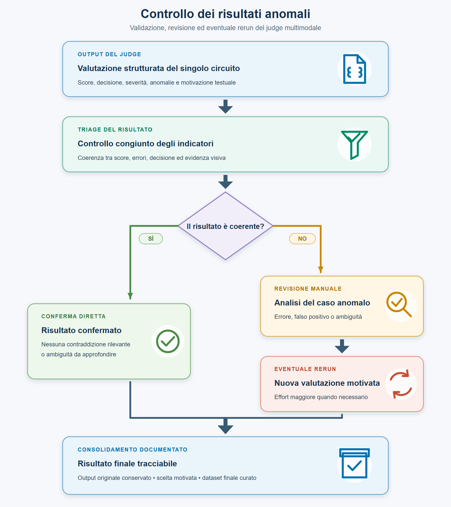

**Figura X.25 — Flusso di controllo e gestione dei risultati anomali.** I risultati coerenti possono essere consolidati direttamente; quelli caratterizzati da contraddizioni, ambiguità o indicatori inattesi vengono sottoposti a revisione manuale e, quando necessario, a un nuovo run motivato. I due percorsi convergono in un risultato finale tracciabile, mantenendo l'output originale e documentando le scelte effettuate.

Nel complesso, l'esperimento non dimostra un'accuratezza assoluta della pipeline né la simulabilità immediata dei 38 circuiti. Fornisce però evidenza descrittiva che il Graph JSON costituisce, nella maggioranza dei casi analizzati, una base topologica informativa e correggibile. Il contributo principale della verifica consiste quindi nell'aver misurato non soltanto la qualità media dell'output, ma anche le condizioni nelle quali tale output può essere trasferito con sicurezza agli stadi successivi e quelle nelle quali è necessario introdurre un controllo aggiuntivo.

## 9. Limiti della verifica

I risultati devono essere interpretati considerando i limiti del protocollo sperimentale. La verifica è stata progettata per stabilire se il Graph JSON conservi i collegamenti visibili nell'immagine e per individuare le principali categorie di errore; non costituisce una certificazione formale della correttezza elettrica dei circuiti né una misura definitiva dell'accuratezza della pipeline.

### 9.1 Assenza di una ground truth topologica annotata

Il limite principale è l'assenza di una ground truth costruita manualmente terminale per terminale e collegamento per collegamento. Le valutazioni derivano dal confronto multimodale effettuato dal judge tra l'immagine e il Graph JSON, non dal confronto deterministico con un grafo di riferimento validato da esperti. Di conseguenza, non è possibile calcolare metriche classiche come precision, recall o F1 sui singoli collegamenti, né distinguere automaticamente tutti i veri positivi, falsi positivi e falsi negativi della ricostruzione topologica.

Lo score medio di 92,368/100 rappresenta quindi la sintesi delle valutazioni strutturate prodotte dal judge e non una percentuale di accuratezza. Analogamente, il fatto che 38 circuiti su 38 siano dichiarati utilizzabili come base indica che il judge riconosce una struttura correggibile, ma non dimostra che ogni grafo sia completo o elettricamente valido. Una futura validazione con ground truth manuale consentirebbe di misurare direttamente la correttezza delle net e di calibrare le soglie del protocollo.

### 9.2 Dimensione e composizione del campione

Il campione comprende 38 circuiti distribuiti in quattro batch. Tale numerosità è sufficiente per osservare più tipologie di errore e confrontare comportamenti differenti, ma non garantisce la generalizzabilità dei risultati a qualunque schema elettrico. I circuiti analizzati appartengono al materiale disponibile per la sperimentazione e non derivano da un campionamento probabilistico di una popolazione definita.

La distribuzione delle classi di componenti, della qualità grafica e della complessità topologica può quindi influenzare i risultati. Schemi con simboli differenti, risoluzioni inferiori, un numero maggiore di componenti multi-terminale o convenzioni grafiche non presenti nei batch potrebbero produrre prestazioni diverse. Anche il confronto tra batch è descrittivo: C2 contiene otto circuiti, mentre A, B e C1 ne contengono dieci, e i gruppi non rappresentano necessariamente livelli crescenti e controllati della stessa variabile di complessità.

### 9.3 Dipendenza dal judge multimodale

Il protocollo utilizza un unico modello, `gpt-5.4`, come judge multimodale. Questo consente di mantenere uniforme il processo di valutazione, ma introduce dipendenza dalle capacità visive, dal ragionamento e dalla variabilità del modello. Non è stato eseguito un confronto sistematico tra giudici differenti, né una doppia annotazione indipendente da parte di esperti umani. Pertanto non sono disponibili misure di accordo inter-rater o una stima dell'incertezza associata al valutatore.

I casi analizzati mostrano concretamente questo limite. Il primo run di `a07` ha prodotto un falso positivo sul ramo del trasformatore; `c13` contiene una contraddizione interna nella valutazione della polarità; `c11` e `c14` presentano penalizzazioni la cui severità appare eccessiva rispetto all'impatto topologico; alcune anomalie di `b06` dipendono da una lettura visiva non completamente univoca. Questi esempi dimostrano che l'output strutturato e il rispetto di uno schema JSON non eliminano gli errori di interpretazione del modello.

I rerun a reasoning effort maggiore hanno permesso di approfondire casi anomali, ma non costituiscono da soli una procedura statistica di stima della variabilità. Nel Batch A, inoltre, la cartella finale curata combina otto risultati ordinari a effort `low` con i rerun a effort `medium` di `a07` e `a09`. La selezione è documentata e motivata, ma deve essere considerata quando si confrontano i risultati del batch con quelli ottenuti mediante una singola configurazione uniforme.

### 9.4 Limiti di score, decisioni e conteggi

Il sistema di punteggio assegna pesi prestabiliti ai quattro criteri e utilizza soglie orientative per le decisioni qualitative. Questi pesi riflettono l'obiettivo dell'esperimento, attribuendo maggiore importanza a `graph_connections`, ma non sono stati calibrati mediante un dataset annotato o uno studio empirico della gravità degli errori negli stadi successivi. Due anomalie con la stessa severità possono inoltre produrre conseguenze molto diverse: la perdita di un endpoint periferico non equivale necessariamente alla fusione tra alimentazione e massa.

La presenza di 13 risultati `VERY_HIGH` con un errore classificato `major` evidenzia una mancata coerenza tra la definizione testuale della fascia e alcuni output del judge. Anche i conteggi richiedono cautela, poiché più segnalazioni possono descrivere effetti correlati della stessa causa e le liste `missing_from_json`, `extra_in_json` e `wrong_graph_connections` non sono mutuamente esclusive. Per tali ragioni, score, decisione, severità e descrizione dell'errore devono essere interpretati congiuntamente e non come indicatori indipendenti.

### 9.5 Ambiguità dell'evidenza visiva

Il judge valuta esclusivamente ciò che è visibile nell'immagine, applicando le regole definite dal prompt e il vocabolario dei terminali. Non utilizza datasheet per inferire funzioni interne non rappresentate e non deve correggere lo schema in base a ciò che sarebbe elettricamente più plausibile. Questa scelta mantiene il confronto aderente all'obiettivo immagine–grafo, ma limita la possibilità di risolvere simboli poco leggibili, pin non etichettati o connessioni parzialmente coperte.

Incroci di fili, assenza o presenza poco visibile delle junction dot, label compresse, simboli multi-terminale e linee molto vicine possono generare interpretazioni alternative. In questi casi non è sempre possibile stabilire se una discrepanza derivi dalla pipeline o dalla lettura del judge senza una revisione manuale dell'immagine sorgente. Le valutazioni di severità critica devono pertanto essere considerate particolarmente affidabili soltanto quando la contraddizione tra immagine e grafo è visivamente certa.

### 9.6 Riproducibilità e tracciabilità della configurazione

Gli output conservano il modello utilizzato, il timestamp, l'hash del prompt, l'hash del vocabolario e l'esito della validazione della risposta. Tutti i 38 risultati finali condividono il prompt con hash SHA-256 `19f1ee29c0c6922dee303ac77ebb6d39133327859473113aaad908c034efb2ac` e il vocabolario con hash `7e5491a8cdf08705fd2679be440ebf737accb951e5f54af17c549e998909dca7`.

Il file `metadata/class_terminals_v1.yaml` presente nella versione corrente della repository è stato successivamente modificato e non possiede più l'hash registrato nell'esperimento. La versione esatta utilizzata è comunque recuperabile dalla cronologia Git al commit `8c573a178c34abd351264a76f8fa3a28940d80ac`. Per rendere l'esperimento autonomamente riproducibile sarebbe preferibile conservare anche una copia immutabile del vocabolario nella directory degli artefatti sperimentali.

I metadati delle singole risposte non registrano esplicitamente il livello di dettaglio dell'immagine e il reasoning effort. Tali parametri sono ricostruibili dalla documentazione dei comandi e dalla procedura usata per creare la cartella finale curata, ma la loro assenza dal record macchina costituisce una limitazione della tracciabilità sperimentale. Nelle esecuzioni future sarà opportuno serializzare insieme a ogni risultato tutti i parametri della richiesta, la versione dello script e gli identificativi degli input, così da rendere ogni valutazione completamente auditabile.

### 9.7 Limiti rispetto alla simulazione e alla diagnosi

La verifica riguarda la fedeltà tra immagine e Graph JSON e non controlla direttamente la conversione in netlist, la compatibilità dei modelli SPICE o il comportamento elettrico simulato. Un grafo topologicamente fedele può richiedere ancora valori, modelli di componente, orientamenti, condizioni iniziali e parametri non ricavabili dalla sola immagine. Viceversa, una rappresentazione con una piccola imprecisione semantica potrebbe essere corretta automaticamente prima della simulazione.

Non è quindi possibile concludere da questo esperimento che uno score più elevato determini necessariamente una migliore diagnosi finale, né quantificare l'effetto di ogni errore topologico sulle risposte di un agente di troubleshooting. Tale relazione richiede una valutazione separata della pipeline completa, nella quale gli output topologici vengono utilizzati negli stadi di simulazione e ragionamento diagnostico.

## 10. Conclusioni

La verifica ha analizzato la corrispondenza tra le immagini di 38 circuiti e i relativi Graph JSON prodotti dalla pipeline. Il protocollo ha utilizzato un judge multimodale con risposta strutturata per valutare componenti, terminali, collegamenti e semantica visibile, mantenendo la topologia come criterio principale mediante un peso di 55 punti su 100 assegnato a `graph_connections`.

I risultati mostrano una qualità complessivamente elevata. Lo score medio è 92,368/100 e la mediana è 95/100; 32 circuiti sono classificati `VERY_HIGH`, quattro `HIGH` e due `MEDIUM`, mentre nessun risultato appartiene alla fascia `LOW`. Tutti i 38 Graph JSON sono considerati dal judge utilizzabili come base topologica. I sottopunteggi medi di 9,763/10 per i componenti e 51,605/55 per i collegamenti indicano che la pipeline conserva generalmente gli endpoint e la struttura principale delle net.

Le anomalie più rilevanti risultano localizzate. I due errori critici sono concentrati nei casi `a09` e `b06`; i Batch C1 e C2 non presentano errori di questa severità. Le principali fragilità riguardano componenti multi-terminale o multi-stato, assegnazione dei ruoli dei pin, collegamenti di alimentazione, endpoint periferici e aree con cablaggio visivamente complesso. Il Batch B ottiene i risultati complessivamente più deboli, mentre C1 e C2 presentano le medie più alte e C2 la distribuzione più uniforme.

L'esperimento evidenzia anche che un risultato aggregato elevato non equivale all'assenza di errori significativi. Tredici circuiti classificati `VERY_HIGH` contengono una segnalazione `major`, e alcuni output mostrano contraddizioni o severità discutibili. Per questo motivo la valutazione non deve essere ridotta a un singolo score: l'uso affidabile del Graph JSON richiede l'analisi congiunta dei sottopunteggi, delle anomalie strutturate, dei terminali non connessi e delle descrizioni prodotte dal judge.

Dal punto di vista dell'ingegneria del software, il risultato principale è la validazione del Graph JSON come rappresentazione intermedia utile, ispezionabile e correggibile. La pipeline produce una base strutturata sulla quale possono essere applicati controlli deterministici, revisioni mirate e successivi arricchimenti semantici. Il judge agentico è efficace come meccanismo di screening e prioritizzazione dei casi problematici, ma non sostituisce una ground truth manuale né un controllo finale nei casi critici o ambigui.

La conclusione dell'esperimento è pertanto favorevole ma non assoluta: per il campione analizzato, la pipeline ricostruisce nella maggioranza dei casi una topologia sufficientemente fedele da giustificare il proseguimento verso gli stadi successivi. Il trasferimento non deve però essere automatico. Prima della generazione di una netlist o dell'impiego del grafo in un processo diagnostico risultano necessari controlli sul numero e sul ruolo dei terminali, sulle alimentazioni, sugli endpoint flottanti e sulle possibili fusioni o separazioni di net.

Questa verifica costituisce quindi il collegamento tra la costruzione della rappresentazione topologica e il successivo esperimento sui circuiti complessi. La seconda valutazione dovrà stabilire non soltanto se il grafo riproduca l'immagine, ma se l'intera pipeline sia in grado di utilizzare tale rappresentazione, insieme alle evidenze di simulazione e ai dati disponibili, per produrre analisi e risposte di troubleshooting tecnicamente fondate.
