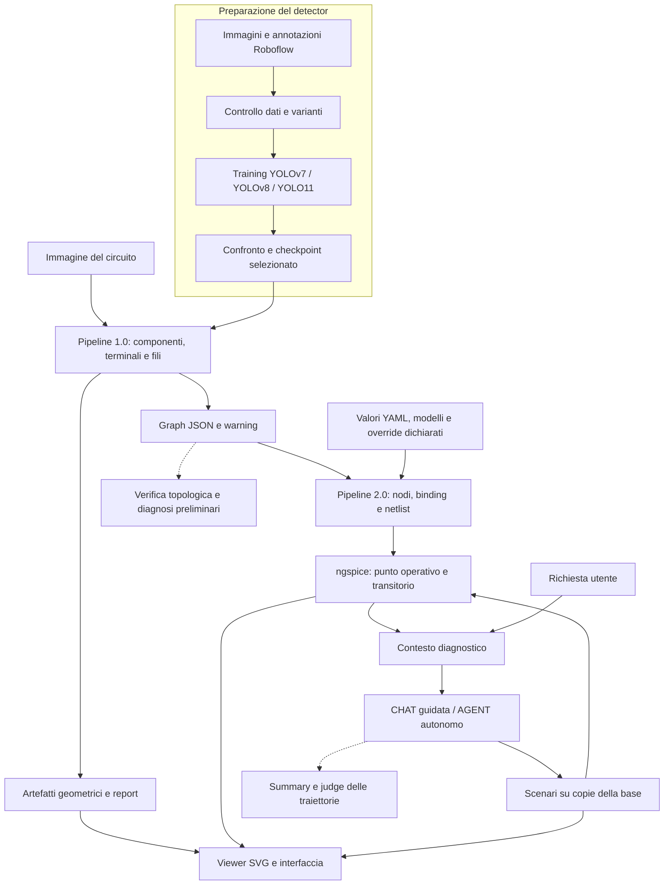

# Capitolo 3 - Problem statement e descrizione della soluzione proposta: mappa concettuale

## Scopo e stato del documento

Questa è la **roadmap per scrivere il Capitolo 3**, non il capitolo già redatto. Traduce la richiesta del relatore — formalizzare le specifiche del problema e descrivere la soluzione proposta — in una struttura di sezioni, sottosezioni, contenuti e materiali da preparare.

- **Ricognizione:** 14 settembre 2026, sul checkout locale con ultimo commit iniziale `ff7608cd`.
- **Stato della stesura del Capitolo 3:** da iniziare; indice e numerazione qui proposti sono provvisori.
- **Riferimento editoriale:** [mappa del Capitolo 2](02_stato_dell_arte_mappa.md), in particolare §2.7 e confine fra Capitoli 3 e 4.
- **Documento unico di lavoro:** indice, contenuti dei paragrafi, figure, pseudocodice, fonti, script e verifiche sono raccolti in questa mappa.
- **Revisione dell’indice e della sequenza dei paragrafi:** 15 settembre 2026. Le note operative espandibili accompagnano le sezioni pertinenti; le fonti documentali e i punti aperti sono raccolti in fondo.
- Non è stato modificato un `chapter3.tex`: questa attività prepara la stesura nel progetto LaTeX.

Il capitolo deve spiegare **che cosa riceve il sistema, quale informazione deve ricostruire, quali condizioni servono per simularla e come questa informazione sostiene la diagnosi**. L'ordine dataset → detector → grafo → SPICE → agente → viewer segue le dipendenze del lavoro svolto. La cronologia serve a motivare le scelte, senza diventare un diario di ogni tentativo.

## Confine con i Capitoli 2 e 4

| Capitolo | Domanda a cui risponde | Materiale principale |
| --- | --- | --- |
| 2 — Stato dell'arte | Quali approcci esistono e quali limiti motivano la tesi? | Letteratura, metodi disponibili, confronto critico. |
| 3 — Problema e soluzione proposta | Quale problema affrontiamo e come funziona il sistema sviluppato? | Specifiche, dataset, scelte progettuali, algoritmi, contratti dati, architettura e strumenti realizzati. |
| 4 — Valutazione sperimentale | Quanto funziona, in quali condizioni e con quali limiti? | Setup sperimentali completi, metriche, risultati YOLO, batch, judge, confronti, casi di errore e minacce alla validità. |

Nel Capitolo 3 si possono riportare dimensioni del dataset, configurazioni, criterio di selezione del detector e funzionamento dei judge: sono elementi del metodo. **Classifiche, score, percentuali di successo, costi misurati e grafici comparativi appartengono al Capitolo 4.** Un esempio di JSON, netlist o scenario nel Capitolo 3 serve a spiegare un passaggio; la sua valutazione va nel capitolo successivo.

## Impostazione dei paragrafi e dei sottoparagrafi

**Titolo del capitolo:** *Problem statement e descrizione della soluzione proposta*.

Usiamo due livelli numerati: **sezioni** (`3.1`, `3.2`, …) e **sottosezioni** (`3.3.1`, `3.3.2`, …). Dentro ogni sottosezione, i punti «Sequenza dei paragrafi di testo» indicano l’ordine della futura prosa: non sono ulteriori sottosezioni numerate e non vanno copiati come elenco nel capitolo. Non prevediamo un quarto livello `3.x.y.z`.

Aprire il capitolo con un breve testo introduttivo, senza sottosezione autonoma: raccordo con la sintesi del Capitolo 2, obiettivo del capitolo e percorso problema → soluzione. Ogni sezione avrà poi un breve paragrafo di apertura sul compito locale; ogni sottosezione svilupperà normalmente 3–4 paragrafi collegati, con più spazio quando occorre spiegare un algoritmo. Chiudere i nuclei principali con un raccordo al successivo, evitando una conclusione ripetitiva per ogni script.

La struttura aggiornata prevede **9 sezioni e 33 sottosezioni**. Il dettaglio cresce dove il lavoro richiede passaggi distinti: dataset, terminali/OCR, fili/grafo, valori/modelli/netlist, CHAT/AGENT. Rilevamento e assegnazione delle istanze rimangono insieme perché il secondo è un passaggio breve; normalizzazione e node map restano nello stesso nucleo elettrico.

**Come raccontare lo sviluppo.** Spiegare il bisogno che ha motivato ciascuna fase e la soluzione adottata: costruzione dei dati, scelta del detector, ricostruzione, preparazione elettrica e diagnosi. Le prove sui batch entrano qui come motivo della predisposizione di strumenti e artefatti; la loro composizione dettagliata, le prestazioni e i cambiamenti osservati vanno nel Capitolo 4. Il percorso di sviluppo deve essere riconoscibile senza riportare un resoconto dei risultati.

**Come usare le note espandibili.** Sono promemoria di lavoro che conservano fonti, conteggi, configurazioni storiche e discrepanze. Non tutto il loro contenuto va nel Capitolo 3: in particolare conteggi delle esecuzioni judge, sostituzioni dei rerun, hash effettivi e limiti di comparabilità del benchmark alimentano la futura mappa del Capitolo 4.

| Nucleo | Dettaglio da dedicare nel Capitolo 3 | Materiale che resta nel Capitolo 4 |
| --- | --- | --- |
| Problema e architettura | Specifiche, ingressi/uscite, assunzioni e relazione fra stadi. | Verifica del raggiungimento degli obiettivi. |
| Dataset e detector | Raccolta, annotazione, preparazione, augmentation, procedura di training e criterio di selezione. | Curve, metriche, ranking e evidenze quantitative della scelta. |
| Pipeline topologica | Algoritmi di stima terminali, OCR, maschere, fili, matching, grafo e contratti. | Prestazioni sui batch e analisi delle discrepanze immagine–grafo. |
| Pipeline SPICE | Binding, modelli, pin mapping, emissione, simulazione e preparazione delle misure. | Valori ottenuti, comportamento osservato e validazione dei casi. |
| Diagnosi e viewer | Contesto, azioni, cicli CHAT/AGENT, controlli, stato e rappresentazione visuale. | Esiti delle traiettorie, confronto delle modalità e valutazione dei limiti. |
| Strumenti judge | Architettura dei pacchetti, riferimenti tecnici, contratti e tracciabilità. | Campioni, rubriche complete, configurazioni effettive, calibrazione e punteggi. |

Nella §3.8 descrivere la **progettazione degli strumenti di verifica**, mantenendola più breve delle sezioni algoritmiche. I judge appartengono al percorso della tesi e possono essere illustrati come software realizzato; non costituiscono un capitolo sperimentale dentro il Capitolo 3. Le rubriche numeriche e i risultati vengono rinviati al capitolo successivo.

## Ricostruzione del percorso e collocazione nel capitolo

| Passaggio effettivamente affrontato | Come raccontarlo | Sezione |
| --- | --- | --- |
| Raccolta immagini e annotazione bbox con Roboflow | Costruzione della base dati e contratto delle annotazioni. | §3.3.1–3.3.2 |
| Preprocessing, controllo annotazioni ed export | Resize 1024×1024, verifica delle label, `data.yaml` e split Roboflow 439/126/62 del dataset finale. | §3.3.3 |
| Grayscale e augmentation di diverso tipo | Motivazioni, trasformazioni immagine–bbox, separazione degli split. | §3.3.4 |
| YOLOv7, YOLOv8 e YOLO11 sulle varianti | Disegno del confronto e configurazioni comuni. | §3.3.5 |
| Estrazione/ricontrollo risultati e scelta del modello | Criterio di selezione e identità del checkpoint operativo; risultati nel Capitolo 4. | §3.3.6 |
| Prima pipeline e prove su batch progressivi | Algoritmi di ricostruzione e artefatti intermedi; batch come contesto di sviluppo. | §3.4 |
| Judge immagine–grafo e benchmark diagnostico | Due verifiche diverse: fedeltà strutturale e utilità del grafo per la diagnosi. | Raccordo §3.4.6; strumenti in §3.8.1 |
| Seconda pipeline per la netlist SPICE | Nodi elettrici, valori, modelli, emissione e simulazione. | §3.5 |
| Assistente e modalità CHAT/AGENT | Contesto, scenari controllati, scelta guidata/autonoma e tracciabilità. | §3.6 |
| Viewer SVG collegato alle simulazioni | Modello visuale, layout, confronto degli scenari e significato delle animazioni. | §3.7 |
| Judge delle traiettorie con ground truth | Schede tecniche, summary, pacchetti e valutazione separata delle esecuzioni. | §3.8.2–3.8.3 |

Questa è una ricostruzione logica dello sviluppo. Non attribuire date o un ordine cronologico più preciso a esperimenti per i quali non è stato verificato un registro delle esecuzioni.

## Indice proposto

```text
3  Problem statement e descrizione della soluzione proposta
   3.1 Definizione del problema e specifiche
       3.1.1 Obiettivo, ingressi e uscite
       3.1.2 Formalizzazione delle rappresentazioni e del compito diagnostico
       3.1.3 Requisiti, assunzioni e perimetro della soluzione
   3.2 Architettura generale della soluzione
       3.2.1 Fasi di sviluppo e flusso operativo
       3.2.2 Modularità, artefatti intermedi e tracciabilità
   3.3 Costruzione del dataset e selezione del detector
       3.3.1 Raccolta delle immagini e definizione del dataset
       3.3.2 Tassonomia e annotazione dei componenti in Roboflow
       3.3.3 Preprocessing, controllo delle annotazioni e organizzazione degli split
       3.3.4 Generazione delle varianti e data augmentation
       3.3.5 Strategia di addestramento con YOLOv7, YOLOv8 e YOLO11
       3.3.6 Criteri di selezione e integrazione del detector
   3.4 Pipeline 1.0: ricostruzione topologica dello schema
       3.4.1 Rilevamento dei componenti e assegnazione delle istanze
       3.4.2 Stima geometrica e identificazione semantica dei terminali
       3.4.3 OCR e gestione dei simboli a più terminali
       3.4.4 Mascheramento dei simboli ed estrazione dei fili
       3.4.5 Associazione terminale–filo e costruzione del grafo
       3.4.6 Esportazione del Graph JSON e report di ispezione
   3.5 Pipeline 2.0: dal Graph JSON alla simulazione SPICE
       3.5.1 Normalizzazione e costruzione dei nodi elettrici
       3.5.2 Associazione dei valori e configurazione dichiarativa del circuito
       3.5.3 Regole di conversione, modelli SPICE e pin mapping
       3.5.4 Generazione della netlist SPICE
       3.5.5 Esecuzione delle analisi e strutturazione delle evidenze elettriche
   3.6 Diagnosi assistita: modalità CHAT e AGENT
       3.6.1 Costruzione del contesto diagnostico e ruolo del modello linguistico
       3.6.2 Definizione ed esecuzione degli scenari controllati
       3.6.3 Interazione guidata in modalità CHAT
       3.6.4 Ciclo autonomo in modalità AGENT
       3.6.5 Validazione delle azioni, arresto e tracciabilità della diagnosi
   3.7 Viewer SVG e integrazione applicativa
       3.7.1 Costruzione del modello visuale e del layout
       3.7.2 Rendering SVG e rappresentazione di tensioni, correnti e transitori
       3.7.3 Interfaccia, confronto degli scenari e workspace unificato
   3.8 Progettazione degli strumenti di verifica della soluzione
       3.8.1 Architettura dei judge per grafo e diagnosi preliminari
       3.8.2 Ground truth tecniche e preparazione delle traiettorie
       3.8.3 Judge finale e tracciabilità del giudizio
   3.9 Sintesi della soluzione e raccordo alla valutazione sperimentale
```

L'indice è articolato perché copre l'intero sistema. Per evitare frammentazione, i singoli script saranno richiamati dentro queste sottosezioni e in una tabella di corrispondenza, senza trasformare ciascun file in una sottosezione. La lunghezza dipenderà dal dettaglio necessario agli algoritmi e dalle figure: non fissiamo un numero di pagine prima di aver scritto i nuclei tecnici.

---

## 3.1 Definizione del problema e specifiche

**Scopo:** trasformare l'obiettivo generale della tesi in un compito preciso e delimitato. È la parte che risponde direttamente alla prima richiesta del professore.

### 3.1.1 Obiettivo, ingressi e uscite

**Sequenza dei paragrafi di testo**

1. Presentare il bisogno: rendere interrogabile uno schema disponibile come immagine.
2. Definire il compito e gli ingressi necessari a percezione, simulazione e diagnosi.
3. Descrivere gli output attesi, compresi artefatti intermedi e informazioni mancanti.

**Contenuti e materiali da sviluppare**

**Dettaglio della definizione del compito**

1. Partire dal limite della sola immagine: contiene simboli, testo e fili, ma non associazioni esplicite fra componenti, terminali e nodi interrogabili da un programma.
2. Definire l'obiettivo della soluzione: ricostruire una rappresentazione strutturata ispezionabile, preparare un modello simulabile quando sono disponibili le informazioni necessarie e usare le evidenze per rispondere a un sintomo o a una richiesta di analisi.
3. Distinguere gli ingressi delle diverse fasi. La detection usa l'immagine; la simulazione richiede anche configurazione elettrica; la diagnosi richiede la domanda dell'utente e i risultati disponibili.
4. Specificare gli output attesi, compresi warning, blocchi e conclusioni non risolutive. Una diagnosi utile può consistere anche nel localizzare una causa, riconoscere un limite del testbench o spiegare un comportamento già corretto.

| Livello | Ingresso | Uscita |
| --- | --- | --- |
| Percezione | Immagine raster, checkpoint e tassonomia | Componenti rilevati con bbox, classe e confidenza. |
| Ricostruzione | Immagine e componenti | Istanze, terminali, connessioni, Graph JSON e warning. |
| Preparazione elettrica | Graph JSON, `values.yaml`, registri di classi/modelli | Node map, parametri associati, netlist o motivi che impediscono una simulazione completa. |
| Simulazione | Netlist e configurazione di analisi | Esito ngspice, log, tensioni/correnti e dati transitori quando previsti. |
| Diagnosi | Richiesta, contesto tecnico, evidenze di base e degli scenari | Ipotesi, prove, confronto, conclusione e traccia dell'esecuzione. |
| Ispezione | Artefatti geometrici ed elettrici della run | Report topologico, viewer SVG e interfaccia CHAT/AGENT. |

**Precisazione centrale:** il sistema realizzato non ricava automaticamente dall'immagine tutti i valori elettrici e tutti i modelli. I valori manuali, gli equivalenti e gli eventuali override sono parte esplicita dell'ingresso della soluzione.

### 3.1.2 Formalizzazione delle rappresentazioni e del compito diagnostico

**Sequenza dei paragrafi di testo**

1. Definire immagine, bbox e classi senza ripetere la teoria del detector.
2. Formalizzare componenti, terminali, connessioni e mappa dei nodi elettrici.
3. Collegare parametri/modelli, simulazione, richiesta diagnostica e copie scenario.

**Contenuti e materiali da sviluppare**

Usare una formalizzazione breve, coerente con il codice. Le formule seguenti sono una **proposta di notazione per la tesi**, non nuovi formati da implementare.

**Detection e annotazioni.** Per un'immagine $I$, il detector produce

$$
D=f_\theta(I)=\{(b_i,k_i,s_i)\}_{i=1}^{m},
$$

dove $b_i$ è la bounding box, $k_i$ la classe e $s_i$ la confidenza. Il dataset annotato $\mathcal D=\{(I_j,Y_j)\}$ contiene classi e bbox di riferimento; la confidenza appartiene alla predizione, non all'annotazione YOLO.

**Topologia.** Siano $C$ l'insieme delle istanze, $T$ l'insieme dei terminali e $\pi:T\to C$ la relazione di appartenenza. Il grafo esportato descrive collegamenti esterni fra terminali:

$$
G_T=(T,E_w).
$$

Un arco indica una connessione ricostruita mediante i fili. **Il corpo del resistore, diodo o condensatore non è un filo che unisce i suoi terminali nello stesso nodo.** L'identità del componente e i suoi terminali restano in `components`; l'adiacenza elettrica esterna è in `graph`.

Le componenti connesse del grafo normalizzato definiscono i nodi elettrici candidati. Dopo l'unificazione dei riferimenti di massa si ottiene una mappa $\nu:T\to N$. Eventuali override dichiarati possono poi produrre una mappa effettiva $\tilde\nu$, conservando separatamente la topologia estratta e la configurazione usata per SPICE.

**Modello elettrico.** Una rappresentazione astratta del circuito preparato è

$$
\mathcal C=(C,T,N,\pi,\tilde\nu,P,M),
$$

con parametri $P$ e modelli $M$. Le sorgenti o gli elementi aggiunti dal testbench vanno dichiarati come tali. La netlist $\mathcal L$ è generata da questa rappresentazione; il simulatore restituisce $S=\operatorname{Sim}(\mathcal L,A)$, dove $A$ comprende analisi, stimoli e condizioni iniziali.

**Diagnosi.** Data una richiesta $q$ e un contesto $K_0$ costruito dagli artefatti di base, il sistema produce ipotesi e, se previste, azioni ammesse $a_j$. Ciascuno scenario è applicato a una copia della base:

$$
\begin{aligned}
\mathcal L_j &= \operatorname{Apply}(\operatorname{Copy}(\mathcal L_0),a_j), \\
S_j &= \operatorname{Sim}(\mathcal L_j,A_j).
\end{aligned}
$$

La cronologia delle evidenze cresce fra le iterazioni; gli scenari non devono essere descritti come modifiche cumulative alla base quando ripartono da copie indipendenti. La conclusione deve riferirsi a misure disponibili e distinguere osservazione, ipotesi e correzione verificata.

### 3.1.3 Requisiti, assunzioni e perimetro della soluzione

**Sequenza dei paragrafi di testo**

1. Esplicitare i requisiti funzionali e la tracciabilità richiesta al sistema.
2. Dichiarare assunzioni sui dati, integrazioni manuali e modelli circuitali.
3. Delimitare i compiti supportati e le condizioni in cui la soluzione può fermarsi.

**Contenuti e materiali da sviluppare**

Presentare questi requisiti come **sistematizzazione a posteriori degli obiettivi implementati**, senza attribuirli a un capitolato formale iniziale non documentato.

| ID | Requisito | Dove viene affrontato | Evidenza da verificare nel Capitolo 4 |
| --- | --- | --- | --- |
| R1 | Localizzare e distinguere le classi di simboli previste. | Detector, §3.3–3.4.1 | Metriche di detection e casi difficili. |
| R2 | Dare identità a componenti e terminali e ricostruire i collegamenti. | Pipeline 1.0, §3.4 | Verifica immagine–grafo e analisi degli errori. |
| R3 | Conservare una rappresentazione strutturata ispezionabile. | Graph JSON e report, §3.4.6 | Artefatti e casi di warning. |
| R4 | Rendere espliciti valori, pin, modelli, equivalenti e correzioni. | YAML, registri e binding, §3.5 | Coerenza immagine–grafo–configurazione–netlist. |
| R5 | Eseguire analisi elettriche e registrare gli errori del simulatore. | ngspice, §3.5.4 | Run, log, misure e comportamento atteso. |
| R6 | Supportare prove diagnostiche guidate e autonome. | CHAT/AGENT, §3.6 | Pertinenza delle prove e qualità delle conclusioni. |
| R7 | Isolare gli scenari e mantenere la traccia delle modifiche. | Runner e workspace, §3.6–3.7 | Base/scenario, manifest e history. |
| R8 | Consentire ispezione visuale e valutazione separata degli stadi. | Viewer e strumenti judge, §3.7–3.8 | Esempi visuali e protocolli sperimentali. |

**Assunzioni e limiti da dichiarare nel testo**

- L'ambito sperimentale riguarda schemi circuitali raster e la simbologia effettivamente presente nei dati. I piani iniziali sui wiring diagram non dimostrano copertura universale di cablaggi industriali o automotive.
- Le 32 classi del detector non corrispondono a 32 modelli elettrici immediatamente simulabili; il riconoscimento di un IC generico non ne determina da solo il pinout e il macromodello.
- Le annotazioni di detection non costituiscono una ground truth topologica completa.
- La qualità di bbox, terminali e fili influenza gli stadi successivi. L'assenza di warning non dimostra correttezza del circuito.
- Le integrazioni manuali possono riguardare anche pin mapping, nodo di riferimento, testbench e correzioni topologiche dichiarative, oltre ai valori.
- Le analisi generate nel flusso corrente sono `.op` e `.tran`. `.dc` e `.ac` rimangono nozioni di contesto del Capitolo 2, salvo estensioni future documentate.
- Simulabilità, fedeltà allo schema e correttezza diagnostica richiedono verifiche distinte. Il prototipo non documenta una validazione sperimentale generale su hardware reale.

**Materiali:** tabella ingressi/uscite e requisiti; nessun lungo richiamo teorico a YOLO o SPICE.

---

## 3.2 Architettura generale della soluzione

**Scopo:** dare al lettore una vista dell'intero sistema prima di descriverne gli algoritmi.

### 3.2.1 Fasi di sviluppo e flusso operativo

**Sequenza dei paragrafi di testo**

1. Presentare la figura generale e distinguere preparazione del detector e uso del sistema.
2. Seguire il percorso operativo da immagine a grafo, netlist e contesto diagnostico.
3. Descrivere l’anello degli scenari e la posizione del viewer e dei judge.

**Contenuti e materiali da sviluppare**

Distinguere due momenti:

1. **Preparazione:** costruzione dataset, generazione varianti, addestramenti, confronto e selezione del checkpoint.
2. **Uso del sistema:** immagine → detection → topologia → configurazione elettrica → SPICE → contesto diagnostico → interazione e scenari.

Il training non viene rieseguito ogni volta che l'utente analizza un circuito. La Pipeline 2.0 estende la Pipeline 1.0; le due denominazioni identificano blocchi funzionali che convivono, non due versioni alternative dello stesso algoritmo.

**Bozza della figura di architettura, da rifinire per LaTeX**



Le frecce tratteggiate rappresentano il percorso di valutazione. I judge non vanno disegnati come un componente obbligatorio eseguito a ogni iterazione dell'applicazione.

### 3.2.2 Modularità, artefatti intermedi e tracciabilità

**Sequenza dei paragrafi di testo**

1. Motivare la divisione in stadi e il ruolo delle rappresentazioni intermedie.
2. Spiegare contratti di scambio, provenienza e separazione fra geometria e topologia.
3. Introdurre workspace e manifest, rinviando i dettagli applicativi alla §3.7.3.

**Contenuti e materiali da sviluppare**

Scrivere tre paragrafi:

1. Ogni stadio legge un contratto definito e produce file ispezionabili: questo permette di localizzare un errore prima che diventi una conclusione diagnostica.
2. Il Graph JSON canonico privilegia componenti e connessioni; le coordinate e gli overlay geometrici più ricchi rimangono negli artefatti della Pipeline 1.0. Il viewer usa entrambe le famiglie di informazioni.
3. Il launcher unificato collega gli stadi mediante workspace, manifest, percorsi degli input e impronte dei file. La parte tecnica e le due sessioni web condividono la provenienza, con copie e history separate.

**Da mostrare:** una tabella compatta `stadio → input → output → script`. La corrispondenza dettagliata è riportata nelle note operative di questa mappa; in tesi selezionare solo gli artefatti principali.

**Fonti:** [README generale](../../README.md), [launcher unificato](../../scripts/pipeline_unified/README.md), [riferimento Pipeline 2.0](../third_part_from_json_to_spice/pipeline2_scripts_reference.md).

---

## 3.3 Costruzione del dataset e selezione del detector

**Scopo:** ripercorrere tutta la prima fase, dalla preparazione delle immagini alla scelta del componente percettivo usato nel sistema.

### 3.3.1 Raccolta delle immagini e definizione del dataset

**Sequenza dei paragrafi di testo**

1. Descrivere tipologia degli schemi e obiettivo della raccolta.
2. Presentare fonti effettive e varietà del materiale, qualificando i dati non documentati.
3. Definire il dataset finale di **627 immagini** di diagrammi completi e raccordarlo alla tassonomia e all'annotazione della §3.3.2.

**Contenuti e materiali da sviluppare**

Descrivere la raccolta di immagini di schemi completi e il compito per cui è stato costruito il dataset. Spiegare la varietà grafica richiesta: più simboli nella stessa immagine, scale diverse, orientamenti e presenza di testo/fili. Documentare le fonti effettivamente impiegate quando disponibili; le opzioni proposte nei Word non attestano una raccolta realmente eseguita.

**Decisione editoriale:** il dataset di riferimento della tesi è uno solo, quello finale da **627 immagini**. Non organizzare la narrazione per v1/v2/v3 o snapshot storici. Le varianti di preprocessing e augmentation sono condizioni derivate, trattate in §3.3.4; i riscontri sugli archivi dei training restano note di tracciabilità per il Capitolo 4. Qui presentare la raccolta; riservare classi e istanze alla §3.3.2 e la suddivisione train/validation/test alla §3.3.3.

**Materiale:** uno o due schemi rappresentativi della collezione, usati per illustrare il dominio di ingresso.

### 3.3.2 Tassonomia e annotazione dei componenti in Roboflow

**Sequenza dei paragrafi di testo**

1. Richiamare brevemente il **supervised learning**: per addestrare il detector, ogni istanza di interesse deve essere associata a una classe e a una regione dell'immagine.
2. Presentare la tassonomia delle **32 classi**, la distinzione fra classe visuale e modello elettrico/SPICE e le **8.728 istanze annotate**; inserire subito dopo il grafico delle frequenze e un breve commento descrittivo.
3. Descrivere l'annotazione manuale delle bbox in Roboflow, illustrarla con lo screenshot dell'interfaccia e chiarire il significato della bbox e i limiti dell'annotazione.
4. Spiegare il formato delle label YOLO con un piccolo esempio reale da recuperare, quindi raccordare alla preparazione e agli split della §3.3.3.

**Contenuti e materiali da sviluppare**

Limitare il richiamo all'apprendimento supervisionato a due o tre frasi che motivino le annotazioni, senza ripetere la teoria dei detector del Capitolo 2.

La tassonomia descrive il **tipo visuale di simbolo** che il detector deve riconoscere. Distinguere classe, singola occorrenza e designator leggibile nello schema. Le 32 classi non equivalgono a 32 modelli elettrici direttamente simulabili: per esempio, riconoscere un `Integrated_Circuit` non ne determina pinout, parametri o macromodello SPICE. Queste informazioni appartengono alla successiva preparazione elettrica (§3.5).

I conteggi per tutte le classi sono **già disponibili**, forniti dall'autore e riportati nelle note operative di questa sezione; la loro somma è **8.728 istanze sull'intero dataset**, non il numero di immagini né il solo train. Usare il nome corretto `Transformer`, confermato dall'autore. Una tabella compatta per famiglie è facoltativa se aiuta a spiegare la tassonomia; evitare di duplicare in tesi una tabella di 32 conteggi e il grafico.

**Grafico previsto:** barre orizzontali per le 32 classi, ordinate per frequenza decrescente, con numero di istanze sull'asse orizzontale in **scala lineare** e conteggio alla fine di ogni barra. Collocarlo subito dopo la tassonomia. Commentare soltanto la distribuzione non uniforme: `Resistor` (2.153), `GND` (1.351) e `Terminal` (826) sono frequenti; `Antenna` (8), `Memristor` (14) e `Breaker` (17) sono rare. Gli effetti sulle prestazioni, le metriche e i risultati appartengono al **Capitolo 4**.

**Annotazione manuale:** importazione delle immagini in Roboflow → individuazione del simbolo → disegno manuale della bounding box → assegnazione della classe. Inserire come figura lo **screenshot Roboflow già condiviso dall'autore**, con immagine, bbox e classi visibili. Spiegare brevemente che la bbox è il rettangolo che localizza l'istanza. L'annotazione riguarda la localizzazione dei simboli, non la connettività completa: stima dei terminali, estrazione dei fili e ricostruzione dei nodi spettano alla Pipeline 1.0 (§3.4). I criteri concreti di inclusione di testo e reofori nelle bbox vanno recuperati dalle note dell'autore; non introdurli come procedura verificata se non documentati.

**Rappresentazione YOLO:** a ogni immagine corrisponde un file label `.txt`, con una riga per istanza nel formato:

```text
class_id x_center y_center width height
```

`class_id` identifica la classe; `x_center` e `y_center` indicano il centro della bbox, `width` e `height` le sue dimensioni. Le quattro quantità geometriche sono **normalizzate tra 0 e 1** rispetto alle dimensioni dell'immagine: centro orizzontale e larghezza rispetto alla larghezza dell'immagine, centro verticale e altezza rispetto all'altezza. La confidenza non compare nelle annotazioni di riferimento.

**Esempio da recuperare:** estrarre 2–3 righe autentiche dal `.txt` di un'immagine del dataset finale, preferibilmente quella mostrata nello screenshot, verificando il mapping degli ID. Usare un piccolo blocco testuale/verbatim accanto al richiamo all'immagine, senza inventare valori né aggiungere una terza figura autonoma. Il blocco sopra illustra soltanto il formato, non è un'annotazione reale. Rinviare alla §3.3.3 per `data.yaml`, preprocessing e split.

**Materiali:** due figure principali — grafico lineare delle frequenze e screenshot Roboflow — più il breve estratto YOLO da recuperare; eventuale tabella per famiglie e mapping completo in appendice.

### 3.3.3 Preprocessing, controllo delle annotazioni e organizzazione degli split

**Sequenza dei paragrafi di testo**

1. Descrivere il preprocessing in Roboflow: auto-orientamento e resize a **1024×1024**.
2. Spiegare il controllo delle annotazioni e della coerenza fra immagini, bbox e classi.
3. Presentare la suddivisione del dataset finale effettuata direttamente in Roboflow: **439 train / 126 valid / 62 test**.
4. Descrivere l'organizzazione dell'export e il ruolo di `data.yaml`, raccordando alle varianti della §3.3.4.

**Contenuti e materiali da sviluppare**

Spiegare auto-orientamento e resize iniziale 1024×1024 di tipo **Stretch**, già documentati negli export, e la corrispondente trasformazione delle bbox. Il preprocessing prepara immagini e annotazioni per il training; la generazione delle varianti e la data augmentation restano in §3.3.4.

Descrivere i controlli sul formato delle label, sulla corrispondenza immagine–file `.txt`, sugli ID di classe e sulla validità delle coordinate normalizzate e delle bbox. Documentare i controlli effettivamente eseguiti, senza attribuire procedure di revisione fra annotatori non confermate. Le utility di conversione di eventuali label poligonali sono un dettaglio tecnico di controllo degli export, non una sequenza narrativa di versioni del dataset; verificare l'esempio finale prima di presentarlo come label detection a cinque campi.

Lo split del **solo dataset finale di 627 immagini**, effettuato direttamente in Roboflow, è:

| Split | Immagini | Percentuale |
| --- | ---: | ---: |
| Training (`train`) | 439 | 70,0% |
| Validation (`valid`) | 126 | 20,1% |
| Test (`test`) | 62 | 9,9% |
| **Totale** | **627** | **100,0%** |

Spiegare il ruolo dei tre sottoinsiemi: training per l'apprendimento dei parametri, validation per il controllo durante l'addestramento e la selezione del modello, test per la valutazione finale. Le percentuali, arrotondate a una cifra decimale, corrispondono approssimativamente a **70/20/10**. Non introdurre qui metriche o risultati né dedurre dalla sola suddivisione un'indipendenza per fonte non verificata.

Descrivere l'organizzazione dell'export in immagini e label per ogni split. Il file **`data.yaml`** raccoglie i percorsi di train/validation/test e il mapping fra ID e nomi delle 32 classi: citarne la funzione e, se utile, mostrare un estratto minimo verificato, senza riportarlo integralmente. Non ripetere la spiegazione delle singole righe YOLO, già trattata in §3.3.2.

**Materiali:** tabella degli split; riscontro delle impostazioni di preprocessing e del `data.yaml` dell'export finale. Le verifiche sulla provenienza dei dati delle singole run alimentano il Capitolo 4 e non cambiano l'organizzazione narrativa di questa sottosezione.

### 3.3.4 Generazione delle varianti e data augmentation

**Sequenza dei paragrafi di testo**

1. Motivare la variante grayscale e le perturbazioni offline.
2. Descrivere trasformazioni lievi, composizione e trasformazioni forti.
3. Spiegare aggiornamento delle bbox, filtri di visibilità e gestione degli split.
4. Distinguere augmentation offline e online e indicare cosa serve alla riproduzione.

**Contenuti e materiali da sviluppare**

Spiegare la motivazione di ciascuna variante e come vengono aggiornate le bbox. Le varianti sono condizioni di preprocessing e augmentation del dataset di riferimento; i nomi tecnici delle politiche non introducono una narrazione per revisioni del dataset.

| Variante | Trasformazione principale | Effetto sugli split |
| --- | --- | --- |
| RGB base | Immagine esportata, senza augmentation offline aggiuntiva. | Mantiene i tre split. |
| Grayscale | Conversione in livelli di grigio, annotazioni copiate. | Converte immagini di train, valid e test. |
| `aug_v1` | Rotazioni ±7°, traslazioni ±3%, piccole variazioni di scala, luminosità/contrasto e rumore. | Aggiunge derivazioni al train; copia valid/test della sorgente. |
| `aug_v2_compose` | Affiancamento di due immagini del train, resize con proporzioni conservate e padding. | Aggiunge circa il 65% di campioni al train; copia valid/test. |
| `aug_v3 strong` | Rotazioni di modulo 25–45°, traslazioni di modulo 8–15%, scala e perturbazioni fotometriche più forti. | Aggiunge derivazioni al train; copia valid/test. |

Chiarire che la composizione affianca due diagrammi **senza creare collegamenti elettrici fra essi**. Le bbox vengono traslate, scalate o ricalcolate insieme alle immagini; i filtri di visibilità e i tentativi di rigenerazione gestiscono oggetti tagliati.

La baseline conserva le augmentation **online** del framework di training. Non definirla «assenza di qualsiasi augmentation». Gli script attuali non fissano uniformemente tutti i generatori casuali: per la riproduzione esatta contano anche gli archivi conservati.

**Materiali:** tavola delle cinque condizioni con bbox; tabella dei parametri completi in appendice. Pseudocodice opzionale di 10–15 righe sulle trasformazioni congiunte immagine–annotazioni; non serve trascrivere tutte le chiamate Albumentations.

### 3.3.5 Strategia di addestramento con YOLOv7, YOLOv8 e YOLO11

**Sequenza dei paragrafi di testo**

1. Presentare famiglie YOLO e matrice delle configurazioni dati–modello.
2. Descrivere procedura di training, parametri documentati e gestione delle riprese.
3. Spiegare quali configurazioni e checkpoint vengono conservati, senza riportare graduatorie.

**Contenuti e materiali da sviluppare**

Presentare la matrice delle **15 configurazioni consolidate**: tre famiglie per cinque condizioni dati. I modelli Ultralytics impiegati sono YOLOv8s e YOLO11s. La directory preliminare `exp11b` e quella corretta `exp11b1` devono rimanere distinte nella ricostruzione storica.

Richiamare il setup documentato: risoluzione 1024, batch 4, 100 epoche previste, ambiente Colab/T4 nei report. Precisare che configurazioni, framework, augmentation online e riprese del training non sono identici in ogni dettaglio. Notebook e launcher unico di training non risultano nel checkout: un eventuale pseudocodice sarà una sintesi metodologica, non la descrizione di uno script esistente.

### 3.3.6 Criteri di selezione e integrazione del detector

**Sequenza dei paragrafi di testo**

1. Motivare il criterio di selezione rispetto alla localizzazione necessaria alla pipeline.
2. Identificare modello e checkpoint adottati, con rinvio al Capitolo 4 per le evidenze comparative.
3. Descrivere l’integrazione del detector nel flusso di inferenza e il suo contratto di uscita.

**Contenuti e materiali da sviluppare**

Spiegare la disponibilità di log e checkpoint e il criterio con cui si individua il detector da integrare. Il percorso log → ricontrollo → tabelle e grafici sarà documentato nel Capitolo 4 per l'analisi dei risultati; qui serve a spiegare la selezione. Le utility presenti non costituiscono un estrattore unico che automatizza integralmente questo percorso.

**Scelta da dichiarare:** YOLO11s, checkpoint `outputs/yolo11/exp11b1_yolo11_rgb_aug_strong_v3/weights/best.pt`. Il confronto consolidato lo indica come `exp11b`, ma il percorso operativo è quello con `exp11b1`.

**Criterio:** massimo mAP@0.5:0.95 di validazione nella selezione riportata, considerando anche precision, recall e F1. Motivare l'interesse per la localizzazione rispetto alla successiva stima di terminali e maschere. Il Capitolo 4 documenterà i valori e i limiti del confronto; il Capitolo 3 non deve dichiarare un miglioramento topologico dimostrato dalla sola mAP.

**Fonti:** [dati](../../data/README.md), [report consolidato detection](../first_part_object_detection/CAPITOLO_RISULTATI_OBJECT_DETECTION.md), [confronto famiglie](../first_part_object_detection/results_comparison_summary.md), script sotto `scripts/augmentation/` e `scripts/bounding_box/`.

---

<details>
<summary>Fonti operative e dettagli verificati per dataset, augmentation e detector</summary>

#### Dataset finale, conteggi e materiali per §3.3.1–§3.3.3

**Riferimento editoriale aggiornato al 16 settembre 2026:** un solo dataset finale di **627 immagini**, **32 classi**, **8.728 istanze annotate** e split Roboflow **439/126/62**. I conteggi seguenti sono stati forniti dall'autore nella conversazione *Struttura Capitolo Tre*; sono il riferimento per il grafico lineare della §3.3.2. L'elenco non definisce l'ordine degli ID YOLO, che va letto nel `data.yaml` dell'export finale.

| Classe | Istanze nell'intero dataset |
| --- | ---: |
| `Analog_Meter` | 32 |
| `Antenna` | 8 |
| `Battery` | 197 |
| `Breaker` | 17 |
| `Capacitor` | 651 |
| `Connector` | 26 |
| `Current_Source` | 195 |
| `Diode` | 302 |
| `Fuse` | 59 |
| `GND` | 1.351 |
| `Inductor` | 274 |
| `Integrated_Circuit` | 92 |
| `Lamp` | 55 |
| `LED` | 123 |
| `Memristor` | 14 |
| `Meter` | 82 |
| `Mosfet` | 475 |
| `Motor` | 29 |
| `NPN_Transistor` | 497 |
| `Operational_Amplifier` | 219 |
| `Polarized_Capacitor` | 364 |
| `Push_Button` | 25 |
| `Resistor` | 2.153 |
| `Signal_Source` | 97 |
| `Speaker` | 21 |
| `Switch` | 204 |
| `Terminal` | 826 |
| `Thermistor` | 26 |
| `Transformer` | 34 |
| `Trim_Capacitor` | 37 |
| `Variable_Resistor` | 75 |
| `Voltage_Source` | 168 |
| **Totale: 32 classi** | **8.728** |

Il supporto successivo di una classe semantica, per esempio `PNP_Transistor` nella pipeline elettrica, non dimostra che fosse una trentatreesima classe addestrata del detector. Verificare separatamente classe YOLO, eventuale rimappatura e supporto SPICE.

**Materiali per la stesura:** usare il grafico a barre orizzontali in scala lineare già scelto e lo screenshot Roboflow già condiviso; predisporre le copie adatte alla tesi. Resta da recuperare il piccolo estratto autentico del file label associato a un'immagine del dataset finale e verificare il relativo mapping in `data.yaml`.

Nei file interni `README.dataset.txt`, `README.roboflow.txt` e `data.yaml` degli export già ispezionati è documentato il progetto Roboflow `electrical-diagrams-detection`, workspace `marcos-workspace-amrpv`. Gli export dichiarano CC BY 4.0. L'annotazione manuale delle bbox è confermata dall'autore.

**Tracciabilità degli archivi, solo come promemoria per il Capitolo 4:** i riepiloghi `metadata/class_summary_global.csv` e `class_summary_by_split.csv` della precedente ricognizione riportano **8.709** istanze, mentre i conteggi finali forniti dall'autore sommano **8.728**. Non usarli come fonte del grafico finale né attribuire i nuovi conteggi a tutti i training senza riscontro. Conservare la distinzione fra fonte dei conteggi finali e dati effettivamente impiegati nelle singole run; la verifica non richiede di ripristinare v1/v2/v3 o tabelle degli snapshot nella narrazione della tesi. Anche le annotazioni di validation/test possono differire fra archivi con immagini uguali.

#### Politiche di augmentation

I conteggi per archivio nella tabella seguente sono un promemoria tecnico per verificare la provenienza delle run nel Capitolo 4, non una struttura da riprodurre nella tesi né una fonte per le 8.728 istanze del dataset finale.

| Politica | Parametri verificati nel codice | Train v1/v2 | Train v3 |
| --- | --- | ---: | ---: |
| RGB base | Export 1024×1024 Stretch, nessuna augmentation offline aggiunta. | 440 | 439 |
| Gray | PIL `convert("L")`, label copiate; conversione di tutti gli split. | 440 | 439 |
| `aug_v1` | Scala 0,97–1,03; traslazione ±3%; rotazione ±7°; `min_visibility=0.30`; α 0,95–1,08, β ±10 con p=0,70; rumore σ 4–10 con p=0,45. | 880 | 878 |
| Compose | Due immagini distinte del train; gap 10 px; resize/padding 1024²; aggiunta `round(0.65*N)`; fotometria p=0,35, α 0,98–1,03 e β ±4. | 726 | 724 |
| Strong | Modulo angolo 25–45° e traslazione 8–15%, ciascuno con segno casuale; scala 0,93–1,07; `min_visibility=0.20`; α 0,92–1,10, β ±15 con p=0,75; rumore σ 5–12 con p=0,50. | 880 | 878 |

Riferimenti di codice utili:

- `make_augmented_dataset.py`: `build_transform` e ciclo di generazione, con massimo cinque tentativi per evitare la perdita di tutte le bbox di un campione annotato;
- `make_augmented_dataset_v2_compose.py`: costruzione della composizione e trasformazione delle coordinate, con selezione di immagini solo dal train;
- `make_augmented_dataset_v3_strong.py`: campionamento delle trasformazioni forti e massimo dieci tentativi;
- `make_greyscale_dataset.py`: conversione di train/valid/test.

I tre script RGB attuali leggono `dataset_v3`: non rigenerano automaticamente gli snapshot storici di tutte le run. I parser delle augmentation leggono righe detection a cinque campi e saltano le altre; i nove poligoni presenti nella base v3 richiedono quindi attenzione nella ricostruzione della preparazione dati.

Le augmentation RGB conservano valid/test della propria sorgente. La conversione grayscale coinvolge invece tutti gli split. Nei training sono attive anche augmentation online: gli `args.yaml` Ultralytics riportano, fra gli altri, HSV, traslazione, scala, flip orizzontale e mosaic; YOLOv7 usa proprie configurazioni `hyp.yaml`.

La casualità offline non è fissata uniformemente: compose usa `random.Random(42)` per le coppie, ma non tutte le perturbazioni condividono quel generatore; gli altri script non inizializzano esplicitamente tutti i seed. Gli ZIP conservati sono pertanto parte della riproducibilità.

#### Matrice degli esperimenti e checkpoint

| Famiglia | RGB | Gray | Lieve | Compose | Strong |
| --- | --- | --- | --- | --- | --- |
| YOLOv7 | exp01 | exp02 | exp03 | exp04 | exp03b |
| YOLOv8s | exp05 | exp06 | exp07 | exp08 | exp07b |
| YOLO11s | exp09 | exp10 | exp11 | exp12 | exp11b, con run corretta exp11b1 |

Questa matrice rappresenta 15 configurazioni consolidate. Esistono 16 directory di run contando anche la versione preliminare `exp11b`; non equiparare configurazioni e numero fisico di esecuzioni.

Il checkpoint operativo è [best.pt della run exp11b1](../../outputs/yolo11/exp11b1_yolo11_rgb_aug_strong_v3/weights/best.pt), referenziato in `01_detect_components.py` e in `pipeline_unified/run_pipeline.py`. L'identità YOLO11s è riscontrata nei metadati del checkpoint. Il suo hash atteso dal preflight è:

```text
325d619c6e9ee4d992e6eb141d21c0641cbf72e1c0a6e03cc9bdd9ec0b22fe6a
```

I metadati delle metriche nel checkpoint coincidono con la riga epoch 59 del `results.csv` della run: il confronto consolidato si riferisce a questa versione. I valori numerici sono materia del Capitolo 4. Il PDF detection preliminare usa invece la precedente `exp11b`, che ha una migliore riga diversa: non trasferire automaticamente le conclusioni sui massimi di recall/F1.

**Punto aperto per la tracciabilità dei training nel Capitolo 4:** il report consolidato attribuisce al benchmark 628 immagini base e 1625 istanze valid, mentre `exp11b1/args.yaml` indica una directory con il nome dell'export successivo. Il nome della cartella non basta a provarne il contenuto. Recuperare il `data_yolo11.yaml` effettivo, i log della scansione o il manifest/hash dello snapshot impiegato. Fino a quel momento evitare di affermare identità completa dei dati in tutte le run.

Ulteriore differenza: il report della run cita Ultralytics 8.4.30, mentre il checkpoint contiene 8.4.33. Una ripresa del training può spiegarlo, ma non è stata accertata come causa; registrare entrambe le evidenze prima della tabella definitiva dell'ambiente.

Non risultano notebook `.ipynb` nel checkout. `README.md` delimita già la riproducibilità del training storico YOLOv7. Alcuni YAML indicano `last.pt` per le riprese; 100 epoche previste non implica sempre 100 righe CSV. `plots_from_results.py` legge una tabella Markdown e `f1_calculate.py` calcola F1 da costanti: non attribuire loro un'estrazione automatica completa di tutti i log.

#### Script di riferimento

| Sezione | Script/modulo | Responsabilità da descrivere |
| --- | --- | --- |
| 3.3.3 | `scripts/bounding_box/count_box_greather_5.py`, `check_bbox.py` | Ispezione del formato e controllo delle annotazioni. |
| 3.3.3 | `scripts/bounding_box/convert_dataset_detection_only.py` | Utility per eventuali label poligonali; dettaglio tecnico degli export, senza narrazione delle revisioni. |
| 3.3.2 | `scripts/utils/build_class_summary.py` | Supporto al controllo dei conteggi; i riepiloghi storici non sostituiscono i 32 conteggi finali forniti dall'autore. |
| 3.3.3 | `unzip_dataset.py`, `zip_dataset.py` | Gestione degli archivi; dettagli operativi in appendice. |
| 3.3.4 | `scripts/augmentation/make_greyscale_dataset.py` | Preprocessing grayscale con label preservate. |
| 3.3.4 | `scripts/augmentation/make_augmented_dataset.py` | Affine lieve, fotometria e rumore. |
| 3.3.4 | `scripts/augmentation/make_augmented_dataset_v2_compose.py` | Affiancamento, padding e ricomputazione bbox. |
| 3.3.4 | `scripts/augmentation/make_augmented_dataset_v3_strong.py` | Trasformazioni geometriche e fotometriche forti. |
| 3.3.5 | `outputs/yolo7/`, `outputs/yolo8/`, `outputs/yolo11/` | Configurazioni, log e checkpoint delle run. |
| 3.3.6 | `scripts/results_yolo/plots_from_results.py`, `scripts/utils/f1_calculate.py` | Supporto alla presentazione/calcolo dei risultati; non un trainer. |


</details>

## 3.4 Pipeline 1.0: ricostruzione topologica dello schema

**Scopo:** spiegare il contributo che trasforma le detection in relazioni utilizzabili. È uno dei nuclei tecnici principali del capitolo.

### 3.4.1 Rilevamento dei componenti e assegnazione delle istanze

**Sequenza dei paragrafi di testo**

1. Descrivere inferenza, filtri e differenza fra output YOLO e post-processing.
2. Spiegare le rifiniture adottate per simboli/bbox ambigui con un esempio.
3. Definire ordinamento e identificativi delle singole istanze.

**Contenuti e materiali da sviluppare**

1. Inferenza con il checkpoint selezionato e metadati delle classi; soglie di confidenza, soppressione delle sovrapposizioni e post-processing geometrico/semantico.
2. Rifiniture per simboli ambigui o bbox problematiche, con uno o due esempi rappresentativi. Separare la predizione del modello dalle regole aggiunte nella pipeline.
3. Ordinamento spaziale e assegnazione di identificativi come `22.1`, `22.2`; successiva forma pubblica `resistor22.1`. Identificativi deterministici per un dato insieme di detection, senza promettere identità invarianti a ogni modifica dell'immagine o del detector.

**Script:** `01_detect_components.py`, `02_assign_instances.py`.

**Materiale:** immagine con classe/confidenza affiancata all'overlay delle istanze. Le soglie correnti principali sono 1024 px, confidence 0,40 e IoU NMS 0,45, con ulteriori filtri per classe; non confondere IoU NMS e IoU delle metriche.

### 3.4.2 Stima geometrica e identificazione semantica dei terminali

**Sequenza dei paragrafi di testo**

1. Presentare il vocabolario operativo delle classi e le strategie per famiglia.
2. Descrivere orientamento e ricerca dei contatti nell’immagine.
3. Spiegare nomi semantici dei terminali, polarità e stati visibili dei componenti.

**Contenuti e materiali da sviluppare**

1. Introdurre il vocabolario `class_terminals_v1.yaml`: numero/tipo di terminali, strategie, uso per mascheramento e semantica.
2. Descrivere la stima a partire da bbox e supporto dei pixel: orientamento, contatti laterali, asse di connessione, componenti a uno/due/tre/molti terminali.
3. Separare posizione geometrica e ruolo elettrico: anodo/catodo, positivo/negativo, B/C/E, G/S/D, ingressi/uscita dell'operazionale e pin multipli.
4. Descrivere gli stati visibili, per esempio switch aperto/chiuso, e come vengono conservati i casi incerti.

**Script:** `03_estimate_terminals.py`, strategie geometriche/semantiche in `estimate_terminals/`, metadati delle classi.

**Materiale:** figura con bbox, terminali e ruoli elettrici su un componente a due terminali e uno a tre terminali.

### 3.4.3 OCR e gestione dei simboli a più terminali

**Sequenza dei paragrafi di testo**

1. Descrivere le difficoltà dei simboli multipin e le informazioni testuali utili.
2. Spiegare OCR mirato, regioni analizzate e associazione di marking/pin/label.
3. Descrivere recuperi controllati e informazioni incerte, distinguendoli dal pin mapping SPICE.

**Contenuti e materiali da sviluppare**

Presentare OCR mirato a marking, numeri e label dei pin IC. Spiegare le regioni analizzate, l'associazione del testo ai terminali e i recuperi/correzioni controllati nei casi supportati. La geometria è il riferimento principale, ma il codice corrente permette anche recuperi di terminali assistiti da OCR.

Separare l'identificazione del simbolo multipin dalla disponibilità di un modello elettrico: conoscere un marking o un pin non basta a produrre un subcircuito simulabile. Connettori e altri simboli multipin richiedono strategie geometriche proprie, senza attribuire loro un OCR obbligatorio.

Non presentare questa fase come estrazione OCR completa di tutti i valori di resistori e condensatori. Il binding elettrico successivo usa valori YAML.

**Script:** `03_estimate_terminals.py`, package `estimate_terminals/`, metadati delle classi.

**Materiali:** una figura con bbox, terminali e label; un crop IC con marking e pin; tabella ridotta `famiglia → strategia → informazione semantica`.

### 3.4.4 Mascheramento dei simboli ed estrazione dei fili

**Sequenza dei paragrafi di testo**

1. Motivare la rimozione dei corpi dei simboli per isolare i collegamenti.
2. Descrivere maschere e preservazione dei contatti vicini ai terminali.
3. Seguire binarizzazione, filtraggio, ricucitura e scheletrizzazione.
4. Spiegare i vincoli che limitano ponti impropri, soprattutto presso gli IC.

**Contenuti e materiali da sviluppare**

**Paragrafi sui fili**

1. Mascheramento dei corpi dei componenti, preservando zone di contatto vicine ai terminali.
2. Binarizzazione, filtraggio delle componenti piccole, ricucitura controllata delle discontinuità e scheletrizzazione. Spiegare finalità e rischio di ciascuna operazione.
3. Distinzione fra fili, testo residuo e tratti interni dei simboli. Un ponte morfologico può recuperare una linea interrotta oppure creare un falso collegamento: le regole vicino agli IC limitano casi specifici.

**Script:** `04_extract_wires.py`.

**Materiale:** stessa immagine nei passaggi maschera → binaria filtrata → fili ricuciti → skeleton.

### 3.4.5 Associazione terminale–filo e costruzione del grafo

**Sequenza dei paragrafi di testo**

1. Descrivere matching locale e direzionale fra terminali e skeleton.
2. Spiegare raggruppamento dei contatti e gestione di giunzioni/incroci.
3. Definire l’adiacenza fra terminali dello stesso gruppo e mostrare il pseudocodice.
4. Descrivere warning e casi incerti come parte dell’output strutturato.

**Contenuti e materiali da sviluppare**

**Paragrafi sul grafo**

1. Aggancio di ciascun terminale allo skeleton mediante ricerca locale e direzionale; registrazione di distanza, modalità di aggancio e sospetti.
2. Raggruppamento per componenti connesse e gestione euristica di incroci, giunzioni, segmenti obliqui, supply e casi specifici di componenti.
3. Costruzione dell'adiacenza pubblica. Un gruppo di terminali sullo stesso filo è rappresentato collegando ogni terminale agli altri del gruppo; questa clique codifica un nodo implicito.

**Pseudocodice proposto — costruzione topologica**

```text
Input: immagine I, componenti istanziati C, terminali stimati T
M ← maschera dei componenti con zone di contatto preservate
B ← binarizza e filtra I dopo il mascheramento M
S ← scheletrizza i fili dopo la ricucitura controllata
S ← rimuovi residui dei simboli secondo le regole geometriche
L ← componenti connesse dello skeleton
per ogni terminale t in T:
    match[t] ← cerca il filo compatibile nella regione locale di t
    registra qualità dell'aggancio e warning
gruppi ← raggruppa gli agganci e applica le euristiche di connessione
G ← adiacenza fra terminali appartenenti allo stesso gruppo
esporta componenti, metadati terminali, G e warning
```

È una sintesi ad alto livello. L'ordine completo delle euristiche resta nel codice e non va sostituito da una pretesa soluzione generale di tutti gli incroci.

**Script:** `04_extract_wires.py`, `05_build_terminal_graph.py`, package `build_terminal_graph/`.

**Materiali:** sequenza stessa immagine → maschera → fili → skeleton → terminali agganciati; seconda figura solo se necessaria per junction/crossing. Dare più spazio al motivo delle regole che alle costanti dei kernel.

### 3.4.6 Esportazione del Graph JSON e report di ispezione

**Sequenza dei paragrafi di testo**

1. Presentare il contratto canonico e un estratto del Graph JSON.
2. Spiegare differenza fra adiacenza terminale, nodo implicito e viste del report.
3. Descrivere ispezione HTML/overlay e raccordo alla preparazione elettrica.

**Contenuti e materiali da sviluppare**

Presentare i campi reali: `image_id`, `image_name`, `components`, `terminal_metadata`, `graph`, `warnings`. I terminali sono contenuti nei componenti e richiamati nell'adiacenza; non usare come schema reale l'esempio semplificato `connections` presente in alcune slide.

**Estratto reale illustrativo del campo `graph` di `a09`**

```json
{
  "battery2.1_negative": ["gnd9.1_t1"],
  "battery2.1_positive": ["fuse8.1_t1"]
}
```

L'estratto omette gli altri terminali e i collegamenti reciproci; non è un Graph JSON completo. La forma canonica non esporta un `net_id` esplicito: le nets sono ricostruibili dall'adiacenza. Le viste derivate del report possono invece mostrare gruppi/nodi espliciti.

Descrivere `06_render_graph_report.py`: report HTML, rappresentazioni del grafo e warning per ispezione. **Questo report topologico e il viewer elettrico SVG della §3.7 hanno funzioni differenti.**

Chiudere con il percorso dei batch di sviluppo e il motivo delle due verifiche preliminari: confronto immagine–grafo e diagnosi su Graph JSON con/senza immagine. Qui basta il raccordo; strumenti in §3.8, risultati nel Capitolo 4. I batch operativi non coincidono con gli split YOLO e non vanno presentati automaticamente come test indipendenti.

**Fonti:** [documentazione step 01–06](../second_part_pipeline_topologica/doc_scripts_1.0/), [verifica topologica](../second_part_pipeline_topologica/RISULTATI_VERIFICA_TOPOLOGICA_GRAPH_JSON.md), [diagnosi su circuiti complessi](../second_part_pipeline_topologica/RISULTATI_DIAGNOSI_CIRCUITI_COMPLESSI.md). Le note storiche vanno controllate contro gli script attuali.

---

<details>
<summary>Script topologici e differenze da considerare durante la stesura</summary>

| Sezione | Script/modulo | Responsabilità da descrivere |
| --- | --- | --- |
| 3.4.1 | `scripts/pipeline_1.0/01_detect_components.py` | Predizione e post-processing; `predict_components_on_image`, rimappature e rifiniture. |
| 3.4.1 | `scripts/pipeline_1.0/02_assign_instances.py` | `sort_components`, `assign_instances_to_image`; identità delle occorrenze. |
| 3.4.2–3.4.3 | `scripts/pipeline_1.0/03_estimate_terminals.py` | Orchestrazione della geometria e dell'arricchimento semantico/OCR. |
| 3.4.2–3.4.3 | `scripts/pipeline_1.0/estimate_terminals/` | Dispatcher, `estimate_terminals_for_component`, strategie per famiglia, semantica e OCR IC. |
| 3.4.2 | `metadata/class_terminals_v1.yaml` | Vocabolario delle classi e strategie dei terminali. |
| 3.4.4 | `scripts/pipeline_1.0/04_extract_wires.py` | `extract_wires_from_image`, maschere, keep zone, `bridge_fragmented_wires`, skeleton. |
| 3.4.5 | `scripts/pipeline_1.0/05_build_terminal_graph.py` | Entry point dello stadio grafo. |
| 3.4.5 | `scripts/pipeline_1.0/build_terminal_graph/processor.py` | `build_terminal_graph_for_image`: integrazione di matching, raggruppamento ed euristiche. |
| 3.4.5 | `scripts/pipeline_1.0/build_terminal_graph/` | `matching`, `crossings`, `grouping`, `label_union`, `skeleton_ops` e regole per componenti. |
| 3.4.6 | `scripts/pipeline_1.0/build_terminal_graph/canonical_export.py` | Componenti canonici, terminal metadata e formato finale. |
| 3.4.6 | `scripts/pipeline_1.0/06_render_graph_report.py` | Viste topologiche, gruppi di net e report HTML/immagini. |


- **Step 01:** il documento `doc_scripts_1.0/01_detect_components.md` descrive un passaggio secondario a 1536 per Diode/Connector; `predict_components_on_image` nel codice corrente contiene un solo `model.predict`. La descrizione del capitolo deve seguire il codice corrente; per raccontare il passaggio precedente serve una versione storica identificata.
- **OCR:** `strategia_ocr_integrated_circuit_marking_e_pin.md` impone una separazione rigida fra OCR e geometria. Il codice corrente include invece `_recover_missing_small_ic_terminals_from_component_words` e `_recover_seven_segment_display_terminals`, oltre a riparazioni per casi specifici. Scrivere «geometria primaria e recuperi controllati».
- **Step 04:** la descrizione «closing orizzontale e poi verticale» è incompleta. `bridge_fragmented_wires` usa un percorso verticale selettivo e `suppress_ic_side_vertical_bridge_pixels` limita ponti presso gli IC. Non semplificare fino a perdere il motivo delle correzioni.
- **Grafo:** il formato canonico attuale ha `components`, `terminal_metadata`, `graph`, `warnings` oltre agli identificativi immagine. Non contiene un elenco globale `connections` come alcune slide schematiche, né un database a grafo esterno dimostrato dal solo nome Graph JSON.
- **Batch:** nelle cartelle storiche step 05 sono conservati, fra gli altri, 6 casi v6, 7 v7, 12 v8, 11 v9.1, 12 v9.2 e 15 v10 IC. Sono tracce di sviluppo; non sommarli come circuiti indipendenti senza deduplicazione e identificazione degli snapshot.

</details>

## 3.5 Pipeline 2.0: dal Graph JSON alla simulazione SPICE

**Scopo:** spiegare il passaggio da una topologia a un modello elettrico eseguibile e dichiararne le informazioni aggiuntive.

### 3.5.1 Normalizzazione e costruzione dei nodi elettrici

**Sequenza dei paragrafi di testo**

1. Descrivere copia sorgente, normalizzazione e lookup di componenti/terminali.
2. Spiegare componenti connesse, numerazione dei nodi e nodo di riferimento.
3. Seguire un gruppo di terminali dal Graph alla node map con un esempio.

**Contenuti e materiali da sviluppare**

1. Copia del Graph sorgente e normalizzazione della struttura: lookup di componenti/terminali e adiacenza utilizzabile dai passaggi successivi.
2. Calcolo delle componenti connesse del grafo terminale e assegnazione dei nodi `N001`, `N002`, ecc.
3. Unificazione dei riferimenti di massa sul nodo SPICE `0` e costruzione delle mappe terminale→nodo e componente→terminali→nodi.
4. Conservazione di warning e provenienza. La numerazione dei nodi è una convenzione; conta la corrispondenza delle connessioni.

**Schema concettuale**

```text
Graph JSON: A ↔ B, A ↔ C, B ↔ C
                  ↓ componente connessa
Node map:       A, B, C → N001
                  ↓ binding dei terminali dei dispositivi
Netlist:        ogni dispositivo richiama N001 sul proprio pin pertinente
```

**Script:** `01_io.py`, `02_normalize.py`, `03_node_map.py`.

**Materiale:** figura che segue un solo nodo dall'immagine ai terminali, al grafo, alla node map e alla riga SPICE. Questo passaggio merita una figura propria perché distingue nodo grafico, terminale e nodo elettrico.

### 3.5.2 Associazione dei valori e configurazione dichiarativa del circuito

**Sequenza dei paragrafi di testo**

1. Spiegare quali informazioni elettriche non sono contenute nel Graph.
2. Descrivere binding di valori/unità e configurazione delle sorgenti e del testbench.
3. Presentare provenienza, override e distinzione fra topologia estratta ed effettivamente simulata.

**Contenuti e materiali da sviluppare**

1. `values.yaml`: valori/unità, sorgenti, stati, modelli e provenienza (`manual_from_image_label`, assunzione, derivazione dal grafo, ecc.).
2. Configurazione del testbench: sorgenti, condizioni di analisi, nodo di riferimento e informazioni aggiunte quando non sono disponibili nel Graph.
3. Override di pin/ordine nodi, subcircuiti e `spice_topology_overlay.terminal_node_overrides`: una correzione dichiarativa può modificare la topologia **effettivamente simulata**, pur lasciando intatto il Graph sorgente. Occorre rendere visibili ragione, provenienza e differenza.

**Script:** `04_values.py`.

**Materiale:** estratto YAML con valore, unità, provenienza e un override documentato, se presente nel caso scelto.

### 3.5.3 Regole di conversione, modelli SPICE e pin mapping

**Sequenza dei paragrafi di testo**

1. Spiegare regole per classe, ordine dei terminali e parametri richiesti.
2. Descrivere equivalenti e modelli per i componenti supportati.
3. Presentare subcircuiti esterni, pin mapping e verifica della provenienza dei modelli.
4. Descrivere gli stati di preparazione e le condizioni non supportate.

**Contenuti e materiali da sviluppare**

1. Registri `pipeline2_spice_classes.yaml` e `pipeline2_spice_models.yaml`: traduzione della classe in elemento simulabile, ordine terminali, parametri obbligatori e modelli disponibili.
2. Equivalenti dichiarati per carichi e componenti non rappresentati integralmente dal modello. Distinguere ciò che deriva dall'immagine da ciò che serve al testbench.
3. IC: modello esterno, ordine dei pin e associazione ai terminali esistenti; hash del file e copia locale nella run. Esempi reali: `TLC555_6`, `LM1875_0`, `LM317_TRANS`.
4. Regole per componente e stati di preparazione: pronto, parametri mancanti, ordine nodi invalido, elemento di misura/strutturale, supporto non disponibile.

**Limite da riportare:** il modello TLC555 impiegato per schemi con 555/NE555 è una scelta di modellazione dichiarata; non dimostra identità di tutte le caratteristiche fisiche. I casi IC supportati non provano identificazione automatica generale di qualsiasi integrato.

`05_device_profiles.py` è un segnaposto non integrato nel runner. Non descriverlo come stadio funzionante: il supporto IC attuale passa dagli override e dai modelli esterni.

**Materiali:** estratto YAML breve con valore e provenienza; esempio pin fisico → terminale Graph → nodo → posizione in `.SUBCKT`. Tabella di copertura dei tipi in appendice, se troppo estesa.

### 3.5.4 Generazione della netlist SPICE

**Sequenza dei paragrafi di testo**

1. Descrivere emissione delle righe SPICE dai dispositivi già associati ai nodi.
2. Spiegare inclusione dei modelli e generazione delle direttive di analisi.
3. Mostrare un estratto commentato e il pseudocodice complessivo della conversione.

**Contenuti e materiali da sviluppare**

Spiegare l'emissione delle righe dei dispositivi usando nodi, parametri e modelli già associati. Descrivere sorgenti, inclusione dei modelli esterni e direttive `.op`/`.tran`. Mostrare la corrispondenza fra un componente nel Graph e la sua riga nella netlist, poi fra un IC e l'istanza del subcircuito.

**Script:** `07_spice_emit.py`.

**Materiale:** estratto breve di netlist con righe leggibili e rimandi al YAML; il codice seguente sintetizza l'intera preparazione elettrica.

**Pseudocodice proposto — preparazione elettrica**

```text
Input: Graph JSON G, valori Y, registri di classi e modelli M
C ← normalizza G e costruisci lookup di componenti e terminali
N ← ricava nodi elettrici dalle componenti connesse e dai riferimenti GND
B ← associa Y a C e N, applicando gli override dichiarati
R ← controlla regole, parametri, ordine dei pin e supporto dei componenti
L, report ← emetti la netlist e registra le condizioni di preparazione
se è richiesta l'esecuzione:
    esegui ngspice secondo le condizioni previste dal runner
    conserva esito, errori, log e misure disponibili
restituisci gli artefatti e le informazioni mancanti o non supportate
```

### 3.5.5 Esecuzione delle analisi e strutturazione delle evidenze elettriche

**Sequenza dei paragrafi di testo**

1. Descrivere configurazione e invocazione delle analisi di punto operativo e transitorie.
2. Spiegare gestione di esito, log, errori e misure disponibili.
3. Descrivere strutturazione delle evidenze per agente/viewer, senza discutere i risultati ottenuti.

**Contenuti e materiali da sviluppare**

Spiegare il ruolo delle analisi `.op` e `.tran`, la configurazione dell'esecuzione e l'invocazione di ngspice. Poi descrivere acquisizione dell'esito, timeout/errori, log e strutturazione delle tensioni, correnti e tracce transitorie disponibili. Le misure vengono preparate per la diagnosi e il viewer; i valori ottenuti e la loro valutazione appartengono al Capitolo 4.

Distinguere netlist generata, run terminata e comportamento elettrico coerente. Una simulazione accettata dal motore non certifica la fedeltà all'immagine.

**Script:** `08_spice_run.py`, orchestrato da `run_pipeline2.py`. Nella descrizione del flusso reale la numerazione salta lo step 05.

**Materiali:** 8–15 righe di netlist reale e relativo frammento di `08_spice_run.json`; un transitorio solo a scopo esplicativo, senza anticipare la discussione prestazionale.

**Fonti:** [README Pipeline 2.0](../../scripts/pipeline_2.0/README.md), [riferimento script](../third_part_from_json_to_spice/pipeline2_scripts_reference.md), [metadati](../../metadata/README.md), [documentazione corpus finale e IC](../../experiment_ai/chat_agent_evaluation_21/README.md).

---

<details>
<summary>Script SPICE e precisazioni sull’implementazione</summary>

| Sezione | Script/modulo | Responsabilità da descrivere |
| --- | --- | --- |
| 3.5 | `scripts/pipeline_2.0/run_pipeline2.py` | `run_technical_pipeline`: core tecnico riusabile; CLI storica con contesto diagnostico. |
| 3.5.1 | `scripts/pipeline_2.0/json_to_spice/01_io.py`, `02_normalize.py` | Copia sorgenti e normalizzazione del circuito. |
| 3.5.1 | `scripts/pipeline_2.0/json_to_spice/03_node_map.py` | `find_connected_components`, `build_node_map`, mappe terminale→nodo. |
| 3.5.2 | `scripts/pipeline_2.0/json_to_spice/04_values.py` | Binding YAML, provenienza, override di pin/nodi e overlay topologici. |
| 3.5.3 | `scripts/pipeline_2.0/json_to_spice/06_component_rules.py` | Requisiti elettrici e stato di preparazione per componente. |
| 3.5.4–3.5.5 | `scripts/pipeline_2.0/json_to_spice/07_spice_emit.py`, `08_spice_run.py` | Emissione, modelli esterni, direttive di analisi, esecuzione e risultati. |
| 3.5.3 | `metadata/pipeline2_spice_classes.yaml`, `pipeline2_spice_models.yaml`, `spice_models/ti/` | Mapping, modelli, file originali e relativa provenienza. |


Il flusso di `run_technical_pipeline` richiama realmente gli step **01, 02, 03, 04, 06, 07**, con 08 quando richiesto. La CLI storica aggiunge il contesto 10. La preparazione web del launcher unificato genera viewer e contesto nelle copie delle sessioni.

`05_device_profiles.py` esiste ma non è integrato. Questo non significa che tutti gli IC siano esclusi: gli IC dei casi finali sono trattati mediante override YAML e subcircuiti esterni. I modelli sono conservati sotto:

- `metadata/spice_models/ti/tlc555/slfj002e/TLC555_6.LIB`;
- `metadata/spice_models/ti/lm1875/snam066a/LM1875.lib`;
- `metadata/spice_models/ti/lm317/slvmc40/LM317_TRANS.LIB`.

I README nelle rispettive directory registrano provenienza e compatibilità. Il bundle `07_external_models.lib` appartiene alla run e viene verificato; l'ordine dei pin deriva dal modello e dal mapping YAML, non dal solo nome della classe.

`spice_override` e `spice_topology_overlay` richiedono attenzione nella valutazione: preservare il file Graph non equivale a usare la stessa topologia senza correzioni nella simulazione. Documentare la differenza e il motivo di ogni integrazione.

Il generatore corrente supporta `.op` e `.tran`. Il PDF viewer è una nota progettuale che richiama un possibile sistema più esteso: non trasferire come implementate tutte le sue proposte. Nel codice visuale le animazioni `.wire.active` hanno una durata CSS fissa di 1 s; le `.wire.transient` usano 1,15 s. Questi tempi sono scelte di visualizzazione, non misure del moto fisico delle cariche. `viewer_core/model_builder.py` contiene invece elaborazioni specifiche dei profili LED transitori, inclusi metodi basati sulla corrente e fallback.

</details>

## 3.6 Diagnosi assistita: modalità CHAT e AGENT

**Scopo:** descrivere come le evidenze vengono usate per formulare e verificare ipotesi. Le prime diagnosi su JSON preparano questa evoluzione, ma non sono ancora il ciclo agentico con simulazione.

### 3.6.1 Costruzione del contesto diagnostico e ruolo del modello linguistico

**Sequenza dei paragrafi di testo**

1. Motivare l’uso del grafo e delle evidenze elettriche nel compito diagnostico.
2. Descrivere selezione e organizzazione degli artefatti nel contesto del modello.
3. Spiegare richiesta, ruolo del modello e formato delle ipotesi/proposte.

**Contenuti e materiali da sviluppare**

Descrivere quali informazioni vengono fornite al modello: richiesta utente, struttura circuitale, valori/modelli, warning, node map, netlist, risultati di base e misure disponibili. Spiegare come gli artefatti sono selezionati e organizzati nel contesto e quali aspetti rimangono assunzioni.

Ricostruire l'evoluzione dalle diagnosi preliminari su Graph JSON all'assistente che propone prove e al sistema che può eseguirle su copie isolate. Descrivere formato delle risposte e legame fra affermazioni ed evidenze, evitando di ripetere la teoria generale degli LLM.

**Script:** `10_build_diagnostic_context.py`, `11_agent_readonly.py`, `agent_readonly/`.

### 3.6.2 Definizione ed esecuzione degli scenari controllati

**Sequenza dei paragrafi di testo**

1. Definire lo scenario: ipotesi, intento, azioni, analisi e aspettative.
2. Descrivere primitive ammesse e applicazione a una copia isolata della base.
3. Spiegare nuova simulazione e confronto delle grandezze richieste dall’obiettivo.
4. Separare supporto a un’ipotesi e verifica di una correzione.

**Contenuti e materiali da sviluppare**

1. Contratto dello scenario: ipotesi, intento diagnostico/correttivo, azioni, analisi, grandezze da confrontare e aspettative.
2. Registro delle azioni ammesse. Nel codice corrente sono nove: `drive_node_voltage`, `set_initial_node_voltage`, `change_source_value`, `change_component_value`, `close_switch`, `connect_nodes`, `feed_nodes_from_source_node`, `add_voltage_source_between_nodes`, `add_resistor_between_nodes`.
3. Confronto base/scenario mediante grandezze pertinenti al sintomo: punto operativo, ampiezza del segnale, corrente, comportamento temporale, guadagno e qualità del segnale nei casi supportati.

Le azioni possono cambiare valori, condizioni iniziali **e topologia della copia scenario**. Non descrivere l'agente come limitato a variazioni numeriche, né come editor libero di codice o netlist arbitrarie.

Separare «ipotesi confermata» e «richiesta risolta»: una prova può mostrare che un ramo si alimenta senza dimostrare che la correzione soddisfa tutti gli obiettivi. I controlli dipendono anche dalla richiesta, per esempio mantenere invariato lo stimolo o misurare un effettivo miglioramento temporale.

**Script:** `10_build_diagnostic_context.py`, `11_agent_readonly.py`, `12_controlled_scenarios.py`, `scenario_runtime.py`, `scenario_actions.py`, `scenario_expectations.py`, `controlled_scenarios/`.

### 3.6.3 Interazione guidata in modalità CHAT

**Sequenza dei paragrafi di testo**

1. Seguire domanda, proposta delle prove e scelta dell’utente.
2. Descrivere esecuzione dello scenario e ritorno delle evidenze alla conversazione.
3. Spiegare history, follow-up e controllo dell’utente fino alla conclusione.

**Contenuti e materiali da sviluppare**

Descrivere il ciclo: domanda → proposta di scenari → scelta/avvio dell'utente → simulazione → ritorno delle evidenze nella conversazione. L'utente può introdurre osservazioni, richieste aggiuntive o misure: questo intervento fa parte della traiettoria valutata.

Spiegare il registro degli scenari e la history persistente. Uno scenario proposto ma non eseguito non è automaticamente un errore: in CHAT la selezione compete all'utente.

**Materiale:** diagramma di sequenza essenziale con utente, modello, validatore e ngspice; estratto breve della conversazione di un caso, lasciando la valutazione al Capitolo 4.

### 3.6.4 Ciclo autonomo in modalità AGENT

**Sequenza dei paragrafi di testo**

1. Descrivere inizializzazione dello stato e aggiornamento del contesto.
2. Seguire decisione strutturata, selezione autonoma, esecuzione e aggiornamento delle evidenze.
3. Mostrare il ciclo con pseudocodice e chiarire la distinzione rispetto a CHAT.

**Contenuti e materiali da sviluppare**

1. Stato della diagnosi, budget e contesto aggiornato prima delle decisioni.
2. Decisione strutturata del modello, validazione delle azioni e possibilità di un tentativo di correzione della risposta JSON.
3. Esecuzione degli scenari ammessi, acquisizione delle misure e aggiornamento della storia.
4. Condizioni di arresto e conclusioni proporzionate alle evidenze: risoluzione, localizzazione o esito inconcludente secondo i contratti implementati.
5. Rinviare alla §3.6.5 per validazione, budget, gestione delle decisioni non valide e condizioni di arresto; qui descrivere la sequenza operativa del ciclo.

**Pseudocodice proposto — ciclo autonomo**

```text
inizializza stato persistente con richiesta, modello e budget
finché la diagnosi è in esecuzione e il budget di decisioni lo consente:
    aggiorna il contesto con base, history e risultati disponibili
    chiedi una decisione strutturata al modello
    valida formato, azioni, obiettivo e budget
    se non valida, consenti il tentativo di correzione previsto
    se propone scenari validi:
        eseguili su copie della base entro il budget
        confronta le misure con le aspettative e salva gli artefatti
    se propone una conclusione:
        verifica le condizioni previste dal controller e registra l'esito
    persisti stato, decisione ed evidenze
se interviene un limite tecnico, conserva le evidenze e una conclusione prudente
```

| Aspetto | CHAT | AGENT |
| --- | --- | --- |
| Selezione delle prove | Utente sulla base delle proposte. | Controller e modello entro il contratto. |
| Avvio scenari | Guidato dall'interazione. | Autonomo dopo validazione. |
| Evidenze elettriche | Risultati delle copie scenario. | Stesso motore di esecuzione e confronto. |
| Stato | Conversazione e registro scenari. | Stato del ciclo, decisioni, scenari e conclusione. |
| Supervisione | Interventi intermedi dell'utente. | Richiesta iniziale e controllo dell'esecuzione autonoma. |

**Script:** `09_web_chat.py`, `16_autonomous_diagnosis.py`, package `autonomous_agent/` e `agent_readonly/`.

### 3.6.5 Validazione delle azioni, arresto e tracciabilità della diagnosi

**Sequenza dei paragrafi di testo**

1. Descrivere validatori di formato, azioni, riferimenti e compatibilità con la richiesta.
2. Spiegare budget, tentativo di correzione e condizioni di arresto.
3. Descrivere persistenza e conclusioni possibili, distinguendo completamento e correzione verificata.

**Contenuti e materiali da sviluppare**

Spiegare i controlli sulla decisione strutturata: formato JSON, azioni ammesse, riferimenti ai nodi/componenti, misure richieste e compatibilità con l'obiettivo dell'utente. Il controller può richiedere un tentativo di correzione della risposta JSON prima di considerare il limite tecnico.

Descrivere limiti correnti — massimo 5 scenari eseguibili, 8 decisioni autonome, 2 scenari per decisione e 5 azioni per scenario — e condizioni di arresto. Separare conclusione risolutiva, localizzazione e insufficienza delle evidenze. Questi controlli vincolano il funzionamento; la loro efficacia diagnostica sarà valutata nel Capitolo 4.

Chiudere con persistenza dello stato, risposte del modello, decisioni, scenari, log e misure. Precisare che conservare la traiettoria permette l'audit successivo ma non dimostra automaticamente la correttezza delle conclusioni.

**Script:** `autonomous_agent/contracts.py`, `controller.py`, `state_store.py`; validatori e registro degli scenari condivisi.

**Fonti:** [nota agente](../third_part_from_json_to_spice/agent/agente_diagnostico_pipeline2.md), codice dei controller e contratti, [copione demo](../DEMO_MANAGER_COPIONE_CHAT_AGENT.md). Il copione è materiale dimostrativo, non un benchmark indipendente.

---

<details>
<summary>Script diagnostici e significato degli esiti interni</summary>

| Sezione | Script/modulo | Responsabilità da descrivere |
| --- | --- | --- |
| 3.6.1 | `scripts/pipeline_2.0/json_to_spice/10_build_diagnostic_context.py` | Contesto derivato dagli artefatti tecnici. |
| 3.6.1 | `scripts/pipeline_2.0/json_to_spice/11_agent_readonly.py`, `agent_readonly/` | Prompt, lettura/interpretazione del contesto e proposte. |
| 3.6.2 | `scripts/pipeline_2.0/json_to_spice/12_controlled_scenarios.py`, `scenario_runtime.py` | Validazione/esecuzione delle prove su copie e registro degli scenari. |
| 3.6.2 | `scripts/pipeline_2.0/json_to_spice/scenario_actions.py`, `scenario_expectations.py`, `controlled_scenarios/` | Azioni ammesse, aspettative, misure e interpretazione degli esiti. |
| 3.6.2 | `scripts/pipeline_2.0/json_to_spice/transient_signal_quality.py` | Grandezze di qualità del segnale transitorio nei casi supportati. |
| 3.6.3–3.7.3 | `scripts/pipeline_2.0/json_to_spice/09_web_chat.py`, `web_chat_core/` | Server/interfaccia, history, proposte, selezione scenari e viste. |
| 3.6.4 | `scripts/pipeline_2.0/json_to_spice/16_autonomous_diagnosis.py` | Entry point della diagnosi autonoma. |
| 3.6.4 | `scripts/pipeline_2.0/json_to_spice/autonomous_agent/controller.py` | `start_diagnosis`, `request_valid_decision`, `run_iteration`, controlli e conclusione. |
| 3.6.4–3.6.5 | `scripts/pipeline_2.0/json_to_spice/autonomous_agent/contracts.py`, `state_store.py`, `prompt_builder.py`, `presentation.py` | Contratti, limiti, persistenza, richiesta al modello e presentazione dello stato. |


I limiti correnti sono definiti in `autonomous_agent/state_store.py` e `contracts.py`: 5 scenari, 8 decisioni, fino a 2 scenari per decisione e 5 azioni per scenario. La decisione JSON può avere un solo tentativo aggiuntivo di correzione nel controller. Non descrivere questi controlli come prova che il modello non possa commettere errori diagnostici.

La distinzione fra intento `diagnostic` e `correction`, richieste di conservazione dello stimolo, misure temporali e verifica dell'obiettivo è parte del contributo software. L'esito interno di uno scenario, il completamento del controller e il verdetto del judge finale sono variabili diverse.

</details>

## 3.7 Viewer SVG e integrazione applicativa

**Scopo:** spiegare come l'utente ispeziona il circuito simulato e il lavoro dell'agente.

### 3.7.1 Costruzione del modello visuale e del layout

**Sequenza dei paragrafi di testo**

1. Motivare il modello visuale intermedio e indicarne le fonti.
2. Spiegare mapping di nodi/dispositivi e uso della geometria della Pipeline 1.0.
3. Descrivere costruzione del layout e riuso del riferimento per le copie scenario.

**Contenuti e materiali da sviluppare**

Descrivere i tre stadi realizzati:

1. `13_build_viewer_model.py`: costruzione di un modello visuale a partire dagli artefatti della run, dalla netlist e dalle evidenze SPICE.
2. `14_build_viewer_layout.py`: disposizione dei simboli e collegamenti usando anche la geometria della Pipeline 1.0 e, per gli scenari, il layout di riferimento quando appropriato.
Spiegare come geometria dello schema e topologia elettrica vengono mantenute distinguibili: le coordinate determinano dove disegnare gli elementi, mentre la run elettrica determina nodi e dispositivi da rappresentare.

**Materiale:** corrispondenza componente della netlist → modello visuale → simbolo nel layout.

### 3.7.2 Rendering SVG e rappresentazione di tensioni, correnti e transitori

**Sequenza dei paragrafi di testo**

1. Descrivere rendering SVG, simboli, collegamenti ed etichette.
2. Spiegare come misure elettriche e profili temporali vengono associati agli elementi visuali.
3. Precisare il significato qualitativo delle animazioni e presentare la legenda.

**Contenuti e materiali da sviluppare**

Descrivere `15_render_viewer_svg.py`: rendering di simboli, fili, etichette, misure e differenze base/scenario.

Il viewer non è un nuovo solutore elettrico: ngspice produce le misure. Il rendering è una rappresentazione derivata che deve rimanere riconducibile ai nodi e dispositivi della run.

**Spiegazione necessaria delle animazioni**

- Le classi grafiche di attività dipendono da misure e regole di interpretazione; non ogni segmento di filo possiede una misura indipendente di corrente.
- Il flusso tratteggiato ha animazioni CSS con tempi fissati: la velocità visuale non misura la corrente, la deriva degli elettroni o la velocità di propagazione.
- La classificazione dei rami e alcune animazioni sono qualitative. Non attribuire automaticamente al verso del tratteggio un verso fisico misurato per ogni collegamento.
- Profili LED e altri indicatori temporali possono usare dati transitori e soglie/isteresi specifiche, con fallback nei casi previsti. Distinguere questi dati temporali dalle animazioni decorative di attività.
- Le figure della tesi devono includere una legenda che separi misura numerica, stato dedotto e rappresentazione visuale.

**Materiali:** vista base e vista scenario dello stesso circuito, con modifiche evidenziate; dettaglio di una misura e, per un caso dinamico, grafico transitorio. Evitare screenshot con testi troppo piccoli.

### 3.7.3 Interfaccia, confronto degli scenari e workspace unificato

**Sequenza dei paragrafi di testo**

1. Descrivere il percorso dell’utente fra circuito, modalità e scenari.
2. Spiegare confronto visuale della base e delle modifiche.
3. Descrivere integrazione delle fasi, workspace, manifest e sessioni separate.

**Contenuti e materiali da sviluppare**

Descrivere selezione circuito/modalità, presentazione dei risultati, accesso agli scenari e visualizzazione delle conclusioni. Poi spiegare l'integrazione tecnica essenziale:

- `graph`, `spice`, `webchat`, `all` e `preflight` nel launcher unico;
- workspace persistente, immagini della run, manifest e log;
- cartelle `web/chat/<circuito>` e `web/agent/<circuito>` separate;
- coerenza fra geometria, netlist e risultati selezionati;
- ripresa delle fasi e controlli di provenienza degli input.

Non dedicare pagine ai comandi di installazione: dipendenze e procedura operativa completa possono stare in appendice o nel README. I test software di contratti, isolamento e regressioni supportano l'implementazione; non sostituiscono la valutazione scientifica.

**Fonti:** [piano viewer con implementazione documentata](../third_part_from_json_to_spice/viewer_simulator/EXPERIMENT3_VIEWER_SIMULATOR_PLAN.md), package `viewer_core/`, [launcher](../../scripts/pipeline_unified/README.md), test sotto `tests/pipeline2/` e `tests/pipeline_unified/`.

---

<details>
<summary>Script del viewer, dell’interfaccia e dei workspace</summary>

| Sezione | Script/modulo | Responsabilità da descrivere |
| --- | --- | --- |
| 3.7.1–3.7.2 | `scripts/pipeline_2.0/json_to_spice/13_build_viewer_model.py`, `14_build_viewer_layout.py`, `15_render_viewer_svg.py` | Tre entry point del viewer. |
| 3.7.1–3.7.2 | `scripts/pipeline_2.0/json_to_spice/viewer_core/` | Modello, layout, libreria simboli, renderer e stile/animazioni. |
| 3.2–3.7.3 | `scripts/pipeline_unified/run_pipeline.py`, `scripts/pipeline_2.0/json_to_spice/run_sources.py` | Workspace, manifest, provenienza e integrazione delle fasi. |
| 3.7 / appendice | `tests/pipeline2/`, `tests/pipeline_unified/` | Contratti, caratterizzazione, regressioni geometriche, launcher e isolamento dei workspace. |


</details>

## 3.8 Progettazione degli strumenti di verifica della soluzione

**Scopo:** completare il percorso includendo i judge e la costruzione delle evidenze di riferimento. Mantenere la sezione contenuta: qui si descrivono gli strumenti sviluppati e ciò che giudicano; setup dettagliati, rubriche numeriche complete e risultati restano nel Capitolo 4.

### 3.8.1 Architettura dei judge per grafo e diagnosi preliminari

**Sequenza dei paragrafi di testo**

1. Definire gli oggetti distinti dei judge: grafo e risposta diagnostica preliminare.
2. Descrivere composizione degli input e distinzione fra riferimento e oggetto giudicato.
3. Spiegare output strutturato e conservazione degli artefatti, rinviando i protocolli sperimentali al Capitolo 4.

**Contenuti e materiali da sviluppare**

| Verifica | Oggetto giudicato | Informazioni di riferimento | Funzione dello strumento |
| --- | --- | --- | --- |
| Immagine–Graph JSON | Fedeltà di componenti, terminali e connessioni estratti. | Immagine e vocabolario; non una netlist topologica annotata di riferimento. | Individuare discrepanze fra schema e rappresentazione estratta. |
| Diagnosi preliminari | Risposta su un sintomo, prima del ciclo con scenari SPICE. | Graph, eventuali estratti datasheet e immagine per il judge. | Giudicare risposte generate da contesti strutturati o multimodali. |
| CHAT/AGENT | Traiettoria di prove, misure e conclusione. | Scheda tecnica del circuito e artefatti della traiettoria. | Giudicare prove, interpretazione e conclusione della traiettoria. |

Nel primo caso spiegare errori di connessione, net fuse/net split, terminali e semantica. Nel secondo spiegare il confronto JSON+datasheet / JSON+immagine+datasheet. Il judge diagnostico preliminare ricostruisce anche cause attese: non equipararle alle schede tecniche congelate della valutazione finale.

**Script:** `scripts/GPT/verifica_json_img/judge_image_graph.py`; `run_one_json.py`, `run_one_json_image.py`, `run_judge_one_circuit.py`; aggregatori e generatori di grafici. I numeri dei batch non devono essere confusi con le versioni delle pipeline.

### 3.8.2 Ground truth tecniche e preparazione delle traiettorie

**Sequenza dei paragrafi di testo**

1. Motivare il riferimento tecnico per giudicare una traiettoria con simulazioni.
2. Descrivere contenuto e costruzione delle schede tecniche.
3. Spiegare estrazione dei summary, composizione del packet e rimozione degli indizi di verdetto.

**Contenuti e materiali da sviluppare**

Spiegare separatamente tre oggetti:

1. **Scheda tecnica di riferimento:** descrizione del circuito, sintomo, assunzioni del testbench, evidenze richieste, condizioni di successo, soluzioni ammissibili e conclusioni non supportate.
2. **Summary:** documento che raccoglie ciò che CHAT o AGENT hanno effettivamente fatto, incluse modifiche, misure e conclusione; costituisce l'oggetto da giudicare.
3. **Packet:** selezione delle informazioni da fornire al judge, con filtraggio delle note di revisione e delle etichette interne che anticiperebbero il verdetto.

Ricostruire la costruzione delle schede: immagine canonica → confronto con Graph e node map → valori/modelli/netlist → log e misure SPICE → verifiche aggiuntive quando necessarie → condizioni di successo e limiti. Le schede sono state compilate anche confrontando le traiettorie: **non definirle ground truth cieche raccolte a priori o misure su hardware**.

La distinzione corretta è fra riferimento tecnico fondato sugli artefatti e affermazioni prodotte dal sistema. I follow-up dell'utente in CHAT sono conservati nel packet come parte dell'interazione, senza diventare automaticamente verità di riferimento.

**Script e dati:** `build_case_summaries.py` per ricavare i summary dai workspace, `build_judge_packets.py` per i pacchetti, `build_dataset.py` per il catalogo descrittivo; directory `references/`, `evaluation/`, `judge_inputs/`.

### 3.8.3 Judge finale e tracciabilità del giudizio

**Sequenza dei paragrafi di testo**

1. Descrivere invio del packet al judge e contratto della risposta.
2. Spiegare separazione fra stato tecnico, esito dello scenario e giudizio diagnostico.
3. Descrivere registrazione della provenienza e passaggio degli artefatti alla valutazione sperimentale.

**Contenuti e materiali da sviluppare**

Descrivere il flusso: packet → prompt/rubrica/schema → judge → JSON con criteri, motivazioni, esito ed errori critici → aggregazione. Il giudizio viene assegnato separatamente a ciascuna traiettoria; l'affiancamento CHAT/AGENT avviene dopo.

I cinque criteri riguardano correttezza diagnostica, qualità delle prove, interpretazione delle evidenze, raggiungimento dell'obiettivo e qualità della conclusione. Il completamento tecnico è ricavato dagli artefatti; il successo semantico non si deduce dal solo successo di ngspice né dalla semplice somma dei punteggi.

Registrare modello, configurazione, hash di input/prompt/schema e output. Anonimizzare nomi delle modalità e identificativi riduce alcuni indizi, ma non garantisce che la forma della traiettoria renda indistinguibili CHAT e AGENT.

**Promemoria per la stesura del Capitolo 4, da non sviluppare qui:** i 42 risultati ufficiali presenti hanno lo stesso hash dello schema di risposta, ma due hash del prompt, uno per le 21 CHAT e uno per le 21 AGENT. Il confronto disponibile è quindi descrittivo e risente anche della diversa calibrazione. Non scrivere che tutte le traiettorie archiviate sono state giudicate con un unico prompt identico.

**Materiali:** figura `summary + scheda tecnica → packet → judge → esito`; tabella compatta che distingua stato tecnico, etichetta dello scenario ed esito del judge. Rubrica integrale, hash completi, selezione dei rerun e risultati nel Capitolo 4 o in appendice.

**Fonti:** [corpus CHAT/AGENT](../../experiment_ai/chat_agent_evaluation_21/README.md), [rubrica](../../experiment_ai/chat_agent_evaluation_21/protocol/evaluation_rubric.md), [tabelle finali e limiti](../third_part_from_json_to_spice/risultati_agente/RESULTS_TABLES.md), `run_judge.py`.

---

<details>
<summary>Fonti operative e dettagli verificati dei tre livelli di valutazione</summary>

#### Fedeltà immagine–Graph JSON

Il corpus contiene 38 circuiti: A=10, B=10, C1=10, C2=8. I risultati finali sono in `experiment_ai/verify_json_img/`, con Batch A in `output_gpt5_4_final_curated` e gli altri in `output_gpt5_4`.

Il judge è `gpt-5.4`; il riferimento è l'immagine, con vocabolario delle classi/terminali. **Manca una ground truth topologica annotata indipendente.** Lo score è una valutazione del judge, non una graph accuracy misurata contro una netlist gold.

Il report documenta due sostituzioni del Batch A, `a07` e `a09`, con rerun a reasoning `medium`, mentre gli altri risultati selezionati sono a `low`. Nel Capitolo 4 spiegare selezione e audit; non affermare completa omogeneità delle chiamate finali.

#### Diagnosi preliminari su circuiti complessi

Due batch da otto circuiti, otto modelli e due configurazioni di input producono 256 risposte. Il judge riceve anche l'immagine quando il modello candidato ha lavorato soltanto su JSON e testo. I criteri e le metriche Top-1/Top-3 del report vanno descritti rispetto alle cause attese ricostruite dal protocollo, non come confronto con le ground truth finali CHAT/AGENT.

Il benchmark motiva l'interesse per il contesto strutturato e il compromesso fra modelli. Prima di affermare una catena causale precisa «il benchmark ha determinato questo modello dell'agente», controllare il modello dichiarato nelle singole traiettorie: default corrente e modello effettivamente usato possono differire.

#### Traiettorie CHAT/AGENT con schede tecniche

Conteggio diretto delle directory canoniche:

| Artefatto | Quantità | Ruolo |
| --- | ---: | --- |
| `references/*.yaml` | 21 | Riferimento tecnico per circuito. |
| `evaluation/*/*_summary.json` | 42 | Una traiettoria CHAT e una AGENT per circuito. |
| `judge_inputs/*/*.json` | 42 | Pacchetti destinati al judge. |
| `judge_results/*/*_judge.json` | 42 | Risultati ufficiali; separati dai piloti. |

Gli input canonici sono `data/batchPipeline2.0/batchChatAgentEvaluation/` per a/b/c e `batchICChatAgentEvaluation/` per ic. I workspace sono rispettivamente `chat_agent_evaluation` e `ic_chat_agent_evaluation`.

La rubrica finale usa cinque criteri 0–2, un totale descrittivo e un esito separato. Lo stato tecnico deriva dagli artefatti; un totale alto non impone `success`. Gli errori critici comprendono `false_success`, `unsupported_claim` e `wrong_interpretation`.

`build_judge_packets.py` filtra le note di revisione dalle schede con `clean_reference`, seleziona gli elementi degli scenari e conserva i follow-up dell'utente. Le etichette interne come `resolved_candidate` non diventano ground truth. I summary possono omettere sequenze numeriche troppo lunghe: la valutazione riguarda l'evidenza conservata nel packet, con gli artefatti sorgente disponibili per audit.

**Hash verificati su tutti i 42 output ufficiali:**

```text
CHAT, 21 output:
c73bff5fc793c0ce94252c188e73dbdb7b3bc5b96d4e3ebf7ad945a493d69455

AGENT, 21 output:
05304a5537b64fedb8f52486119342f1842b27168a44aed2a27dd134c9ef17b5

Schema di risposta, comune a tutti i 42 output:
2a6c8bb65919a658fad6d5dc801e49d469a4061c61b4a8b8c2cc9228a50fb1fe
```

`RESULTS_TABLES.md`, sezione «Provenienza e limite di comparabilità», documenta la diversa calibrazione. Il README del corpus contiene invece ancora indicazioni su un futuro congelamento comune e risultati da produrre. Per raccontare l'esecuzione reale prevalgono gli output e la nota finale di comparabilità.

Il confronto CHAT/AGENT è secondario e descrittivo: una sola traiettoria per modalità/circuito, possibile intervento informativo dell'utente in CHAT, domanda iniziale non testualmente identica per `b03` e prompt judge diversi. Non ricavare una superiorità generale o una stima della variabilità delle nuove esecuzioni.

Le schede sono fondate su controllo di immagine, topologia, configurazione, modelli e misure, anche osservando gli scenari. Il loro riferimento tecnico è distinto dalle affermazioni del modello; non è stato però documentato un processo cieco a priori né una validazione sistematica mediante misure fisiche indipendenti.

#### Script di riferimento

| Sezione | Script/modulo | Responsabilità da descrivere |
| --- | --- | --- |
| 3.8.1 | `scripts/GPT/verifica_json_img/judge_image_graph.py` | Verifica multimodale della fedeltà immagine–grafo. |
| 3.8.1 | `scripts/GPT/run_one_json.py`, `run_one_json_image.py`, `run_judge_one_circuit.py` | Generazione e valutazione delle diagnosi preliminari. |
| 3.8.1 | `scripts/GPT/aggregate_judge_results.py`, `make_judge_tables.py`, `make_graph_csvs.py` | Aggregazione degli esperimenti preliminari. |
| 3.8.2 | `experiment_ai/chat_agent_evaluation_21/build_case_summaries.py` | Estrazione dei summary dai workspace e selezione delle prove, senza giudizio tecnico autonomo. |
| 3.8.2 | `experiment_ai/chat_agent_evaluation_21/build_judge_packets.py` | `clean_reference`, `clean_scenario`, `clean_user_followups`, anonimizzazione e packet. |
| 3.8.2 | `experiment_ai/chat_agent_evaluation_21/build_dataset.py` | Catalogo e metriche descrittive del corpus. |
| 3.8.3 | `experiment_ai/chat_agent_evaluation_21/run_judge.py`, `protocol/` | Prompt, schema, esecuzione e provenienza del judge finale. |
| 3.8 / Cap. 4 | `experiment_ai/chat_agent_evaluation_21/build_result_figures.py`, `build_application_flow.py` | Presentazione dei risultati e diagrammi del processo. |


</details>

## 3.9 Sintesi della soluzione e raccordo alla valutazione sperimentale

Chiudere con tre paragrafi brevi, senza nuove sottosezioni:

1. Ricomporre la catena: dataset e detector → ricostruzione topologica → parametrizzazione elettrica → simulazione → diagnosi e ispezione.
2. Esplicitare il contributo implementativo della tesi: integrazione modulare, rappresentazioni intermedie, regole geometriche/semantiche, binding dichiarativo a SPICE, scenari isolati, interazione guidata/autonoma e strumenti di valutazione. YOLO, ngspice e i modelli linguistici sono componenti impiegati; non sono algoritmi nuovi proposti dalla tesi.
3. Introdurre le verifiche del Capitolo 4: accuratezza del detector, fedeltà del grafo, utilità delle diagnosi, comportamento del circuito simulato e qualità delle traiettorie CHAT/AGENT. Non anticipare un successo complessivo prima di presentare le evidenze.

---

## Piano delle figure, tabelle e frammenti di codice

Le label sono proposte, non figure già inserite nel progetto LaTeX. Preferire figure originali ricavate dagli artefatti del progetto, con esportazione vettoriale quando adatta. Le figure di letteratura restano principalmente nel Capitolo 2.

| ID proposto | Contenuto e funzione | Posizione | Stato/materiale disponibile |
| --- | --- | --- | --- |
| `fig:architettura-proposta` | Flusso globale, preparazione detector, dati manuali e ciclo scenari. | §3.2.1 | Bozza Mermaid qui; adattabile `fig01_flusso_applicativo.svg` dei risultati agente. |
| `fig:dataset-distribuzione-classi` | Barre orizzontali in scala lineare delle 8.728 istanze nelle 32 classi, ordinate per frequenza decrescente. | §3.3.2, dopo la tassonomia | Conteggi disponibili nelle note operative; grafico lineare già scelto, da predisporre per la tesi. |
| `fig:dataset-annotazione` | Screenshot Roboflow con schema, bbox e classi; breve richiamo al corrispondente formato YOLO. | §3.3.2, dopo la descrizione dell'annotazione manuale | Screenshot già condiviso; recuperare 2–3 righe reali di label per un piccolo estratto testuale, senza terza figura autonoma. |
| `fig:dataset-varianti` | Stesso campione nelle cinque condizioni, con bbox. | §3.3.4 | Varianti negli archivi; scegliere campioni della stessa revisione. |
| `fig:pipeline-topologica` | Componenti, terminali, maschera, skeleton e agganci. | §3.4 | Overlay delle run e slide `pipeline_01_06.pptx`; selezionare una run coerente. |
| `fig:terminali-semantici` | Terminali geometrici e ruoli/pin IC. | §3.4.2–3.4.3 | Overlay/OCR; facoltativa se leggibile dentro la figura precedente. |
| `fig:grafo-nodi-spice` | Gruppo di terminali → nodo → dispositivi SPICE. | §3.5.1 | Da costruire su un esempio reale verificato. |
| `fig:chat-agent-loop` | Decisione dell'utente rispetto a decisione autonoma; validazione e simulazione condivise. | §3.6 | Da costruire dal controller; evitare due figure quasi identiche. |
| `fig:viewer-base-scenario` | Vista base/scenario e legenda delle misure/animazioni. | §3.7.2–3.7.3 | SVG nelle run; predisporre una vista adatta alla stampa. |
| `fig:valutazione-traiettorie` | Riferimento tecnico e summary distinti fino al packet. | §3.8 | Adattare `fig02_processo_valutazione.svg`: correggere «stesso protocollo» alla luce dei due prompt e precisare il significato di indipendenza del riferimento. |

Prevedere **8–10 figure sostanziali**, raggruppando immagini in pannelli leggibili. Evitare una figura per ogni script. Tabelle consigliate: ingressi/uscite e requisiti, split del dataset finale (§3.3.3), eventuale tassonomia per famiglie (§3.3.2, senza duplicare i conteggi del grafico), varianti dataset, matrice del confronto YOLO senza score, contratti della pipeline, CHAT/AGENT, livelli di valutazione.

**Codice e pseudocodice**

- Includere i tre pseudocodici centrali: topologia, conversione SPICE, ciclo autonomo.
- Aggiungere il quarto sull'augmentation solo se migliora la spiegazione delle bbox trasformate.
- Usare estratti brevi e commentati di YOLO label, Graph JSON, YAML, netlist e scenario; ogni estratto deve spiegare una relazione nuova.
- Non inserire file Python interi. I dettagli di helper, soglie e registri completi possono andare in appendice o nel repository.
- Etichettare sempre un estratto come completo, ridotto o schematico. Gli esempi JSON devono seguire lo schema reale quando sono presentati come artefatti della pipeline.

## Casi guida per una narrazione continua

**Caso principale proposto: `a09`.** Permette di seguire batteria, fusibile, connettore, interruttore, resistore, LED e lampada dall'immagine alla simulazione e alle prove. Usare gli input congelati in `data/batchPipeline2.0/batchChatAgentEvaluation/` e gli artefatti del workspace `outputs/demo_workspaces/chat_agent_evaluation/`, senza mescolare copie con lo stesso identificativo di esperimenti precedenti.

**Caso dinamico proposto: `b02`.** Utile per spiegare `.tran`, condizioni iniziali, profilo temporale LED e differenza fra circuito ricostruito e comportamento del testbench. La validazione della diagnosi e l'effettivo esito delle due modalità appartengono al Capitolo 4.

**Caso IC proposto: `ic02`.** Utile per mostrare pin mapping e macromodello LM1875; usare `batchICChatAgentEvaluation` e workspace `ic_chat_agent_evaluation`. `ic01` è un'alternativa se si preferisce continuità con l'esempio del lampeggio.

Questi casi servono a spiegare il metodo; non costituiscono una selezione rappresentativa per stimare le prestazioni. Prima di esportare le figure, verificare che immagine, Graph, YAML, netlist e viewer provengano dalla stessa run.

## Fonti documentali per scrivere il capitolo

| Fonte | Utilità per la stesura | Cautela |
| --- | --- | --- |
| [Mappa Capitolo 2](02_stato_dell_arte_mappa.md) | Filo logico, lessico e confine fra teoria, soluzione e risultati. | È la mappa del testo già scritto, non una descrizione del codice attuale. |
| [README generale](../../README.md) e [launcher unificato](../../scripts/pipeline_unified/README.md) | Flusso operativo attuale, workspace, checkpoint, dipendenze e riproducibilità. | La guida di installazione è orientata a Windows; evitare di trasformarla nel corpo del capitolo. |
| [Dati e provenienza](../../data/README.md) | Export Roboflow, organizzazione ZIP e riuso delle immagini nei batch. | Licenza dichiarata dall'export e origine documentata di ogni singola immagine sono informazioni differenti. |
| [Costruzione Dataset.docx](../Teoria_Papers/Costruzione%20Dataset.docx) | Motivazioni iniziali e opzioni considerate. | Contiene proposte su CAD, dati sintetici e wiring; non attesta l'uso effettivo di tutte queste fonti. |
| [Spiegazione_HighLevel.docx](../Teoria_Papers/Spiegazione_HighLevel.docx), [Passi_da_seguire.docx](../Teoria_Papers/DetectionComponents/Passi_da_seguire.docx) | Evoluzione dell'idea immagine → componenti → relazioni → diagnosi. | Grafo con componenti come nodi, graph database e RAG sono anche spiegazioni/proposte iniziali; non vanno automaticamente attribuiti all'implementazione finale. |
| [Spiegazione.docx](../Teoria_Papers/Papers/Spiegazione.docx) e [paper di Cao et al.](../Teoria_Papers/Papers/electronics-14-00833-with-cover.pdf) | Contesto dell'approccio per livelli: elementi, testo, connessioni. | Il paper è fonte di letteratura del Capitolo 2. Migliorie YOLO, PaddleOCR o altri strumenti del paper non diventano contributi implementati nel progetto. |
| [PDF riepilogo detection](../first_part_object_detection/electrical_symbols_yolo_thesis_summary.pdf) | Dataset, annotazione, varianti e prima sintesi degli esperimenti. | Contiene la selezione preliminare `exp11b`; numeri/conclusioni da riallineare al report consolidato. |
| [Report detection consolidato](../first_part_object_detection/CAPITOLO_RISULTATI_OBJECT_DETECTION.md), [confronto globale](../first_part_object_detection/results_comparison_summary.md), report YOLOv7/v8/v11 | Disegno del confronto, scelta finale e tracciabilità delle metriche. | Da controllare sullo snapshot di ogni run; alcune informazioni di dataset/framework non coincidono con tutti gli artefatti. |
| [Documentazione step 01–06](../second_part_pipeline_topologica/doc_scripts_1.0/) | Motivazioni degli algoritmi topologici e materiale per figure. | Sono presenti differenze rispetto al codice corrente; vedere le note operative della §3.4. |
| [Verifica topologica](../second_part_pipeline_topologica/RISULTATI_VERIFICA_TOPOLOGICA_GRAPH_JSON.md) e [diagnosi circuiti complessi](../second_part_pipeline_topologica/RISULTATI_DIAGNOSI_CIRCUITI_COMPLESSI.md) | Due verifiche preliminari distinte e passaggio al sistema diagnostico. | Score e conclusioni quantitative appartengono al Capitolo 4. |
| [Teoria integrazione JSON–SPICE.docx](../third_part_from_json_to_spice/Teoria_Integrazione%20json%20-%20Spice.docx) e [presentazione relativa](../third_part_from_json_to_spice/Teoria_presentazione_integrazione_json_spice_diagnosi_ai.pptx) | Motivazione dello strato elettrico e ruolo delle assunzioni manuali. | Descrivono anche una proposta: confrontare gli stadi con `run_pipeline2.py`. |
| [README Pipeline 2.0](../../scripts/pipeline_2.0/README.md), [riferimento script](../third_part_from_json_to_spice/pipeline2_scripts_reference.md) | Responsabilità dei moduli, override, netlist, contesto e scenari. | Le CLI storiche convivono con il launcher unificato; i percorsi di output non sono un'unica root. |
| [Roadmap esperimenti Pipeline 2.0](../third_part_from_json_to_spice/ROADMAP_TEMP_ESPERIMENTI_PIPELINE2.md), [Batch A](../third_part_from_json_to_spice/batchA_end_to_end_workplan.md), [Batch B](../third_part_from_json_to_spice/experiment5_batchB_workplan.md) | Ricostruzione dell'evoluzione: baseline, primitive scenario, estensione a casi più complessi. | Possono conservare attività ancora segnate da fare ma poi realizzate e riferimenti a percorsi precedenti. |
| [Nota agente](../third_part_from_json_to_spice/agent/agente_diagnostico_pipeline2.md) | Architettura della diagnosi con evidenze e scenari. | Numero di azioni, limiti e flusso effettivo si verificano nei contratti correnti. |
| [PDF SPICE Scenario Viewer](../third_part_from_json_to_spice/spice_scenario_viewer_simulatore_note.pdf) | Nota progettuale del 2 luglio 2026; motivazioni e opzioni per la visualizzazione. | Non prova l'adozione di React/Plotly o tutte le funzioni desiderate; il viewer implementato è negli step 13–15 e `viewer_core/`. |
| [Piano viewer con implementazione](../third_part_from_json_to_spice/viewer_simulator/EXPERIMENT3_VIEWER_SIMULATOR_PLAN.md) | Dati in ingresso, geometria, scenari e componenti visualizzati. | Leggere insieme alle regole e allo stile SVG per distinguere misure e animazioni qualitative. |
| [Corpus CHAT/AGENT](../../experiment_ai/chat_agent_evaluation_21/README.md), [rubrica](../../experiment_ai/chat_agent_evaluation_21/protocol/evaluation_rubric.md) | Schede tecniche, summary, packet, IC e protocolli. | Parti dello stato del README sono superate dai risultati già presenti; prompt effettivi diversi per modalità. |
| [Capitolo risultati agente](../third_part_from_json_to_spice/risultati_agente/CAPITOLO_RISULTATI.md), [tabelle finali](../third_part_from_json_to_spice/risultati_agente/RESULTS_TABLES.md) | Interpretazione degli artefatti finali, limiti e figure riutilizzabili. | Alcuni riferimenti relativi conservano la vecchia collocazione sotto `experiment_ai/.../results`; usare i percorsi correnti. |
| [Slide tesi](../slide%20tesi.pptx), [slide step 01–06](../second_part_pipeline_topologica/doc_scripts_1.0/pipeline_01_06.pptx), [slide grafo](../second_part_pipeline_topologica/doc_scripts_1.0/script_05_explainer_slides.pptx), [slide wiring](../Teoria_Papers/Extraction%20and%20Recognition%20of%20Wiring%20Diagrams.pptx) | Sintesi visiva del percorso e idee per figure/pseudocodice. | Esempi schematici di JSON e affermazioni aggregate vanno verificati sugli artefatti. |

I documenti interni servono come fonti di lavoro. Nel testo finale della tesi citare la letteratura e la documentazione originale per i metodi esterni, e descrivere come elaborazione dell'autore algoritmi, diagrammi ed esperimenti del progetto. Questa ricognizione non introduce una nuova ricerca bibliografica.

## Figure già disponibili da adattare

Le figure seguenti sono già presenti e pertinenti al metodo:

- [Flusso applicativo](../third_part_from_json_to_spice/risultati_agente/figures/fig01_flusso_applicativo.svg): adattabile alla §3.2, aggiungendo il ramo di preparazione dataset/detector e chiarendo gli ingressi manuali.
- [Processo di valutazione](../third_part_from_json_to_spice/risultati_agente/figures/fig02_processo_valutazione.svg): adattabile alla §3.8, ma la dicitura «stesso protocollo» per tutte le 42 traiettorie va corretta rispetto ai due prompt. Anche «riferimento indipendente» va spiegato nel senso tecnico sopra delimitato.
- [Flusso verifica topologica](../second_part_pipeline_topologica/figures/verify_json_img/fig00_flusso_verifica_topologica.svg): utile per lo strumento preliminare, oppure da lasciare al Capitolo 4 se la §3.8 risulta troppo lunga.
- [Processo diagnosi circuiti complessi](../second_part_pipeline_topologica/figures/circuiti_complessi/fig00_processo_sperimentale.svg): evidenzia la diversa informazione fornita a candidato e judge.

Le distribuzioni degli score, gli esiti e i confronti numerici già esportati in PNG/SVG/PDF restano nel Capitolo 4. La disponibilità di una figura non ne impone l'inserimento.

Per le figure della pipeline usare gli overlay dello stesso workspace, evitando di accostare immagini e JSON con identificativo uguale ma provenienza diversa. Per esempio `a09` compare in verifiche storiche, demo e corpus finale: il nome da solo non identifica lo snapshot.

## Ordine operativo della stesura

1. **Fissare il lessico e le fonti.** Usare per §3.3.1–§3.3.3 il dataset finale da 627 immagini, 32 classi e 8.728 istanze; recuperare il piccolo esempio YOLO autentico. Consolidare gli altri punti aperti, soprattutto natura degli interventi manuali e versioni dei judge. La provenienza dei dati della run `exp11b1` resta una verifica per il Capitolo 4 e non blocca la stesura sul dataset finale.
2. **Scrivere §3.1 e §3.2.** Preparare definizione del problema, tabella dei requisiti e figura di architettura. Sono la base per far controllare al relatore il perimetro del capitolo.
3. **Scrivere §3.3.** Seguire raccolta del dataset finale → tassonomia, grafico e annotazione → preprocessing e split → augmentation → training → selezione, con risultati e metriche rinviati al Capitolo 4.
4. **Scrivere §3.4.** Seguire un caso reale attraverso i sei step, preparare gli overlay e il primo pseudocodice.
5. **Scrivere §3.5.** Collegare lo stesso caso a node map, YAML e netlist; aggiungere l'esempio IC e il secondo pseudocodice.
6. **Scrivere §3.6 e §3.7.** Documentare le decisioni, gli scenari, le misure, il viewer e l'integrazione; preparare il terzo pseudocodice e le viste base/scenario.
7. **Scrivere §3.8 e §3.9.** Chiudere il percorso con la preparazione della valutazione e i rinvii al Capitolo 4.
8. **Revisione trasversale.** Controllare identificativi, formule, contratti, origine delle immagini, coerenza fra figure e codice, duplicazioni col Capitolo 2 e sconfinamenti nei risultati.

## Punti da verificare prima della stesura definitiva

Questi punti non impediscono la preparazione della roadmap o la scrittura delle sezioni indipendenti. Servono a delimitare le affermazioni finché non emerge una prova ulteriore.

| Priorità | Punto | Evidenza da recuperare o decisione editoriale |
| --- | --- | --- |
| Alta, per il Capitolo 4 | Dataset esatto di `exp11b1` e comparabilità fra training. | YAML/log di scansione/manifest o hash degli archivi effettivamente impiegati; non attribuire automaticamente a tutte le run i conteggi finali 627/8.728. |
| Alta | Origine delle immagini e dettagli dei controlli sulle annotazioni. | Annotazione manuale in Roboflow confermata; recuperare criteri specifici delle bbox e 2–3 righe YOLO autentiche con immagine e mapping ID. Non attribuire automaticamente tutte le fonti suggerite nei Word. |
| Alta | Riuso fra training e batch successivi. | Mappa per contenuto/provenienza e split, distinguendo sviluppo, demo e valutazione; non chiamare i batch automaticamente «test mai visto». |
| Alta | Contributo degli interventi manuali alla simulazione. | Inventario per caso di valori, pin mapping, overlay topologici, equivalenti e testbench. |
| Alta | Due prompt judge nel corpus finale. | Mantenerli espliciti nel testo e nelle figure; eventuale rivalutazione uniforme sarebbe una nuova attività sperimentale, non svolta qui. |
| Media | Versione framework effettiva del training/resume. | Confrontare report, YAML, checkpoint e log; qualificare i dati non concordanti. |
| Media | Passaggi OCR/euristiche cambiati nel tempo. | Identificare commit o snapshot dei batch storici se si racconta l'evoluzione quantitativa. |
| Media | Esempi grafici coerenti. | Scegliere la run completa per `a09`, `b02`, `ic02`; verificare Graph/YAML/netlist/viewer prima dell'export. |
| Media | Indipendenza e costruzione del riferimento tecnico. | Descrivere chi/cosa ha verificato le schede e l'uso di misure/controlli aggiuntivi senza dichiarare un protocollo cieco non documentato. |
| Editoriale | Percorsi e note obsolete. | Aggiornare i riferimenti nel testo della tesi alle collocazioni correnti; i documenti storici possono conservare il proprio valore di archivio. |

## Come trasformare la mappa in paragrafi di tesi

Per ogni sottosezione della mappa preparare: **problema locale → scelta adottata → input e output → funzionamento → esempio → limite → raccordo allo stadio successivo**. Usare il presente per il sistema descritto, il passato per la ricostruzione delle attività, e il futuro solo per estensioni esplicitamente non implementate.

Il capitolo può sostenere un contributo di integrazione e sviluppo di una pipeline controllabile. Le affermazioni di accuratezza, robustezza, generalizzazione o efficacia richiedono invece i dati e le cautele del Capitolo 4.

## Checklist prima di dichiarare il capitolo pronto

- [ ] Il problema è formalizzato prima della descrizione degli strumenti.
- [ ] Ogni ingresso manuale e ogni assunzione di simulazione sono espliciti.
- [ ] §3.3.1–§3.3.3 descrivono un solo dataset finale: 627 immagini, 32 classi, 8.728 istanze e split Roboflow 439/126/62, senza struttura narrativa v1/v2/v3 o snapshot storici.
- [ ] Grafico lineare e screenshot Roboflow sono previsti in §3.3.2; l'esempio YOLO è autentico e verificato; preprocessing, resize 1024×1024 e `data.yaml` sono in §3.3.3.
- [ ] La run operativa è identificata come `exp11b1`; la provenienza esatta dei suoi dati è qualificata correttamente.
- [ ] Grayscale e augmentation online sono descritti senza semplificazioni errate.
- [ ] Terminale, componente e nodo elettrico non vengono usati come sinonimi.
- [ ] Il Graph JSON illustrato corrisponde al contratto canonico corrente.
- [ ] Sono distinti topologia estratta, eventuali overlay elettrici e copie scenario.
- [ ] Sono descritti solo gli stadi implementati; `05_device_profiles` non compare come operativo.
- [ ] CHAT e AGENT condividono il motore degli scenari ma differiscono nella supervisione.
- [ ] L'animazione del viewer è distinta dalle misure SPICE.
- [ ] I tre esperimenti judge e le rispettive forme di riferimento sono separati.
- [ ] Sono dichiarati i limiti di indipendenza dei batch e di comparabilità dei prompt finali.
- [ ] Ogni figura ha origine, scopo, caption e rinvio nel testo.
- [ ] Score e confronti sperimentali sono collocati nel Capitolo 4.
- [ ] Nessuna sezione è indicata come completata prima della sua effettiva stesura e revisione.
